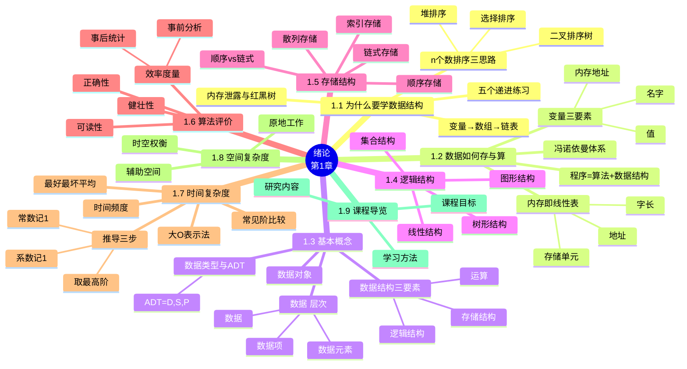

# 第一章 绪论

> **本章主线**：从五个递进的编程练习出发回答"**为什么要学数据结构**" → 沿着"数据如何在计算机中存、如何被 CPU 算"建立硬件直觉（冯·诺依曼体系、内存与地址、变量）→ 给出基本概念（**数据 → 数据元素 → 数据项**）与**数据结构三要素**（逻辑结构、存储结构、运算）→ 分别展开四类逻辑结构与四种存储结构，并引入**抽象数据类型** → 最后进入算法与算法分析，掌握全书的度量语言（时间复杂度 $T(n)=O(f(n))$、空间复杂度 $S(n)=O(f(n))$）。
> 一句话版本：**程序 = 算法 + 数据结构**——数据结构解决"数据怎么摆"，算法解决"数据怎么算"，本章给出贯穿全书的概念骨架与评价语言。



---

## 1.1 为什么要学习数据结构

### 1.1.1 五个递进的编程练习

课程以一组 C/C++ 小练习开场，问题规模与数据组织需求逐级上升：

1. 从命令行输入 5 个整数，输出其中的**最大值**；
2. 从命令行输入 5 个整数，依次输出其中的**最大值和最小值**；
3. 从命令行输入 5 个整数，依次输出其中的最大值、最小值和**第三大**的值；
4. 从命令行输入 5 个整数，依次输出最大值、第二大的值、第三大的值、第四大的值和最小值；
5. 从命令行输入若干个不为 0 的整数，以 0 为输入结束，将这些不为 0 的整数按照**从大到小**的顺序依次输出。

这五道题表面上在练循环与条件判断，实质是在逼迫我们回答：**数据变多以后，用什么容器装、按什么规律取？**

### 1.1.2 从变量到数组再到链表：存储方式的演化

针对同一批练习，程序的"主要变量使用方式"经历了三级演化：

1. **散变量阶段（练习 1、2）**：练习 1 只需 2 个整型变量——1 个存放当前最大值，1 个存放当前输入的数；程序开始时把当前最大值初始化为整数的最小值，每次输入后比较并保留较大者。练习 2 在此基础上增加"当前最小值"变量，扩展为 3 个变量。
2. **数组阶段（练习 3、4）**：练习 3 可以用 6 个整型变量（5 个按大小保存读入的数，1 个存当前输入），更自然的做法是改用**1 个 5 个整数的数组**：读入后与现有数比较、插入合适位置，或读入同时做**插入排序**。练习 4 直接沿用数组 + 插入排序的思路。
3. **链表阶段（练习 5）**：输入规模不再固定，数组面临"大小不够需要扩充"的问题；于是引入**整数链表**——用一个整数变量记录数量，读入同时做链表的插入排序，结束后按顺序输出。

**数组使用的规律是通过下标来读取和存入；链表的使用规律是通过一个结点的链接找到下一个结点，不断这样找直至找到所需数据。** 让数据按照某种规律存入内存、并按照某种规律从内存读到 CPU 中——这就是用**数据结构的方法**来处理数据的存储和操作。

### 1.1.3 大规模数据下的增、查、改、删

回头审视上面五个程序，可以归纳出两个根本问题：

1. 我们是如何将程序外部的信息在程序内保存的？——**保存在程序的变量中**。
2. 我们是如何处理这些保存在程序内的信息并得到结果的？——**通过一系列指令（高级语言的语句），按照特定的逻辑处理方法，对变量值进行判断和重新赋值后得到结果**。

在大规模数据情况下，还要求在内存中**高效**地处理信息：能在内存中将数据保存下来（**增**），能快速查找到需要的数据（**查**），能快速对数据进行重新赋值（**改**和**删**）。几十年来，前辈们对这些存储数据的结构和相应方法研究得非常透彻，本课程学习和掌握其中最基础的一部分。

**应用**：应用计算机解决问题时，对需要保存和处理的数据要做到三步——**分清数据的内在联系**（互不关联、一对一、一对多、多对多）、**合理组织数据**（用表、树、图表达外部事物）、**有效处理数据**（选择快速、节省资源的数据结构和算法）。

### 1.1.4 n 个整数排序的三种思路

排序问题最能体现"换一种数据结构，结果大不一样"：

1. **数组 + 简单选择排序**：完成 $n$ 个数的排序需要 $n-1$ 趟，第 $m$ 趟要进行 $n-m$ 次比较来找出最（小）值。
2. **二叉排序树**：换一种数据结构思考——把数据依次插入一棵树中，插入时比当前值大的向右走、小的向左走；插入完成后按中序遍历即可得到有序序列。
3. **堆排序**：把数组表示的数据当作一棵二叉树来思考。数组下标 $i$ 的左孩子为 $2i$、右孩子为 $2i+1$（下标从 1 开始）。排序时先**构造大根堆**（从第 $n/2$ 个元素起，在根、左子树、右子树三个值中选出最大的，先左右比、选出大的再和根比，不是最大则交换），然后反复执行"堆顶输出 → 重新调整为大根堆"，直到树空。它与选择排序同为 $n-1$ 趟，但每趟比较次数大幅减少，**总比较次数比选择排序少了很多**。

> 口诀：**选择排序一趟一比对，二叉排序树边插边有序，堆排序把数组当树用——同一堆数据，摆法不同，算得快慢天差地别**。

### 1.1.5 一个故事：从内存泄露检查到红黑树

《算法技术手册》中记载了一个真实案例：Graham 为了查出公司程序员代码中的内存泄露，改写了 C/C++ 的 `malloc`、`free` 和 `exit` 三个库函数——改写后的 `malloc` 在完成分配的同时**记录分配的程序位置**，`free` 记录释放位置，`exit` 在程序退出时输出未释放的 `malloc` 记录供调试。代码几小时就写完并调通，但使用它的程序运行时变得**非常慢**。

Gray 帮助排查后发现关键线索：`malloc` 后马上 `free` 就正常，连续多次 `malloc` 再集中释放就很慢。深挖 `malloc` 的实现可知：内存分配记录用**二叉树**存储，每个结点的 key 是内存地址；而"一直申请、最后释放"的程序产生的地址 key 大概率是一个**递增序列**，直接插入二叉排序树会一直向右子树插，树退化成一条单链表——这显然不是便于查找和插入的结构。对插入的二叉排序树做平衡化，改进路径为：**平衡二叉树（AVL 树）→ 2-3 树 → 2-3-4 树 → 红黑树**。Gray 和 Graham 意识到数据结构的缺陷后直接改用红黑树，问题得以解决。

**启示**：同样的数据、同样的操作，**组织方式不同，程序执行效率天差地别**——这正是"程序 = 算法 + 数据结构"的生动注脚（二叉排序树、平衡化的内容将在第 6 章展开）。

## 1.2 数据在计算机中如何存储与操作

### 1.2.1 冯·诺依曼体系结构

**冯·诺依曼体系结构**是现代计算机的基础，计算机由**控制器、运算器、存储器、输入设备、输出设备**五部分组成。与 CPU 的接近程度将存储器分为**内存储器**（内存）与**外存储器**（外存）；CPU 包含三部分：

1. **控制器**：控制系统一步步从存储器中取出指令进行译码，或从内存中取出数据到寄存器；
2. **运算器**：根据指令完成对寄存器中数据的算术/逻辑运算；
3. **寄存器（组）**：存储需要进行运算的数据、保存程序运行状态、当前指令信息地址及下一条指令地址等。

### 1.2.2 内存抽象：线性编号的存储单元

CPU 要进行计算，需要先把数据放在内存中，再从内存取到 CPU；若没有先把数据存入内存就去取，取回的值程序无法控制。据此可以抽象地理解内存：

1. 内存是若干个**存储单元**，每个存储单元的大小为**字长**；
2. 为了准确取出放在内存中的某个数据，程序需要记住数据存在哪个存储单元——给每个存储单元编号，这个编号就是**内存地址**；
3. 在操作系统的支持下，内存可以抽象为**一个从序号 0 开始、连续编号的线性表**，表中每个存储单元都有自己的唯一序号（即内存地址）；
4. 进程的逻辑内存地址与计算机实际内存的物理地址之间的转换，由**操作系统的内存管理**完成。

**编程序是在干嘛？** 可以概括为五步：为每个进入内存的数据**分配存储单元**（编写时用变量定义分配，或运行时用动态内存分配）→ 让数据从**外设保存到内存** → 让 CPU 从内存中**取出数据做计算**（加减乘除、整除、取模、比较等）→ 计算后**放回内存** → 让内存中的数据**输出到外设**；对这几步做各种组合和重复，把数据加工成编程者想要的结果。

### 1.2.3 变量的三要素

一段 C 程序与其对应的汇编代码的对照，能直观看出变量的本质：

```c
int a = 3;        /* mov [010B], 3   将 010B 地址的内存的值修改为 3 */
int b;
a = a + 1;        /* mov ax, [010B]; add ax, 1; mov [010B], ax */
b = a + 2;        /* mov ax, [010B]; add ax, 2; mov [010D], ax */
```

执行后 4 和 6 这两个值放在内存中某个存储单元里，地址分别是 `010B` 和 `010D`——在 C 语言中即 `&a` 与 `&b` 计算出的地址。由此得到**变量的三个要素**：

1. **名字**：为了编程方便，给值的存储位置起的名字，值直接用变量名表示；
2. **值**：存储单元中保存的数据；
3. **内存地址**：值的实际存放位置，用取地址操作符 `&` 取出。

在声明（定义）变量时，编译器给变量指定一块内存，此时内存中的值是**未知的**；使用该变量前需要先赋予初始值。

**数据结构课程和内存的关系**：本课程研究在进程级别的**虚拟内存**中存储数据（即**逻辑结构的具体实现**，也就是 C 语言的类型定义和变量定义）、处理数据的通用方法和高效方法（即**算法**）。因此要求先修并掌握如下基础：内存；变量（变量名、变量值、变量名所代表的内存地址）；对变量的赋值与取值；存储地址值的变量（指针变量）；如何取得并存储变量的地址（`&`、`malloc`、`new`）；如何通过地址存取变量的值（`*` 操作符）；如何在函数调用时通过参数传入数据；如何在函数中把处理后的数据返回给调用者。

## 1.3 基本概念与术语

### 1.3.1 数据、数据元素、数据项与数据对象

1. **数据（data）**：是对客观事物的符号表示，是所有能输入到计算机中并被计算机程序处理（输入、存储、运算、输出）的符号的总称。任何需要被计算机处理的数据，首先要做的事情就是**符号化**：数值（整数的原码/补码、实数的定点/浮点表示）、字符（西文 ASCII 码、中文 Unicode/UTF）、图像（像素化采样、量化和编码）、声音（时间分片的 PCM 采样编码）、自动控制信号（传感器数字化采样）等。数据大的类别分为**数值数据**和**非数值数据**。
2. **数据元素（data element）**：是数据的基本单位，在计算机中通常作为一个整体进行考虑和处理，也称**结点（node）**或**记录（record）**；C 语言中用 `struct` 定义一个结构化的数据类型。一个数据元素可以由若干个数据项组成。
3. **数据项**：是具有独立含义的表示单位，是数据的**不可分割的最小单位**，也称**域（field）**，即 `struct` 中的一个成员；数据项可以是组合项（可再由若干部分组成）。
4. **数据对象（data object）**：是**相同特性数据元素的集合**，是数据的一个子集，例如整数数据对象 $N = \{0, 1, 2, \ldots\}$、学生记录的集合。

三者的层次关系为：**数据 > 数据元素 > 数据项**。

**例**：学生表 > 个人记录 > 学号、姓名……；文件目录树 > 文件结点记录 > 文件名称、属性、大小、块数量、起始文件块；田径项目组成关系树中，数据是整棵树、数据元素是树中的结点、数据项是结点可能有的属性；人际关系图中，数据元素是图中的结点，数据项是姓名、年龄等结点属性。

**位图的例子**：图像由像素点组成，颜色用 RGB/RGBA 表示；BMP 文件格式依次分为位图文件头（14 字节）、位图信息头（40 字节）、调色板（可选）和位图数据区。从结构定义看，1 个位图文件是 1 个数据，其中 `fileHeader`、`fileInfo` 和像素字节块都是**数据项**（组合项）；而整张图由 `width × height` 个像素（数据元素）按照**矩阵的逻辑结构**构成，再转换为逻辑上的线性表（按从左下到右上的顺序），采用**顺序存储**方式存入文件。

### 1.3.2 数据结构的定义与三要素

**数据结构（data structure）**是指**相互之间存在着一种或多种特定关系的数据元素的集合**。数据结构包括三个方面：

1. **数据的逻辑结构**：多个数据元素间的逻辑关系——集合、线性结构、树形结构、图形结构；
2. **数据的存储结构**（物理结构）：数据在计算机中的实际存储方式——顺序存储、链式存储、索引存储、散列存储；
3. **数据的运算**：在这些数据上定义的一组运算——引用型运算、加工型运算。

三者的关系是本章最重要的结论之一：**逻辑结构唯一，存储结构不唯一，运算的实现依赖于存储结构**。

### 1.3.3 数据的基本运算

对于一种数据结构，常见的运算指的是**逻辑结构上的运算（操作）**，基本运算包括：

1. **插入**（增）；
2. **删除**（删）；
3. **修改**（改）；
4. **查找**（查）；
5. **排序**（有时在增、删、改的过程中一起完成）。

**逻辑结构和存储结构都相同，但运算不同，则数据结构不同**。例如栈与队列都是线性表，但栈的运算只在逻辑结构的第一个位置进行，队列则可以在第一个、最后一个及某个指定位置进行——它们因此成为两种不同的数据结构。

**补充说明/拓展**：运算按是否改变数据可分为**引用型运算**（只读取，如查找、遍历）与**加工型运算**（改变数据，如插入、删除、修改）。

### 1.3.4 数据类型与抽象数据类型

**数据类型**是程序设计语言中变量所具有的数据种类。C 语言中分为**基本数据类型**（`char`、`int`、`float`、`double`、`void`）与**构造数据类型**（数组、结构体、共用体、文件）。数据类型是一组性质相同的值的集合，以及定义于这个集合上的一组运算的总称。

**抽象数据类型（ADT, Abstract Data Types）** 是更高层次的数据抽象：

1. 由**用户定义**，用以表示应用问题的数据模型；
2. 由基本的数据类型组成，并包括一组相关的操作；
3. 分两个层次——**数据的逻辑结构 + 运算的定义**面向用户（**概念层**）；**数据的存储结构 + 运算的实现**面向计算机（**实现层**）。

抽象数据类型可以用三元组表示：

$$ADT = (D, S, P)$$

其中 $D$ 是数据对象，$S$ 是 $D$ 上的关系集，$P$ 是 $D$ 上的操作集。常用定义格式为：

```text
ADT 抽象数据类型名 {
    数据对象：<数据对象的定义>
    数据关系：<数据关系的定义>
    基本操作：<基本操作的定义>
} ADT 抽象数据类型名
```

**例**：图书馆系统对学生而言只需"检索图书、借书、还书、续借图书"等接口，对管理员还有"图书信息修改、学生离校、图书馆进新书"；底层可以是顺序存储的线性表，也可以是二叉链表存储的二叉树。通过接口或用户界面（**API**）把数据类型的物理实现封装起来，实现**信息隐蔽和数据封装，使用与实现相分离**。

ADT 可以通过固有的数据类型（整型、实型、字符型等）来表示和实现，它有些类似 C 语言中的 `struct` 类型，但增加了相关的操作。教材用**类 C 语言**（介于伪码和 C 语言之间）作为描述工具，上机时要用具体语言（如 C/C++）实现。

## 1.4 数据的逻辑结构

### 1.4.1 逻辑结构的定义

**逻辑结构**是数据元素间抽象化的相互关系，**与数据的存储无关，独立于计算机**，是从具体问题抽象出来的数学模型。求解非数值计算问题时，首先要考虑相关的各种信息如何表示、组织和存储——设计出合适的数据结构及相应的算法。

### 1.4.2 两种划分方法

**划分方法一：按元素间的对应关系分**

1. **集合**——除"同属于一个集合"外无其它关系，数据元素间是"互不关联"的，如一堆沙子；
2. **线性结构**——一个对一个，有逻辑的先后关系，包括线性表、栈、队列等，如一根链条、一个单词中的所有字母；
3. **树形结构**——一个对多个，包括树、二叉树、森林，如一棵树、家谱树；
4. **图形结构**——多个对多个，如交通图、高铁图。

**划分方法二：按结点间的对应关系二分**

1. **线性结构（1 对 1）**：有且仅有一个开始结点和一个终端结点，并且所有结点都最多只有一个直接前趋和一个后继，例如线性表、栈、队列、串；
2. **非线性结构（1 对多或 1 对 0）**：一个结点可能有多个或 0 个直接前趋和直接后继，例如树、图、集合。

### 1.4.3 逻辑结构总览

| 逻辑结构 | 元素间关系 | 典型例子 | 本课程对应章节 |
|---|---|---|---|
| 集合结构 | 除同属一个集合外无关系 | 一堆沙子 | —（作为其他结构的基础背景） |
| 线性结构 | 一对一，最多一个前趋、一个后继 | 链条、单词的字母序列 | 第 2 章线性表、第 3 章栈和队列、第 4 章串、第 5 章数组与广义表 |
| 树形结构 | 一对多 | 家谱树、目录树 | 第 6 章树和二叉树 |
| 图形结构 | 多对多 | 交通图、高铁网 | 第 7 章图 |

> 口诀：**集合无关、线性一对一、树形一对多、图形多对多**；判断一个结构属于哪类，就看"每个结点能连出去几条线"。

## 1.5 数据的存储结构

**存储结构（物理结构）** 是数据元素及其关系在计算机存储器中的存储方式。

### 1.5.1 顺序存储结构

**顺序存储**把数据元素依次放在**连续的存储单元**中，用物理位置的相邻表示逻辑关系（如前后关系），相对位置可通过计算得到。设首地址为 $Lo$、每个元素占用 $m$ 个存储单元，则第 $i$ 个元素的地址为：

$$Loc(a_i) = Lo + (i-1) \times m$$

**顺序存储主要特点**：

1. 结点中只有自身信息域，没有连接信息域，因此**存储密度大，利用率高**；
2. 可以通过计算确定第 $i$ 个元素的位置，可以**随机存取**；
3. **插入和删除操作会引起大量的元素移动**；
4. 必须存储在一片**地址连续**的存储单元中。

顺序表的类型定义（类 C）：

```c
typedef struct {
    int a, b, c;
    char ch;
} ElemType;

#define MAXSIZE 100                 /* 最大长度 */
typedef struct {
    ElemType elem[MAXSIZE];         /* 连续的地址空间 */
    int length;                     /* 线性表的当前长度 */
} SqList;
```

### 1.5.2 链式存储结构

**链式存储**借助**指示元素存储地址的指针**表示数据元素间的逻辑关系，需通过遍历（依次访问）得到指定元素的存储位置。例如逻辑上相邻的元素 1、2、3、4，物理地址可以是 1345、1400、1536、1346——每个结点除了存储内容外还保存下一个结点的地址（指针）。

**链式存储主要特点**：

1. 结点除自身信息域外还有表示连接信息的**指针域**，因此**存储密度小，利用率低**；
2. **逻辑上相邻的结点在物理上不一定邻接**，适用于复杂的逻辑结构；
3. **插入和删除操作灵活方便**，只要修改指针域的值即可；
4. 可以存储在**不连续**的存储单元中。

在这种存储结构中，可以把逻辑上相邻的元素存放在物理上不相邻的存储单元中，也可以在线性编址的存储器中表示结点的非线性联系——其实现依靠**指针**。单链表的存储结构定义（类 C）：

```c
typedef struct LNode {
    ElemType   data;          /* 数据域 */
    struct LNode *next;       /* 指针域 */
} LNode, *LinkList;           /* *LinkList 为 LNode 类型的指针 */
```

**注意区分两个概念**：**指针变量 `p`** 表示结点的**地址**；**结点变量 `*p`** 表示一个**结点**。若 `p->data` 为 $a_i$，则 `p->next->data` 为 $a_{i+1}$。

**例**：26 个英文字母表 $(a, b, \ldots, y, z)$ 的顺序存储是一段连续单元 `a b c d ... z`；链式存储则是每个字母的结点通过指针依次相连、末尾指针为空。

### 1.5.3 索引存储与散列存储

1. **索引存储**：在存储结点信息的同时，建立**索引表**，存放**关键字**（唯一标识一个数据元素的数据项）和**地址**（指出数据元素所在的位置）。例如按班级建索引表：班级 01 对应地址 1、班级 02 对应地址 31……查询时先在索引表中定位，再到主表取数据。
2. **散列存储（哈希存储）**：根据数据元素的关键字值，由**散列函数**直接计算出存储地址：

$$LOC(a_i) = H(key)$$

### 1.5.4 逻辑结构、存储结构与运算的关系

| 对比维度 | 逻辑结构 | 存储结构 |
|---|---|---|
| 定义 | 数据元素间的抽象关系 | 数据元素及其关系在存储器中的存放方式 |
| 与计算机的关系 | 独立于计算机，是从具体问题抽象的数学模型 | 依赖于计算机，是逻辑结构在内存中的实现 |
| 是否唯一 | **唯一**（一个问题只有一种逻辑关系） | **不唯一**（同一逻辑结构可有多种存储实现） |
| 分类 | 集合、线性、树形、图形 | 顺序、链式、索引、散列 |

再比较两种最常用的存储方式：

| 对比维度 | 顺序存储 | 链式存储 |
|---|---|---|
| 存储密度 | 大（只有信息域） | 小（信息域 + 指针域） |
| 存取方式 | 可计算地址，**随机存取** | 需沿指针**遍历** |
| 插入/删除 | 引起大量元素移动 | 只改指针，灵活方便 |
| 物理要求 | 必须连续 | 可不连续 |
| 适用场景 | 数据相对稳定、需频繁随机访问 | 结构复杂、频繁增删 |

> 口诀：**逻辑唯一存储多，运算实现靠存储；顺序查得快、增删慢，链式增删快、查着绕**。

**运算的实现依赖于存储结构**：同样的"插入第 $i$ 个位置"，顺序表要移动元素，链表要改指针——这正是后续每学一种结构都要先讲存储、再讲运算的原因。

## 1.6 算法及其评价

### 1.6.1 算法的评价标准

**算法有好坏之分**，评价一个算法通常看以下方面（以"求 10 个数的最大值"为例）：

1. **正确性**：无语法错误还不够。下面的程序在输入全为正数时结果正确，输入全为负数时求得的最大值为 0，结果不正确——因此**既要输入正确的数据，也要输入错误的数据进行健壮性测试**。
2. **可读性**：下面的程序同样无语法错误，但格式混乱，不满足算法的"可读性"要求。
3. **健壮性**：对非法输入（如全负数、空输入）能合理处理而不给出错误结果。

```c
/* 可读性差的写法（无语法错误，但格式不好） */
main()
{
    int max = 0, x;
    for (int i = 1; i <= n; i++)
    { scanf("%d", &x);
      if (x > max) max = x; }
    printf("%d", max);
}
```

**补充说明/拓展**：教材通常还列举算法的五大特性——**有穷性**（有限步内结束）、**确定性**（每条指令含义确切）、**可行性**（每条操作都能被执行）、**输入**（零个或多个输入）、**输出**（一个或多个输出）。

### 1.6.2 算法效率的度量：事后统计与事前分析估计

用依据算法编制的程序执行所消耗的时间度量算法效率，方法分为两类：

| 对比维度 | 事后统计 | 事前分析估计 |
|---|---|---|
| 做法 | 利用计算机计时功能，对相同统计数据运行程序计时 | 不必运行，推算算法执行时间与问题规模的关系 |
| 依赖因素 | 依赖硬件、软件等环境因素 | 只依赖算法策略与问题规模 |
| 缺点 | 必须先运行程序；环境差异**掩盖算法本身的优劣** | 是估算，需要正确的分析方法 |
| 改进 | 多种硬件、软件、数据组合多次测试（性能测试） | 引入时间频度与渐进复杂度（1.7 节） |

一个高级语言程序在计算机上运行消耗的时间取决于：依据的算法选用何种**策略**、问题的**规模**、**程序语言**、**编译程序**产生的机器代码质量、机器执行指令的速度。同一个算法用不同语言、不同编译程序、在不同计算机上运行效率均不同——**使用绝对时间单位衡量算法效率不合适**，这正是事前分析估计成为主流的原因。

**例——保持队列连续**：队列满后有队员离开，要保持队列在存储器中"连续"，有两种做法：**方法 1** 依次向前移动一个位置；**方法 2** 把最后一个元素挪过来补位。二者的差别是：**同样的逻辑结构，同样的运算，算法不同**——空间代价相同，时间代价不同（方法 1 要移动多个元素，方法 2 只动一个）。若问题改为"保持队列连续**并且队员间的相互顺序不变**"，方法 2 就不再适用，需要重新设计算法。

> 口诀：**事后统计靠跑，事前分析靠算；绝对时间不可比，只比随规模增长的趋势**。

## 1.7 算法的时间复杂度

### 1.7.1 时间频度与时间函数 T(n)

一个算法执行所耗费的时间是所有语句执行时间之和，用 $T(n)$ 表示。假设每条语句执行时间相同（第 $i$ 条语句执行一次耗时 $t_i$），则只需统计所有语句执行次数的总和。算法中原操作的执行次数称为**语句频度**或**时间频度**，第 $i$ 条语句的时间频度记为 $c_i$：

$$T(n) = \sum_{i \in \text{语句集合}} c_i \, t_i$$

**例——求 $1+2+3+\cdots+100$ 的三种算法**：

```c
/* 算法 1：循环累加 */
int i, sum = 0, n = 100;
for (i = 1; i <= n; i++)       /* 执行 n+1 次 */
{
    sum = sum + i;             /* 执行 n 次 */
}                              /* 初始化执行 1 次 */
/* 总共 2n+2 次 */
```

```c
/* 算法 2：公式计算 */
int i, sum = 0, n = 100;       /* 执行 1 次 */
sum = (1 + n) * n / 2;         /* 执行 1 次 */
/* 总共 2 次 */
```

```c
/* 算法 3：双重循环 */
int i, j, sum = 0, n = 100;
for (i = 1; i <= n; i++)       /* 执行 n+1 次 */
{
    for (j = 1; j <= n; j++)   /* 执行 (n+1)×n 次 */
    {
        sum = sum + j;         /* 执行 n×n 次 */
    }
}                              /* 初始化执行 1 次 */
/* 总共 1 + (n+1) + (n+1)×n + n×n = 2n²+2n+2 次 */
```

三个算法的差别，本质上就是频度函数 $2n+2$、$2$、$2n^2+2n+2$ 的差别——把循环当作一个整体、忽略头尾判断次数，算法 1 与算法 2 的差别就是 $n$ 与常数 $1$ 的区别。

### 1.7.2 渐进时间复杂度与大 O 表示法

算法中基本语句重复执行的次数是问题规模 $n$ 的某个函数 $f(n)$，算法的时间量度记作：

$$T(n) = O(f(n))$$

**大 O 符号的定义**：若 $T(n)$ 和 $f(n)$ 是定义在正整数集合上的两个函数，则 $T(n) = O(f(n))$ 表示**存在正的常数 $C$ 和 $n_0$，使得当 $n \ge n_0$ 时都满足 $0 \le T(n) \le C \cdot f(n)$**。它表示随着 $n$ 的增大，算法执行时间的**增长率和 $f(n)$ 的增长率相同**，称为**渐近时间复杂度**，简称**时间复杂度**。$f(n)$ 通常选取容易衡量的函数：$\log_2 n$、$n$、$n \log_2 n$、$n^2$、$n^3$、$2^n$。

一般情况下，随 $n$ 的增大，$T(n)$ 增长较慢的算法为最优的算法。

### 1.7.3 推导大 O 阶的方法

1. 程序运行时间中的**常数用 1 代替**——运行 3 次记为 $O(1)$，运行 100 次也记为 $O(1)$；
2. 在大 O 函数中**只取最高阶项**；
3. **最高阶项的常数系数化为 1**——如 $5n^2$ 记为 $O(n^2)$。

**例**：三段程序中原操作 `x = x + 1` 的时间复杂度：

1. `x = x + 1;` 执行 1 次，$T(n) = O(1)$，称**常量阶**；
2. `for (i = 1; i <= n; i++) x = x + 1;` 共执行 $2n+1$ 次，取最高项、去系数，$T(n) = O(n)$，称**线性阶**；
3. 双重循环版本共执行 $2n^2+2n+1$ 次，$T(n) = O(n^2)$，称**平方阶**。

**练习**：按大 O 阶推导方法，$f(n)$ 分别为 $3$、$2n+3$、$C(3n+5)$、$2n^2$、$2n^2+3n+5$ 时，结果依次为 $O(1)$、$O(n)$、$O(n)$、$O(n^2)$、$O(n^2)$——常数项用 1 代替，系数改为 1，按最高项取、其余忽略不计。

**补充说明/拓展**：渐进分析还有更精细的符号族——$o$（松上界，"小于"）、$O$（上界，"小于等于"）、$\Theta$（精确渐近，"等于"）、$\Omega$（下界，"大于等于"）、$\omega$（松下界，"大于"）。例如存在正数 $n_0, c$ 使 $n \ge n_0$ 时恒有 $0 \le f(n) \le c \cdot g(n)$，则记 $f(n) = O(g(n))$。本课程以大 O 为主。

### 1.7.4 常见时间阶及其比较

时间复杂度从低到高排列：

$$O(1) < O(\log_2 n) < O(n) < O(n^2) < O(n^3) < O(2^n)$$

**为什么不能只看具体次数？** 对四个频度 $2n+3$、$2n$、$3n+1$、$3n$：

| $n$ | $2n+3$ | $2n$ | $3n+1$ | $3n$ |
|---|---|---|---|---|
| 1 | 5 | 2 | 4 | 3 |
| 2 | 7 | 4 | 7 | 6 |
| 10 | 23 | 20 | 31 | 30 |
| 100 | 203 | 200 | 301 | 300 |

注意 $n=1$ 时 $2n+3 = 5 > 3n+1 = 4$，而 $n=100$ 时 $203 < 301$——**小规模时常数和低阶项可能占优，规模增大后阶数起决定作用**。再看 $2n^2$、$3n+1$、$2n^2+3n+1$、$10n$ 四个频度：$n=1$ 时 $10n=10$ 最大，$n=100$ 时 $2n^2 = 20000$ 远大于 $10n = 1000$——$n$ 越大，高阶算法与低阶算法的差异越悬殊；指数时间算法和多项式时间算法在 $n$ 很大时所需时间非常悬殊。

> 口诀：**小 n 看不出、大 n 定输赢；比算法先比阶，同阶再比常数**。

### 1.7.5 完整例题：求程序段的时间复杂度

**例题** 分析下列程序段中基本操作 `x++` 的时间复杂度：

```c
for (i = 1; i < n; i++) {
    y = y + 1;
    for (j = 0; j <= 2 * n; j++)
        x++;
}
```

**解题步骤**：

1. **找基本语句**：嵌套最深层、重复执行次数最多的语句是 `x++`（依据：时间复杂度由语句频度最大的基本语句决定）。
2. **算外层频度**：`i` 从 1 到 $n-1$，外层循环体执行 $n-1$ 次（依据：`i < n`，共 $n-1$ 个取值）。
3. **算内层频度**：内层 `j` 从 0 到 $2n$，每次执行 $2n+1$ 次（依据：共 $2n+1$ 个整数取值）。
4. **求总频度**：内外层相乘，$f(n) = (n-1)(2n+1) = 2n^2 - n - 1$。
5. **取大 O 阶**：常数记 1 → 只取最高阶项 $2n^2$ → 系数化 1，得 $T(n) = O(n^2)$。

**最终答案**：$T(n) = O(n^2)$（平方阶）。

**同类速算**：矩阵相乘三重循环 $n \times n \times n = n^3$ 次，$T(n) = O(n^3)$；`{++x; s=0;}` 频度为 1 或 2，$T(n) = O(1)$；单层循环 $n$ 次，$T(n) = O(n)$；`exam` 函数求 $m \times n$ 矩阵行和，$f(n) = m \cdot n$，$T(n) = O(m \cdot n)$——**多变量问题规模就写多变量的阶**。

**注意**：若循环条件含函数调用，如 `for (k = 0; k < fun(n); k++)`，必须先分析 `fun(n)` 本身的时间复杂度，整体为 $O(n) \times O(T(fun(n)))$；在不知道 $T(fun(n))$ 的情况下，**不能贸然以下一段代码的 $O(n^2)$ 作为整体复杂度**。

**一句话概括**：嵌套循环的频度相乘、顺序执行的频度相加，展开后"常数记 1、只取最高阶、系数化 1"——最大易错点是**漏算循环边界的判断次数后不取阶**，以及**多个变量时强行压成单变量**。

### 1.7.6 最好、最坏与平均情况

有些算法中基本操作重复执行的次数还随**输入数据集**不同而不同。以在数组 $a$ 中顺序查找值等于 $e$ 的元素为例：

```c
for (i = 0; i < n; i++)
    if (a[i] == e) return i + 1;
return 0;
```

1. **最好情况**：1 次（目标排在第一个）；
2. **最坏情况**：$n$ 次（目标在最后一个或不存在）；
3. **平均时间复杂度**：$O(n)$。

注意与 `for (k = 0; k < n; k++) x++;` 对比——后者无论数据如何都是 $O(n)$，**没有最好、最坏之分**；只有"执行次数随输入不同而变化"的算法才需要区分三种情况。

## 1.8 算法的空间复杂度

### 1.8.1 空间复杂度的定义

**空间复杂度**是算法所需存储空间的度量，记作：

$$S(n) = O(f(n))$$

其中 $n$ 为问题的规模。一个程序运行从开始到结束所需的存储量分为：

1. **固定部分**：程序代码、常量、简单变量、定长的结构变量；
2. **可变部分**：与问题规模有关的存储空间。

程序执行除寄存指令、常数、变量和输入数据外，还需要一些对数据进行操作的**辅助存储空间**。输入数据所占的具体存储量只取决于问题本身、与算法无关，因此只需分析算法实现所需的**辅助空间**；当问题规模较大时，可变部分可能远大于固定部分，所以一般讨论**渐进空间复杂度**，针对可变部分，分析方法与时间复杂度类似。

若算法执行时所需的辅助空间相对于输入数据量而言是常数，则称算法为**原地工作**，辅助空间为 $O(1)$。

### 1.8.2 完整例题：数组逆序的两种算法

**题目** 将一维数组 $a$ 中的 $n$ 个数**逆序存放到原数组中**，分析两种算法的空间复杂度。

**解题步骤**：

1. **算法 1（交换法）**：`for (i = 0; i < n/2; i++)` 循环内用临时变量 `t` 交换 `a[i]` 与 `a[n-i-1]`。除输入数组本身外只用了 1 个辅助变量 `t`，不随 $n$ 增长。
2. **判定**：辅助空间为常数，$S(n) = O(1)$，属于**原地工作**。
3. **算法 2（辅助数组法）**：先把 $a$ 逆序抄入辅助数组 `b`（`b[i] = a[n-i-1]`），再把 `b` 抄回 `a`。辅助数组 `b` 需要 $n$ 个元素。
4. **判定**：辅助空间随 $n$ 线性增长，$S(n) = O(n)$。

**最终答案**：算法 1 为 $S(n) = O(1)$（原地工作），算法 2 为 $S(n) = O(n)$。

**一句话概括**：空间复杂度只看**随 $n$ 增长的辅助空间**，与输入数据本身占用无关——"申请不随规模增长的临时变量就是原地工作"。

### 1.8.3 时间与空间的权衡

算法执行时间的节省和存储空间的节省两者是**矛盾的，难以兼得**：时间上的节省常常以增加空间存储为代价，反之亦然。就一般情况而言，**常常以算法执行时间作为算法优劣的主要衡量指标**。

> 口诀：**时间空间二选一，拿空间换时间最常见；评估先看阶，再看是否原地工作**。

## 1.9 课程导览与学习指导

### 1.9.1 研究内容与学科地位

N. 沃思（Niklaus Wirth）教授提出：

$$\text{程序} = \text{算法} + \text{数据结构}$$

电子计算机早期主要用于**数值计算**（数学计算算法研究），后来处理扩大到**非数值计算**领域，需要处理多种复杂的、具有一定结构关系的数据，此时出现了数据结构的大量基础性研究。**数据结构的研究内容**是：研究非数值计算的程序设计问题中计算机的**操作对象**以及它们之间的**关系**和**操作**。

课程的形成与发展：20 世纪 60 年代初期，"数据结构"有关内容散见于操作系统、编译原理和表处理语言等课程；**1968 年**"数据结构"被列入美国一些大学计算机科学系的教学计划；此后概念不断扩充，包括了网络、集合代数论、关系等离散数学结构的内容；**70 年代后期**，我国高校陆续开设该课程。《数据结构》是**介于数学、计算机硬件和计算机软件三者之间的一门核心课程**。

### 1.9.2 课程目标与学习方法

**课程目标**：

1. **基础**：掌握常用数据结构的概念及其不同实现方法；
2. **技能**：通过系统学习在不同存储结构上的运算方法，能够在不同存储结构上实现不同的运算，并对算法设计的方式和技巧有所体会；
3. 能够分析研究计算机加工的对象的特性，获得其逻辑结构，根据需求选择合适的存储结构及其相应的算法；
4. 学习一些常用的算法；进行复杂程序设计的训练，要求编写的程序结构清楚、正确易读；
5. **初步掌握算法的时间分析和空间分析技术**。

**课程学习指导**：

1. 提前预习、认真听课、按时完成书面及上机作业；
2. 注意先修课程的知识准备——**离散数学、C 语言**；
3. 注意循序渐进：基本概念、基本思想、基本步骤、算法设计；
4. 注意培养算法设计的能力：理解所讲算法并多做思考——若问题要求不同，应如何选择数据结构、设计有效的算法。

**课程特点**：内容抽象、概念性强、内容灵活、**理解后掌握**。

### 1.9.3 考核方式与教材

**考核方式**：平时成绩包括考勤、作业、期中与课堂纪律（不要无故迟到、旷课，不要玩游戏、上网聊天）；期末成绩为考试。课堂上有问题提出来讨论。

**教材与参考书**：教材为《数据结构》（C 语言版），严蔚敏、吴伟民等，清华大学出版社；参考书包括《数据结构题集（C 语言版）》（严蔚敏等）与《数据结构与算法分析》（*Data Structures and Algorithm Analysis in C*，Mark Allen Weiss，机械工业出版社）。

**本章小结**：本章建立了课程的概念骨架——数据、数据元素、数据项、数据对象等基本概念；对数据结构"逻辑结构 + 存储结构 + 运算"两个层次的理解；抽象数据类型的表示方法；以及算法的时间复杂度及其分析的简易方法。

---

### 知识定位与框架衔接

**前置知识（地基，来自先修课程）**：

1. **C 语言**：数组、结构体、指针（`&`、`*`、`->`）、`malloc`/`free`、函数传参与返回——本课程所有存储结构都用 C 描述，指针更是链式存储的唯一实现手段；
2. **离散数学**：集合与映射（逻辑结构的数学模型）、树与图（树形/图形结构）、函数与增长率（复杂度分析的数学语言）；
3. **计算机组成原理**：冯·诺依曼体系、内存与地址、CPU 取指执行——理解"变量为什么对应地址"；
4. **高等数学**：求和、对数与极限——读懂 $O(\cdot)$ 的定义。

**后置知识（上层建筑，本课程后续章节）**：

1. **线性结构主线**：第 2 章线性表 → 第 3 章栈和队列 → 第 4 章串 → 第 5 章数组与广义表——1.1 节的"数组 vs 链表"在这里展开为顺序/链式两种实现的完整对比；
2. **非线性结构主线**：第 6 章树和二叉树（1.1.4 的堆排序、1.1.5 的红黑树伏笔在此回收）→ 第 7 章图；
3. **算法与应用主线**：第 9 章查找、第 10 章内部排序、第 11 章外部排序——复杂度分析是评价这些算法的统一语言；
4. **更远的后续**：操作系统（内存管理、进程调度中的队列）、数据库（索引与散列存储）、算法设计与分析（分治、动态规划的复杂度证明）。

**打地基比喻**：本章相当于盖房子时的**打地基 + 立图纸**——"程序 = 算法 + 数据结构"告诉你房子由"结构"和"施工方法"两部分组成；逻辑结构是**设计图**（与用什么材料无关），存储结构是**施工工艺**（同样的图纸可以砖混也可以框架），运算是**使用房子的功能**（拆改住人），而 $O(\cdot)$ 复杂度则是**评价这套方案快不快、省不省的度量尺**。地基不牢，后面每学一种结构都会"知其然不知其所以然"。

**核心灵魂问题（学完本章应能回答）**：

1. **为什么逻辑结构唯一、存储结构却不唯一？同一逻辑结构为什么要设计多种存储实现？** ——逻辑结构是问题本身的数学关系（与机器无关），而存储实现要权衡随机访问与增删成本：顺序存储换来了 $O(1)$ 随机存取，代价是插入删除要移元素；链式存储反之。选择哪种存储，取决于后续要执行什么运算、运算的频率如何——这正是"运算的实现依赖于存储结构"。
2. **为什么比较算法要看"阶"而不是具体执行次数？$n$ 很小时 $2n+3$ 比 $3n+1$ 大，能说前者更慢吗？** ——具体次数受常数、低阶项和运行环境影响，会掩盖算法本身的优劣；大 O 描述的是 $n \to \infty$ 时的**增长率**，只有阶相同才轮到比常数。小 $n$ 时完全可能出现"阶高者更快"的交叉（如 $10n$ 与 $2n^2$ 在 $n<5$ 时），所以结论永远要声明适用的规模范围。
3. **若只分析时间不分析空间，会漏掉什么问题？"原地工作"为什么值得单独强调？** ——辅助空间可能成为硬约束（嵌入式、大数据场景内存有限）；数组逆序的两种算法时间同为 $O(n)$，但一个 $O(1)$、一个 $O(n)$ 空间，内存占用差 $n$ 倍。且时间与空间往往互相交换（用空间换时间，如索引、缓存），只看一侧无法做出正确的设计权衡。

> **一句话总结本章**：**程序 = 算法 + 数据结构**——先用**逻辑结构**刻画数据之间的关系，再用**存储结构**把它落进内存，围绕它定义**运算**（增删改查排），用**ADT** 把"是什么"与"怎么实现"分离；最后用**时间复杂度 $T(n)=O(f(n))$** 与**空间复杂度 $S(n)=O(f(n))$** 这两把尺子，度量一切算法的优劣。

---

## 课件 PDF

<iframe src="https://cognishelf.naimore3.workers.dev/课程笔记/大二上/数据结构/01绪论/01绪论.pdf" width="100%" height="800px" style="border: none;"></iframe>

[打开 PDF](https://cognishelf.naimore3.workers.dev/课程笔记/大二上/数据结构/01绪论/01绪论.pdf)
