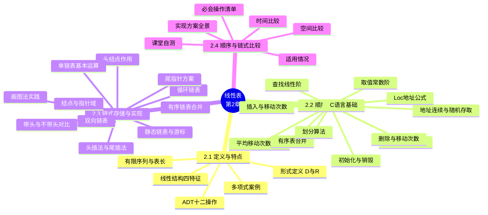

# 第二章 线性表

> **本章主线**：从字母表、成绩单、集装箱、排队等生活实例引出**线性结构**"一对一"的逻辑关系 → 用二元组 $(D, R)$ 给出线性表的**形式定义**与四条基本特征，以多项式表示为案例说明"顺序存储有短板、链式存储来补位" → 定义线性表的 **ADT**（12 个基本操作，使用与实现分离）→ 第一种实现：**顺序存储**——地址连续、按址算位，展开初始化、取值、查找、插入、删除五个核心算法，推导插入/删除的**平均移动次数**，再做有序表合并与划分算法两个应用 → 第二种实现：**链式存储**——结点 = 数据域 + 指针域，围绕**头结点**讲清单链表的增删改查与两种建表法，对比有/无头结点的写法差异，归并两个有序链表，再扩展到**静态链表、循环链表、双向链表**与"画图写代码"的工程实践 → 最后从空间、时间、适用情况三维对比**顺序表与链表**，给出 22 种实现方案的全景与必会操作清单。
> 一句话版本：**同一种逻辑结构，两种存储哲学**——顺序表用"物理相邻"换来 $O(1)$ 随机存取与存储密度 1，代价是增删要搬半张表；链表用"指针链接"换来自由增删与动态扩展，代价是每个结点多背一根指针、按位查找要顺藤摸瓜。



---

## 2.1 线性表及其特点

### 2.1.1 何谓线性结构

**线性结构**是一个数据元素的**有序（次序）集合**。常见例子建立直觉：

1. **字母表** $(A, B, C, \ldots, Z)$ 与**扑克点数** $(2, 3, \ldots, J, Q, K, A)$——最直观的有序序列；
2. **花名册、成绩单、通讯录、工资表、图书目录**——计算机内由一行行结构相同的数据元素构成的表，常见操作是**修改、查找、插入和删除**；
3. **集装箱装货**——由下而上摆放、卸货时从上至下取出，遵循**后进先出**（Last In First Out，**LIFO**）原则；
4. **排队购物、汽车进站出站、银行办理业务**——遵循**先进先出**（First In First Out，**FIFO**）原则；
5. **文本编辑**——可看作对一个大字符串做建立、插入、删除、取子串、字符串匹配，字符串就是以字符为数据元素的线性结构。

若结构是非空有限集，则有且仅有一个**开始结点**和一个**终端结点**，并且所有结点都最多只有一个直接前趋和一个直接后继，可表示为 $(a_1, a_2, \ldots, a_n)$。简言之，线性结构反映结点间的逻辑关系是**一对一**的关系。

非空线性结构的**四个特征**：

1. 非空集合中必存在唯一的一个"第一元素"；
2. 非空集合中必存在唯一的一个"最后元素"；
3. 非空集合中除最后元素之外，其它数据元素均有唯一的"后继"；
4. 非空集合中除第一元素之外，其它数据元素均有唯一的"前驱"。

**常见的线性结构**：线性表、栈、队列（循环队列）、数组、串——它们的数据元素间关系都是**逻辑位置先后关系**；其中线性表是最基本的一种，第 2 章讲它，第 3、4、5 章依次展开栈和队列、串、数组与广义表。

### 2.1.2 线性表的形式定义

**线性表**的形式定义为一个二元组：

$$Linear\_list = (D, R)$$

其中 $D = \{a_i \mid a_i \in D_0,\ i = 1, 2, \ldots, n,\ n \ge 0\}$，$R = \{N\}$，$N = \{\langle a_{i-1}, a_i\rangle \mid a_{i-1}, a_i \in D_0,\ i = 2, 3, \ldots, n\}$，$D_0$ 为某个数据对象。或者简记为：

$$(a_1, a_2, \ldots, a_i, \ldots, a_n), \quad n \ge 0$$

$n$ 为**表长**；当 $n = 0$ 时称为空表。$\langle a_{i-1}, a_i\rangle$ 这种有序对称为**序偶**——它与一般集合不同之处在于具有确定的次序。

在数据元素的非空有限集中，线性表的**特点**：

1. 数据元素间是线性关系，数据元素在表中的位置只取决于其**序号**；
2. 存在唯一的一个"第一个"数据元素和唯一的一个"最后一个"数据元素；
3. 除第一个外，每个数据元素均只有一个前驱；除最后一个外，每个数据元素均只有一个后继。

### 2.1.3 定义、术语与基本约定

**定义**：线性表是具有**相同数据类型**的 $n\ (n \ge 0)$ 个数据元素的**有限序列**。

对照 $(a_1, a_2, \ldots, a_i, \ldots, a_n)$ 记住这些术语：

| 术语 | 含义 |
|---|---|
| 线性起点 | $a_1$，表中第一个元素 |
| 线性终点 | $a_n$，表中最后一个元素 |
| $a_i$ 的直接前趋 | $a_{i-1}$（$i > 1$） |
| $a_i$ 的直接后继 | $a_{i+1}$（$i < n$） |
| 下标 $i$ | 元素的序号，表示元素在表中的位置 |
| 表长 $n$ | 元素总个数；$n = 0$ 时称**空表**——指表中的元素个数为空，而不是一个不存在的表 |

**同一**线性表中的元素必定具有相同特性：字母表里全是字母，学生表里每条记录都是"学号、姓名、性别、年龄、班级"结构。数据元素的类型可以为简单类型（单个数据项），也可以为复杂类型（多个数据项）。

从具体应用中抽象出共性的逻辑结构和基本操作（抽象数据类型），再实现其存储结构与基本操作，并把数据元素的类型差异忽略、抽象为一个结点——这就是"抽象 → 实现"的路线。

**线性表的重要基本操作**（按功能分）：

1. 初始化；
2. 取值，按位置取值；
3. 查找，按位置查找、按值查找；
4. 插入，指定位置插入、尾插入；
5. 删除；
6. 计数；
7. 排序（第 7 章展开）。

### 2.1.4 案例引入：多项式的表示

一元多项式 $P_n(x) = p_0 + p_1x + p_2x^2 + \cdots + p_nx^n$ 可以直接对应线性表 $P = (p_0, p_1, p_2, \ldots, p_n)$——**每一项的指数 $i$ 隐含在其系数 $p_i$ 的序号中**，$x$ 不需要每次表示。例如 $P(x) = 10 + 5x - 4x^2 + 3x^3 + 2x^4$ 用顺序存储只需系数表 $[10, 5, -4, 3, 2]$。

但对稀疏多项式 $S(x) = 1 + 3x^{10000} + 2x^{20000}$，按指数上界建顺序表需要 $n = 20001$ 个单元，其中只有 3 个有值，其余全空——**顺序存储结构存在存储空间分配不灵活、运算的空间复杂度高两个问题**，这正是引入链式存储的动机。

解决办法是把每一项存为**二元组（系数，指数）**，得到线性表 $P = ((p_1, e_1), (p_2, e_2), \ldots, (p_m, e_m))$。以 $P(x) = 7 + 3x + 9x^8 + 5x^{17}$、$Q(x) = 8x + 22x^7 - 9x^8$ 为例，链式存储下**直接在 $P$ 表上完成加法**：

1. 指数相同：系数相加，和非零则替换值，为零则**删除当前结点**，继续比较下一结点；
2. 指数不同且 $P$ 的指数小：指针 $X$ 前进到 $P$ 下一结点继续比较；
3. 指数不同且 $Q$ 的指数小：新建结点复制 $Q$ 的值，插入到 $P$ 当前结点之前，指针 $Y$ 前进到 $Q$ 下一结点；
4. $Q$ 链表遍历结束即计算结束；$P$ 先遍历完则把 $Q$ 剩余结点依次插到 $P$ 尾部。

结果为 $R(x) = 7 + 11x + 22x^7 + 5x^{17}$。该运算正是线性表的**遍历**运算（依次访问线性表的每个元素）的实际应用；若用顺序存储则需创建新表 $R$ 并同时遍历两个表逐项比较。

### 2.1.5 线性表的抽象数据类型

从应用抽象出 ADT 后，上层只面对接口，底层可以是顺序表、单链表、循环链表或双向循环链表——**ADT 的好处：信息隐蔽和数据封装，使用与实现相分离**。

线性表的 ADT 定义：数据对象 $D = \{a_i \mid a_i \in \text{ElemSet},\ i = 1, 2, \ldots, n,\ n \ge 0\}$；数据关系 $R = \{\langle a_{i-1}, a_i\rangle \mid a_i \in D,\ i = 2, \ldots, n\}$。

**基本操作清单（12 个）**：

1. 线性表初始化：`InitList(&L)`
2. 销毁线性表：`DestroyList(&L)`
3. 将线性表置空：`ClearList(&L)`
4. 判断线性表是否为空：`ListEmpty(L)`
5. 求线性表的长度：`ListLength(L)`
6. 按位置取表中某个元素：`GetElem(L, i, &e)`
7. 按值查找：`LocateElem(L, e, compare())`
8. 求前驱：`PriorElem(L, cur_e, &pre_e)`
9. 求后继：`NextElem(L, cur_e, &next_e)`
10. 插入操作：`ListInsert(&L, i, e)`
11. 删除操作：`ListDelete(&L, i, &e)`
12. 遍历操作：`ListTraverse(L, visit())`

遍历操作中用 `visit()` 函数指针作为参数——遍历到某个结点时，由 `visit()` 具体对该结点的数据项进行操作。

### 2.1.6 应用示例：求集合并集

**例 2-1** 用线性表 $LA$、$LB$ 分别表示集合 $A$、$B$，求 $A = A \cup B$。

审题得到要求：**集合合并于 $A$ 上**，即将 $B$ 中不存在于 $A$ 中的元素加入到 $A$ 中；用线性表语言说，就是把存在于 $LB$ 而不存在于 $LA$ 的数据元素插入到 $LA$ 中。算法思路：

1. 从 $LB$ 中取出一个数据元素（`GetElem(Lb, i, &e)`，配合 `ListLength(Lb)` 控制循环）；
2. 依值在 $LA$ 中查询（`LocateElem(La, e)`）；
3. 若不存在，则插入到 $LA$ 尾部（`ListInsert(La, ListLength(La) + 1, e)`）；
4. 重复上述三步直至处理完 $LB$ 中所有元素。

设 $LA$ 长 $n$、$LB$ 长 $m$，每次插入可能移动 $O(n)$ 个元素，整体时间复杂度为 $O(n \cdot m)$——顺序表实现的代价在此已可见一斑。

## 2.2 线性表的顺序存储与实现

### 2.2.1 顺序存储的定义与地址计算

线性表的**顺序表示**又称为**顺序存储结构**或**顺序映像**：把**逻辑上相邻**的数据元素存储在**物理上相邻**的存储单元中。顺序存储方法是用一组地址连续的存储单元依次存储线性表的元素，可通过数组 `V[n]` 实现——简言之，**逻辑上相邻，物理上也相邻**。

设线性表的基地址为 $L_0$，每个数据元素占用 $m$ 个存储单元（$m = \texttt{sizeof(数据元素)}$），则第 $i$ 个元素的存储地址为：

$$Loc(a_i) = L_0 + (i - 1) \times m$$

**补充说明/拓展**：**随机存取**与**顺序存取**的区别——对内存，可以通过地址直接取到数据，这叫随机存取；对磁带存储，查找数据只能在磁带绕动的同时一个数据一个数据地找，这叫顺序存取。顺序表属于前者，链表属于后者。

### 2.2.2 顺序表的类型定义

假设已定义数据元素类型 `typedef int ElemType;`，定义顺序表有四种递进方法：

1. **方法 0**：`ElemType SqList[100];`——顺序存储特征明显，但表长写死在注释里、大小固定为 100、两个变量靠注释维系关系；
2. **方法 1**：`#define MAXSIZE 100` + `ElemType SqList[MAXSIZE];` + `int nListLength;`——用宏定义替换魔数并补上当前长度变量，但大小仍然固定；
3. **方法 2**：结构体打包——`struct { ElemType elem[MAXSIZE]; unsigned nListLength; unsigned nListSize; }`，把存储位置、当前长度、最大长度放在一起阅读方便，但**类型定义时表大小就固定了**；
4. **方法 3**：把数组换成指针——`struct { ElemType *elem; unsigned uListLength; unsigned uListSize; }`，初始化时 `malloc` 出实实在在的存储区域，可适应不同容量要求；代价是定义变量时未分配空间、容易忘分配导致空指针，且退出时必须 `free`——所以数据结构都需要配套**初始化函数**与**销毁函数**。

方法 3 也可以**静态分配**：先定义静态数组 `ElemType aList[MAXSIZE];`（编译时分配），再把 `sqList.elem = &aList;` 联系起来，运行时无需释放。

**教材上的定义**：

```c
typedef struct {
    ElemType *elem;        /* 存储空间基地址 */
    int       length;      /* 当前长度 */
    int       listsize;    /* 表最大大小，即分配后可容纳的元素个数 */
} SqList;
```

定义顺序表变量 `SqList L;`；有时用指针更方便：`SqList *pL;`，先 `pL = (SqList *)malloc(sizeof(SqList));` 给结构体分配空间，再 `pL->elem = (ElemType *)malloc(sizeof(ElemType) * pL->listsize);` 给数据分配空间。顺序表的第一个数据元素是 `*(L.elem)` 或 `L.elem[0]`，第一个元素的地址是 `L.elem` 或 `&L.elem[0]`。

### 2.2.3 初始化、销毁与简单操作

**初始化**（三种参数形式，时间复杂度均为 $O(1)$）：

```c
/* 形式一：引用方式参数 */
bool InitList_Sq(SqList &L, int nListSize)
{
    if (nListSize <= 0) return false;
    L.elem = (ElemType *)malloc(sizeof(ElemType) * nListSize);
    if (!L.elem) return false;          /* 存储分配失败 */
    L.length   = 0;                     /* 空表长度为 0 */
    L.listsize = nListSize;             /* 最大表长 */
    return true;
}
```

形式二把参数改为指针 `SqList *pL`，函数体内用 `pL->elem` 访问——注意 `pL` 本身由调用者持有，**不能**在函数内 `pL = (SqList *)malloc(...)` 来"初始化调用者的指针"：值传递下这只改了函数内的副本，会**导致内存丢失且无法给成员赋值**，这是最常见的"在函数内初始化调用者的指针"错误。形式三返回一个线性表指针 `SqList *InitList_Sq(int nListSize)`，由函数内部 `malloc` 结构体与数据空间并返回。

**补充说明/拓展**：`fopen` 与 `fopen_s` 的对比讨论"你喜欢用哪个"——`fopen` 直接返回 `FILE *`，判空即可；`fopen_s` 把结果写进 `FILE **` 参数并返回错误码。VS2019 对 `fopen` 报 C4996 "unsafe" 警告，建议改用带参数检测的 `_s` 版本。这组对比想说明的是：**接口设计各有利弊**——引用/指针出参与返回值出参，正是顺序表初始化三种形式的缩影。

**销毁与清空**（销毁 $O(1)$；`ClearList` 的 `memset` 版为 $O(n)$）：

```c
void DestroyList(SqList &L)          /* 销毁：真正归还内存 */
{
    if (L.elem) free(L.elem);
    L.elem = NULL;
    L.length = L.listsize = 0;
}

void ClearList(SqList &L)            /* 清空：安全方式 */
{
    L.length = 0;                     /* 仅置 0 有风险 */
    memset(L.elem, 0, sizeof(ElemType) * L.listsize);
}
```

只写 `L.length = 0` 是"简单方式"，并未真正清空 `L.elem` 占用内存的内容，有风险；`memset` 逐字节赋值（gcc 源码就是一个 `while (len-- > 0) *ptr++ = val;` 循环），时间复杂度为 $O(n)$。

**求长度与判空**（均为 $O(1)$）：

```c
int GetLength(SqList L) { return L.length; }

int IsEmpty(SqList L) { return (L.length == 0) ? 1 : 0; }
```

**扩展存储空间**：`realloc` 原地扩展或搬家，**最好 $O(1)$、最坏 $O(n)$**：

```c
bool ExtendList_Sq(SqList &L, int nIncrementSize)
{
    ElemType *newbase = (ElemType *)realloc(L.elem,
        (L.listsize + nIncrementSize) * sizeof(ElemType));
    if (!newbase) return false;
    L.elem     = newbase;
    L.listsize += nIncrementSize;
    return true;
}
```

### 2.2.4 取值与按值查找

**取值**（按位置 $i$ 取内容）——这是**随机存取**，$O(1)$：

```c
int GetElem(SqList L, int i, ElemType &e)
{
    if (i < 1 || i > L.length) return 0;   /* i 值不合理 */
    e = L.elem[i - 1];                     /* 第 i 个元素存于下标 i-1 */
    return 1;
}
```

**按值查找**——只能顺序扫描，$O(n)$：

```c
int LocateElem(SqList L, ElemType e)
{
    for (i = 0; i < L.length; i++)
        if (L.elem[i] == e) return i + 1;  /* 找到返回位序 */
    return 0;                              /* 未找到 */
}
```

在 `25 34 57 16 48 09` 中查找 16，扫到下标 3 即成功；查找 50 需扫完全表才宣告失败——查找的代价与目标位置有关，最坏 $n$ 次。

### 2.2.5 插入操作

**插入**指在第 $i$ 个数据元素**之前**插入新元素。直观过程：插第 4 个结点之前要移动 $6 - 4 + 1$ 次，插在第 $i$ 个结点之前要移动 $n - i + 1$ 次（把 $a_i \sim a_n$ 依次**向下（后）**移动一个位置，为新元素让出位置）。

**思路代码化**：

1. `i < 1 || i > L.length + 1` → 超出范围，返回 `false`；
2. `L.length >= L.listsize` → 满，返回 `false`（或先增加分配空间）；
3. **倒着处理**，从 $a_n$ 到 $a_i$ 依次后移一个位置；
4. 将 $x$ 置入空出的第 $i$ 个位置；
5. 修改 `L.length`（表长增 1）。

```c
bool ListInsert_Sq(SqList &L, int nPos, ElemType e)
{
    if (nPos < 1 || nPos > L.length + 1)
        return false;                              /* i 值不合法 */
    if (L.length == L.listsize)                    /* 空间已满 */
        if (!ExtendList_Sq(L, L.listsize / 10 + 1)) /* 按 10% 增量扩充 */
            return false;
    for (j = L.length - 1; j >= nPos - 1; j--)
        L.elem[j + 1] = L.elem[j];                 /* 从后向前移动 */
    L.elem[nPos - 1] = e;                          /* 放入新元素 */
    ++L.length;                                    /* 表长增 1 */
    return true;
}
```

本算法注意四个问题：

1. 顺序表数据区有 `listsize` 个存储单元，插入前**先检查表是否满**，满时除非扩展空间否则不能再插入；
2. 要检验插入位置的有效性，$nPos$ 的有效范围是 $1 \le nPos \le n + 1$，其中 $n$ 为原表长；
3. 注意数据的移动方向——**先移动最后一个，从后向前移动**（从前向后会覆盖未移动的数据）；
4. 别忘了修改表长。

时间主要耗费在移动元素上：插在尾结点之后**根本无需移动**（特别快），插在首结点之前**全部后移**（特别慢）。

### 2.2.6 删除操作

**删除**第 $i$ 个结点：删第 4 个结点要移动 $6 - 4$ 次，删第 $i$ 个结点要移动 $n - i$ 次（把 $a_{i+1} \sim a_n$ 顺序**向前**移动）。

```c
bool ListDelete_Sq(SqList &L, int i)
{
    if (i < 1 || i > L.length)
        return false;                              /* 含表空与位置检查 */
    for (j = i; j <= L.length - 1; j++)
        L.elem[j - 1] = L.elem[j];                 /* 被删元素之后前移 */
    --L.length;                                    /* 表长减 1 */
    return true;
}
```

注意四个问题：

1. $i$ 的取值为 $1 \le i \le n$，否则第 $i$ 个元素不存在，要检查删除位置的有效性；
2. 表空时不能做删除，`(i < 1) || (i > L.length)` 同时覆盖了表空检查与位置检查；
3. 删除 $a_i$ 后该数据就不存在了，如需要应**先取出再删除**（用 `&e` 带出）；
4. 修改表长。

删尾结点无需移动（特别快），删首结点 $n-1$ 个元素全部前移（特别慢）。

**小结**：顺序表的空间复杂度 $S(n) = O(1)$（不占辅助空间），查找、插入、删除算法的**平均**时间复杂度均为 $O(n)$。

### 2.2.7 顺序表的特点与优缺点

顺序存储的两个本质特点：

1. 利用数据元素的**存储位置**表示相邻元素间的前后关系，即线性表的**逻辑结构与存储结构一致**；
2. 访问时可以快速计算出任何一个数据元素的存储地址，访问每个元素所花时间相等——这种存取方法称为**随机存取**。

| 维度 | 顺序表 |
|---|---|
| 存储密度 | **大**（结点本身所占存储量 / 结点结构所占存储量，无需额外指针） |
| 存取方式 | **可随机存取**任一元素，按位访问 $O(1)$ |
| 增删代价 | 插入、删除时**需要移动大量元素** |
| 空间弹性 | **浪费存储空间**；属静态存储形式，元素个数不便于自由扩充 |

> 口诀：**顺序表两头翘——查得飞快搬得累，密度满格弹性差**；表长稳定、按号访问多就用它。

链表正是为克服这些缺点而生的。

### 2.2.8 完整例题：插入与删除的平均移动次数

**题目** 设长度为 $n$ 的顺序表，在各位置插入/删除都是**等概率**的，求插入与删除的平均移动次数，并评价其时间复杂度。

**解题步骤**：

1. **数插入的移动量**：插在第 $i$ 个位置之前（$1 \le i \le n+1$，共 $n+1$ 种可能）需要把 $a_i \sim a_n$ 后移，移动次数为 $n - i + 1$；
2. **求插入期望**（等概率 $\frac{1}{n+1}$）：

    $$\bar{E}_{ins} = \frac{1}{n+1}\sum_{i=1}^{n+1}(n - i + 1) = \frac{n + (n-1) + \cdots + 1 + 0}{n+1} = \frac{n(n+1)/2}{n+1} = \frac{n}{2}$$

3. **数删除的移动量**：删第 $i$ 个元素（$1 \le i \le n$，共 $n$ 种可能）需要把 $a_{i+1} \sim a_n$ 前移，移动次数为 $n - i$；
4. **求删除期望**（等概率 $\frac{1}{n}$）：

    $$\bar{E}_{del} = \frac{1}{n}\sum_{i=1}^{n}(n - i) = \frac{(n-1) + \cdots + 1 + 0}{n} = \frac{n(n-1)/2}{n} = \frac{n-1}{2}$$

5. **对齐最好/最坏**：插入最好 0 次（表尾之后）、最坏 $n$ 次（表头之前）；删除最好 0 次（表尾）、最坏 $n-1$ 次（表头）。

**最终答案**：插入平均移动 $\dfrac{n}{2}$ 次，删除平均移动 $\dfrac{n-1}{2}$ 次，均约为**半张表**，时间复杂度 $O(n)$，空间复杂度 $O(1)$。

**一句话概括**：顺序表插删的代价就是"平均搬家半张表"——这也是它与链表分道扬镳的根本原因。

### 2.2.9 应用举例：有序顺序表的合并

有顺序表 $A$、$B$，元素均按从小到大升序排列，合并成升序顺序表 $C$。核心是**双指针一趟归并**：

```c
void MergeList_Sq(SqList La, SqList Lb, SqList &Lc)
{
    ElemType *pa = La.elem, *pb = Lb.elem;
    Lc.listsize = Lc.length = La.length + Lb.length;
    pc = Lc.elem = (ElemType *)malloc(Lc.listsize * sizeof(ElemType));
    if (!pc) exit(OVERFLOW);
    ElemType *pa_last = La.elem + La.length - 1;
    ElemType *pb_last = Lb.elem + Lb.length - 1;
    while (pa <= pa_last && pb <= pb_last) {   /* 两表都未耗尽 */
        if (*pa <= *pb) *pc++ = *pa++;         /* 谁小复制谁 */
        else            *pc++ = *pb++;
    }
    while (pa <= pa_last) *pc++ = *pa++;       /* 剩余元素直搬 */
    while (pb <= pb_last) *pc++ = *pb++;
}                                /* O(La.length + Lb.length)，即 O(n) 线性 */
```

两个收尾 `while` 循环不写成 `pa - La.elem <= La.length` 的下标比较，是因为那样每次判断要多做两次减法——**指针直达是早期 C 专家偏爱指针代替数组的原因之一**。用数组下标写的同构代码逻辑完全一样，只是变量操作方式不同。

### 2.2.10 应用举例：顺序表划分算法

**题目** 将顺序表 $(a_1, a_2, \ldots, a_n)$ 重新排列为以 $a_1$ 为界的两部分：$a_1$ 前面的值均比 $a_1$ 小，$a_1$ 后面的值都比 $a_1$ 大。

**基本思路**（假设当前已满足以 $a_1$ 为界，逐个验证）：

1. 取出 $a_1$ 的值放到基准变量 $x$；
2. 当前元素比 $x$ 大：假设成立，不移动，继续比较下一个；
3. 当前元素比 $x$ 小：假设不成立——前面的都已符合规则，把当前元素前面的元素依次**向后移动一个位置**，再把它放到最前面，继续验证。

例如 `25 30 20 60 10 35 15` 调整为 `15 10 20 25 30 60 35`。

```c
void part(SeqList &L)
{
    int i, j;
    ElemType x, y;
    x = L.elem[0];                       /* 基准数据元素 */
    for (i = 1; i < L.uLength; i++) {
        if (L.elem[i] < x) {             /* 当前元素小于基准 */
            y = L.elem[i];
            for (j = i - 1; j >= 0; j--) /* 前面所有元素后移 */
                L.elem[j + 1] = L.elem[j];
            L.elem[0] = y;               /* 置入最前面位置 */
        }
    }
}
```

**算法分析**：最坏情况下（每个元素都小于基准）每次都要把前面全部元素后移，总移动次数为 $1 + 2 + \cdots + (n-1) = \dfrac{n(n-1)}{2}$，时间性能为 $O(n^2)$。**思考**：如何优化以减少移动次数？——思路是减少"整段搬移"（如改为只交换两个元素、或划分与遍历结合），这正是后续快速排序 partition 的雏形。

### 2.2.11 补充：实现算法所需的 C 语言基础

**补充说明/拓展**：本课程用 C 的数据类型描述存储结构，主要用到**数组、指针、结构、结构指针**四类：

1. **数组**：`char a[100];` 每元素 1 字节，`int b[100];` 每元素 4 字节；`typedef int Scores[30];` 可定义数组类型。指针 `p++` 前进的字节数由元素类型决定——`char *` 走 1 字节，`int *` 走 4 字节。
2. **结构与 typedef**：`struct { ... } 变量;` 或 `typedef 结构定义 结构类型名;`，区分**类型定义**与**变量定义**；结构成员访问可用 `(*p).score` 或 `p->score`，`p++` 按结构体大小步进。
3. **结构指针**：`typedef struct { ... } *BookPtr;` 声明的 `pbook` 是指向结构的指针。
4. **参数传递三种形式**——值传递（传变量值，单向，改了带不出）、引用传递（C++ 的 `&`，函数内操作的就是调用者变量本身）、值传递指针值（传地址，函数内可改地址所指向的内容，但改指针变量本身的值带不出函数）。最常见错误是**在函数内 `malloc` 后赋给参数指针**——调用者看不到，内存丢失；应改为返回新指针或传指针的指针。

## 2.3 线性表的链式存储与实现

### 2.3.1 链式存储的定义与结点

线性表的**链式表示**又叫**链式存储结构**：**逻辑上相邻的元素在物理位置上不一定相邻**，通过结点中**指针域**指示后继关系。因此除数据域外还需设置指针域——每个结点只含一个指针域的叫**单链表**，含两个指针域的叫**双向链表**。

顺序表必须事先分配好连续空间，链表可随时创建（不用时释放）——链式存储**动态开辟存储空间**，这就是它的核心动机。

```c
typedef struct LNode {
    ElemType      data;    /* 数据域 */
    struct LNode *next;    /* 指针域 */
} LNode, *LinkList;         /* LNode 是结点类型，LinkList 是头指针类型 */
```

注：完整定义时 `LNode` 用于结构变量，`LinkList` 用于头指针，`*LNode` 不行；只用 `LNode*` 而不用 `LinkList` 也行，不声明 `LNode` 只用 `LinkList` 也行——两种 typedef 都等价于描述一个结构。

关键术语（务必分清）：

| 术语 | 含义 |
|---|---|
| **头指针** | 指向链表**第一个结点**的指针，标识整个链表，无论有无头结点都**必须有**；等于最后一个结点指针就没法回头了 |
| **头结点** | **带头结点**链表中第一个**不存数据**的附加结点，数据域常放表长等信息 |
| **首元结点** | 第一个存数据的结点（带头结点时位于头结点之后，不带头时就是第一个结点） |
| **空表判断** | 带头结点：`L->next == NULL`；不带头结点：`L == NULL` |

**头结点的三个作用**：

1. 使首元结点的处理与其他结点**统一**（无论在首元结点前插入还是删除，都能归结为在某结点之后插入、删除，套用统一逻辑）；
2. 使空表与非空表的处理**统一**（带头结点时两种情况都从 `L->next` 判断）；
3. 数据域常作为表长等附加信息存放处（画图实践中的头结点 `data = 5` 即其长度）。

### 2.3.2 单链表的基本运算

**初始化与销毁**：

```c
bool InitList_L(LinkList &L)
{
    L = (LinkList)malloc(sizeof(LNode)); /* 生成头结点 */
    if (!L) return false;
    L->next = NULL;                      /* 空表：头结点指针域为空 */
    return true;
}

bool DestroyList_L(LinkList &L)
{
    LNode *p;
    while (L) {                          /* 逐个结点释放，释放到 L 为 NULL */
        p = L;
        L = L->next;
        free(p);
    }
    return true;
}
```

初始化注意：**头指针是函数的局部变量**，为保证调用后还能访问，**必须用引用（或指针的指针）**传参；`if (!L) return false` 判的是 `malloc` 失败（常见于待操作链表未初始化）。

**求长度、判空**：

```c
int Length_LinkList1(LinkList L)         /* 带头结点：从首元结点起数 */
{
    LNode *p = L->next;
    int n = 0;
    while (p) { n++; p = p->next; }
    return n;
}

int Length_LinkList2(LinkList L)         /* 不带头结点：L 本身即首元 */
{
    LNode *p = L;
    int n = 0;
    while (p) { n++; p = p->next; }
    return n;
}

int IsEmpty(LinkList L)                  /* 带头结点判空 */
{
    return (L->next == NULL);
}
```

**取值**——链表只能从头顺着 `next` 找，$O(n)$ 顺序存取（对比顺序表 $O(1)$ 随机存取）：

```c
int GetElem_L(LinkList L, int i, ElemType &e)
{
    LNode *p = L->next;
    int j = 1;
    while (p && j < i) {                 /* 沿链扫描，顺数到第 i 个 */
        p = p->next;
        ++j;
    }
    if (!p || j > i) return 0;           /* i 不合理或表太短 */
    e = p->data;
    return 1;
}
```

**按值查找与求前驱、后继**：

```c
LNode *LocateElem_L(LinkList L, ElemType e)
{
    LNode *p = L->next;
    while (p && p->data != e) p = p->next;
    return p;                            /* 返回指针，注意空表时 p 为 NULL */
}

LNode *PriorElem_L(LinkList L, LNode *p)
{
    LNode *q = L;
    while (q && q->next != p) q = q->next;
    return q;                            /* 返回 p 的前驱结点指针 */
}

LNode *NextElem_L(LNode *p)
{
    if (p->next) return p->next;         /* 返回后继；末结点返回 NULL */
    return NULL;
}
```

**遍历框架**（链表一切算法的骨架）：

```c
p = L->next;                            /* 带头：首元结点开始 */
while (p) {
    /* 对 p->data 做处理 */
    p = p->next;
}
```

### 2.3.3 插入与删除

**插入**——在第 $i$ 个位置前插（使指针把三步串起来，步骤乱了链就断了）：

```c
bool ListInsert_L(LinkList &L, int i, ElemType e)
{
    LNode *p = L;
    int j = 0;
    while (p && j < i - 1) { p = p->next; ++j; } /* 找第 i-1 个结点 */
    if (!p || j > i - 1) return false;
    LNode *s = (LNode *)malloc(sizeof(LNode));
    if (!s) return false;
    s->data = e;
    s->next = p->next;                   /* ① 先让新结点指向后继 */
    p->next = s;                         /* ② 再让前驱指向新结点 */
    return true;
}
```

**后插三步不能换顺序**——若先执行 ②，`p->next` 被覆盖，原来的后继就找不到了。**效率**：设找位置已 $O(n)$，后插只需两步指针操作，**未满情况下加入新元素是常数时间**（直接在结点间插入即可）——这是相对顺序表最根本的改善，只改变了逻辑关系而不需搬移数据元素。

**前插**的等价套路：先按后插把 $e$ 插在 $p$ 结点之后，再交换两结点的数据域即可（新结点位置正确）。

**删除**——删第 $i$ 个结点：

```c
bool ListDelete_L(LinkList &L, int i, ElemType &e)
{
    LNode *p = L;
    int j = 0;
    while (p->next && j < i - 1) { p = p->next; ++j; } /* 找前驱 */
    if (!(p->next) || j > i - 1) return false;
    LNode *q = p->next;                  /* q 指向待删结点 */
    e = q->data;
    p->next = q->next;                   /* ① 前驱越过被删结点指向后继 */
    free(q);                             /* ② 释放空间 */
    return true;
}
```

头插法在头结点后插入、尾插法找尾，**删除只能找前驱**——在 $p$ 指向的结点之前删除/插入没有"前一个结点"的指针，**$O(n)$ 的遍历不可避免**。

**特殊位置**（带头结点下被自然吸收）：在第一个数据结点前插，让 `p` 指向头结点即可套用统一逻辑；删除第一个数据结点同样是让 `p->next` 跳过首元结点。**不带头**时则需单独判断 `i == 1` 的情况。

### 2.3.4 单链表建表：头插法与尾插法

**头插法**（逆序建表——新结点总是插在头结点之后，后进的排前面）：

```c
void CreateList_H(LinkList &L, int n)   /* 前插法/头插法 */
{
    L = (LinkList)malloc(sizeof(LNode));
    L->next = NULL;
    for (i = 0; i < n; i++) {
        s = (LNode *)malloc(sizeof(LNode));
        scanf("%d", &s->data);
        s->next = L->next;              /* 先挂后继 */
        L->next = s;                    /* 再挂头侧 */
    }
}
```

输入 `1 2 3 4 5` 得到的链表是 `5 → 4 → 3 → 2 → 1`。读一遍思考后不难发现：**每次新插入的结点都在第一位**——如要把一组数读入数组，先插入的是 $a_0$，最后插入的是 $a_{n-1}$，头插使下标与插入顺序相反，所以结果是倒的。

**尾插法**（正序建表——维护尾指针，新结点挂在当前末尾之后）：

```c
void CreateList_R(LinkList &L, int n)   /* 后插法/尾插法 */
{
    L = (LinkList)malloc(sizeof(LNode));
    L->next = NULL;
    r = L;                              /* r 始终指向当前尾结点 */
    for (i = 0; i < n; i++) {
        s = (LNode *)malloc(sizeof(LNode));
        scanf("%d", &s->data);
        r->next = s;                    /* 尾后接入新结点 */
        r = s;                          /* 尾指针后移 */
    }
    r->next = NULL;                     /* 尾结点指针域置空 */
}
```

输入同样数据得到 `1 → 2 → 3 → 4 → 5`。顺带注意题库检查点：**头插法后 `head->next->next` 的值是倒数第 2 个元素**。

### 2.3.5 有头结点 vs 无头结点（对比）

| 维度 | **带头结点**（头结点后是首元结点） | **不带头结点**（头指针直接指向首元结点） |
|---|---|---|
| 头指针指向 | 附加的头结点 | 首元结点 |
| 首元结点位置 | 位于头结点之后 | 位于头指针处 |
| 首元结点指针存储于 | 头结点的指针域 | 头指针本身 |
| 判空条件 | `L->next == NULL` | `L == NULL` |
| 在首元前插入/删首元 | 与其他位置统一处理 | 须做**特殊情况**处理 |

> 口诀：**带头省心处处统一，不带头简洁首元特判**——写代码先问有没有头结点，判空和边界全看它。

实际中带头结点的方式用得较多。以带头单链表实现 `int GetLength(LinkList L)` 为例——函数内直接用 `L->next` 而无需再接收头指针，`L == NULL` 则说明链表不存在，返回 0；上一版（不带头）的同名函数则要先判 `L == NULL` 再从 `L` 本身开始数——两种写法的差别正是上表的两行。

### 2.3.6 应用举例：两个有序链表合并（例 2-4）

**题目** 已知两个按元素值递增有序的线性表 $L_a$、$L_b$，设计算法将它们合并为一个新的有序线性表 $L_c$（仍递增有序）。

**审题**：两表有序；结果并入 $L_c$；还是有序线性表——要求保持有序。逻辑上与顺序表合并（2.2.9）一模一样：**两指针各指一表，谁小取谁，取一进一，剩余整体搬运**——不同只在实现方法（顺序表按下标取，链表按指针取）。

**头插法建立 `Lc` 的代码**（`CreateList_H` 模式，每取一个就在 `Lc` 头部插入，再调整保持升序）：

```c
void MergeList_L(LinkList La, LinkList Lb, LinkList &Lc)
{
    LNode *pa = La->next, *pb = Lb->next;  /* 指向首元结点 */
    Lc = (LinkList)malloc(sizeof(LNode));   /* 头结点 */
    Lc->next = NULL;
    while (pa && pb) {
        if (pa->data <= pb->data) {
            Lc->next = pa;                  /* 取 La 当前元素并入 */
            pa = pa->next;
        } else {
            Lc->next = pb;                  /* 取 Lb 当前元素并入 */
            pb = pb->next;
        }
    }
    Lc->next = (pa != NULL) ? pa : pb;      /* 剩余整段挂上 */
}
```

**算法分析**：两个链表只需**从头到尾各扫描一遍**，时间复杂度 $O(m + n)$，不用辅助空间。

课件上该题的解法与之等价：`MergeList_L` 用 `*pc` 逐个比较、`pc = (*pa)->data <= (*pb)->data ? pa : pb; ... (*pc)->next = *pc; pc = &(*pc)->next;` 的**尾插指针链**写法，最后 `if (*pa) pc->next = *pa; else pc->next = *pb;` 收尾。两种写法都围绕同一件事：**当前两数谁小挂谁，指针前移，最后接上非空的尾巴**。

**顺序表版合并**（`MergeList_Sq`，见 2.2.9）与本题对比记忆：结构相同（两指针对齐比较 → 谁小复制/挂谁 → 剩余搬运），只是顺序表下标移动、链表指针移动，且链表可就地改造原表而无需新建同等大小的数组空间——代价则是多 $O(m+n)$ 次指针访问。

### 2.3.7 静态链表

**静态链表**借助数组实现链式存储——**游标（`cur`）代替指针**，物理上顺序、逻辑上仍链式。基本结构：

```c
#define MAXSIZE 1000
typedef struct {
    ElemType data;
    int      cur;     /* 游标：相当于指针，指示下一元素下标；0 表示 NULL */
} Component, SLinkList[MAXSIZE];
```

（与教材 `SLinkList` + `cur` 略有差异的写法在题库中也常见：`typedef struct { elemtype data; int cur; } slinklist[MAXsize];`，本质相同。）

操作要点：

1. **分配新结点**：取 `spare` 位置，`spare = S[spare].cur` 推进备用链；
2. **释放结点**：把被释放位置的 `cur` 指向原 `spare`，实现 $O(1)$ 回收——**假回收**（不像 `free` 真归还内存）；
3. **插入**：与单链表"后插"同理，改的是 `cur` 三步——先让新结点的 `cur` 指向后继，再让前驱的 `cur` 指向新结点；
4. **删除**：让前驱的 `cur` 直接指向被删结点的后继，再把被删位置回插到备用链；
5. **初始化**：`S[0].cur` 作为**头结点**（不放数据），`S[0].cur = 1` 指向首元；最后一个元素的 `cur = 0`；其余 `cur` 串成备用链。

**适用场景**：以“增、删”为主、随机读少的场景；因为**需要预先知道空间大小**（无法像指针链表那样动态扩容），实际用得不多。

**对比**：静态链表**存储密度大、无需指针、可预先分配**，但**表长固定、插入删除要移动元素**的部分特性仍像顺序表——它其实是两者的中间形态。

### 2.3.8 循环链表

**循环链表**把表中最后一个结点的指针域 `NULL` 改为**指向头结点**（或首元结点），整个链表形成一个环——从任一结点出发都能到达其他结点。

**操作与单链表的唯一区别**：循环遍历时的终止条件不能用 `p->next == NULL`（永远不成立，死循环），而应判断"是否绕回起点"：

```c
/* 头插法建循环链表：尾结点 next 回指头结点 */
L->next = L;                             /* 空表时头结点自指成环 */
...
r->next = L;                             /* 建完后尾接头 */

/* 遍历：绕回头结点即停 */
p = L->next;
while (p != L) {
    /* 处理 p->data */
    p = p->next;
}
```

**带头 vs 不带头的遍历**（判断条件随头结点有无而变）：

1. 有头结点：`p = L->next; while (p != L) { p = p->next; }`——绕回头结点停；
2. 无头结点：`p = L; while (p->next != L) { p = p->next; }`——回到首元结点停。

**循环单链表的特点**：从任一结点可访问其余结点，**找尾要绕一圈**（$O(n)$）；找头则容易——从尾走到头的前一个就是头，这为**只设尾指针**创造了条件。

**循环双链表**与循环单链表对应——尾的后继是头、头的前驱是尾，插入四步/删除三步加上"绕回"判断即可。

**尾指针方案**：仅设一个**尾指针 `rear`** 时，`rear->next` 即头结点（找头 $O(1)$），`rear` 即尾（找尾 $O(1)$），找首元结点为 `rear->next->next`——**头尾操作都降为常数时间**，所以实际常用尾指针表示循环链表。

### 2.3.9 双向链表

**双向链表**的结点含两个指针域——`prior` 指向前驱、`next` 指向后继。类型定义：

```c
typedef struct DuLNode {
    ElemType           data;
    struct DuLNode *prior, *next;
} DuLNode, *DuLinkList;
```

好处：**可直接找前驱**（单链表找前驱必须从头遍历，$O(n)$），使求前驱、找结点都变快；坏处：每个结点多存一个指针，**存储密度下降**，插入/删除时要维护**四个指针**、更易出错。

**插入**（在 $p$ 所指结点之前插入 $s$）——**四步，顺序有讲究**：

```c
s->data = e;
s->prior      = p->prior;   /* ① s 接上原前驱 */
p->prior->next = s;         /* ② 原前驱接上 s */
s->next      = p;           /* ③ s 接上 p */
p->prior     = s;           /* ④ p 接上 s（改 p->prior 必须在 ①② 之后） */
```

**为什么 ① 必须在 ④ 前**：若先执行 `p->prior = s`，`p` 原来的前驱地址就丢了，`s->prior = p->prior` 会指向自己——链直接断掉。记法：**先把 s 的两侧接好，再回头改 p**。

**删除**（删除 $p$ 所指结点）——**三步**：

```c
p->prior->next = p->next;   /* ① 前驱越过 p 指向后继 */
if (p->next)                /* ② 若不是尾结点（判空防崩溃） */
    p->next->prior = p->prior;
free(p);                    /* ③ 释放 */
```

**画图法实践**：给定输入（如 `1 2 3 4 5`）手工构建双向链表时，头结点 `data` 可放元素个数（5），尾结点 `next` 画成 `NULL`；两个常见作图错误：

1. 少了从结点指回头结点的 `prior` 箭头（循环语义下尾的 prior 应指头）；
2. 尾结点 `next` 随手画成回环——若非循环双链表，应画 `NULL`，否则后面 `while (*pprear)` 之类判空逻辑会绕晕。

**典型实践题**：设计 `insert(DuLinkList &L, int n)`——输入 5 个数据、用头插法建链表，输入 `n` 后在值为 `n` 的结点前插入；核心仍是统一的"找前驱结点 → 三步/四步插入"。

## 2.4 顺序表和链表的比较

### 2.4.1 顺序存储与链式存储的对比

顺序表和链表都是线性表的存储结构，**逻辑结构相同**（都是一对一的有限序列），差别全在存储哲学上——把 2.2 与 2.3 的结论归拢成一张主对比表：

| 比较维度 | **顺序表（数组）** | **链表（指针）** |
|---|---|---|
| 存储方式 | 物理位置连续 | 物理位置任意、指针链接 |
| 存储密度 | 1（无额外指针） | 小于 1（每结点背指针） |
| 按位/随机存取 | $O(1)$ 随机存取 | $O(n)$ 顺序存取 |
| 按值查找 | $O(n)$ | $O(n)$ |
| 插入、删除 | 平均搬移 $n/2$ 个元素 | $O(1)$ 改指针（找位置仍 $O(n)$） |
| 空间弹性 | 静态、定长、不易扩 | 动态、随用随建、易扩 |
| 初始化 | 不必初始化数据区 | 每结点须 `malloc`，漏建易空指针 |
| 适用情况 | 表长稳定、多查少增删、按下标访问 | 频繁增删、长度未知/变化大 |

> 口诀：**顺序查得快、搬得累、密度满、弹性差；链表增删快、查找慢、指针多、动态建**——表长稳定按号找就选顺序表，频繁增删不知多长就选链表。

两者的**相同点**也别忘：逻辑结构一致、基本操作集合一致、时间复杂度大多为 $O(n)$、都需 $O(n)$ 空间——差异只是常数因子与访问方式。

### 2.4.2 实现方案全景：22 种不同实现

课件把同一套 ADT 的实现方式归纳为两大类共 22 种：

**一、函数参数按"值传递、引用传递、指针传递"细分**：

1. 结果通过参数返回——值传递变量、值传递变量指针、值传递引用（C++）；
2. 结果通过函数返回——返回变量、返回指针、返回引用。

**二、表长信息放在哪里**：表长 `n` 放在头结点、放在头指针（如 `SqList` 结构体本身）、既不放头结点也不放头指针（遍历数一遍）。

**三、存储载体的细分**：**顺序存储**有 6 种（静态数组、指针动态分配、静态数组+指针联结、大数组划段、`malloc` 元素数组、结构体与数据区分离）；**链式存储**有 5 种（带头指针、头尾双指针、仅尾指针、带头结点、循环/双向变体）——与参数传递的 6 种、表长位置的 3 种、表满处理 2 种、遍历方式 2 种**组合后构成 22 种实现方案**。

**用哪一种的依据**：

1. 教材顺序表举例常用**方式 2**：`SqList` 结构体放数据区、`n`、`listsize`，参数用 C++ 引用或指针；
2. 教材链表举例常用**方式 3**：结构体存头尾/长度，数据结点另行 `malloc`；
3. ADT/接口层常用**方式 4**：调用者只见函数签名，存储方案被封装——**使用与实现相分离**，这正是抽象数据类型的意义。

### 2.4.3 必会操作清单

考试与作业层面，顺序表、单链表各**必须掌握**的操作：

| 类别 | 顺序表 | 单链表 |
|---|---|---|
| 初始化/销毁 | `InitList_Sq`（三形式）、`DestroyList` | `InitList_L`、`DestroyList_L` |
| 计数/判空 | `GetLength`、`IsEmpty`（均 $O(1)$） | `Length_LinkList`、`IsEmpty`（$O(n)$） |
| 访问 | `GetElem` $O(1)$、`LocateElem` $O(n)$ | `GetElem_L` $O(n)$、`LocateElem_L` $O(n)$ |
| 修改 | 直接按下标改 | 按位查到再改（$O(n)$） |
| 增删 | `ListInsert_Sq`、`ListDelete_Sq`（搬移） | `ListInsert_L`、`ListDelete_L`（改指针） |
| 建表 | 读入即赋值 | **头插法、尾插法** |
| 应用 | 有序表合并 `MergeList_Sq`、划分 `part` | 有序表合并 `MergeList_L`、按值输出/删除 |

再加循环链表（判空用 `p == L` 或 `p->next == L`）、双向链表（插四删三、改序必炸）、静态链表（游标模拟指针）三类扩展结构。

### 2.4.4 课堂自测（附答案）

1. **单链表中指针 $p$ 指向 $a_n$，要找到 $a_{n-1}$ 的前驱**——只能从头遍历找前驱，$O(n)$（找前驱是单链表的先天短板，双向链表正是为此而生）。
2. **头插法输入 `1 2 3 4 5`，输出顺序是**——`5 4 3 2 1`（每读一个插在最前）。
3. **顺序表删除第 $i$ 个元素**——后 $n-i$ 个元素各前移一位；平均移动 $(n-1)/2$ 次。
4. **表空时执行删除**——带头结点判 `L->next == NULL` 拒绝；不带头判 `L == NULL` 拒绝。
5. **在值为 $x$ 的结点之前插入**——先遍历定位到前驱 $p$，再三步后插（或前插交换数据域）；双向链表则用四步插法、先接 $s$ 两侧再改 $p$。

### 知识定位与框架衔接

- **前置知识**：C 语言的数组、指针、结构体与三种参数传递（值传递 / 引用传递 / 指针传递）；绪论中的逻辑结构、存储结构与抽象数据类型概念——**先分清 ADT 与实现，代码才有地方安放**。
- **后续支撑**：线性表是全书的"原子结构"——第 3 章栈与队列是**受限**的线性表（只允许一端/两端操作），第 4 章串是**元素为字符**的线性表，第 5 章数组与广义表是线性表的**推广**，第 6 章树与第 7 章图的**邻接表、孩子链表**本质都是"链式存储"思想的延伸，第 9 章查找中的索引表、第 10 章排序中的链式排序也直接复用本章结构。
- **一个比喻**：顺序表像**火车硬座车厢**——座位号连续，报 8 号立刻坐到第 8 位，但中间加人得让整排往后挪；链表像**寻宝接力**——每个信封只写着"下一个信封在哪"，插一封信只需改一个地址，但想知道第 8 站在哪只能一封封拆。
- **核心灵魂问题**：同一逻辑结构为什么要两种存储？——因为**没有免费的午餐**：顺序表用"物理相邻"买到 $O(1)$ 随机存取与存储密度 1，却要付"增删搬半张表"的税；链表用"指针相邻"买到 $O(1)$ 增删与动态扩容，却要付"每个结点多背一个指针"与"按位查找顺藤摸瓜"的税。**选择的依据永远是操作分布**：多查少改选顺序，多改少查选链式。

> **一句话总结本章**：线性表 = 一对一的有限序列；实现上顺序存储换来的随机存取以增删搬移为代价，链式存储换来的自由增删以指针开销和顺序访问为代价——**按操作分布选结构，按指针顺序写代码**。

---

## 课件 PDF

<iframe src="https://cognishelf.naimore3.workers.dev/课程笔记/大二上/数据结构/02线性表/02线性表.pdf" width="100%" height="800px" style="border: none;"></iframe>

[打开 PDF](https://cognishelf.naimore3.workers.dev/课程笔记/大二上/数据结构/02线性表/02线性表.pdf)
