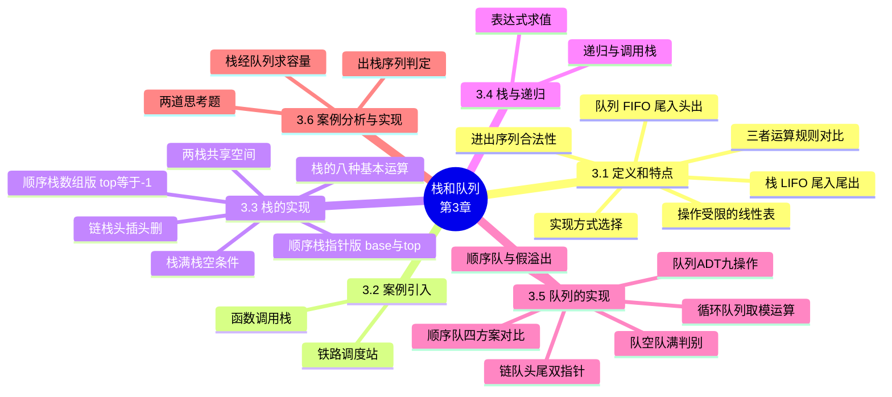

# 第三章 栈和队列

> **本章主线**：从铁路调度站与函数调用两个案例引出**操作受限的线性表**——栈与队列的逻辑结构仍是一对一，差别只在运算规则（栈 LIFO、队列 FIFO）→ 用"定义、逻辑结构、存储结构、运算规则、实现方式"五要素分别刻画两种结构，并讨论"直接拿线性表的尾插/尾删、头删来实现"的代价：凡 $O(n)$ 的方案一律不采用，凡 $O(1)$ 的方案才是优化结构 → 栈的实现：**顺序栈**两种定义方式（固定数组 $top=-1$、指针 $base/top$）+ 两栈共享空间 + **链栈**（无头结点单链表的头插头删），核心是栈满、栈空条件 → **栈与递归**：函数调用栈的状态变化与表达式求值 → 队列的实现：顺序队的**真溢出/假溢出** → **循环队列**取模运算的关键表达式与队空队满两种控制方式 → **链队列**（有头结点单链表 + 头尾双指针，注意删除末结点时 rear 失效）→ 最后用案例分析收束：栈经队列的输出与容量、出栈序列合法性、两道思考题。
> 一句话版本：**同一份线性表，只在一端进出是栈（尾入尾出，顺序用 top 顶进顶出、链式用头插头删，皆 $O(1)$），一端进另一端出是队列（尾入头出）**；顺序队必须用**取模**转成循环才能躲开假溢出，队空 `front==rear`、队满 `(rear+1)%M==front` 是整个实现的生命线。



---

## 3.1 栈和队列的定义和特点

### 3.1.1 栈：只能在一端进出的线性表

**栈**（Stack）是**只能在表的一端（栈顶）进行插入和删除运算的线性表**。按五要素逐条刻画：

1. **定义**：只能在表的一端（栈顶）进行插入和删除运算的线性表；
2. **逻辑结构**：与线性表相同，仍为**一对一**关系；
3. **存储结构**：用顺序栈或链栈存储均可，但以**顺序栈更常见**；
4. **运算规则**：只能在栈顶运算，且访问结点时依照**后进先出**（Last In First Out，**LIFO**）或**先进后出**（First In Last Out，**FILO**）的原则；
5. **实现方式**：关键是编写**入栈**和**出栈**函数，具体实现依顺序栈或链栈的不同而不同。

从一般线性表的角度看，栈就是**只能在表的尾部插入新元素、并且只能在表的尾部删除老元素**（或只能在头部插入、头部删除）——运算被限制在一端。记法上，**"进"＝压入＝PUSH**，**"出"＝弹出＝POP**；基本操作有入栈、出栈、读栈顶元素值、建栈、判断栈满、栈空等。

铁路调度站是栈的经典原型：进站的车只能从同一端原路退出（详见 3.2.1）。

### 3.1.2 队列：一端进、另一端出的线性表

**队列**（Queue）是**只能在表的一端（队尾）进行插入、在另一端（队头）进行删除运算的线性表**。同样按五要素：

1. **定义**：只能在表的一端（队尾）插入、在另一端（队头）删除的线性表；
2. **逻辑结构**：与线性表相同，仍为**一对一**关系；
3. **存储结构**：用顺序队列或链队存储均可；
4. **运算规则**：**先进先出**（First In First Out，**FIFO**）；
5. **实现方式**：关键是编写**入队**和**出队**函数，具体实现依顺序队或链队的不同而不同。

队列 $q = (a_1, a_2, \ldots, a_n)$，约定 $a_1$ 端为**队头**（出队端），$a_n$ 端为**队尾**（入队端）：$a_{n+1}$ 从队尾**入队列**，$a_1$ 从队头**出队列**——入队后队列变为 $(a_1, a_2, \ldots, a_n, a_{n+1})$，出队后变为 $(a_2, \ldots, a_n, a_{n+1})$。记法上，**"进"＝入队列＝EnQueue**，**"出"＝出队列＝DeQueue**；从一般线性表的角度看，队列就是**只能在表的尾部插入新元素、并且只能在表的头部删除老元素**（或头部插入、尾部删除）。

### 3.1.3 栈、队列与一般线性表的区别

栈和队列是一种**特殊（操作受限）的线性表**，区别仅在于**运算规则**不同：

| 维度 | 一般线性表 | 栈 | 队列 |
|---|---|---|---|
| 逻辑结构 | 一对一 | 一对一 | 一对一 |
| 存储结构 | 顺序表、链表 | 顺序栈、链栈 | 顺序队、链队 |
| 运算规则 | 随机存取、顺序存取，**任意位置存取** | **后进先出**（尾入尾出） | **先进先出**（尾入头出） |

> 口诀：**线性表任意位置自由存取，栈认一端、队认两端**——逻辑同宗、存储同源，差别只在"从哪儿进、从哪儿出"。

### 3.1.4 基于线性表的实现方式选择

栈的两个核心操作可以直接落到线性表的两个重要函数上——尾插入与按位删除：

```c
/* 栈：尾入尾出 */
Status Push(Stack &S, ElemType e)   { return ListTailInsert(S, e); }
Status Pop(SqStack &S, ElemType &e) { return ListDelete_Sq(S, S.Length, e); }

/* 队列：尾入头出 */
Status EnQueue(Queue &Q, ElemType e) { return ListTailInsert(Q, e); }
Status DeQueue(SqStack &S, ElemType &e) { return ListDelete_Sq(S, 1, e); }
```

但"能实现"不等于"实现得优"。把**顺序/链式存储 × 操作端位置**共 8 种组合的时间复杂度摊开（结论见下表）：

| 存储 | 位置方案 | 操作方式与复杂度 | 结论 |
|---|---|---|---|
| 顺序 | 栈顶为表头 | PUSH 在下标 1 处插入、POP 在下标 1 处删除，均需顺序移动元素 $O(n)$ | 不采用 |
| 顺序 | 栈顶为表尾 | 用下标直接访问表尾，PUSH/POP 均 $O(1)$ | **已是优化结构** |
| 顺序 | 队头为表尾 | EnQueue 在下标 1 处插入 $O(n)$，DeQueue 直接访问表尾 $O(1)$ | 不采用，优化为循环队列 |
| 顺序 | 队头为表头 | EnQueue 直接访问表尾 $O(1)$，DeQueue 在下标 1 处删除 $O(n)$ | 不采用，优化为循环队列 |
| 链式 | 栈顶为表头 | PUSH 头插法、POP 头指针后删除，均 $O(1)$ | **已是优化结构** |
| 链式 | 栈顶为表尾 | PUSH 尾插先移动到表尾、POP 尾删除先移动到表尾前，均 $O(n)$ | 不采用 |
| 链式 | 队头为表尾 | EnQueue 头插法 $O(1)$，DeQueue 尾删除先移动到表尾前 $O(n)$ | 不采用，优化为头尾双指针链表 |
| 链式 | 队头为表头 | EnQueue 尾插先移动到表尾 $O(n)$，DeQueue 头指针后删除 $O(1)$ | 不采用，优化为头尾双指针链表 |

最终选型结论：**顺序栈选"栈顶为表尾"、链栈选"栈顶为表头"，均已是最优结构、进出皆 $O(1)$**；顺序队列两方案各有一端 $O(n)$，统一**优化为循环队列**——用 $rear$、$front$ 两个下标按 $++$ 取模直接加入与删除，不移动任何已有元素、维持原有顺序，进出均 $O(1)$；链队列两方案同样各有一端 $O(n)$，统一**优化为头尾双指针链表**——EnQueue 在 $rear$ 指针后插入结点、DeQueue 删除 $front$ 指针后结点，进出均 $O(1)$。

> 口诀：**栈挑一端：顺序顶在表尾、链式顶在表头，$O(1)$ 已是优化结构；队列别纠结位置——顺序转循环、链式挂双指针，进出才都 $O(1)$**。

**教学目标提示**：实现栈要**特别注意栈满和栈空的条件**，实现队列要**特别注意队满和队空的条件**——它们是后续所有代码判错的第一道闸门。

### 3.1.5 进出序列的合法性

**练习 1（栈）**：若已知一个栈的入栈序列是 $1, 2, 3, \ldots, n$，其输出序列为 $p_1, p_2, \ldots, p_n$，若 $p_1 = n$，则 $p_i$ 为（　）。A．$i$　B．$n-i$　C．$n-i+1$　D．不确定。

**答案 C**。推理：$n$ 最先出栈，意味着 $1 \sim n$ 必须全部先入栈（否则 $n$ 还没进得来），此时栈内自底向上为 $1, 2, \ldots, n$，只能依次弹出 $n, n-1, \ldots, 1$，故 $p_i = n - i + 1$。

**练习 2（队列）**：若已知一个队列的入队序列是 $1, 2, 3, \ldots, n$，其输出序列为 $p_1, p_2, \ldots, p_n$，则 $p_i$ 为（　）。A．$i$　B．$n-i$　C．$n-i+1$　D．不确定。

**答案 A**。队列先进先出，输入 $123456$ 输出**永远是** $123456$——不存在任何重排的自由度，$p_i = i$。

**练习 3（栈）**：如果一个栈的输入序列为 $123456$，能否得到 $435612$ 和 $135426$ 的出栈序列？

- $435612$ **不能**——得到 $4, 3$ 后栈内剩 $[1, 2]$（2 压在 1 上），后续即使把 $5、6$ 走完，也只能先出 $2$ 再出 $1$；而目标序列末尾是 $1, 2$，**$1、2$ 顺序颠倒**，不可能实现；
- $135426$ **可以**——操作序列为 PUSH(1) POP、PUSH(2) PUSH(3) POP(3)、PUSH(4) PUSH(5) POP(5)、POP(4)、POP(2)、PUSH(6) POP(6)。

详细判定方法作为完整例题在 3.6.2 展开。

## 3.2 案例引入

### 3.2.1 铁路调度站：栈的原型

铁路调度站是栈最直观的物理模型：列车从一端驶入调度站，**只能从同一端原路驶出**——后进站的车必须先出站（LIFO）。调度站的"站口"就是**栈顶**，站内轨道深处就是**栈底**；压入（PUSH）对应车辆进站，弹出（POP）对应车辆出站。这个模型解释了为什么 3.1.5 练习 3 中 $1, 2$ 的相对顺序一旦入栈就再难颠倒：**栈内的先后关系被物理地锁死了**。

### 3.2.2 函数调用栈：递归的原型

五个子函数与 main 函数构成一条递归调用链：

```c
int fun1(int n) { if (n == 0) return 1; else return n * fun2(n - 1); }
int fun2(int n) { if (n == 0) return 1; else return n * fun3(n - 1); }
int fun3(int n) { if (n == 0) return 1; else return n * fun4(n - 1); }
int fun4(int n) { if (n == 0) return 1; else return n * fun5(n - 1); }
int fun5(int n) { if (n == 0) return 1; else return 1; }
void main() { int i = fun1(4); printf("%d", i); }
```

当被调用的 `fun5` 执行到 `n == 0` 条件成立时，在**调用栈**中可以看到从 `fun1` 到 `fun5` 的依次调用次序——`fun1(4)` 压栈 → `fun2(3)` 压栈 → `fun3(2)` 压栈 → `fun4(1)` 压栈 → `fun5(0)` 压栈，栈内自底向上恰好是 `fun1, fun2, fun3, fun4, fun5`；随后 `fun5` 返回 1，逐层弹栈回算：$\text{fun4}(1) = 1 \times 1$、$\text{fun3}(2) = 2 \times 1$、$\text{fun2}(3) = 3 \times 2$、$\text{fun1}(4) = 4 \times 6$，最终 `i` 为 $4 \times 3 \times 2 \times 1 \times 1 = 24$。

这个案例预告了 3.4 的主题：**递归的执行过程就是调用栈的压栈与弹栈过程**——后调用的函数先返回，正是 LIFO。

## 3.3 栈的表示和操作的实现

### 3.3.1 栈的基本运算集

定义在栈结构上的基本运算共 8 个：

1. 生成空栈（初始化栈）：`InitStack(&S)`
2. 销毁栈：`DestroyStack(&S)`
3. 判栈空：`StackEmpty(S)`
4. 数据元素入栈：`Push(&S, e)`
5. 数据元素出栈：`Pop(&S, &e)`
6. 取栈顶元素：`GetTop(S, &e)`——读栈顶元素，**栈不变化**
7. 置栈空（清空栈元素）：`ClearStack(&S)`
8. 求当前栈元素个数：`StackLength(S)`

因为栈是运算受限的线性表，**线性表的存储结构对栈也适用**——顺序存储与链式存储两条路线展开如下。

### 3.3.2 顺序栈（实现方式 1：固定数组）

和顺序表相似，固定大小顺序栈的类型描述：

```c
#define MAXSIZE 1024
typedef struct {
    datatype data[MAXSIZE];
    int      top;
} SeqStack;
SeqStack *s;   /* 指向顺序栈的指针 */
```

约定三条基本规则：

1. 顺序表的 **0 下标端设为栈底**，入栈时 `top` 向上增长，出栈时 `top` 向下减少；
2. 初始化栈顶指针 `s->top` 值为 **-1**，表示空栈；
3. 栈顶元素存于 `data[top]`。

**置空栈**——先建立栈空间，再初始化栈顶指针（返回指针形式，避开"在函数内初始化调用者指针"的陷阱）：

```c
SeqStack *Init_SeqStack()
{
    SeqStack *s;
    s = (SeqStack *)malloc(sizeof(SeqStack));  /* 申请栈空间 */
    if (!s) { printf("空间不足\n"); return NULL; }
    s->top = -1;                               /* 初始化栈顶指针 */
    return s;
}
```

**判栈空**——检查栈顶指针的值：

```c
int Empty_SeqStack(SeqStack *s)
{
    if (s->top == -1) return 1;   /* 空栈返回 1 */
    else               return 0;
}
```

**入栈**——尾插入，先查满：

```c
int Push_SeqStack(SeqStack *s, datatype x)
{
    if (s->top == MAXSIZE - 1)
        return 0;                      /* 栈满不能入栈，返回错误代码 0 */
    s->top++;                          /* 栈顶指针向上移动 */
    s->data[s->top] = x;               /* 将 x 置入新的栈顶 */
    return 1;                          /* 入栈成功 */
}
```

**出栈**——尾弹出，先查空，**先保存再下移**：

```c
int Pop_SeqStack(SeqStack *s, datatype *x)
{
    if (Empty_SeqStack(s))
        return 0;                      /* 栈空不能出栈，返回错误代码 0 */
    *x = s->data[s->top];              /* 保存栈顶元素值 */
    s->top--;                          /* 栈顶指针向下移动 */
    return 1;
}
```

**取栈顶元素**——与出栈的唯一差别是 **`top` 不动**：

```c
int Top_SeqStack(SeqStack *s, datatype *x)
{
    if (Empty_SeqStack(s)) return 0;   /* 栈空无元素 */
    *x = s->data[s->top];              /* 仅读取，栈顶指针不变化 */
    return 1;
}
```

**可变容量版本**：参考顺序表的动态分配，把 `data` 换成指针、增加 `nMaxStackSize`——`data` 在初始化时指向分配的内存，`top` 照旧为 $-1$；初始化函数改为 `Init_SeqStack(int nMaxStacksize)`，先 `malloc` 结构体、再 `malloc` 数据区（数据区失败须 `free(s)` 回收后再返回 NULL）。代码组织有"有 else"与"无 else"两种结构——**当 if 分支之后的代码只在条件不成立时才该执行完**，可以省略 else 让错误分支提前 `return`，主流程自然变成一条直线（提前返回式防御性结构）。

**练习**：在一个具有 $n$ 个单元的顺序栈中，假设以地址**高端**作为栈底，以 `top` 作为栈顶指针，则作进栈处理时 `top` 的变化为（　）。A．top 不变　B．top=0　C．top++　D．top--

**答案 D**。栈底在高地址，新元素只能向**低地址**方向生长，栈顶指针向低地址移动即 `top--`——与"0 下标端为栈底、top++ 增长"（3.3.2）方向正好相反。**方向本身无所谓，有所谓的是"top 指向谁"与"空/满时 top 的取值"**，写代码前必须先把这两条约定钉死。

### 3.3.3 顺序栈（实现方式 2：指针 base/top）

用指针方式表示的顺序表来实现栈——**`base` 永远不动（就是栈底/顺序表本体），`top` 指向栈顶元素之上的下一个下标地址**：

```c
#define MAXSIZE 100
typedef int SElemType;
typedef struct {
    SElemType *base;
    SElemType *top;
    int        stacksize;
} SqStack;
```

> 为什么不用另一种定义——`unsigned int base; unsigned int top; SElemType *s; int stacksize;`？因为**只有指针才能做减法**：`top - base` 直接得到栈中元素个数、`top - base == stacksize` 直接判满；整数下标方案还得先换算基地址，且与 `data[i]` 索引割裂。这就是"顺序表去哪了"的答案：**`base` 指向的那个顺序表就是栈本身**。

关键状态：

1. **空栈**：`base == top`（即 `top - base == 0`）；
2. **栈满**：`top - base == MAXSIZE`；
3. 栈顶元素：`*(top - 1)` 或 `base[top - base - 1]`；
4. 初始化时 `top = base`，`stacksize = MAXSIZE`。

**初始化**——三步：分配空间并检查、设置栈底栈顶指针、设置栈的大小：

```c
Status InitStack(SqStack &S)
{
    S.base = new SElemType[MAXSIZE];
    if (!S.base) return OVERFLOW;
    S.top = S.base;
    S.stackSize = MAXSIZE;
    return OK;
}
```

**判空、求长、清空、销毁**：

```c
bool StackEmpty(SqStack S)
{
    if (!S.base) return false;      /* 未初始化 */
    else          return S.top == S.base;
}

int StackLength(SqStack S)
{
    if (!S.base) return 0;
    else          return S.top - S.base;   /* 指针相减 = 元素个数 */
}

Status ClearStack(SqStack S)
{
    if (S.base) { S.top = S.base; return OK; }  /* 长度归零，空间保留 */
    else        return ERROR;
}

Status DestroyStack(SqStack &S)
{
    if (S.base) {
        delete S.base;
        S.stacksize = 0;
        S.base = S.top = NULL;
    }
    return OK;
}
```

注意 `ClearStack` 只把 `top` 拉回 `base`（**空间不还**，清空即可再用），`DestroyStack` 才真正释放内存并把指针置空——两者与线性表的 `ClearList`/`DestroyList` 一一对应。

**入栈**——判满后**先放后移**（`*S.top++ = e` 等价于 `*S.top = e; S.top++;`）：

```c
Status Push(SqStack &S, SElemType e)
{
    if ((!S.base)                          /* 栈未初始化 */
        || (S.top - S.base == S.stacksize)) /* 栈满 */
        return ERROR;
    *S.top++ = e;
    return OK;
}
```

**出栈**——判空后**先移后取**（`e = *--S.top` 等价于 `--S.top; e = *S.top;`）：

```c
Status Pop(SqStack &S, SElemType &e)
{
    if ((!S.base) || (S.top == S.base))    /* 栈空 */
        return ERROR;
    e = *--S.top;
    return OK;
}
```

**取栈顶元素**——只能读 `*(S.top - 1)`：

```c
Status GetTop(SqStack S, SElemType &e)
{
    if ((!S.base) || (S.top == S.base))    /* 栈空 */
        return ERROR;
    e = *(S.top - 1);
    return OK;
}
```

> 易错警示：写成 `e = *(S.top--)` **行不行？**——不行。**取＝读取，不是弹出**：`top--` 会把栈顶指针下移，读完之后栈里就"少了"一个元素，`GetTop` 偷偷变成了 `Pop`。

**栈满时的处理方法**：报错，返回操作系统；或分配更大的空间作为栈的存储空间，将原栈的内容移入新栈（对应线性表的 `ExtendList` 思想）。

**练习回顾**：栈顶 `top` 向上增长方案下，入栈是 `top++`、出栈是 `top--`；若反过来以高地址为栈底则方向相反——**无论哪种，空栈/栈满的判别式都要与约定保持自洽**：`top == base`（空）与 `top - base == stacksize`（满）不随方向改变语义。

### 3.3.4 两栈共享空间

两个栈共享一组地址连续的存储单元：**数组（栈空间）+ 两个栈顶指示**——栈 1 从左端向右生长，栈 2 从右端向左生长，相遇即满。

```c
#define DUSTACK_SIZE 100        /* 两栈的总允许容量 */
typedef struct {
    SElemType *base;
    SElemType *top1, *top2;     /* 两个栈顶指示 */
    int        dustacksize;
} DuStack;
DuStack S;
/* 存储布局：S.base[0] ... S.base + S.dustacksize - 1
   栈 1 的栈底在 S.base，栈 2 的栈底在 S.base + S.dustacksize - 1 */
```

**价值**：两个栈互补忙闲——栈 1 满时栈 2 往往还空着，总空间 $M$ 可被两边动态分享，只有 $top1 + 1 == top2$ 才是真正的"满"。这是"空间换弹性"的又一例证，与顺序表 `realloc` 扩容思路互补。

### 3.3.5 链栈

链栈是**运算受限的单链表**：只能在链表头部进行操作，**故没有必要附加头结点——栈顶指针就是链表的头指针**。

```c
typedef struct StackNode {
    SElemType           data;
    struct StackNode *next;
} StackNode, *LinkStack;
LinkStack S;
/* 结点定义与单链表 LNode 完全一样，差别只在"从哪端操作" */
```

**初始化**——就是一个没有头结点的单链表，置空即可：

```c
void InitStack(LinkStack &S) { S = NULL; }
```

**判空**——两种等价写法：

```c
Status StackEmpty(LinkStack S)
{
    if (S == NULL) return OK;   /* 常写成 if (!S) */
    else           return ERROR;
}
bool StackEmpty2(LinkStack S) { return !S; }
```

**进栈**——**就是一个没有头结点的单链表的头插算法**，$O(1)$：

```c
Status Push(LinkStack &S, SElemType e)
{
    p = new StackNode;          /* 生成新结点 p */
    if (!p) return OVERFLOW;
    p->data = e;
    p->next = S;                /* 新结点指向原栈顶 */
    S = p;                      /* 栈顶指针指向新结点 */
    return OK;
}
```

**出栈**——**就是一个没有头结点的单链表的头删除算法**，$O(1)$，注意释放：

```c
Status Pop(LinkStack &S, SElemType &e)
{
    if (S == NULL) return ERROR;
    e = S->data;                /* 保存栈顶值 */
    p = S;
    S = S->next;                /* 栈顶指针后移 */
    delete p;                   /* 释放原栈顶 */
    return OK;
}
```

**取栈顶元素**——读头指针数据域，不动链：

```c
SElemType GetTop(LinkStack S)
{
    if (S == NULL) return 1;    /* 栈空（约定返回值） */
    else           return S->data;
}
```

链栈**没有栈满问题**（内存够就一直能压），只有 `S == NULL` 一个判别条件——这正是"链式 vs 顺序"的经典差异在栈上的投影。

### 3.3.6 顺序栈与链栈的对比

| 维度 | 顺序栈 | 链栈 |
|---|---|---|
| 底层载体 | 连续数组 + 栈顶指示 | 无头结点单链表，头指针即栈顶 |
| 空栈条件 | `top == -1` 或 `base == top` | `S == NULL` |
| 栈满条件 | `top == MAXSIZE-1` 或 `top - base == stacksize` | 不存在（动态分配） |
| Push/Pop | 判满判空 + 指针/下标移动，$O(1)$ | 头插/头删，$O(1)$ |
| 空间特性 | 预分配、可能浪费、存储密度 1 | 每结点多一个指针、随用随建 |
| 初始化/销毁 | 分配整块数据区 / `delete` 归还 | `S = NULL` / 逐结点释放 |
| 栈满处理 | 报错或搬移扩容 | 无需处理 |

> 口诀：**顺序栈一数组两指针、判满判空两道闸；链栈一指针判空即止、无满可忧**——规模固定用顺序，伸缩自如用链式；**无论哪种，空满条件先于一切操作**（教学目标反复强调的正是这一点）。

## 3.4 栈与递归

### 3.4.1 递归执行过程与调用栈

递归算法执行过程中**栈的状态变化**是本章的核心考点之一。以 3.2.2 的 `fun1(4)` 为例，压栈与弹栈全程：

| 步骤 | 动作 | 栈内自底向上 | 说明 |
|---|---|---|---|
| 1 | `main` 调 `fun1(4)` | fun1 | 第 1 层压栈，$n=4$ 随帧保存 |
| 2 | `fun1` 调 `fun2(3)` | fun1, fun2 | 第 2 层压栈 |
| 3 | `fun2` 调 `fun3(2)` | fun1, fun2, fun3 | 第 3 层压栈 |
| 4 | `fun3` 调 `fun4(1)` | fun1, fun2, fun3, fun4 | 第 4 层压栈 |
| 5 | `fun4` 调 `fun5(0)` | fun1, ..., fun4, fun5 | 第 5 层压栈，`n==0` 成立 |
| 6 | `fun5` 返回 1 | fun1, ..., fun4 | fun5 弹栈，值上抛 |
| 7 | `fun4` 算 $1\times1$ 返回 | fun1, ..., fun3 | fun4 弹栈 |
| 8 | `fun3` 算 $2\times1$ 返回 | fun1, fun2 | fun3 弹栈 |
| 9 | `fun2` 算 $3\times2$ 返回 | fun1 | fun2 弹栈 |
| 10 | `fun1` 算 $4\times6$ 返回 | （空） | fun1 弹栈，`i = 24` |

规律：**调用即压栈、返回即弹栈；后调用的先返回**——这正是 LIFO。每一层"未完成的计算现场"（参数、局部变量、返回地址）都作为一个栈帧保存在调用栈里；**递归深度受栈空间限制**，层次过深会造成栈溢出（补充说明/拓展：操作系统给线程栈的默认空间有限，深度递归或无限递归会触发 `StackOverflow` 类错误——这就是为什么递归总要问"递归终止条件 + 每次规模更小"两件事）。

### 3.4.2 表达式求值

**补充说明/拓展**：教学目标要求"掌握表达式求值方法"，其标准做法是**栈的经典应用**，此处按学科常识补全。

**问题**：计算含 `+ - * /` 与括号的中缀表达式，如 $9 + 3 \times (4 - 2) / 2$。

**思路（两栈法）**：设运算数栈 `OPND`、运算符栈 `OPTR`，从左到右扫描：

1. 读到数字 → 压入 `OPND`；
2. 读到运算符 → 若栈顶符号优先级**低于**当前符号，当前符号入栈；否则弹出栈顶运算符、从 `OPND` 弹出两个数计算，结果压回 `OPND`，再与新符号比较；
3. 读到左括号 → 直接入 `OPTR`；读到右括号 → 把 `OPTR` 中符号逐个弹出计算，直到左括号弹出为止；
4. 扫描结束，`OPTR` 弹空为止，`OPND` 栈顶即结果。

**为什么必须用栈**：运算符有结合性与优先级——"先来未必先算"（`9 + 3 * 2` 中 `+` 先读到却后算），**延迟处理等待高优先级符号**这个需求与栈的 LIFO 完全同构；括号更是显式的"回到过去"语义。**本质**：表达式求值 = 用栈把"线性扫描的时间序"改造成"符合运算规则的计算序"。

## 3.5 队列的表示和操作的实现

### 3.5.1 队列的抽象数据类型

**ADT Queue**：

- **数据对象**：$D = \{a_i \mid a_i \in \text{ElemSet},\ i = 1, 2, \ldots, n,\ n \ge 0\}$
- **数据关系**：$R = \{\langle a_{i-1}, a_i\rangle \mid a_{i-1}, a_i \in D,\ i = 2, \ldots, n\}$，约定 $a_1$ 端为队头、$a_n$ 端为队尾
- **基本操作（9 个）**：

1. `InitQueue(&Q)`：构造空队列
2. `DestroyQueue(&Q)`：销毁队列
3. `ClearQueue(&Q)`：清空队列
4. `QueueEmpty(Q)`：判空，空--TRUE
5. `QueueLength(Q)`：取队列长度
6. `GetHead(Q, &e)`：取队头元素
7. `EnQueue(&Q, e)`：入队列
8. `DeQueue(&Q, &e)`：出队列
9. `QueueTraverse(Q, visit())`：遍历

与栈的运算集对比：**多出"取队头 `GetHead`"且入队出队分处两端**——栈只需一个 `top`，队列必须维护 `front` 与 `rear` 两个指示。

### 3.5.2 顺序队列与假溢出

队列的顺序表示——用顺序存储的线性表：

```c
#define MAXQSIZE 100                 /* 最大队列长度 */
typedef struct {
    QElemType *base;                 /* 初始化时动态分配存储空间 */
    int        front;                /* 头指针（下标） */
    int        rear;                 /* 尾指针（下标） */
} SqQueue;
```

> **为什么这里的两个"指针"是整数下标，而顺序栈用真指针？**——队列在循环队列时用**取模运算**计算绕回来的队头、队尾位置，下标取模方便；顺序栈对地址值（指针值）用 `++`、`--` 计算快捷。**数据结构选型永远跟着运算方式走**。

基本状态（初始 `front = rear = 0`）：

1. **空队标志**：`front == rear`
2. **入队**：`base[rear++] = x;`
3. **出队**：`x = base[front++];`

**存在的问题——真溢出与假溢出**（设队列大小为 $M$）：

1. `front == 0` 且 `rear == M` 时再入队——**真溢出**（真的放不下了）；
2. `front != 0` 且 `rear == M` 时再入队——**假溢出**（0 到 $front-1$ 处明明空着，却因为 $rear$ 到头而拒绝入队）。

假溢出的根源：**两端指示只进不绕**，空闲区被甩在 `front` 之前再也用不上。解决方法——**循环队列**。

### 3.5.3 循环队列

把 `base[0]` 接在 `base[M-1]` 之后，逻辑上围成一个环：若 `rear + 1 == M` 则令 `rear = 0`——**利用"模"运算**实现。

**关键操作和表达式**（`M = MAXQSIZE`，全部建立在"少用一个元素空间"约定上）：

| 语义 | 表达式 |
|---|---|
| 队指针初值 | `Q.front = Q.rear = 0` |
| **队空**判断 | `Q.front == Q.rear` |
| **队满**判断 | `Q.front == (Q.rear + 1) % MAXQSIZE` |
| 入队 | `Q.rear = (Q.rear + 1) % MAXQSIZE`（先放 `base[rear]` 再移） |
| 出队 | `Q.front = (Q.front + 1) % MAXQSIZE`（先取 `base[front]` 再移） |
| 求队列长 | `(Q.rear - Q.front + MAXQSIZE) % MAXQSIZE` |

长度公式为什么要 `+ MAXQSIZE` 再取模——`rear` 绕回后可能小于 `front`，直接相减得负数，加上一个 $M$ 把负值抬成正的环上距离。

**循环队列的两种控制方式**——队空都是 `front == rear`，分歧在**如何区分队满**：

1. **方法 1**：另外设一个标志（或记录队列长度的变量）以区别队空、队满——如结构体中增加 `bool isQueueFull;` 或 `int nQueueLength;`；
2. **方法 2（教材/本课程采用）**：**少用一个元素空间**——空间不能用满，队满时留一个空单元当"哨兵"：队空 `front == rear`，队满 `(rear + 1) % M == front`。

> 两种方式的权衡：**方式 1 用一个变量换满空间利用率**（长度随手可读），**方式 2 用一个单元换判别式简洁**（无需维护额外状态）——代价都极小，选谁取决于是否顺手要维护长度。

**代码**（方式 2）：

```c
Status InitQueue(SqQueue &Q)
{
    Q.base = new QElemType[MAXQSIZE];
    if (!Q.base) return OVERFLOW;
    Q.front = Q.rear = 0;
    return OK;
}

int QueueLength(SqQueue Q)
{
    return (Q.rear - Q.front + MAXQSIZE) % MAXQSIZE;
}

Status EnQueue(SqQueue &Q, QElemType e)
{
    if ((Q.rear + 1) % MAXQSIZE == Q.front)   /* 队满 */
        return ERROR;
    Q.base[Q.rear] = e;
    Q.rear = (Q.rear + 1) % MAXQSIZE;
    return OK;
}

Status DeQueue(SqQueue &Q, QElemType &e)
{
    if (Q.front == Q.rear)                    /* 队空 */
        return ERROR;
    e = Q.base[Q.front];
    Q.front = (Q.front + 1) % MAXQSIZE;
    return OK;
}
```

**顺序存储队列的几种实现方案对比**：

1. **队尾固定为 0 下标**——缺点：入队列时需向后移动队列中的剩余元素；
2. **队头固定为 0 下标**——缺点：出队列时需向前移动队列中的剩余元素；
3. **队头队尾均不固定**——优点：入出队列均无需移动元素；缺点：**假溢出**；
4. **循环队列**——综合最优：不移动元素、绕回复用空闲区。

> 口诀：**固定一端必搬队，双移不绕必假溢，循环取模三全齐**——队列顺序存储只有一条正路：让 $front$、$rear$ 都会转圈。

### 3.5.4 链队列

链队列——**就是一个有头结点的单链表，用 `front` 和 `rear` 分别指向头和尾**：

```c
typedef struct QNode {
    QElemType          data;
    struct QNode      *next;
} QNode, *QueuePtr;

typedef struct {
    QueuePtr front;        /* 队头指针（指向头结点） */
    QueuePtr rear;         /* 队尾指针 */
    int      nQueueLength; /* 队列当前长度 */
} LinkQueue;
LinkQueue Q;
```

**状态变化**（对应四种基本情形）：

1. **(a) 空队列**：`front == rear`，都指向头结点，头结点 `next == NULL`；
2. **(b) 元素 x 入队**：`rear->next` 挂上新结点，`rear` 后移；
3. **(c) 元素 y 入队**：同上，队列为 `头结点 → x → y`；
4. **(d) 元素 x 出队**：头结点后第一个结点摘下，`front->next` 越过它。

**初始化**——申请头结点空间：

```c
Status InitQueue(LinkQueue &Q)
{
    Q.front = Q.rear = (QueuePtr)malloc(sizeof(QNode));
    if (!Q.front) return OVERFLOW;
    Q.front->next = NULL;            /* 空队列 */
    Q.nQueueLength = 0;
    return OK;
}
```

**销毁**——逐结点释放（把 `Q.rear` 当临时变量用）：

```c
Status DestroyQueue(LinkQueue &Q)
{
    QueuePtr p = Q.front;
    while (p) {
        Q.rear = p->next;            /* 借 rear 存后继 */
        free(p);
        p = Q.rear;
    }
    Q.front = Q.rear = NULL;
    Q.nQueueLength = 0;
    return OK;
}
```

**判空**——两种方式：

```c
Status QueueEmpty(LinkQueue Q)
{
    if (Q.front && Q.rear)
        return (Q.front == Q.rear);  /* 方式 1：头尾同指 */
    return ERROR;
}
/* 方式 2：直接看长度  return (!Q.nQueueLength); */
```

**取队头元素**——跳过头结点：

```c
Status GetHead(LinkQueue Q, QElemType &e)
{
    if (!Q.front || !Q.rear) return ERROR;
    if (Q.front == Q.rear)   return ERROR;   /* 队空 */
    e = Q.front->next->data;
    return OK;
}
```

**入队**——**就是一个有头结点的单链表在 `Q.rear` 之后插入的算法**，$O(1)$：

```c
Status EnQueue(LinkQueue &Q, QElemType e)
{
    if (!Q.front || !Q.rear) return ERROR;
    p = (QueuePtr)malloc(sizeof(QNode));
    if (!p) return OVERFLOW;
    p->data = e;
    p->next = NULL;
    Q.rear->next = p;            /* 尾后接入 */
    Q.rear = p;                  /* 尾指针后移 */
    Q.nQueueLength++;
    return OK;
}
```

**出队**——**就是一个有头结点的单链表的头删除算法**，关键在"删的是最后一个结点"：

```c
Status DeQueue(LinkQueue &Q, QElemType &e)
{
    if (!Q.front || !Q.rear)     return ERROR;
    if (Q.front == Q.rear)       return ERROR;   /* 队空 */
    p = Q.front->next;                            /* 首元结点 */
    e = p->data;
    Q.front->next = p->next;
    if (Q.rear == p) Q.rear = Q.front; /* 删除 p 后 rear 失效；此时队列空 */
    delete p;
    Q.nQueueLength--;
    return OK;
}
```

> **易错点**：出队摘掉的若正是 `rear` 指向的末结点，`rear` 就成了**悬空指针**——必须执行 `Q.rear = Q.front` 把队尾收回头结点，否则下次入队 `Q.rear->next = p` 直接写飞。这一行是链队列出队代码里**唯一比单链表头删多出来的语句**，也是最常见的失分点。

**链队小结**：有头结点 → 判空统一为 `front == rear`；头删/尾插 → 进出皆 $O(1)$；与 3.1.4 选型结论呼应——**头尾双指针链表正是链式队列的优化终点**。

## 3.6 案例分析与实现

### 3.6.1 完整例题：栈经队列的输出与栈容量

**题目** 设栈 S 和队列 Q 的初始状态为空，元素 $e_1, e_2, e_3, e_4, e_5, e_6$ 依次通过 S，**一个元素出栈后即进入 Q**，若 6 个元素出队的序列是 $e_2, e_4, e_3, e_6, e_5, e_1$，则栈 S 的容量至少应该是（　）。A．2　B．3　C．4　D．6

**解题步骤**：

1. **建模**：元素按 $e_1 \sim e_6$ 顺序入栈，凡出栈者立刻原样入队；**队列只负责按出入栈的先后顺序原样输出**——所以"出队序列"就等于"出栈序列"，问题转化为：按目标出栈序列模拟栈，记录**同时在栈内的元素个数的最大值**，即栈容量下界；
2. **逐步模拟**（出队请求 $e_2$：栈中须有 $e_2$，故先压 $e_1$、压 $e_2$，再弹 $e_2$ 入队）：

    | 出队目标 | 栈内动作 | 动作后栈内（底→顶） | 栈峰值 |
    |---|---|---|---|
    | $e_2$ | 压 $e_1$、压 $e_2$、弹 $e_2$ | $e_1$ | 2 |
    | $e_4$ | 压 $e_3$、压 $e_4$、弹 $e_4$ | $e_1, e_3$ | 3 |
    | $e_3$ | 弹 $e_3$ | $e_1$ | 3 |
    | $e_6$ | 压 $e_5$、压 $e_6$、弹 $e_6$ | $e_1, e_5$ | 3 |
    | $e_5$ | 弹 $e_5$ | $e_1$ | 3 |
    | $e_1$ | 弹 $e_1$ | （空） | 3 |

3. **读峰值**：全程同时在栈中的元素最多 3 个（$e_1, e_3, e_4$ 或 $e_1, e_5, e_6$ 两个瞬间），少于 3 则中途必有元素无处可放；
4. **排除干扰项**：6 个元素不代表容量要 6——栈是复用的，弹出即归还空间；也不是 2——第 2 步 $e_3$ 还压着时又要压 $e_4$。

**最终答案**：B．3。

**一句话概括**：栈经队列的输出问题 = 直接模拟出栈序列并记录**栈内同时存在元素的峰值**——容量就是这个峰值，不必猜。

### 3.6.2 完整例题：出栈序列的合法性判定

**题目** 栈的输入序列为 $123456$，判断 $435612$ 与 $135426$ 能否作为出栈序列；若能，给出一种操作序列。

**解题步骤**：

1. **判定准则**：出栈序列必须能被"压栈/弹栈"模拟出来——对目标序列从左到右扫描，栈顶等于目标值就弹出，否则继续压入下一个输入值；若输入耗尽仍凑不出目标值，则非法。其本质约束是：**任一时刻，栈内元素的递减次序（自顶向下）必须与它们在目标序列中的出现次序一致**；
2. **验证 $435612$**：`PUSH 1,2,3,4 → POP 4 → POP 3`，此时栈内为 $[1, 2]$（2 压在 1 上）；接下来目标要求 $5$——`PUSH 5 → POP 5`，再 `PUSH 6 → POP 6`，此时目标还剩 $1, 2$，但栈内自顶向下是 $2, 1$——**只能弹出 2 再弹出 1，得到 ...21，而目标是 ...12**，$1、2$ 顺序颠倒，无法实现；
3. **验证 $135426$**：`PUSH 1 → POP 1`（输出 1）→ `PUSH 2, PUSH 3 → POP 3`（输出 3，栈剩 $[2]$）→ `PUSH 4, PUSH 5 → POP 5`（输出 5，栈剩 $[2,4]$）→ `POP 4`（输出 4，栈剩 $[2]$）→ `POP 2`（输出 2，栈空）→ `PUSH 6 → POP 6`（输出 6）——输出恰为 $1,3,5,4,2,6$，合法；
4. **归纳判据**：$435612$ 中 $1$ 排在 $2$ 前面出——但 $2$ 后于 $1$ 入栈且其间无 $1$ 的弹出机会，$2$ 必然压在 $1$ 上，$1$ 不可能先于 $2$ 出——**"相对顺序被锁死"正是 3.2.1 铁路调度站模型的结论**。

**最终答案**：$435612$ **不能**，$135426$ **可以**（操作序列见步骤 3）。

**一句话概括**：判定出栈序列就是**一次模拟**——栈顶对得上就弹、对不上就压，压不动又对不上即非法；一切技巧都敌不过动手模拟一遍。

### 3.6.3 思考题

**思考题 1**：为什么顺序存储的队列要用循环方式来合理利用存储空间，而栈则无需考虑用循环方式合理利用存储空间这个问题？

**答**：因为两端的"空闲区位置"不同。栈的插入与删除发生在**同一端**——`top` 进进退退，已用空间始终是**从栈底连续到栈顶**的一段，空闲区永远整齐地留在栈顶之上，`top` 回退即自动复用，**永远不会出现"中间空着、两头够不着"**。队列则相反：`rear` 只进、`front` 只追，两端相向移动，`front` 走过之处留下的空洞被甩在身后，`rear` 到达数组末端时无法回头去填——这就是假溢出；只有让下标**取模绕回成环**，才能把身后的空洞重新接给 `rear` 用（见 3.5.2、3.5.3）。

**思考题 2**：能否用 2 个栈来实现 1 个队列？

**答（补充说明/拓展）**：能。一个栈 `Sin` 专管入队（push），一个栈 `Sout` 专管出队（pop）：出队时若 `Sout` 非空直接弹；若 `Sout` 为空，则把 `Sin` 中元素**全部逐个弹出压入 `Sout`**（一次翻转即恢复了先进先出的次序），再弹 `Sout`。每个元素至多被移动两次，摊还时间复杂度仍为 $O(1)$——**两个 LIFO 叠加出一个 FIFO**，与 3.5 中"操作端位置决定结构形态"的思想一脉相承。

### 知识定位与框架衔接

- **前置知识**：第 2 章线性表的顺序表与链表基本操作（本章大量代码就是"尾插、头删、按位删"的受限特化，如 `Push = ListTailInsert`、链栈进栈即头插法）；C 语言的指针、结构体、数组下标与函数递归——**递归不会写，调用栈就无从谈起**。
- **后续支撑**：第 4 章串的模式匹配、第 6 章树的先序/中序非递归遍历（显式栈）与层次遍历（队列）、第 7 章图的深度优先搜索（栈）、广度优先搜索（队列）、拓扑排序（入度队列）、第 10 章排序中的基数排序（队列序列）——**栈与队列是全书遍历算法的"执行器"**；表达式求值还直接衔接编译原理课程。
- **一个比喻**：栈像**一摞盘子**——只能从最上面拿，后放的先用；队列像**食堂排队**——队尾进、队头出，先来的先被打饭。而它们在学科体系中的角色，相当于盖房子时的**起重与传送装置**：房子（树、图）盖得再花哨，砖块（结点）的上下运输全靠这两件受限工具。
- **核心灵魂问题**：
  1. 循环队列为什么宁可**浪费一个单元**也要区分队空队满？若不浪费，`front == rear` 同时成立两义，哪些代码会第一个出错？
  2. 链队列出队删掉末结点时若漏写 `Q.rear = Q.front`，下一行入队代码会怎样崩掉？
  3. 同是一张线性表，栈为什么能"顺序取表尾 + 链式取表头"双双 $O(1)$，队列却必须靠循环与双指针才凑齐 $O(1)$？——**操作端的数量与位置，如何一步步决定了存储布局？**

> **一句话总结本章**：栈和队列是操作受限的线性表——栈 LIFO 一端进出，顺序栈用 `top` 顶进顶出、链栈用头插头删，皆 $O(1)$；队列 FIFO 两端进出，顺序队必须取模转循环（队空 `front==rear`、队满 `(rear+1)%M==front`），链队用头尾双指针并防住 rear 失效；**受限换来的是恒定 $O(1)$ 的进与出，而栈满栈空、队满队空这四组判别条件，就是所有实现的生命线**。

---

## 课件 PDF

<iframe src="https://cognishelf.naimore3.workers.dev/课程笔记/大二上/数据结构/03栈和队列/03栈和队列.pdf" width="100%" height="800px" style="border: none;"></iframe>

[打开 PDF](https://cognishelf.naimore3.workers.dev/课程笔记/大二上/数据结构/03栈和队列/03栈和队列.pdf)
