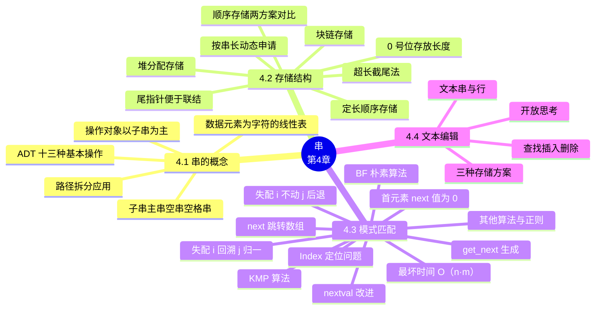

# 第四章 串

> **本章主线**：串是**数据元素为单个字符的特殊线性表**——线性表的操作以"数据元素"为对象，串的操作主要以"**子串**"为对象 → 从串名/串值/串长、子串/主串/空串/空格串等基本概念出发，定义 **ADT String** 的十三种基本操作，并用路径拆分（取路径/文件名/扩展名）展示 `Index + SubString` 的组合威力 → 存储结构三方案：**定长顺序存储**（0 号位存长、上溢截尾）与**堆分配存储**（按串长动态申请、免截断）各配一套 `StrCompare`/`Concat`/`SubString` 实现，**块链存储**因笨重而少用 → 全章灵魂——**模式匹配** `Index(S, T, pos)`：**BF 朴素算法**失配即回溯（$i = i - j + 2$、$j = 1$），最坏 $O(n \cdot m)$；**KMP 算法**用 **next 数组**把"已部分匹配的信息"变成跳转表，**失配时 $i$ 不动、$j$ 后退**，总复杂度 $O(n + m)$；next 的计算本身就是"模式串对自己的 KMP"，`get_next` 与 `Index_KMP` 代码同构；**nextval** 再消一层重复比较 → 最后一览 BM/Horspool/Sunday/KR/AC 自动机与正则表达式，并以文本编辑器的三种存储方案收束。
> 一句话版本：**串把线性表的"元素"缩小为字符、把操作重心上移到子串**；模式匹配是核心——BF 靠回溯蛮力 $O(nm)$，KMP 靠 next 数组记录"失配后 $j$ 跳哪"，让主串指针 $i$ 永不回头，复杂度降到 $O(n+m)$——**已匹配的部分不该被重复比较**，这就是 KMP 的全部灵魂。



---

## 4.1 串的概念

### 4.1.1 串及其基本概念

串是特殊的线性表：线性表可表示为 $(a_1, a_2, \ldots, a_n)$ 的线性结构，**数据元素是单个字符**。线性表的操作通常以"数据元素"为操作对象；**串的操作主要以"子串"为操作对象**——这一句是全章操作语义的总纲。

**定义**：**串**（String）是由**零个或多个字符**组成的**有限序列**，记作 $S = "a_1 a_2 \cdots a_n"$（$n \ge 0$）。相关术语：

| 术语 | 含义 |
|---|---|
| **串名** | 串的名称，如 $a$、$b$、$c$ |
| **串值** | 串本身，如 `'BEI'`、`'JING'`——**必须用单引号等定界符括起**，与标识符区分 |
| **串长** $n$ | 串中字符个数 |
| **空串** | 不包含任何字符的串，长度为 0，记作 `''` |
| **空格串/空白串** | 由一个或多个**空格**组成的串，如 `'   '`——**不是空串** |
| **子串** | 串中任意个**连续**的字符组成的子序列 |
| **主串** | 包含子串的串 |
| **串相等** | 两个串**长度相等**，且**对应位置的字符都相等**——空格是字符，参与比较 |

用例子钉死语义：$a=$`'BEI'`，$b=$`'JING'`，$c=$`'BEIJING'`，$d=$`'BEI JING'`。则 $a$、$b$ 都是 $c$ 的子串；$c$ 与 $d$ **不相等**（$d$ 多一个空格字符，长度已不同）——**空格串 ≠ 空串 ≠ 省略**，这是初学者最易混淆处。

字符的位置与子串的位置沿用线性表约定：串中第 $i$ 个字符记为 $S[i]$（或 $S[i-1]$，视下标方案而定，4.2 的 `SString` 从 1 开始编号）；子串在主串中的位置以**其首字符在主串中的位置**表示。

### 4.1.2 串的抽象数据类型

**ADT String**：

- **数据对象**：$D = \{a_i \mid a_i \in \text{Character},\ i = 1, 2, \ldots, n,\ n \ge 0\}$
- **数据关系**：$R = \{\langle a_{i-1}, a_i\rangle \mid a_{i-1}, a_i \in D,\ i = 2, \ldots, n\}$
- **基本操作（13 个）**：

1. `StrAssign(&T, chars)`：串赋值——用常量串 `chars` 给 `T` 赋值
2. `StrCompare(S, T)`：串比较——$S > T$ 返回值 $> 0$，$S = T$ 返回 $0$，$S < T$ 返回值 $< 0$
3. `StrLength(S)`：求串长
4. `Concat(&T, S1, S2)`：串联结——`T` 返回 `S1` 与 `S2` 联接而成的新串
5. `SubString(&Sub, S, pos, len)`：求子串——`Sub` 返回 `S` 从第 `pos` 个字符起长度为 `len` 的子串
6. `StrCopy(&T, S)`：串拷贝
7. `StrEmpty(S)`：串判空
8. `ClearString(&S)`：清空串
9. `Index(S, T, pos)`：子串定位——**模式匹配的核心操作**（4.3 全章展开）
10. `Replace(&S, T, V)`：串替换
11. `StrInsert(&S, pos, T)`：子串插入
12. `StrDelete(&S, pos, len)`：子串删除
13. `DestroyString(&S)`：串销毁

其中 `Index`、`Replace`、`StrInsert`、`StrDelete` 都可以由 `StrAssign`、`StrCompare`、`StrLength`、`Concat`、`SubString` 这五个**最小操作集**组合实现——**熟悉基本操作的定义，并能利用这些基本操作实现串的其它各种操作**，是本章第一条教学目标。

### 4.1.3 C 语言中的常用串运算

C 语言标准库 `<string.h>` 已提供常用串运算：**串比较** `strcmp(s1, s2)`、**串复制** `strcpy(to, from)`、**串连接** `strcat(to, from)`、**求串长** `strlen(s)`。更完整的常用函数一览：

| 函数 | 功能 |
|---|---|
| `strlen()` | 返回串长 |
| `strcpy()` / `strncpy()` | 整串复制 / 复制前 $n$ 个字符 |
| `strcat()` / `strncat()` | 整串连接 / 连接前 $n$ 个字符 |
| `strcmp()` / `strncmp()` | 整串比较 / 比较前 $n$ 个字符 |
| `strchr()` / `strrchr()` | 查找给定字符**首次/末次**出现 |
| `strstr()` | 查找给定**子串** |
| `strspn()` / `strcspn()` | 源串中仅含/不含给定字符集的跨度 |
| `strpbrk()` | 查找给定字符集中任一字符首次出现 |
| `strtok()` | 按分隔符把串切分为记号 |
| `strcoll()` | 按当前区域设置比较两串 |
| `memset()` / `memcpy()` / `memmove()` | 按字节初始化/复制/移动内存块 |
| `memcmp()` / `memchr()` | 按字节比较/查找内存块 |

> 注意：C 语言本身的串表示以 `'\0'` 作结束标志（如 `B O O K \0`），**不便于求串长等操作**——`strlen` 必须扫描到 `'\0'` 才知道长度；这正是数据结构课程改用"**0 号位（或 length 域）显式存放长度**"表示法的动机（见 4.2.1）。

### 4.1.4 串的常见应用：路径拆分

以路径 `C:\Windows\System32\WindowsPowerShell\v1.0\powershell.exe.config` 为例：

1. **Q1：取路径**——定位最后一个分隔符 `'\'`，`SubString` 截取其左侧部分；
2. **Q2：取文件名**——取最后一个 `'\'` 与最后一个 `'.'` 之间的子串；
3. **Q3：取文件扩展名**——定位最后一个 `'.'`，截取其右侧部分。

三个问题的解法全部是 **`Index`（定位分隔符）+ `SubString`（截取）** 的组合——基本操作虽小，组合起来即覆盖真实应用。

## 4.2 串的存储结构和操作的实现

### 4.2.1 定长顺序存储表示

**定长顺序存储**——用固定长度的数组存放串，**0 号单元存放串长**，字符从 1 号单元开始：

```c
#define MAXSTRLEN 255                     /* 最大串长 */
typedef unsigned char SString[MAXSTRLEN + 1];
/* S[0] 存放串长，S[1..S[0]] 存放字符，S[S[0]+1..MAXSTRLEN] 为闲置 */
```

如串 `'student'` 占用 `S[0]=7`、`S[1..7]="student"`。约定：**串值长度上溢时，用"截尾法"处理**——截断超过预定义长度的部分（`Concat` 中以返回值 `FALSE` 标告截断发生）。

**StrCompare**——从 1 号位逐个比较，比不出大小再比长度：

```c
int StrCompare(SString S, SString T)
/* S>T 返回值 >0；S=T 返回 0；S<T 返回值 <0 */
{
    for (i = 1; i <= S[0] && i <= T[0]; i++)
        if (S[i] != T[i])
            return (S[i] - T[i]);
    return S[0] - T[0];                /* 前缀全等，长者为大 */
}
```

**Concat**——三分支处理截断：

```c
bool Concat(SString &T, SString S1, SString S2)
/* 用 T 返回 S1 和 S2 联接的新串；未截断返回 TRUE，否则 FALSE */
{
    if (S1[0] + S2[0] <= MAXSTRLEN) {              /* ① 完全放得下 */
        T[1..S1[0]] = S1[1..S1[0]];
        T[S1[0]+1..S1[0]+S2[0]] = S2[1..S2[0]];
        T[0] = S1[0] + S2[0];
        uncut = TRUE;
    } else if (S1[0] < MAXSTRLEN) {                /* ② S1 放得下，S2 截尾 */
        T[1..S1[0]] = S1[1..S1[0]];
        T[S1[0]+1..MAXSTRLEN] = S2[1..MAXSTRLEN - S1[0]];
        T[0] = MAXSTRLEN;
        uncut = FALSE;
    } else {                                       /* ③ S1 本身就超长，全截 */
        T[0..MAXSTRLEN] = S1[0..MAXSTRLEN];
        uncut = FALSE;
    }
    return uncut;
}
```

三分支对应三种容量关系：$|S1| + |S2| \le \text{MAXSTRLEN}$、$|S1| < \text{MAXSTRLEN} < |S1| + |S2|$、$\text{MAXSTRLEN} \le |S1|$——**截尾只发生在尾部，前部永远优先保真**。

**SubString**——先验合法性，再整段拷贝：

```c
Status SubString(SString &Sub, SString S, int pos, int len)
/* 用 Sub 返回 S 从第 pos 个字符起长度为 len 的子串
   隐含条件：Sub 的空间必须 >= len + 1 */
{
    if (pos < 1 || pos > S[0] || len < 0 || len > S[0] - pos + 1)
        return ERROR;                       /* 位置或长度不合法 */
    Sub[1..len] = S[pos..pos + len - 1];
    Sub[0] = len;
    return OK;
}
```

注意 `len > S[0] - pos + 1`——截取长度不得超过"从 pos 到串尾"的剩余字符数；`len = 0` 合法（空子串）。

### 4.2.2 堆分配存储表示

**堆分配存储**——动态分配串值存储空间，**按串长申请、避免定长结构的截断现象**：

```c
typedef struct {
    char *ch;                    /* 串空间基址，按串长申请 */
    int   length;                /* 串长度 */
} HString;
```

与 `SString` 的差异：**长度从 0 号单元挪进独立字段**、字符从 `ch[0]` 起存放（0 号下标方案）、容量按需 malloc。

**StrCompare**——逻辑同款，下标从 0 起：

```c
int StrCompare(HString S, HString T)
{
    for (i = 0; i < S.length && i < T.length; i++)
        if (S.ch[i] != T.ch[i])
            return S.ch[i] - T.ch[i];
    return S.length - T.length;
}
```

**Concat**——**先释放 T 原有空间，再按需申请**，没有截断一说：

```c
Status Concat(HString &T, HString S1, HString S2)
{
    if (T.ch) free(T.ch);                       /* 释放 T 原有空间 */
    if (!(T.ch = (char *)malloc((S1.length + S2.length) * sizeof(char))))
        return OVERFLOW;
    T.length = S1.length + S2.length;
    T.ch[0..S1.length - 1]       = S1.ch[0..S1.length - 1];
    T.ch[S1.length..T.length - 1] = S2.ch[0..S2.length - 1];
    return OK;
}
```

**SubString**——`len = 0` 单独分支（`Sub.ch = NULL`、`Sub.length = 0`），非零才 malloc：

```c
Status SubString(HString &Sub, HString S, int pos, int len)
{
    if (pos < 1 || pos > S.length || len < 0 || len > S.length - pos + 1)
        return ERROR;
    if (Sub.ch) free(Sub.ch);                   /* 释放 Sub 原有空间 */
    if (!len) { Sub.ch = NULL; Sub.length = 0; }
    else {
        if (!(Sub.ch = (char *)malloc(len * sizeof(char))))
            return OVERFLOW;
        Sub.ch[0..len - 1] = S.ch[pos - 1..pos + len - 2];  /* pos 起 1 号位 */
        Sub.length = len;
    }
    return OK;
}
```

注意下标换算：`SString` 的第 `pos` 个字符是 `S[pos]`，`HString` 的第 `pos` 个字符是 `S.ch[pos - 1]`——**"第几个"与"下标"差一个 1，越界 bug 十有八九出在这里**。

### 4.2.3 顺序存储两种方案的对比

| 维度 | **定长顺序存储 `SString`** | **堆分配存储 `HString`** |
|---|---|---|
| 容量 | 编译期固定（`MAXSTRLEN`） | 运行期按串长 malloc |
| 长度存放 | 0 号单元 `S[0]` | 独立字段 `length` |
| 字符下标 | 从 **1** 起 | 从 **0** 起 |
| 超长处理 | **截尾法**，`Concat` 返回 FALSE 告警 | 无截断，重新按需分配 |
| 内存管理 | 无（随数组/结构体生存） | **必须 `free` 原空间再 malloc**，否则泄漏 |
| 适用场合 | 串长上界已知、追求简单 | 串长不可预知、不可容忍截断 |

> 口诀：**定长省心但会截、堆上精确须勤收**——下标一从 1 起一从 0 起，写算法先问"第 $i$ 个字符到底是谁"；堆方案的每次"变身"都伴随 free + malloc 两步曲。

### 4.2.4 块链存储结构

串的块链存储——结点的 `data` 不是单字符而是一个**字符块**：

```c
#define CHUNKSIZE 4                        /* 由用户定义块大小 */
typedef struct Chunk {
    char          ch[CHUNKSIZE];
    struct Chunk *next;
} Chunk;

typedef struct {                           /* 头尾指针的单链表 */
    Chunk *head, *tail;                    /* 串的头、尾指针 */
    int    curlen;                         /* 串的当前长度 */
} LString;
```

要点：块大小由用户定义；**设置尾指针便于联结操作**（`Concat` 时直接在 `tail` 后接块，不必找到链尾）；块内字符可能未占满（末块用特殊字符如 `^`、`#` 填充对齐）。

**评价**：占用存储量大（每块都有指针开销、末块常有填充）且操作不便（跨块截取、跨块比较都要处理边界）——**实际应用很少**；它的价值在于理解"链式结构如何承载连续数据"，与第 2 章链表、第 3 章链栈一脉相承。

## 4.3 串的模式匹配算法

### 4.3.1 模式匹配问题与 BF 算法思想

**算法目的**：确定主串中所含子串**第一次出现的位置（定位）**——即如何实现 `Index(S, T, pos)` 函数。其中 $S$ 是**主串**，$T$ 是**子串/模式串**，`pos` 表示从该位序字符开始向后寻找匹配。**算法种类**：BF（Brute Force，又称古典的、经典的、朴素的、穷举的）与 KMP（速度快）。以下以**定长顺序存储**结构讨论实现。

**BF 算法设计思想**——用 $i$ 跟踪主串当前位置、$j$ 跟踪模式串当前位置：

1. 将主串的第 `pos` 个字符（用 $i$ 跟踪）和模式的第一个字符（用 $j$ 跟踪）比较：**若相等**，继续逐个比较后续字符（$i{+}{+}$、$j{+}{+}$）；
2. **若不等（失配）**，从主串的**下一字符起**重新与模式的第一个字符比较——即**回溯**：$i = i - j + 2$、$j = 1$；
3. 直到主串的一个连续子串字符序列与模式相等——返回值为 $S$ 中与 $T$ 匹配的子序列第一个字符的**序号**，匹配成功；否则匹配失败，返回 $0$。

回溯公式的来历：失配时 $i$ 已经前进了 $j - 1$ 步，本次匹配的**起点**是 $i - (j - 1) = i - j + 1$；起点右移一位即 $i - j + 2$——也可引入变量 `pos` 记录本次匹配开始的位置（`pos` 的值可以由 $i - j + 1$ 算出），失配时令 $i$ 移动到 `pos + 1`、$j$ 从头开始。

### 4.3.2 BF 算法实现与时间复杂度

**实现一**（内外双循环，外层只做 `$j = 1$` 的复位）：

```c
int Index(SString S, SString T, int pos)
{
    int j = 1, i = pos;
    while (i <= S[0]) {
        j = 1;                              /* 外层循环的唯一工作 */
        while (j <= T[0]) {
            if (S[i] == T[j]) { ++i; ++j; }
            else { i = i - j + 2; break; }  /* i 回溯，j 回到 1（下轮外层做） */
        }
        if (j > T[0]) return i - T[0];      /* j 越界 = 整串匹配成功 */
    }
    return 0;
}
```

**实现二**（合并内外层循环，更紧凑——外层的 `$j = 1$` 并入内层的 `else` 分支）：

```c
int Index(SString S, SString T, int pos)
{
    int j = 1, i = pos;
    while (i <= S[0] && j <= T[0]) {
        if (S[i] == T[j]) { ++i; ++j; }
        else { i = i - j + 2; j = 1; }      /* i 回溯，j 回到 1 */
    }
    if (j > T[0]) return i - T[0];          /* 匹配成功 */
    else          return 0;
}
```

两版等价：判定成功的条件都是循环退出后 $j > T[0]$（模式全部比对完），此时匹配起点为 $i - T[0]$。

**时间复杂度**——设主串长度 $n$、模式串长度 $m$：

1. 最好情况：第一个字符即失配或首个位置即匹配，比较 $O(m + 1)$ 次；
2. **最坏情况**：主串前面 $n - m$ 个位置都**部分匹配到模式的最后一位**（前 $n - m$ 位各比较 $m$ 次），最后 $m$ 位也各比较 1 次，总次数为

    $$(n - m) \times m + m = (n - m + 1) \times m$$

3. 若 $m \ll n$，则复杂度为 $O(n \times m)$。

典型最坏例子：$S =$`'0000000001'`，$T =$`'0001'`，`pos = 1`——模式的前缀与主串的"全 0 段"处处部分匹配、处处在最后一位失配，逼着 BF 每个位置都从头比一遍。

### 4.3.3 KMP 算法思想

**改进动机**：BF 的 $i$ 回溯是"笨办法"——已经比对过的字符序列被整段丢弃。利用**已经部分匹配的结果**加快模式串的滑动速度，且**主串 $S$ 的指针 $i$ 不必回溯**，可提速到 $O(n + m)$。

对比一次失配时两算法的动作：

| 算法 | 失配时 $i$ | 失配时 $j$ |
|---|---|---|
| BF | 回溯：$i = i - j + 2$ | 归一：$j = 1$ |
| KMP | **不变**（停在原地） | **后退**到 $j = k$（由 next 数组给出） |

**核心问题**：失配点 $S[i] \ne T[j]$ 时，有没有一个 $k$ 使得 $T_1 \cdots T_{k-1}$ 恰好等于 $S_{i-k+1} \cdots S_{i-1}$（也就是"已匹配过的那段"的某个真前后缀）？若有，则**可以直接比较 $S[i]$ 和 $T[k]$**——$i$ 不动，$j$ 后退到 $k$。

而 $T_1 \cdots T_{k-1} = S_{i-k+1} \cdots S_{i-1}$ 这个"已匹配段"本来就等于 $T_{j-k+1} \cdots T_{j-1}$（它们刚刚逐位相等过），于是条件转化为**只与模式串自身有关**：$k$ 由 $T$ 的结构唯一决定，与 $S$ 无关——**这就是 next 数组可以预先离线计算的原因**。

### 4.3.4 next 数组的定义

**引入 next 数组**：将 $j$ 后退时对应的 $k$ 值保存在 `next[j]` 中——在 $S[i]$ 和 $T[j]$ 失配时，可继续对 $S[i]$ 和 $T[\text{next}[j]]$ 进行比较；$S$ 串的 $i$ 不需要回溯到 $i - j + 2$ 的位置重新开始，而是**停在原地不动**；存在 $k$ 时 $T$ 串的 $j$ 回溯到 `next[j]`，不存在时回溯到 1。

**next[j] 的函数定义**：

$$\text{next}[j] = \begin{cases} 0 & j = 1 \text{ 时} \\ \max\{k \mid 1 < k < j,\ \text{且}\ "p_1 \cdots p_{k-1}" = "p_{j-k+1} \cdots p_{j-1}"\} & \text{当此集合非空时} \\ 1 & \text{其他情况} \end{cases}$$

三条分支的含义与后果：

1. `next[j] = k`（集合非空）：**下一趟比较 $i$ 不变，$j = k$**——已匹配段的**最大真前缀**（长度 $k-1$）被直接挪到段首，跳转幅度最大；
2. `next[j] = 1`（其他情况）：**下一趟比较 $i$ 不变，$j = 1$**——没有任何可用的公共前后缀，只能拿模式首字符对准 $S[i]$ 重来；
3. `next[1] = 0`：**代表下一趟比较 $i = i + 1$，$j = 1$**——$T[1]$ 与 $S[i]$ 本身失配，模式串整体右移一位。

**next[j] 的函数语义**（另一种等价表述）：表明当模式中第 $j$ 个字符与主串中相应字符"失配"时，在模式中**需重新和主串中该字符进行比较的字符的位置**。

**为什么 `next[1]` 规定为 0**——$j = 1$ 时已经没有回退的位置了，"可以认为是不需要的"；给它 0 是为了**让代码统一**：当失配且 `j == 0` 时，说明连模式首字符都没对上，此时把 $i$ 和 $j$ **一起 $+{+}$** 即可（`j == 0` 是一个"哨兵态"，下一轮必然走 `S[i] == T[j]` 的推进分支）。

### 4.3.5 Index_KMP 与 get_next 的实现

**Index_1**——在 BF 基础上引入 next（保留 `$j == 1$ 特判"）：

```c
int Index_1(SString S, SString T, int pos)
{
    int j = 1, i = pos;
    while (i <= S[0] && j <= T[0]) {
        if (S[i] == T[j]) { ++i; ++j; }
        else {
            if (j == 1) i++;                /* j==1 无处可退，i 前进 */
            else        j = next[j];        /* i 不变，j 后退 */
        }
    }
    if (j > T[0]) return i - T[0];
    else          return 0;
}
```

**Index_KMP**——利用 `next[1] == 0` 的哨兵态去掉特判（**推荐背诵版**）：

```c
int Index_KMP(SString S, SString T, int pos)
{
    int i = pos, j = 1;
    while (i <= S[0] && j <= T[0]) {
        if (j == 0 || S[i] == T[j]) {       /* j==0 时必然 i++,j++ */
            i++; j++;
        } else
            j = next[j];                    /* i 不变，j 后退 */
    }
    if (j > T[0]) return i - T[0];          /* 匹配成功 */
    else          return 0;                 /* 返回不匹配标志 */
}
```

`j == 0 || S[i] == T[j]` 中的 `j == 0` 是 KMP 的标志性写法——**它把"模式整体右移一位"折叠进了正常推进分支**。

**get_next**——计算 next 数组，**其本身就是一次"模式串对自己的 KMP"**：

```c
void get_next(SString T, int next[])
{
    int j = 1; next[1] = 0; int k = 0;
    while (j < T[0]) {
        if (k == 0 || T[j] == T[k]) {
            ++j; ++k;
            next[j] = k;                    /* 顺序调整后少算两次加法 */
        } else
            k = next[k];                    /* k 回退，不回溯 j */
    }
}
```

**计算 next 数组的算法思路**（设 `next[j]` 的值为 $k$，注意此处 $j$ 跟踪"主串"角色、$k$ 跟踪"模式串"角色——与 `Index_KMP` 中 $i$、$j$ 的含义对位替换）：

1. 若 $T[j] = T[k]$：`next[j+1] = next[j] + 1`，$j{+}{+}$、$k{+}{+}$，回到本条继续；
2. 若 $T[j] \ne T[k]$：因 $1$ 到 $j$ 的 next 已经都算出了，按 KMP 的滑动令 $k = $ `next[k]`，回到本条继续；
3. 若 $k$ 一直滑动到 `next[1]`（即 $k = 0$）仍找不到匹配子串：表示需要从 $T[1]$ 开始向后比较，`next[j+1] = 1`，此时完成 $j$ 的处理，$k = 1$、$j{+}{+}$，回到本条继续。

**初始与结束条件**：`next[1] = 0`（不需计算）；$j = 1$（开始计算 `next[2]`）；$j = 1$ 时 $k$ 一定是 0；当 $j = T[0]$ 时计算结束，next 已全部算出。代码中的 `++j; ++k; next[j] = k;` 就是三条思路的合并——先自增再赋值，等价于"算 `next[j+1]` 再 `j++`"，但少算两次加法。

### 4.3.6 完整例题：next 与 nextval 数组计算

**题目** 已知模式串 $T =$ `"abcaabbcabcaabdab"`（长度 17），分别计算其 next 数组与 nextval 数组。

**解题步骤**：

1. **写清模式串与下标**（`SString` 下标从 1 起）：

    | $j$ | 1 | 2 | 3 | 4 | 5 | 6 | 7 | 8 | 9 | 10 | 11 | 12 | 13 | 14 | 15 | 16 | 17 |
    |---|---|---|---|---|---|---|---|---|---|---|---|---|---|---|---|---|---|
    | $T[j]$ | a | b | c | a | a | b | b | c | a | b | c | a | a | b | d | a | b |

2. **逐位计算 next**——按定义 $\text{next}[j] = \max\{k \mid 1 < k < j,\ T_1 \cdots T_{k-1} = T_{j-k+1} \cdots T_{j-1}\}$，集合空取 1，`next[1] = 0`。例如 $j = 7$ 时最长公共前后缀为 `"ab"`（$T_1 T_2 = T_5 T_6$），故 $\text{next}[7] = 3$；$j = 15$ 时 $T_1 \cdots T_6 =$`"abcaab"` $= T_9 \cdots T_{14}$，且加长即失败，故 $\text{next}[15] = 7$；
3. **得到 next**：

    | $j$ | 1 | 2 | 3 | 4 | 5 | 6 | 7 | 8 | 9 | 10 | 11 | 12 | 13 | 14 | 15 | 16 | 17 |
    |---|---|---|---|---|---|---|---|---|---|---|---|---|---|---|---|---|---|
    | $\text{next}[j]$ | 0 | 1 | 1 | 1 | 2 | 2 | 3 | 1 | 1 | 2 | 3 | 4 | 5 | 6 | 7 | 1 | 2 |

4. **逐位计算 nextval**——规则：生成 $i$ 位时，若 $T[i] \ne T[\text{next}[i]]$ 则 `nextval[i] = next[i]`，否则 `nextval[i] = nextval[next[i]]`（**与后继字符相等就继承后继的 nextval，一步跳到底**）；`nextval[1] = 0`。例：$i = 4$ 时 $T[4] = a = T[\text{next}[4]] = T[1]$，故 `nextval[4] = nextval[1] = 0`；$i = 15$ 时 $T[15] = d \ne T[7] = b$，故 `nextval[15] = next[15] = 7`；
5. **得到 nextval**：

    | $j$ | 1 | 2 | 3 | 4 | 5 | 6 | 7 | 8 | 9 | 10 | 11 | 12 | 13 | 14 | 15 | 16 | 17 |
    |---|---|---|---|---|---|---|---|---|---|---|---|---|---|---|---|---|---|
    | $\text{nextval}[j]$ | 0 | 1 | 1 | 0 | 2 | 1 | 3 | 1 | 0 | 1 | 1 | 0 | 2 | 1 | 7 | 0 | 1 |

**最终答案**：next $=$ `0 1 1 1 2 2 3 1 1 2 3 4 5 6 7 1 2`；nextval $=$ `0 1 1 0 2 1 3 1 0 1 1 0 2 1 7 0 1`。

**一句话概括**：算 next 就是"拿模式的前缀对模式的中间段做匹配"——最长公共前后缀长度加 1；算 nextval 就是"**跳转目标与当前字符相同时，直接继承目标的 nextval**"，把重复比较消灭在生成期。

### 4.3.7 next 函数的改进：nextval

**问题**：KMP 在 $S[i] \ne T[j]$ 时用 `next[j]` 把 $T[j]$ 滑动到 $T[\text{next}[j]]$ 再试；若发现 $T[j]$、$T[\text{next}[j]]$、$T[\text{next}[\text{next}[j]]]$……都相同，本可以**一步滑到第一个与 $T[j]$ 不同的位置**——但这个探测发生在失配时，用 $S[i]$ 逐个去比，和 KMP 执行时的滑动是一回事，**没有效率提升**。

**关键洞察**：$T[j]$ 与 $T[\text{next}[j]]$、$T[\text{next}[\text{next}[j]]]$……都是**模式串自己**的字符——能否在**生成 next 数组时**就把"后继字符与当前字符相同"这一事实折进去？**能**：把"在 KMP 中对 $T$ 向前比较"改为"在生成 next 值时进行"；生成时从前向后进行，**在生成 $i$ 位置的 next 值时，只需向前比较一次即可**。`get_next` 由此改进为 `get_nextval`，数组名改为 `nextval`。

规则（对比 `get_next` 只多了一个 if）：

- 若 $T[i] \ne T[\text{next}[i]]$：`nextval[i] = next[i]`——后继字符不同，跳到那里即可；
- 若 $T[i] = T[\text{next}[i]]$：`nextval[i] = nextval[next[i]]`——**跳到那里还是会失配，直接继承那个位置的 nextval，一步跳到底**。

```c
void get_nextval(SString T, int nextval[])
{
    int i = 1; nextval[1] = 0; int j = 0;
    while (i < T[0]) {
        if (j == 0 || T[i] == T[j]) {
            ++i; ++j;
            if (T[i] != T[j]) nextval[i] = j;   /* 后继不同：正常赋值 */
            else             nextval[i] = nextval[j];  /* 后继相同：继承 */
        } else
            j = nextval[j];
    }
}
```

经典例子：模式 `"aaaab"`——

| $j$ | 1 | 2 | 3 | 4 | 5 |
|---|---|---|---|---|---|
| 模式 | a | a | a | a | b |
| $\text{next}[j]$ | 0 | 1 | 2 | 3 | 4 |
| $\text{nextval}[j]$ | 0 | 0 | 0 | 0 | 4 |

next 逐级递增（1→2→3→4），失配时要一级一级试到 4；nextval 直接给 0（$j \le 4$ 时都是 $a$，跳一次必失配不如整串右移）或 4（$j = 5$ 时 $b \ne T[4] = a$，保留原跳转）——**重复比较被彻底消灭**。

### 4.3.8 BF 与 KMP 的对比

| 维度 | **BF（朴素）** | **KMP** |
|---|---|---|
| 失配时 $i$ | **回溯**：$i = i - j + 2$ | **不动** |
| 失配时 $j$ | 归一：$j = 1$ | 后退：$j = \text{next}[j]$（或 `nextval`） |
| 模式串右移 | 一位一位挪，已比信息全丢弃 | 按 next 跳转表**最大化右移** |
| 预处理 | 无 | $O(m)$ 离线计算 next/nextval |
| 最坏时间 | $O((n - m + 1) \times m) \approx O(n \cdot m)$ | 匹配 $O(n)$ + 预处理 $O(m)$ = **$O(n + m)$** |
| 实现 | 双指针 + 回溯公式 | `j == 0` 哨兵态统一推进 |

> 口诀：**BF 失配就回头、$i$ 退 $j$ 归一；KMP 失配 $i$ 不走、$j$ 跳 next 表**——已匹配的前缀是"免费信息"，BF 当没看见、KMP 拿来当跳转表；一次 $O(m)$ 预处理，换全程 $O(n)$ 扫描，$n \gg m$ 时差距立现。

### 4.3.9 其他模式匹配算法与正则表达式（补充说明/拓展）

除了 BF 与 KMP，实践中还有若干更高效的算法（课件一览）：

1. **Boyer-Moore（BM）算法**——Bob Boyer 与 J Strother Moore 设计于 1977 年，子串查找中公认的最高效算法之一。移动模式串从左到右，**比较却从右到左**；内含两个并行的启发策略：**坏字符规则**（bad-character shift）与**好后缀规则**（good-suffix shift），目的都是让模式串**每次右移尽可能大的距离**；
2. **Horspool 算法**——Nigel Horspool 1980 年的 BM 改进版：好后缀规则较难理解、正确性证明长期未决，故 Horspool **只保留坏字符规则**并对其加以改进，仍从右向左比较；
3. **Sunday 算法**——Daniel M. Sunday 1990 年提出，思想近似 BM，但**从前往后匹配**；失配时关注的是主串中参与匹配的**最末位字符的下一位**；
4. **KR 算法**——Karp-Rabin，利用 **hash 函数**：对模式串和主串中每个待比子串求 hash，**hash 相同才用 BF 精确比对**；hash 设计得好时"不同子串同 hash"是小概率事件。理论复杂度 $O(m \cdot n)$，实践中一般 $O(m + n)$，适合模式串在主串中出现次数较少的场合；
5. **AC 自动机**——最著名的**多模式匹配**算法，贝尔实验室的 Alfred V. Aho 与 Margaret J. Corasick 于 1975 年发明（几乎与 KMP 同时问世），至今仍广泛应用。用**前缀树**存放所有模式串的前缀，通过**失配指针**处理失配——三步：构建前缀树（生成 goto 表）、添加失配指针（生成 fail 表）、模式匹配（构造 output 表）。

**基于正则表达式的模式匹配**：**正则表达式**（Regular Expression，如 `*.ppt?`）用单个字符串描述一系列满足某种句法规则的字符串作为模式串；文本编辑器中常用来检索、替换匹配某模式的文本。此概念由 Unix 工具（sed、grep）普及——Unix 之父 Ken Thompson 将其引入编辑器 QED，再到 ed、grep；理论与历史推荐《精通正则表达式》（Jeffrey Friedl）。C/C++ 常用库：GNU Regex Library、Boost.Regex、PCRE、PCRE++；引擎设计参见 Thompson 构造（NFA 状态机）。工业级高效实现如 **Hyperscan**（Intel，X86 平台，以 PCRE 为原型，BSD 许可开源）：在支持 PCRE 大部分语法的同时增加特定语法与工作模式保证真实网络场景的实用性，借助大量高效算法与 **Intel SIMD 指令**实现高性能匹配，以自动机理论为基础，流程分**编译期（compile-time）**与**运行期（run-time）**两阶段。

## 4.4 串应用示例——文本编辑

以文本编辑器（如记事本、IDE）编辑如下源码片段为例：

```c
#include <stdio.h>
int main (void)
{
      printf("Hello world!\n");
      return 0;
}
```

**分析**：

1. **操作对象**——**文本串**（行是文本串的子串）：整个文件是一个大文本串，显示时按行切分，"行"即以换行符为界的子串；
2. **基本操作**——**查找、插入、删除**：编辑器的查找替换、光标处插入、退格删除，全部落在 `Index` + `StrInsert` + `StrDelete` 的组合上。

**存储结构选择**——三种候选方案：

| 方案 | 结构 | 特点 |
|---|---|---|
| **方案一** | 简单顺序存储（一个大 `SString`/`HString`） | 全文连续存放；按位置插入/删除要整段搬移 |
| **方案二** | **行表 + 堆/块链** | 行表存每行的起始指针，每行独立堆块或块链——**插入删除只影响一行**，跨行不搬 |
| **方案三** | （留白开放设计） | 由设计者自行选择与权衡 |

> 口诀：**小文可一锅炖（方案一），长编须分行治（方案二）**——"行"把"整个文件"的粒度降为"一行"的粒度，插入删除的搬移代价从 $O(n)$ 降到 $O(\text{行长})$；这与磁盘按块组织、虚拟内存按页组织是同一思想——**用索引层换搬移量**。

**开放思考**（巩固练习，覆盖存储结构、时间复杂度、显示与存盘等）：

1. **三个方案的优缺点**各是什么？从初始化（加载磁盘文件到内存）、在电脑窗口显示内容、插入文字、删除文字、查找文字、替换文字、操作结束后存盘这几个功能进行**时间复杂度的比较**；对每种数据结构的某个时间复杂度大的功能，如何采用技巧改进？
2. **电脑窗口显示的内容和全部内容之间的关系**？如何利用"部分与整体"的关系加速内容显示？会带来什么问题？
3. **磁盘上的文件大小和加载到内存中的内容大小之间的关系**？如何利用该关系在超大文件操作方面加速？会带来什么问题？
4. **实际软件采用的是什么数据结构**？找开源软件读文档、找关键代码读代码。

第 2 问的指向即**视窗/懒加载**：窗口只显示可见行，行表随机访问 $O(1)$ 即可取到任意可见区间——这正是"行表 + 堆/块链"方案的核心红利。

### 知识定位与框架衔接

- **前置知识**：第 1 章绪论（逻辑结构、时间复杂度）；第 2 章线性表（串是其特例，操作对象升维为子串）；第 3 章栈和队列（`get_next` 中 $k = \text{next}[k]$ 的回退与指针协同思想相通）。
- **后置知识**：第 5/6 章**数组与广义表**（多维结构上的下标与存储映像）；第 7 章**树**（AC 自动机的前缀树/Trie 是"串集合"与"树"的交点）；第 8/9 章**图与查找**（哈希与 KR 算法同源）；第 10 章**排序**（串比较是比较排序的比较器特例）。
- **比喻**：BF 像拿钥匙一把一把试锁，试错就从头再来；KMP 像配了把"错齿钥匙"——发现这把不对，就直接换到"下一个可能咬合的齿位"，绝不退回去重试；next 数组就是那张"错齿换算表"，nextval 是把换算表里"换了也白换"的齿提前锉掉。
- **灵魂问题**：为什么已匹配过的字符**可以被信任**、让 $i$ 不回溯？——因为"能不能续上"只取决于模式串的**自身结构**（前后缀），而这段结构**在离线时已经全部算完**；运行时剩下的工作只是查表。

> **一句话总结本章**：串 = 字符版线性表 + 以子串为中心的操作；模式匹配是核心——BF 回溯蛮力 $O(nm)$，KMP 用 next/nextval 把"已匹配的前缀"变成跳转表、$i$ 永不回头，总复杂度 $O(n+m)$。

---

## 课件 PDF

<iframe src="https://cognishelf.naimore3.workers.dev/课程笔记/大二上/数据结构/04串/04串.pdf" width="100%" height="800px"></iframe>

[打开 PDF](https://cognishelf.naimore3.workers.dev/课程笔记/大二上/数据结构/04串/04串.pdf)
