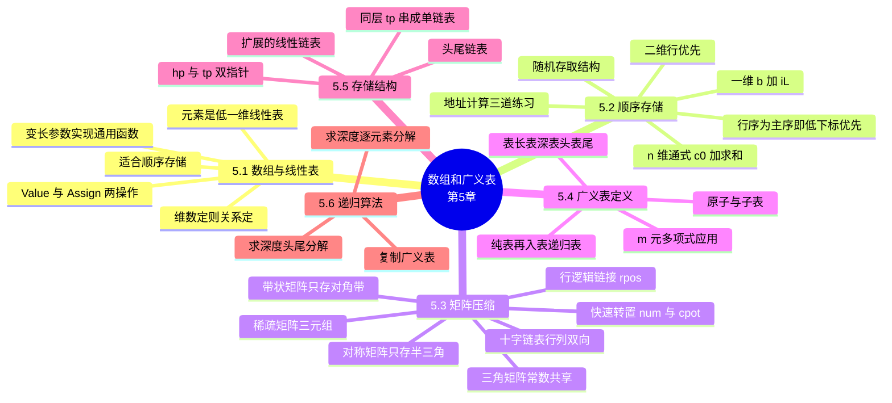

# 第五章 数组和广义表

> **本章主线**：任何数组都可以看作一个**线性表**——元素本身是低一维的线性表（一维数组元素是原子、二维数组的行是一维数组、n 维数组的元素是 n−1 维数组）→ 数组的特点决定存储方式：类型统一、d 维非边界元素有 d 个直接前趋和 d 个直接后继、**维数确定后元素个数与关系不再改变，适合顺序存储** → 顺序存储的核心是**地址计算**：一维 $\text{LOC}[i] = b + iL$，二维行优先 $\text{LOC}(i,j) = b + (i \times n + j) \times L$（行序为主序 = 低下标优先，C/Pascal；列序为主序 = 高下标优先，Fortran），n 维通式 $\text{LOC} = c_0 + \sum c_i j_i$——数组是**随机存取结构**，任一元素存取时间相等 → **矩阵压缩存储**省空间：对称矩阵只存半三角 $n(n+1)/2$、三角矩阵常数共享再 +1、带状矩阵只存对角带 $(n-1)L+1$、稀疏矩阵只记三元组 $(i, j, a_{ij})$——代价是**丧失随机存取**；三元组转置从 $O(n \cdot t)$ 优化到快速转置 $O(n+t)$（`num` + `cpot` 两个辅助向量），变动频繁则改用十字链表 → 第二部分**广义表**把线性表推广为**本质非线性**的结构：原子 + 子表、表长/表深/表头/表尾、纯表 ⊂ 再入表 ⊂ 递归表 → 存储两方案（头尾链表、扩展的线性链表）→ **递归算法**收官：求深度（逐元素分解 vs 表头表尾分解两法）与复制广义表。
> 一句话版本：**固定结构靠下标算地址（顺序存储 + 随机存取），稀疏结构只存非零元（省空间但丢随机性），嵌套结构靠递归攻定义（广义表）**——数组是"把地址算出来"，稀疏矩阵是"把没用的扔掉"，广义表是"把表装进表"。



---

## 5.1 数组和线性表的关系以及数组的运算

### 5.1.1 数组与线性表的关系

任何数组 $A$ 都可以看作一个线性表：$A = (a_1, a_2, \ldots, a_i, \ldots, a_n)$——**逐层降维看**：

1. 一维数组（$n$）：$a_i$ 是数组中第 $i$ 个数据元素（$0 \le i \le n-1$）；
2. 二维数组（$m \times n$）：**行优先**视角下 $a_i$ 是第 $i$ 行所有元素（$0 \le i \le m-1$），表中每个元素是一个一维数组；**列优先**视角下 $a_i$ 是第 $i$ 列所有元素（$0 \le i \le n-1$），同样每个元素是一维数组；
3. 三维数组：表中每个元素 $a_i$ 是一个二维数组；
4. n 维数组：表中每个元素 $a_i$ 是一个 $(n-1)$ 维数组。

**与线性表的关系**——数组是**线性表的扩展，其数据元素本身也是线性表**；广义地看，线性表是数组的"一维特例"。

**数组的特点**：

- 数组中各元素都具有**统一的类型**；
- 可以认为，d 维数组的**非边界元素**具有 d 个直接前趋和 d 个直接后继——以二维数组为例即"上和左、下和右"，多维以此类推（注意：边界元素的前趋/后继个数会因越界而减少，所以说"非边界元素"）；
- **维数确定后，数据元素个数和元素之间的关系不再发生改变**，适合于顺序存储——什么时候考虑链式存储或其他存储？当结构需要频繁变动（如稀疏矩阵非零元频繁增删，见 5.3）时才考虑。

**在数组上的基本操作**只有两类，都以"一组下标"为参数：

1. **Value**——给定一组下标，取得相应的数据元素值；
2. **Assign**——给定一组下标，修改相应的数据元素值。

**本章数组与高级语言数组的区别**：高级语言（C、Java 等）中的数组是**顺序结构**；本章讨论的数组**既可以是顺序的，也可以是链式结构**，用户可根据需要选择——这正是后面矩阵压缩存储、十字链表存在的空间。

### 5.1.2 数组的基本操作定义

**ADT 层面的四个操作**：

1. 构造 n 维数组：`InitArray(&A, dim, bound1, …, boundn)`；
2. 销毁数组 A：`DestroyArray(&A)`；
3. 取得指定下标的数组元素值：`Value(A, &e, index1, …, indexn)`；
4. 为指定下标的数组元素重新赋值：`Assign(&A, e, index1, …, indexn)`。

实现要点：**使用变长参数（可变参数）来实现对多维数组的通用操作函数**——`InitArray` 用参数 `dim` 指定数组的维度，同时确定参数数量；`DestroyArray`、`Value`、`Assign` 三个函数用数组 A 中的成员变量 `dim` 保存数组的维度，同时确定参数的数量。

### 5.1.3 C 语言变长参数实现（补充说明/拓展）

`Value`、`Assign` 中把一组下标逐个传入的机制是 C 的**变长参数**：通过三个宏（`va_start`、`va_end`、`va_arg`）和一个类型（`va_list`）实现，需包含头文件 `<stdarg.h>`。用法：

1. 用 `va_start` 获取参数列表（的地址）存储到 `ap` 中；
2. 用 `va_arg` 逐个获取值；
3. 最后用 `va_end` 将 `ap` 置空。

典型骨架（以求多个整数之和为例，例子程序用 `-1` 作结束符）：

```c
__cdecl int va_sum(int first_num, ...)
{
    va_list ap;                 /* (1) 定义参数列表 ap */
    va_start(ap, first_num);    /* (2) ap 指向参数列表 */
    int sum = first_num, temp;
    while ((temp = va_arg(ap, int)) != -1)   /* (3) 逐个取 */
        sum += temp;
    va_end(ap);                 /* (4) 关闭参数列表 */
    return sum;
}
```

原理：`__cdecl` 强制使用 C 的参数入栈方式——最右边的参数先入栈（系统栈从高地址向低地址方向入栈）；函数的所有参数均被从右向左压入栈中，将 `ap` 指向第一个固定参数在栈中的位置后，**按参数类型对 `ap` 指针值做加法**即可依次获得每个参数的指针，再对指向的内存做强制类型转换即得参数值。**参数个数如何确定**？或靠特殊结束符（如上例的 `-1`），或靠第一个参数（如 `printf` 的格式串）——`scanf`、`printf` 正是靠格式串确定个数与类型。教材 93–94 页的 `InitArray` 等函数实现都用到了它。

## 5.2 数组的顺序存储结构

### 5.2.1 一维数组

一维数组 `ElemType a[n]` 按下标顺序连续存放，设基地址 $b = \text{LOC}[0]$、每个元素占 $L$ 个存储单元：

- **方法一**：$\text{LOC}[i] = \text{LOC}[0] + i \times L$
- **通式（方法二）**：$\text{LOC}[i] = b + i \times L = c_0 + c_1 \times i$，其中 $c_1 = L$（单个数据元素大小）、$c_0 = b = \text{LOC}[0]$（基地址）。

方法二的意义不在一维本身，而在**把地址写成"常数 + 各下标乘系数之和"的标准形式**——这个形式将一路推广到二维、n 维和压缩存储。

### 5.2.2 二维数组与行/列优先

二维数组 $a_{m \times n}$ 的每个元素 $a_{ij}$ 在**顺序存储**中必须展平成一维序列，于是有两种自然的排序：

- **行序为主序（行优先）**：先存第 0 行，再第 1 行……——**"低下标优先"**；C、Pascal 语言采用；
- **列序为主序（列优先）**：先存第 0 列，再第 1 列……——**"高下标优先"**；Fortran 语言采用。

设 $\text{LOC}(0,0) = b$，行序优先时 $a[i][j]$ 之前先放满 $i$ 行（每行 $n$ 个元素），再放第 $i$ 行的前 $j$ 个：

$$\text{LOC}(i, j) = b + (i \times n + j) \times L$$

**通式（方法二）**：$\text{LOC}[i, j] = c_0 + c_1 \times i + c_2 \times j$，其中 $c_2 = L$（单个元素大小）、$c_1 = n \times c_2 = b_2 \times c_2$（一整行的全体大小）、$c_0 = b = \text{LOC}[0,0]$（起始地址）。

| 维度 | **行优先（低下标优先）** | **列优先（高下标优先）** |
|---|---|---|
| 遍历次序 | 第 0 行 → 第 1 行 → … | 第 0 列 → 第 1 列 → … |
| 地址公式 | $b + (i \times n + j) \times L$ | $b + (j \times m + i) \times L$ |
| 系数结构 | $i$ 的系数是一整行 $nL$ | $j$ 的系数是一整列 $mL$ |
| 代表语言 | C、Pascal、Java | Fortran、MATLAB（默认列优先） |
| 口头禅 | 行序为主序 = 低下标优先 | 列序为主序 = 高下标优先 |

> 口诀：**行优先 $i \times n + j$，列优先 $j \times m + i$——行看"每行几个"、列看"每列几个"**；低下标先跑是行优先，高下标先跑是列优先；C 语言里二维数组 $a[i][j]$ 就是行优先展平，`&a[i][j] = b + (i*n + j)*L`。

### 5.2.3 地址计算练习

**练习一**：设二维数组 $A[10, 20]$，每个元素占 2 个字节，$A[0][0]$ 存储地址为 100。按行优先存储，$A[6,6]$ 的地址？按列优先呢？

- 行优先：先存 0–5 行共 6 行、每行 20 列，再存第 6 行的前 6 列：$(6 \times 20 + 6) \times 2 + 100 = 352$；
- 列优先：先存 0–5 列共 6 列、每列 10 行，再存第 6 列的前 6 行：$(6 \times 10 + 6) \times 2 + 100 = 232$。

**练习二**：二维数组 $A[m][n]$ 按行优先存储，$A[0][0]$ 在 644，$A[2][2]$ 在 676，每个元素占 1 个单元，求 $A[3][3]$ 的位置。

1. 先算每行元素个数 $n$：由 $\text{Loc}(2,2) = \text{Loc}(0,0) + (2 \times n + 2) \times 1 = 644 + 2n + 2 = 676$，得 $n = (676 - 2 - 644) / 2 = 15$；
2. 再算 $\text{Loc}(3,3) = 644 + (3 \times 15 + 3) \times 1 = 644 + 45 + 3 = 692$。

### 5.2.4 n 维数组

各维元素个数分别为 $m_1, m_2, m_3, \ldots, m_n$，**按维度先后次序**（低下标优先）顺序存储：先顺序存放 $m_1$ 个 $n-1$ 维数组，每个 $n-1$ 维数组又顺序存放 $m_2$ 个 $n-2$ 维数组……以此类推。下标为 $j_1, j_2, \ldots, j_n$ 的元素存储位置：

$$\text{LOC}[j_1, j_2, \ldots, j_n] = c_0 + \sum_{i=1}^{n} c_i \times j_i = c_0 + c_1 j_1 + c_2 j_2 + \cdots + c_n j_n$$

其中：$c_n = L$（ElemType 大小）；$c_{i-1} = c_i \times b_i\ (1 < i \le n)$（$n-i$ 维数组整体大小，即 $c_{i-1}$ 是"第 $i$ 维满维时整体跳一步"的跨度）；$c_0 = b = \text{LOC}[0,0,\ldots,0]$（基地址）。等价的"方法一"展开式：

$$\text{LOC} = b + \big[\,m_2 m_3 \cdots m_n \cdot j_1 + m_3 \cdots m_n \cdot j_2 + \cdots + m_n \cdot j_{n-1} + j_n\,\big] \times L$$

由通式可知：**数组是一种随机存取结构**——对任一元素的存取时间相等，因为地址是下标的**线性函数**，一次乘加即可到达，无需从头遍历。

### 5.2.5 完整例题：四维数组地址计算

**题目** 4 维数组 `ElemType A[3..7, 0..9, 1..6, 5..12]`，每个数组元素占用 8 个存储单元，起始地址为 1000。按低下标优先（类似行优先）顺序存储，求 $\text{LOC}[6, 1, 4, 7] = ?$

**解题步骤**：

1. **算各维长度**（上界减下界加 1）：$m_1 = 7-3+1 = 5$，$m_2 = 9-0+1 = 10$，$m_3 = 6-1+1 = 6$，$m_4 = 12-5+1 = 8$；
2. **化归零下界问题**（方法二思路）：相当于 $A[0..4, 0..9, 0..5, 0..7]$ 中求 $\text{LOC}[3, 1, 3, 2]$（各下标减去各自下界）；
3. **套通式逐维展开**，$c_4 = L = 8$：

    $$\begin{aligned} \text{LOC}[3,1,3,2] &= 1000 + c_1 j_1 + c_2 j_2 + c_3 j_3 + c_4 j_4 \\ c_3 &= c_4 \times m_4 = 8 \times 8 = 64 \\ c_2 &= c_3 \times m_3 = 64 \times 6 = 384 \\ c_1 &= c_2 \times m_2 = 384 \times 10 = 3840 \end{aligned}$$

    代入得 $1000 + 3840 \times 3 + 384 \times 1 + 64 \times 3 + 8 \times 2 = 1000 + 11520 + 384 + 192 + 16 = 13112$；
4. **用方法一交叉验证**——直接按"每维满跨"写系数：

    $$\text{LOC}[6,1,4,7] = 1000 + \big[10 \times 6 \times 8 \times (6-3) + 6 \times 8 \times (1-0) + 8 \times (4-1) + (7-5)\big] \times 8 = 13112$$

**最终答案**：$\text{LOC}[6,1,4,7] = 13112$。

**一句话概括**：n 维地址就是"逐维算跨度"——从最后一维起每往上一维，跨度乘上该维长度；先把不从 0 开始的下界归零，再用 $c_0 + \sum c_i j_i$ 一口气展开，两种方法殊途同归。

## 5.3 矩阵的压缩存储

**目的：节省空间**——当矩阵具有某种特殊形态（对称、三角、带状）或大量元素为零（稀疏）时，没必要为 $n \times n$ 个位置全部买单。压缩的通用手法：**只存"值得存"的部分**，其余靠下标**映射公式**推算。

### 5.3.1 对称矩阵

**特点**：在 $n \times n$ 的矩阵 $a$ 中，满足 $a_{ij} = a_{ji}\ (1 \le i, j \le n)$——上三角与下三角对应相等，**一半信息是冗余的**。

**存储方法**：只存储下三角（或者上三角）**包括主对角线**的数据元素，共占用 $n(n+1)/2$ 个元素空间：`sa[0.. n(n+1)/2-1]`。按行优先把半三角摊平（$a_{11}, a_{21}, a_{22}, a_{31}, \ldots, a_{nn}$ 依次对应 $k = 0, 1, 2, 3, \ldots, \frac{n(n+1)}{2}-1$），下标映射：

$$k = \begin{cases} \dfrac{i(i-1)}{2} + j - 1 & i \ge j\ \text{（元素在存的那一半）}\\[2ex] \dfrac{j(j-1)}{2} + i - 1 & i < j\ \text{（对称翻转到存的那一半）} \end{cases}$$

读 $a_{ij}$：若 $i \ge j$ 直接定位；若 $i < j$ 交换行列号再套公式——**用一次下标交换换掉一半存储**。

### 5.3.2 三角矩阵

**特点**：对角线以下（或者以上）的数据元素（**不包括对角线**）**全部为同一个常数 $c$**——对称矩阵只要求"对应相等"，三角矩阵要求"角落全是常数"，冗余更极端。

**存储方法**：重复元素 $c$ **共享一个元素存储空间**，共占用 $n(n+1)/2 + 1$ 个元素空间：`sa[0.. n(n+1)/2]`，常数 $c$ 单独放一个单元（课件中放 `sa[0] = c` 之外的位置，即半三角之外再 +1 个常数位）。

下标映射（半三角部分与对称矩阵同型，只是起点与常数位不同）：

| 矩阵类型 | 有效区域条件 | $k$ 公式 |
|---|---|---|
| **上三角**（右上为数据） | $i \le j$ | $\dfrac{(i-1)(2n - i + 2)}{2} + j - i + 1$ |
| 上三角 | $i > j$ | $0$（常数位） |
| **下三角**（左下为数据） | $i \ge j$ | $\dfrac{i(i-1)}{2} + j$ |
| 下三角 | $i < j$ | $0$（常数位） |

### 5.3.3 带状矩阵（对角矩阵）

**特点**：在 $n \times n$ 的方阵中，**非零元素集中在主对角线及其两侧共 $L$（奇数）条对角线**的带状区域内——称为 $L$ 对角矩阵，有效位置满足 $|i - j| \le \dfrac{L-1}{2}$。例：五对角矩阵（$L = 5$）只有 $|i-j| \le 2$ 的位置有值。

**存储方法一**：以**对角线的顺序**存储（把每条对角线首尾相接地摊平），共 $n \times L$ 个元素——首末对角线不满也按满存，简单但浪费边界。

**存储方法二**：只存储带状区内的元素——除首行和末行外，按每行 $L$ 个元素，共

$$(n-2)L + (L+1) = (n-1)L + 1 \text{ 个元素}，\quad \texttt{sa[0..(n-1)L]}$$

存储地址计算：

$$k = (i-1)L + (j - i), \qquad 1 \le i, j \le n,\ |i-j| \le \frac{L-1}{2}$$

（行号 $i$ 决定落在第几个"整行块"，$j - i$ 是列相对主对角线的偏移。）以 $n = 6$、$L = 5$ 的五对角矩阵为例，25 个位置存下 36 个位置的方阵。

### 5.3.4 四种压缩存储方法对比

| 方法 | 适用矩阵 | 占用空间（元素数） | 随机存取 | 关键映射 |
|---|---|---|---|---|
| **对称矩阵** | $a_{ij} = a_{ji}$ | $n(n+1)/2$ | ✅ 保留（算地址） | 半三角行优先 + 下标交换 |
| **三角矩阵** | 半边全为常数 $c$ | $n(n+1)/2 + 1$ | ✅ 保留 | 半三角 + 常数共享位 |
| **带状矩阵** | $|i-j| \le (L-1)/2$ | $(n-1)L + 1$ | ✅ 保留 | $k = (i-1)L + (j-i)$ |
| **稀疏矩阵** | $\delta = t/(m \times n) \le 0.05$ | $3t$（三元组）或链式 | ❌ 丧失（需扫描） | 逐个记录 $(i, j, a_{ij})$ |

> 口诀：**对称砍一半、三角多一个、带状留斜条、稀疏记三点**——前三种是"规则冗余"，用下标公式把砍掉的部分**算回来**，随机存取不丢；稀疏是"无规则可算"，只能老老实实记 $(i, j, a_{ij})$ 三元组，**省了空间、丢了 O(1) 定位**。

### 5.3.5 随机稀疏矩阵与三元组表

**特点**：大多数元素为零，通常以 $\delta = \dfrac{t}{m \times n} \le 0.05$（$t$ 为非零元个数）作为稀疏判据。

**常用存储方法**：**记录每一非零元素的三元组 $(i, j, a_{ij})$**——节省空间，但**丧失随机存取功能**（给定 $(i,j)$ 不能 O(1) 直达，得扫描定位）。

- 顺序存储：**三元组表**；
- 链式存储：**十字（正交）链表**。

**三元组表类型定义**：

```c
#define MAXSIZE 1000                  /* 设定非零元素最大值 */
typedef struct {
    int      i, j;                    /* 行号、列号 */
    ElemType e;                       /* 元素值 */
} Triple;
typedef struct {
    Triple data[MAXSIZE + 1];         /* 三元组表，data[0] 未用 */
    int    mu, nu, tu;                /* 行数、列数、非零元个数 */
} TSMatrix;
```

### 5.3.6 应用例：矩阵转置的两种算法

设 $a$ 为 $m \times n$ 稀疏矩阵，转置矩阵 $b$ 为 $n \times m$ 矩阵，满足 $b_{ji} = a_{ij}$——三元组表上交换每项的 $i$、$j$ 即可，**难点在于 $b$ 中三元组的存放顺序**要让同一行的元素相邻（否则后续按行扫描会很痛苦）。

**算法一（朴素转置）**——对 $a$ 的**每一列**扫全部三元组、挑出该列的项依次放入 $b$：

```c
void TransMatrix(TSMatrix &b, TSMatrix a)
{
    b.mu = a.nu; b.nu = a.mu; b.tu = a.tu;
    if (b.tu) {
        q = 1;                              /* b 中下一个存放位置 */
        for (col = 1; col <= a.nu; col++)   /* 对 a 的每一列 */
            for (p = 1; p <= a.tu; p++)     /* 扫 a 的每个三元组 */
                if (a.data[p].j == col) {   /* 找列号为 col 的项 */
                    b.data[q].i = a.data[p].j;
                    b.data[q].j = a.data[p].i;
                    b.data[q].e = a.data[p].e;
                    q++;
                }
    }
}
```

代价：外层 $n$ 列、内层每次扫 $t$ 项，时间 $O(n \times t)$——列号小的列要被重复扫很多遍。

**算法二（快速转置法）**——引入两个辅助向量，**一趟统计、一趟定位**：

- `num[1 : a.nu]`：$a$ 中**每列的非零元素个数**；
- `cpot[1 : a.nu]`：$a$ 中**每列第一个非零元素在 $b$ 中的起始位置**，递推公式

    $$\text{cpot}[1] = 1,\qquad \text{cpot}[\text{col}] = \text{cpot}[\text{col}-1] + \text{num}[\text{col}-1] \quad (2 \le \text{col} \le n)$$

以例题矩阵（$t = 8$）为例：`num = {2, 1, 2, 2, 0, 1}`，递推得 `cpot = {1, 3, 4, 6, 8, 8}`——每列在 $b$ 中的落点**一次算死**。

```c
Status FastTransMatrix(TSMatrix &b, TSMatrix a)
{
    b.mu = a.nu; b.nu = a.mu; b.tu = a.tu;
    if (b.tu) {
        for (col = 1; col <= a.nu; ++col) num[col] = 0;      /* num 清零 */
        for (t = 1; t <= a.tu; ++t)
            ++num[a.data[t].j];                              /* 按列计数 */
        cpot[1] = 1;                                         /* 生成 cpot */
        for (col = 2; col <= a.nu; ++col)
            cpot[col] = cpot[col - 1] + num[col - 1];
        for (p = 1; p <= a.tu; ++p) {                        /* 转置 */
            col = a.data[p].j; q = cpot[col];
            b.data[q].i = a.data[p].j;
            b.data[q].j = a.data[p].i;
            b.data[q].e = a.data[p].e;
            ++cpot[col];                                     /* 该列落点前移 */
        }
    }
    return OK;
}
```

三个循环各扫一遍：统计 $O(t)$、递推 $O(n)$、转置 $O(t)$，总时间 $O(n + t)$——相比算法一的 $O(n \times t)$，**把"反复扫"换成了"记住从哪开始"**。`cpot[col]` 在转置过程中充当"各列当前写指针"，写一个自增一次。

### 5.3.7 行逻辑链接的表

三元组表按行序存放，但**没有记录每行从哪开始**——要取第 $i$ 行得从头扫。**行逻辑链接**在三元组表基础上加一个行索引数组：

```c
typedef struct {
    Triple data[MAXSIZE + 1];
    int    rpos[MAXRC + 1];            /* 每行第一个非零元在 data 中的位置 */
    int    mu, nu, tu;
} RLSMatrix;
```

**便于随机存取任意一行的非零元素**：`rpos[i]` 直接给出第 $i$ 行首项下标，第 $i$ 行的项就是 `data[rpos[i] .. rpos[i+1]-1]`——这是"稀疏矩阵版"的行表，与 4.4 文本编辑中"行表 + 堆/块链"的思路同源：**用一个索引数组换按行定位的 O(1)**。

### 5.3.8 十字（正交）链表

**特点**：在**行、列两个方向**上同时把非零元素链接在一起——**克服三元组表在矩阵的非零元素位置或个数经常变动时的使用不便**（插入/删除非零元时，三元组表要整体搬移，十字链表只需改几个指针）。

**类型定义**：

```c
typedef struct OLNode {
    int              i, j;             /* 该非零元的行、列下标 */
    ElemType         e;                /* 该非零元的值 */
    struct OLNode   *right, *down;     /* 同行、同列的下一个非零元 */
} OLNode, *OLink;
typedef struct {
    OLink  *rhead, *chead;             /* 行、列表头指针向量 */
    int     mu, nu, tu;                /* 行数、列数、非零元个数 */
} CrossList;
```

每个非零元是一个十字交叉点：`right` 串起**本行**的非零元、`down` 串起**本列**的非零元；`rhead[i]`、`chead[j]` 分别是第 $i$ 行、第 $j$ 列的带头链表。插入一个非零元只需在对应行链和列链各插一次——**以双倍指针开销换动态性**。

## 5.4 广义表的定义和表示方法

**广义表本质上是非线性结构，是扩展的线性表：表中的数据元素本身也是一个数据结构**——从本节起，"元素"不再被要求是同型原子。

### 5.4.1 概念与相关术语

**广义表**（列表）是由**零个或多个原子或者子表**组成的**有限序列**，记作 $LS = (d_1, d_2, \ldots, d_n)$：

- **原子**：逻辑上**不能再分解**的元素（作为基本数据项，如单个字符、数）；
- **子表**：作为广义表中元素的**广义表**（表中套表）。

**与线性表的关系**：广义表中的元素**全部为原子**时即为线性表——**线性表是广义表的特例，广义表是线性表的推广**。

**四个基本术语**（以典型例子逐个过）：

| 广义表 | 表长 | 表深 | 表头 | 表尾 |
|---|---|---|---|---|
| $A = (\,)$ | 0 | 1 | —（空表无头尾） | — |
| $B = (a, A) = (a, (\,))$ | 2 | 2 | $a$ | $((\,))$ |
| $C = ((a,b), c, d)$ | 3 | 2 | $(a,b)$ | $(c,d)$ |
| $D = (a, D) = (a, (a, (a, \ldots)))$ | 2 | $\infty$ | $a$ | $(D)$ |

- **表的长度**：表中的元素（**第一层**）个数；
- **表的深度**：表中元素的**最深嵌套层数**（单原子的表，深度为 1？——空表 $A$ 深度为 1，单原子视为深度 0 的极端，见 5.6 的递归定义：空表返回 1、单原子返回 0）；
- **表头**：表中的**第一个元素**（可以是原子，也可以是子表——$C$ 的表头是 $(a,b)$）；
- **表尾**：**除第一个元素外，剩余元素构成的广义表**——**非空广义表的表尾必定仍为广义表**（哪怕只剩一个元素，也要包成 $(\,)$ 形式的表）。

### 5.4.2 图形表达与命名表示

广义表可画成树形图（圆圈/分支表示表结点，叶子表示原子）：$A = (a,b)$ 一个表结点挂两片叶子；$B = (A, c)$ 中 $A$ 作为子表出现；$D = (a, D)$ 则是**指向自身的环**——图形上画成自环，直观暴露"递归表"的本质。

**规定所有表都有名字**时的书写表示法：$A(a,b)$、$B(A(a,b), c)$、$L(A(a,b), B(A(a,b),c))$、$D(a, D(a, D(\ldots)))$——名字让共享与递归在文本中显式可见（$B$ 和 $L$ 中的 $A$ 指向同一个表——**共享**）。

### 5.4.3 广义表结构的分类

按"元素是否可共享、表是否可递归"分三级，逐级包容：

| 类型 | 定义 | 对应结构 |
|---|---|---|
| **纯表** | 与**树型结构**对应的广义表（无共享、无递归） | 树 |
| **再入表** | 允许**结点共享**的广义表（同一子表被多处引用） | 有向无环图 |
| **递归表** | 允许**递归**的广义表（表中可出现自身） | 有向图（含环） |

包含关系：**递归表 ⊃ 再入表 ⊃ 纯表 ⊃ 线性表**——每一层都是对"元素约束"的放松：线性表要求原子同型 → 纯表允许套表 → 再入表允许共享 → 递归表允许自指。

**广义表的应用**：程序的语句结构；**m 元多项式的表示**。例：

$$P(x,y,z) = x^{10}y^3z^2 + 2x^6y^3z^2 + 3x^5y^2z + 2yz + 15$$

按 $z$ 逐层展开：$P = (x^{10}y^3 + 2x^6y^3)z^2 + (3x^5y^2 + 2y)z + 15$，用一元广义表的嵌套表示为 $P = z((A,2), (B,1), (15,0))$，其中 $A = y((C,3))$、$C = x((1,10), (2,6))$、$B = y((D,2), (2,1))$、$D = x((3,5))$——**变元多时不再需要多维下标，用"系数–指数对 + 子表"的嵌套即可**，这正是广义表"非线性"威力的展示。

### 5.4.4 基本操作与 ADT GList

**基本操作四组**：

1. **结构的创建和销毁**：`InitGList(&L)`、`DestroyGList(&L)`、`CreateGList(&L, S)`（由书写形式串 $S$ 建表）、`CopyGList(&T, L)`；
2. **状态函数**：`GListLength(L)`、`GListDepth(L)`、`GListEmpty(L)`、`GetHead(L)`、`GetTail(L)`；
3. **插入和删除操作**：`InsertFirst_GL(&L, e)`、`DeleteFirst_GL(&L, &e)`；
4. **遍历**：`Traverse_GL(L, Visit())`。

**ADT GList**：

- **数据对象**：$D = \{e_i \mid i = 1, 2, \ldots, n;\ n \ge 0;\ e_i \in \text{AtomSet}\ \text{或}\ e_i \in \text{GList},\ \text{AtomSet 为某个数据对象}\}$
- **数据关系**：$R = \{\langle e_{i-1}, e_i\rangle \mid e_{i-1}, e_i \in D,\ 2 \le i \le n\}$
- **基本操作**（摘录）：

    1. `InitGList(&L)`——操作结果：创建空的广义表 L；
    2. `CreateGList(&L, S)`——初始条件：S 是广义表的书写形式串；操作结果：由 S 创建广义表 L；
    3. 其余操作同上列四组。

注意数据对象的定义——$e_i$ **要么是原子、要么又是一个 GList**，这种"定义中引用自身"就是**递归定义**，也是 5.6 用递归算法处理广义表的根本原因。

## 5.5 广义表的存储结构

由于广义表中的元素**类型不同**（原子 vs 子表）、**长度不定**且可能递归/共享，顺序存储无从下手——两种方案都是**链式**，靠 `tag` 区分原子与子表。

### 5.5.1 方法一：头尾链表形式

**类型定义**——结点用 `tag` 标识身份，`union` 复用同一块空间存放原子值或一对指针：

```c
typedef enum { ATOM, LIST } ElemTag;    /* ATOM==0: 原子；LIST==1: 子表 */
typedef struct GLNode {
    ElemTag tag;                        /* 公共部分：结点类型 */
    union {                             /* 共用存储空间 */
        AtomType  atom;                 /* tag==ATOM: 原子值 */
        struct {                        /* tag==LIST: 表结点 */
            struct GLNode *hp, *tp;     /* hp: 表头指针；tp: 表尾指针 */
        } ptr;
    };
} *GList1;
```

**结构语义**——对 $GL = (a_1, a_2, \ldots, a_n)$ 逐层套"表头/表尾"：

- 表结点的 `hp` 指向**表头**（第一元素：原子则为原子结点，子表则为子表的表结点）；
- 表结点的 `tp` 指向**表尾**（剩余元素构成的表——非空时又是下一个表结点，空表时为 `NULL`）；
- 即 $\text{head}(GL) = a_1$，$\text{Tail}(GL) = (a_2, \ldots, a_n)$。

**示例**：$A = (\,)$ 表示为 `NULL`（空表直接用空指针，无结点）；$B = (a, A)$ 表头是原子结点 `a`、表尾是"指向 A"的子表；$C = ((a,b), c, d)$ 表头是一个子表结点（内挂 `a`,`b`）、再依次挂 `c`、`d`；$D = (a, D)$ 的表尾指针**指回 D 自己的表结点**，形成环——递归表在存储上就是"指针指回自己"。

### 5.5.2 方法二：扩展的线性链表形式

**类型定义**——把"同一层的兄弟"直接串成单链表，`tp` 不再指向"表尾"而是指向"同层下一个结点"：

```c
typedef enum { ATOM, LIST } ElemTag;
typedef struct GLNode {
    ElemTag tag;
    union {
        AtomType atom;                  /* tag==ATOM: 原子值 */
        struct { struct GLNode *hp; }   /* tag==LIST: hp 指向表头 */
    };
    struct GLNode *tp;                  /* 同一层的下一个结点 */
} *GList2;
```

**结构语义**：`hp` 指向表头；`tp` 指向**同一层的下一个结点**——构成一个单链表，**把本层的原子或子表都链起来**（原子结点也有 `tp`，与兄弟平级串联）。于是 $(a_1, a_2, \ldots, a_n)$ 中每个元素是链上一环，比方法一少一层"表尾包装"结点。

**示例**：$A = (\,)$ 用一个 `tag=LIST、hp=^、tp=^` 的空表结点表示（与方法一的 `NULL` 不同——**这里空表仍占一个结点**，因为要靠它挂进上层的链）；$B = (a, A)$ 中原子 `a` 与子表 `A` 用 `tp` 相串；$C = ((a,b), c, d)$ 中子表结点、`c`、`d` 三环相扣；$D = (a, D)$ 中 `a` 的 `tp` 指向一个表结点，其 `hp` 指回 D 本身。

### 5.5.3 两种存储方法的对比

| 维度 | **方法一：头尾链表 `GList1`** | **方法二：扩展线性链表 `GList2`** |
|---|---|---|
| `tp` 的含义 | **表尾**（剩余元素构成的表） | **同层下一个兄弟结点** |
| 同层结构 | 表尾套表尾，靠"层包装"递进 | 本层直接串成**单链表** |
| 空表表示 | `NULL`（无结点） | 一个 `hp=^、tp=^` 的**空表结点** |
| 与操作的契合 | 直接对应 `GetHead`/`GetTail` 定义 | 直接对应逐元素遍历、`InsertFirst_GL` |
| 每结点开销 | 表结点 2 指针 + tag | 原子也带 `tp`，表结点 1+1 指针 |

> 口诀：**头尾链表问"头尾"，扩展线性串"兄弟"**——方法一是教科书定义（表头/表尾）的直译，递归分解最顺手；方法二是执行效率的直译，遍历插入最顺手；空表一个用 `NULL`、一个用"空结点"，实现时切勿混用。

## 5.6 广义表的递归算法

**广义表的特点：定义是递归的**——定义里"元素可以是 GList 本身"，所以处理它的算法也天然递归（分治：把表拆成子问题，子问题结构与原问题相同）。**本节约定：非递归表且无共享子表**（否则递归会无限进行或需要标记访问）。

### 5.6.1 求深度：方法一——分析表中各元素

对 $LS = (a_1, a_2, \ldots, a_n)$ 逐元素分解，深度 = 最深的那个元素的深度 + 1：

- **基本项**：$\text{DEPTH}(LS) = 1$，当 $LS$ 为空表时；$\text{DEPTH}(LS) = 0$，当 $LS$ 为原子时；
- **归纳项**：$\text{DEPTH}(LS) = 1 + \max\limits_{1 \le i \le n}\{\text{DEPTH}(a_i)\}$，当 $n \ge 1$ 时。

**算法描述**——头尾链表存储上，遍历同层的每个 `hp` 递归求深度、取最大值再 +1：

```c
int GListDepth(GList1 L)
{
    if (!L) return 1;                       /* 空表 */
    if (L->tag == ATOM) return 0;           /* 单原子 */
    for (max = 0, pp = L; pp; pp = pp->ptr.tp) {   /* 遍历同层 */
        dep = GListDepth(pp->ptr.hp);       /* 每个表头递归 */
        if (dep > max) max = dep;
    }
    return max + 1;
}
```

### 5.6.2 求深度：方法二——分析表头和表尾

换一个分解视角：一个非空表的深度只取决于**表头和表尾谁更深**：

$$\text{depth}(LS) = \begin{cases} 1 & LS\ \text{为空表} \\ 0 & LS\ \text{为单原子} \\ \max\{\text{depth}(\text{head}(LS)) + 1,\ \text{depth}(\text{tail}(LS))\} & \text{其它情况} \end{cases}$$

**算法描述**——只沿"表头 +1"与"表尾"两条线递归：

```c
int GListDepth(GList1 L)
{
    if (!L) return 1;                       /* 空表 */
    if (L->tag == ATOM) return 0;           /* 单原子 */
    dep1 = GListDepth(L->ptr.hp) + 1;       /* 表头方向 */
    dep2 = GListDepth(L->ptr.tp);           /* 表尾方向 */
    if (dep1 > dep2) return dep1;
    else             return dep2;
}
```

两法殊途同归：方法一把表**摊平成 n 个子表**（n 叉分治），方法二把表**劈成头尾两半**（二叉分治）——后者每一次递归只有两支，前者一次开 n 支；数据结构上，方法二正对应"头尾链表"的两个指针 `hp`/`tp`。

### 5.6.3 复制广义表

**复制操作的递归定义**——与求深度同一套路，三个分支：

- **基本项**：$LS$ 为空表时 `InitGList(NEWLS)`；$LS$ 为原子时**复制单原子结点**；
- **归纳项**：**建表结点** → **复制表头** → **复制表尾**。

**算法描述 CopyGList**——先建当前结点、抄 `tag`，原子直接抄值，表则递归复制两半：

```c
Status CopyGList(GList1 &T, GList1 L)
{
    if (!L) T = NULL;                       /* 复制空表 */
    else {
        T = (GList1)malloc(sizeof(GLNode));
        if (!T) exit(OVERFLOW);
        T->tag = L->tag;
        if (L->tag == ATOM) T->atom = L->atom;      /* 复制单原子 */
        else {
            CopyGList(T->ptr.hp, L->ptr.hp);        /* 复制表头 */
            CopyGList(T->ptr.tp, L->ptr.tp);        /* 复制表尾 */
        }
    }
    return OK;
}
```

与 `GListDepth` 方法二同构：**沿 hp/tp 两条线递归到底，遇到原子抄值、遇到空表抄 NULL**——"递归结构的算法也是递归的"，这是本章递归算法的总纲（也为第 7 章树的递归算法预演）。

### 知识定位与框架衔接

- **前置知识**：第 1 章绪论（逻辑结构、时间复杂度、随机存取概念）；第 2 章线性表（数组是其扩展、广义表是其推广——两次"推广"都以线性表为基准）；第 4 章串（串是字符的线性表，而数组是"装下标"的线性表）；C 语言变长参数（5.1.3）。
- **后置知识**：第 7 章**树**（纯表即树、递归表即有向图；`GListDepth`/`CopyGList` 的递归套路直接迁移为二叉树的遍历与复制）；第 8 章**图**（再入表对应共享结点的 DAG）；第 9 章**查找**（稀疏矩阵的行索引 `rpos` 就是"索引查找"）；第 10 章**排序**（快速转置的 `num`+`cpot` 是"计数排序 + 前缀和"思想，第 10 章计数排序原样再现）。
- **比喻**：顺序存储的地址公式像**地铁线路图**——不管你在哪一站（哪个下标），报出线路号和站号（$j_1, j_2, \ldots$）就能一口报出坐几站到（一次乘加），这就是随机存取；稀疏矩阵压缩像**只记有东西的格子**，找起来得对着清单翻（丢随机性）；广义表像**俄罗斯套娃**——打开一层还是娃娃，所以"量深度"这种事只能一层层拆着数（递归）。
- **灵魂问题**：为什么数组能 O(1) 随机存取，稀疏矩阵三元组表却不能？——因为数组的"下标 → 地址"是**确定性线性函数**，公式一次算尽；三元组表的第 $k$ 项与下标 $(i,j)$ 之间**没有封闭公式**，只能扫描建立对应——**能不能把寻址写成公式，就是随机存取的分水岭**。同理追问：广义表为什么不能顺序存储？——元素类型不定、长度不定、可递归，三条都击穿顺序存储的前提。

> **一句话总结本章**：数组 = 线性表的推广 + 下标到地址的线性映射（行优先 $i \times n + j$，随机存取）；矩阵压缩 = 用下标公式赎回被砍的空间（对称/三角/带状保住随机性，稀疏三元组用扫描换空间，快速转置 $O(n+t)$）；广义表 = 线性表的再推广（原子 + 子表，表长表深表头表尾，头尾链表/扩展线性链表存储），**递归定义决定递归算法**——求深度两法（逐元素 / 头尾分解）与复制是模板题。

---

## 课件 PDF

<iframe src="https://cognishelf.naimore3.workers.dev/课程笔记/大二上/数据结构/05数组与广义表/05数组与广义表.pdf" width="100%" height="800px"></iframe>

[打开 PDF](https://cognishelf.naimore3.workers.dev/课程笔记/大二上/数据结构/05数组与广义表/05数组与广义表.pdf)
