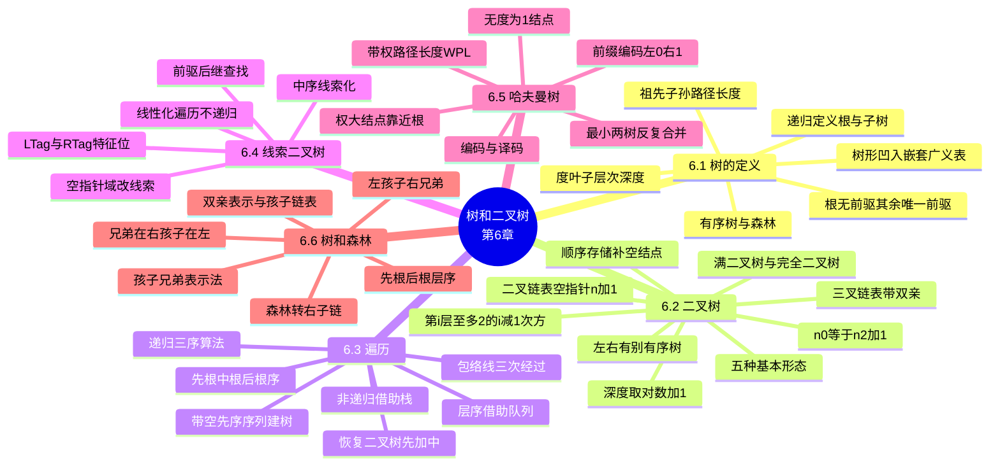

# 第六章 树和二叉树

> **本章主线**：线性结构是"一个对一个"，树是**"至多一个前驱、可有多个后继"**的层次结构——**递归定义**：树是 n（n ≥ 0）个结点的有限集，或为空树，或有唯一根 + m 棵互不相交的子树（每棵子树又是树）→ 术语体系（度、叶子、层次、深度、祖先、路径、森林）→ 收敛到**二叉树**作为一般树的**规范形式**：递归定义、0 ≤ 度 ≤ 2、**左右有别**（与树的最主要差别）、5 种基本形态、满二叉树与完全二叉树 → **五条性质**（第 i 层至多 $2^{i-1}$、深度 k 至多 $2^k-1$、$n_0 = n_2 + 1$、深度 $\lfloor \log_2 n \rfloor + 1$、完全二叉树编号公式）→ 存储两路：顺序存储靠性质 5（补空结点成完全二叉树、单支树浪费）、链式存储靠**二叉链表**（n 个结点必有 **n+1 个空指针**）/三叉链表 → 全章核心**遍历**：**包络线模型**（每结点经过 3 次，第 1/2/3 次访问 = 先/中/后序）→ 递归三序 + **非递归栈实现**（递归改迭代通用方法）+ **层序队列** → 遍历应用：带空指针先序建树、查找、计数、释放、**由遍历序列恢复二叉树**（先+中或后+中唯一确定，先+后不唯一）→ **线索二叉树**：把 n+1 个空指针改造成前驱/后继线索（LTag/RTag），中序线索化 + 线性化遍历 O(n) → **哈夫曼树**：WPL 最小的最优二叉树，"最小两棵合并"构造，**前缀编码**（左 0 右 1）→ **树和森林**：**左孩子右兄弟**三步法转二叉树、先根/后根/层序遍历与二叉树先中序的对应、四种存储结构。
> 一句话版本：**树是递归的，二叉树是树的规范形**——遍历是万能基础（递归三序 = 包络线三次经过，非递归靠栈、层序靠队列），线索化把 n+1 个空指针换成"找前驱后继的快线"，哈夫曼用"权大靠根"造最短带权路径与前缀码，任意树靠**左孩子右兄弟**寄生在二叉树上——**结构简单规律性强，才能把所有树的问题降维成二叉树的问题**。



---

## 6.1 树的定义和基本术语

### 6.1.1 问题提出与树的递归定义

从逻辑结构划分看四种结构：**线性结构**——一个对一个（线性表、栈、队列，如一根链条）；**树形结构**——一个对多个（如一棵树、家谱树）；**集合**——数据元素间除"同属于一个集合"外无其它关系（如一堆沙子）；**图形结构**——多个对多个（如交通图、高铁图）。

线性结构中元素至多有一个前驱和一个后继；还有一种情况是**元素至多有一个前驱，而可有多个后继**——称之为**树结构**。现实例子俯拾皆是：教材章节组织（数据结构 → 第 1 章 → 1.1 节 → 1.1.1 段）、文件目录、0-1 背包问题的**解空间（搜索树）**——定义解空间、以合适方式组织它、在约束下**先序（深度优先）遍历并剪枝**，就是"用树解题"的标准三步。

**树（Tree）的递归定义**——树是一类重要的非线性数据结构，是以**分支关系定义的层次结构**：

1. 树是 n（n ≥ 0）个结点的有限集，它或为**空树**（n = 0）；
2. 或为非空树，对于非空树 T：（1）有且仅有一个称之为**根**的结点；（2）除根结点以外的其余结点可分为 m（m > 0）个**互不相交**的有限集 $T_1, T_2, \ldots, T_m$，其中每一个集合本身又是一棵树，并且称为根的**子树（SubTree）**。

树的递归定义刻画了树的固有特性：**一棵非空树由若干棵子树构成，子树又可由若干棵更小的子树构成**——这直接决定了树的算法天然递归（6.3 的遍历、6.6 的转换皆源于此）。

**树的两个特点**（也即"什么不是树"的判据）：

1. 树的**根结点没有前驱**，除根之外的**所有结点有且只有一个前驱**；
2. 树中**所有结点可以有零个或多个后继**。

由此特点可知：有环的、一个结点有两个前驱的图形都不是树结构。

### 6.1.2 树的表示方法

同一棵树可有多种逻辑表示：

1. **树形表示**（直观图）——根在上、子树在下；
2. **凹入表示**——逐层缩进，文件管理器的目录树即是；
3. **嵌套集合**——同心圆/矩形层层包含；
4. **广义表表示**——如 `(A(B(E(K,L),F),C(G),D(H(M),I,J)))`：括号内第一项是根、其余是子树——**树是广义表的纯表特例**，与第 5 章呼应。

### 6.1.3 基本术语

以树 `A(B,C,D) / B(E,F) / C(G) / D(H,I) / E(J)`（层次 1–4）为例，全套术语如下：

1. **结点的度**——结点拥有的**子树数目**；
2. **叶子（终端）结点**——度为 0 的结点；**分支（非终端）结点**——度不为 0 的结点；
3. **树的度**——树的**各结点度的最大值**；
4. **内部结点**——除根结点之外的分支结点；
5. **双亲与孩子**——结点的子树的根称为该结点的孩子，该结点称为孩子的双亲；**兄弟**——同一双亲的孩子；
6. **结点的祖先**——从根到该结点所经分支上的所有结点；**结点的子孙**——该结点为根的子树中的任一结点；
7. **结点的层次**——根为**第一层**，其它结点依次下推；某结点在第 L 层，则其孩子在第 L+1 层；**堂兄弟**——双亲在同一层的结点；
8. **树的深（高）度**——树中结点的**最大层次**；
9. **有序树**——树中各结点的子树**从左至右有次序、不能互换**，否则为无序树；
10. **路径长度**——从结点 $N_i$ 到 $N_j$ 所经**分支（边）的个数**；
11. **森林**——m（m ≥ 0）棵**互不相交**的树的集合（0 棵树的森林即空森林）。

> 记忆锚点：**"度"数自己有几个孩子，"树的度"取全树最大；根在第 1 层（不是第 0 层）**——后面性质 1 的 $2^{i-1}$ 就建立在"第 1 层 = 根"的约定上。

### 6.1.4 树的基本操作（ADT）

1. `InitTree(&T)` 构造空树；2. `DestroyTree(&T)` 销毁；3. `ClearTree(&T)` 置空；
4. `TreeDepth(T)` 求深度；5. `Root(T)` 求根；6. `Parent(T, Cur_e)` 求双亲；
7. `LeftChild(T, Cur_e)` 求最左孩子；8. `RightSibling(T, Cur_e)` 求右兄弟；
9. `InsertChild(&T, &p, i, c)` 插入子树 c 作为 p 的第 i 棵子树；10. `DeleteChild(&T, &p, i)` 删除 p 的第 i 棵子树；
11. `TraverseTree(T, Visit())` 遍历。

---

## 6.2 二叉树

### 6.2.1 二叉树的定义与特点

**二叉树（BinaryTree）**——n（n ≥ 0）个结点的有限集合，或为**空树**（n = 0），或由一个**根**及两棵**互不相交**的、分别称为**左子树**和**右子树**的二叉树组成。二叉树也是**递归**定义的，其每个结点至多只有两棵子树——但**子树有左右之分，其次序不能任意颠倒**。

**二叉树与树的最主要差别**：二叉树每个结点**至多有两棵子树**（即有度的限制），并且**子树有左右之分**——即使某结点只有一棵子树，也要区分它是左子树还是右子树；而树的子树之间无此约束（树是 m 叉的，且常不强调子树次序）。

二叉树的**特点**：

1. 是递归定义的；
2. 每个结点的度 **0 ≤ 度 ≤ 2**；
3. 即使只有一棵子树，也要区分**左、右**。

**二叉树的 5 种基本形态**：（a）空树；（b）单根结点（无子树）；（c）根 + 左子树；（d）根 + 右子树；（e）根 + 左子树 + 右子树。**注意（c）和（d）是两棵不同的二叉树**——这正是"左右有别"的直接体现。

> 拓展：即使限定度为 2，二叉树也**不等价于 2 阶有序树**——2 阶有序树只有一棵（形态唯一），而二叉树有 5 种形态（可为空）。

### 6.2.2 满二叉树与完全二叉树

**满二叉树**——深度为 k 且有 $2^k - 1$ 个结点的二叉树（每层结点数均达到"该层最多 $2^{i-1}$"的上限，即**每层都填满**）。

**完全二叉树**——深度为 k、有 n（0 ≤ n ≤ $2^k - 1$）个结点的二叉树，当且仅当其每一个结点都与深度为 k 的**满二叉树中编号 1 ~ n 的结点一一对应**时，称为完全二叉树（**只有最下面两层允许有度 < 2 的结点，且最下层集中在最左侧**）。

**完全二叉树的特点**（由定义推得）：

1. 叶子结点只出现在**最下层和次最下层**；
2. 最下层的结点**集中在该层最左侧**；
3. 至多只有**最下面两层**有分支结点；
4. 度为 1 的结点**只有 0 个或 1 个**（$n_1 \in \{0, 1\}$）；
5. 具有 n 个结点的完全二叉树的深度为 $\lfloor \log_2 n \rfloor + 1$（性质 4）；
6. 若对完全二叉树从 1 开始按层编号，则任一结点 i 的左孩子 2i、右孩子 2i+1、双亲 $\lfloor i/2 \rfloor$（性质 5）。

**满二叉树与完全二叉树对比表**：

| 对比项 | 满二叉树 | 完全二叉树 |
| --- | --- | --- |
| 形态要求 | 每层结点**全部填满** | 与满二叉树前 n 个编号**一一对应** |
| 结点数 | 深度 k 必为 $2^k - 1$ | n 可取 $0 \sim 2^k-1$ 任意值 |
| 叶子位置 | 全部集中在最下层 | 只在最下层与次最下层，**最下层靠左** |
| 度为 1 的结点 | $n_1 = 0$（根除外可为 0） | $n_1 = 0$ 或 $1$ |
| 包含关系 | 满二叉树**一定是**完全二叉树 | 完全二叉树**不一定是**满二叉树 |

> 口诀：**满则全满，完全只对号**——满二叉树"层层全填"，完全二叉树"按满的前 n 个号对号入座、底层靠左"。

### 6.2.3 二叉树的性质

**性质 1**：二叉树第 i 层上的结点数**最多**为 $2^{i-1}$（i ≥ 1；最少 1 个——除最末层外各层至少 1 个）。*证明：根 1 个（第 1 层 $2^0$），每层至多翻倍。*

**性质 2**：深度为 k 的二叉树**最多**有 $2^k - 1$ 个结点（k ≥ 1；**至少**有 k 个——每层 1 个的单支树）。*证明：$\sum_{i=1}^{k} 2^{i-1} = 2^k - 1$。*

**性质 3**：对任何二叉树，**叶子结点数 $n_0$ = 度为 2 的结点数 $n_2$ + 1**，即 $n_0 = n_2 + 1$。

*证明*：设总结点数 n、度为 0/1/2 的结点数分别为 $n_0, n_1, n_2$，则 $n = n_0 + n_1 + n_2$；再按分支数 B 计数——n 个结点中除根外每个结点都由一个分支引入，故 $B = n - 1$；同时分支全部出自度为 1、2 的结点，故 $B = n_1 \cdot 1 + n_2 \cdot 2$。联立：

$$n - 1 = n_1 + 2n_2 \;\Rightarrow\; n_0 + n_1 + n_2 - 1 = n_1 + 2n_2 \;\Rightarrow\; n_0 = n_2 + 1 \qquad \blacksquare$$

**练习（PPT 例）**：一棵**完全二叉树**有 5000 个结点，叶子结点数为多少？

*解*：由性质 3，$n_0 = n_2 + 1$。分 $n_1 = 0$ 与 $n_1 = 1$ 两种情况（完全二叉树 $n_1$ 只能是 0 或 1）：

1. 若 $n_1 = 0$：$n_0 + n_2 = 5000$，代入 $n_0 = n_2 + 1$ 得 $2n_2 + 1 = 5000$，$n_2 = 2499.5$ 不是整数——**舍去**；
2. 若 $n_1 = 1$：$1 + n_0 + n_2 = 5000$，即 $n_0 + n_2 = 4999$，代入 $n_0 = n_2 + 1$ 得 $2n_2 + 2 = 4999$ 即 $2n_2 = 4998$，$n_2 = 2499$，$n_0 = n_2 + 1 = 2500$。

**最终答案**：叶子结点数 $n_0 = 2500$（即 (1) 情况无正整数解，(2) 情况 $n_0 = 2500$）。

**性质 4**：具有 n 个结点的二叉树的深度为 $\lfloor \log_2 n \rfloor + 1$。*证明*：由性质 2，深度 k 满足 $n \le 2^k - 1$，即 $k \ge \log_2(n+1)$，取最小整数。

**性质 5**：对完全二叉树中编号为 i（1 ≤ i ≤ n）的结点：

1. 若 $i = 1$，则该结点为根，**无双亲**；若 $i > 1$，其双亲编号为 $\lfloor i/2 \rfloor$；
2. 若 $2i \le n$，则其**左孩子**编号为 $2i$；否则无左孩子（i 为叶子）；
3. 若 $2i + 1 \le n$，则其**右孩子**编号为 $2i + 1$；否则无右孩子。

> 注：下标从 **0** 开始的 0-based 版本——双亲 $\lfloor (i+1)/2 \rfloor - 1$、左孩子 $2i + 1$、右孩子 $2i + 2$；若第 0 号单元不使用（1-based 起存），公式更简洁。**顺序存储时是否用第 0 单元，是两套下标公式**。

### 6.2.4 二叉树的存储结构

**（1）顺序存储结构**——用一维数组存储二叉树的结点，按**完全二叉树编号次序**存放。性质 5 使其能由下标直接算双亲/孩子。

为表示任意二叉树，需将二叉树补成**完全二叉树**：非完全的补上**空结点**以保持编号对应——如树 A 只有左链 `A→B→D→E`，需补 `nil` 凑成满的编号结构，再把 A、B、D、E 按编号存入数组。顺序存储**适合完全二叉树和接近完全的二叉树**；若只有单支树（如左单链 k 个结点），深度为 k 时须占用 $2^k - 1$ 个存储单元——**空间浪费严重**。顺序存储有多种方案：完全二叉树按编号存（本节）；用两个一维数组分别存双亲/孩子关系；在孩子单元中存带正负号的双亲下标（负号标记左/右孩子）等。

**（2）链式存储结构**——二叉树每个结点最多两个孩子，链式存储时每个结点设一个**数据域**加**两个指针域**（分别指向两棵子树）：

```c
typedef struct BiTNode {
    TElemType     data;
    struct BiTNode *lchild, *rchild;
} BiTNode, *BiTree;
```

**二叉链表（lchild-data-rchild）**——最常用；**三叉链表**在二叉链表基础上增加 **parent** 指针（找双亲 O(1)，代价是每结点多一个指针域）。

**空指针计数练习（PPT 例）**：具有 n 个结点的二叉链表，每个结点有 2 个指针域，其中**非空指针域个数为 n-1，空指针域个数为 n+1**。*解*：指针域共 $2n$ 个；n 个结点中除根外每个结点恰好被一个非空指针指向（即双亲的某孩子指针），故非空 $n - 1$ 个，空指针 $2n - (n-1) = n + 1$ 个。**这 n+1 个空指针就是 6.4 线索二叉树的原料**。

**二叉树三种存储方案对比表**：

| 存储方案 | 结构要点 | 找双亲 | 找孩子 | 空间代价 | 适用场景 |
| --- | --- | --- | --- | --- | --- |
| 顺序存储 | 一维数组按完全二叉树编号 | $\lfloor i/2 \rfloor$ | 2i / 2i+1 | 单支树补 nil，浪费大 | 满/完全二叉树 |
| 二叉链表 | data + lchild + rchild | 需从根遍历 | 直接 | **n+1 个空指针** | 一般二叉树、最常用 |
| 三叉链表 | 二叉链表 + parent | 直接 O(1) | 直接 | 每结点多 1 指针 | 频繁回溯双亲（如带父指针的堆） |

> 口诀：**顺序存完树，链式存任意**——完全二叉树用数组最省（性质 5 下标即关系），一般二叉树用二叉链表（空指针 n+1 个，线索化再利用）。

### 6.2.5 二叉树的基本运算与实现（补充说明）

二叉树 ADT 常见操作：`InitBiTree(&T)` 初始化、`DestroyBiTree(&T)` 销毁、`BiTreeEmpty(T)` 判空、`BiTreeDepth(T)` 求深度、`Root(T)` 取根、`Value(T, e)`/`Assign(T, &e, value)` 取值/赋值、`Parent(T, e)`/`LeftChild(T, e)`/`RightSibling(T, e)` 求双亲/左孩子/右兄弟、`InsertChild(&T, p, i, c)`、`DeleteChild(&T, p, i)`、`PreOrderTraverse(T, Visit())` 等遍历。

**初始化**——约定带头结点版本（根结点地址存于 `T->lchild`）：

```c
Status InitBiTree(BiTree &T)
{ // 构造空二叉树T，T为头结点，根指针存于T->lchild
  T = (BiTree)malloc(sizeof(BiTNode));
  if (!T) exit(OVERFLOW);
  T->lchild = NULL;
  return OK;
}
```

**扩展操作 1 InsertL**——若二叉树 T 存在且结点 p 非空，则插入 c 为 p 的左孩子，**p 的原左子树变为 c 的左子树**：

```c
Status InsertL(BiTree &T, TElemType c, BiTree p)
{ if (!p) return ERROR;
  s = (BiTree)malloc(sizeof(BiTNode));
  if (!s) exit(OVERFLOW);
  s->data = c;
  s->lchild = p->lchild;   // 原左子树挂到新结点下
  p->lchild = s;           // 新结点成为p的左孩子
  return OK;
}
```

**扩展操作 2 DeleteL**——删除 p 的左子树：`p->lchild` 下挂的是一棵树（不只一个结点），**不能直接 free**，必须先用 `ClearTree(q)` 逐个释放子树结点、再置 `p->lchild = NULL`——**"释放一棵树 ≠ 释放一个结点"**，这是递归释放思想的直接应用。

---

## 6.3 二叉树的遍历

### 6.3.1 遍历的概念与包络线模型

**遍历（Traversal）**——若每个结点均被访问**且仅访问一次**，称完成了一次**遍历**（也叫周游）。

一棵二叉树可看成由三部分组成：**根结点**、**左子树**、**右子树**。若规定左、右子树的访问次序为"先左后右"，且**根先访问**，可得六种方案：

| 类型 | 次序 | 含义 |
| --- | --- | --- |
| DLR | 先根次序遍历（先序） | 根 → 左 → 右 |
| LDR | 中根次序遍历（中序） | 左 → 根 → 右 |
| LRD | 后根次序遍历（后序） | 左 → 右 → 根 |
| DRL | 先根次序逆遍历 | 根 → 右 → 左 |
| RDL | 中根次序逆遍历 | 右 → 根 → 左 |
| RLD | 后根次序逆遍历 | 右 → 左 → 根 |

> 口诀：**正序三种最常用——DLR 先根、LDR 中根、LRD 后根；根最先=先序、根居中=中序、根最后=后序**。

逆序的三种（DRL/RDL/RLD）少用。**常用三种：DLR、LDR、LRD——访问结点的时机决定次序：根最前=先序，根居中=中序，根最后=后序。**

**包络线模型**：给定一棵二叉树，从根结点**左外侧**出发沿二叉树外缘按**逆时针**方向画一条曲线到根结点**右外侧**——这条曲线称**包络线**，它**三次经过每个结点**：

- **第 1 次经过（从左侧进入时）**→ 相当于该结点是 DLR 树的根，得**先根（先序）遍历**；
- **第 2 次经过（从下方回到时）**→ 相当于该结点是 LDR 树的根，得**中根（中序）遍历**；
- **第 3 次经过（从右侧离开时）**→ 相当于该结点是 LRD 树的根，得**后根（后序）遍历**。

对树 `A(B,D,E,C)`（A 根、B 为 A 左孩子、C 为 A 右孩子、D 与 E 分别为 B 的左右孩子），包络线第 1/2/3 次访问序列为：**先序 ABDEC、中序 DBEAC、后序 DEBCA**。

> 口诀：**先中后序看根位——先根（第 1 次经过）、中根（第 2 次经过）、后根（第 3 次经过）**；逆时针包络线三次经过每个结点，第几次经过就是第几种序。

**遍历的应用方向**：（1）**表达式树**——如 `(a+b)*(c-(d/e))` 对应的树，**先序=前缀表达式、中序=中缀表达式、后序=后缀表达式**（中缀需加括号）；（2）由**遍历序列恢复二叉树**（6.3.8）；（3）按某种规则**构造二叉树**（6.3.6 带空先序序列建树）；（4）查找、计数、释放等基础操作（6.3.7）。

### 6.3.2 先序、中序、后序遍历的递归算法

**先序（DLR）**：若二叉树非空——（1）访问根结点；（2）先序遍历左子树；（3）先序遍历右子树。

```c
Status PreOrderTraverse(BiTree T, Status (*Visit)(TElemType e))
{ if (T) {
      if (Visit(T->data))                      // 访问根结点
          if (PreOrderTraverse(T->lchild, Visit)) // 先序遍历左子树
              if (PreOrderTraverse(T->rchild, Visit)) // 先序遍历右子树
                  return OK;
      return ERROR;
  }
  return OK;
}
```

**中序（LDR）**：左子树 → 访问根 → 右子树；**后序（LRD）**：左 → 右 → 访问根。算法结构与先序完全同构，**仅三行访问语句的相对位置不同**（递归骨架 `if (T) { 左; 访问; 右; }` 的排列）。

**例题（PPT）**：给定树，写出先序/中序/后序——先序 **ABDEC**、中序 **DBEAC**、后序 **DEBCA**（与包络线三次经过完全一致）。

### 6.3.3 遍历算法的分析与改进

**分析**：每个结点**有且仅有一次访问**，故时间复杂度 $\Theta(n)$；空间复杂度为 $O(n)$（递归栈最大辅助空间，与树形有关，最坏单支树为 $O(n)$）。

**改进 1（减少空二叉树的递归调用）**：原来左/右子树为空时也发起递归调用再返回。可先判断子树非空再进入递归——同上例可减少 9 次空二叉树上的递归调用（访结点 7 次、递归调用共 15 次 → 优化后空树调用消失）。核心思想：**加"if 子树非空"守卫**。

**改进 2（空间与通用性）**：递归栈的最大深度 = 树高 + 1，最坏 $O(n)$；遍历**不修改原二叉树**。两种思路：① 展开递归为**显式栈**（非递归遍历，见 6.3.4）；② 遍历外挂辅助结构（线索二叉树，见 6.4）。**中序+后序组合能恢复二叉树**（6.3.8），先序+后序则不一定。

### 6.3.4 非递归遍历（递归改迭代的通用方法）

递归调用本身靠系统栈，栈溢出、效率受限——**把递归算法改为非递归（迭代）算法**是本节前置方法论（PPT 开篇即讲"递归转换为非递归的方法"）：

1. **迭代法**——把重复操作用循环实现，如斐波那契：递归版 $O(2^n)$、循环版 $O(n)$；循环内更新 `t = a + b; a = b; b = t;` 即可；
2. **用栈（或队列）模拟递归**——注意**只有递归调用时才用栈**。以 $n!$ 递归函数 `fac(n) = n * fac(n-1)` 为例，改写时：
   1. 定义栈元素 `SElemType { int rd; int n; int f; }`——`rd`（read）是"**第几次读**"（= 第几递归层语句读到哪一步，用栈保存当前读到的递归函数语句号）；
   2. 把递归函数**展开为带标号的语句序列**；
   3. 非空时**每条语句只执行一次**：`rd` 指示哪条语句尚未执行；执行"调用语句"时入栈（此时 `rd` 递增）、执行"返回语句"时出栈；
   4. 把两个控制变量（`n`、`rd`）分别压入栈中，实现非递归；
3. **消除尾递归**——若**递归调用是倒数第二条语句**（其后无别的语句），则可在返回时**循环调用**：如尾递归输出链表的 `rd` 恒为 3（第三条语句），出栈后令 `rd = 1` 反复"调用"，即从**栈操作变为循环**。

**非递归遍历的栈设计**——仿照表达式转换思想，**深入左链入栈（遇左孩子就压），到头则弹栈转向右子树**；结点**入栈一次**的作用是"**记住本层已完成左子树、待去右子树**"，且弹栈即访问（先序/中序）。**时、空复杂度均为 $O(n)$**，辅助空间为栈的最大深度 $O(h)$（h 为树高）。

**先序非递归算法（NRPreOrder）**——第 3 章 NRPreOrder 结构 + 包络线：

```c
void NRPreOrder(BiTree T, Status (*Visit)(TElemType e))
{ InitStack(S);
  p = T;
  while (p || !StackEmpty(S)) {
      if (p) {                       // 深入左链：先访问再压栈
          Visit(p->data);
          Push(S, p);
          p = p->lchild;
      } else {                       // 左链到头：弹栈转向右子树
          Pop(S, p);
          p = p->rchild;
      }
  }
}
```

**中序非递归** = 同一骨架，把**访问时机从"压栈前"移到"弹栈后"**（弹出的结点左子树已遍历完，此时才访问）。教材给出两种中序非递归写法（算法 6.2 先深入到底再逐层回、算法 6.3 边深入边判断的压缩版），**本质相同**。

**后序非递归**——弹栈时还不能访问（右子树未遍历），需**标记**：压入 `-p`（负号即标记），第二次弹到负标记才访问并转右子树；或用结构体带 `flag` 域——**"两次到访"才输出**（先序/中序各"一次到访"即输出，后序要"第三次经过"才输出）。

**两种中序非递归写法对比**：

| 写法 | 思路 | 特点 |
| --- | --- | --- |
| 教材算法 6.2 | 一路深左入栈至空，再弹栈访问、转右子树 | 结构清晰，与先序仅差访问位置 |
| 教材算法 6.3 | 入栈后立即判断左链是否到头，压缩循环层次 | 代码更紧凑，逐个结点处理 |

> 口诀：**先序弹前中弹后，后序弹两遍**——同一"深左入栈、弹栈转右"骨架，先序入栈前访问、中序弹栈后访问、后序带负号标记第二次弹栈才访问。

### 6.3.5 层次遍历（Level Order）

**层次遍历**——从上到下、从左到右逐层访问各结点（如树按层输出 `ABCDEFG`）。非递归、**借助队列**实现：

1. 若二叉树非空，**根结点入队**；
2. 队不空时出队：（1）访问该结点；（2）若该结点**左/右孩子非空**，依次入队；
3. 重复第 2 步直至队空。

```c
void LevelOrder(BiTree T, Status (*Visit)(TElemType e))
{ if (!T) return;
  EnQueue(Q, T);
  while (!QueueEmpty(Q)) {
      DeQueue(Q, p);
      Visit(p->data);
      if (p->lchild) EnQueue(Q, p->lchild);
      if (p->rchild) EnQueue(Q, p->rchild);
  }
}
```

> 注：PPT 版本中"左孩子入队"一行误写为 `rchild`（版本 1 的笔误），**以"左先右后入队"为准**（见后记版本 2）。

**四种遍历对比表（补充说明）**：

| 遍历 | 辅助结构 | 访问时机（包络线） | 输出示例（A 根，左 B(D,E)，右 C） | 典型用途 |
| --- | --- | --- | --- | --- |
| 先序 DLR | 栈 / 递归 | 第 1 次经过 | ABDEC | 复制、前缀表达式、建树 |
| 中序 LDR | 栈 / 递归 | 第 2 次经过 | DBEAC | 二叉搜索树有序输出、中缀式 |
| 后序 LRD | 栈 / 递归（带标记） | 第 3 次经过 | DEBCA | 释放、后缀式、算表达式值 |
| 层序 | **队列** | 按层 FIFO | A B D E C | 层次处理、序列化 |

> 口诀：**先中后用栈、层序用队列；栈管深（DFS）、队列管宽（BFS）**——递归本质是系统栈，非递归先中后全靠栈、层序独靠队列。

### 6.3.6 遍历的应用之一：带空指针先序序列构造二叉树

**思路**——先序遍历中根的位置唯一，但仅凭 `A B D E C` 这类**只含非空结点**的序列无法区分"子树不存在"与"子树为空"。若序列**包含空子树信息**（以 `^` 或 `#` 标记空指针），则先序序列**唯一确定**一棵二叉树。

**方法（CreateBiTree）**：按先序序列读入字符，遇数据则建**新结点**并以**当前父结点**为双亲；遇 `^` 则该孩子为空、返回上一层——本质是**递归下降**：每读一个非空字符建结点，再递归建其左、右子树。

给定**扩展先序序列** `ABD^G^^^C^E^F`（`^` 表空）：

```c
Status CreateBiTree(BiTree &T, ReadChar nc)
{ nc(&ch);                    // 读入一个字符
  if (ch == '^') T = NULL;     // '^'表示空子树
  else {
      T = (BiTree)malloc(sizeof(BiTNode));
      if (!T) exit(OVERFLOW);
      T->data = ch;
      CreateBiTree(T->lchild, nc);  // 递归构造左子树
      CreateBiTree(T->rchild, nc);  // 递归构造右子树
  }
  return OK;
}
```

构造结果：A 根；B 为左孩子；B 的左 D、右 G（D 的左右均空）；C 为右孩子；C 的左空、右 E（E 左右空）；F 经由……按序列逐字符展开即得唯一二叉树。**递归函数逐字符消费序列**——这是"遍历的逆过程"。

### 6.3.7 遍历的应用之二：查找、计数与释放

**找值为 item 的结点并返回其双亲**（先序遍历逐层扫描）：

```c
BiTree FindParent(BiTree T, TElemType item)
{ if (!T || T->data == item) return NULL;   // 根即目标/空树 → 无双亲
  if (T->lchild->data == item || T->rchild->data == item)
      return T;                              // 子命中 → T
  p = FindParent(T->lchild, item);           // 左子树递归
  if (p) return p;
  return FindParent(T->rchild, item);        // 右子树递归
}
```

**统计叶子结点个数**（LeafCount）：递归出口 `!T → 0`；`T` 的左右均空 → 1；否则 `左子树叶子数 + 右子树叶子数`——**遍历 + 累加**。**统计二叉树深度**（Depth）：`!T → 0`；否则 `max(左深, 右深) + 1`——与性质 4 呼应。

**释放（销毁）二叉树**——与 DeleteL 同理，**不能只 free 根**，须后序顺序逐结点释放：

```c
void FreeBiTree(BiTree &T)
{ if (T) {
      FreeBiTree(T->lchild);   // 先释放左子树
      FreeBiTree(T->rchild);   // 再释放右子树
      free(T); T = NULL;       // 最后释放根
  }
}
```

**后序释放的原因**：父结点被 free 后其 lchild/rchild 指针失效，无法再找到孩子——**必须"先孩子后父亲"**，这正是后序"依赖先完成"语义的用武之地。

### 6.3.8 遍历的应用之三：由遍历序列恢复二叉树（完整例题）

**关键结论**：已知**先序 + 中序**或**后序 + 中序**，可**唯一确定**一棵二叉树；仅**先序 + 后序不一定**（如先序 `AB`、后序 `BA`——B 可能是 A 的左孩子，也可能是右孩子，两棵树都满足）。*思考：何时先序+后序也能唯一确定？——当每个结点都**缺左或缺右至少其一**之外的强约束（补充：当二叉树中**没有度为 1 的结点**时，先序+后序可唯一确定）*。

**恢复方法（以先序+中序为例）**：先序第 1 个 = 根；中序中根左边全是左子树、右边全是右子树；再对左右子树**递归**执行同一步骤（后序+中序时，后序**最后 1 个** = 根，其余按中序切分）。

**【题目】** 已知一棵二叉树的**先序序列为 ABECDFGHIJ**，**中序序列为 EBCDAFHIGJ**，请恢复（画出）该二叉树，并写出其后序序列。

**【解题步骤】**

1. **定根**：先序首字符 **A** 为根；在中序中定位 A——`EBCD` | `A` | `FHIGJ`，A 左边 4 个结点属左子树、右边 4 个属右子树。
2. **左子树**（先序 `BECD`，中序 `EBCD`）：根 **B**；中序 `E` | `B` | `CD` → B 左子树 = {E}（先序剩余 `E` 确认 E 为叶子），B 右子树 = {C,D}（先序 `CD`，中序 `CD`）→ 根 **C**，C 左空、右孩子 **D**。
3. **右子树**（先序 `FGHIJ`，中序 `FHIGJ`）：根 **F**；中序 `F` 之前无字符 → F 左空，右子树 = {G,H,I,J}（先序 `GHIJ`，中序 `HIGJ`）→ 根 **G**；中序 `HI` | `G` | `J` → G 左子树 = {H,I}（先序 `HI`，中序 `HI`）→ 根 **H**、H 左空、右孩子 **I**；G 右子树 = {J} → J 为叶子。
4. **验证**：对所得树做先序 → `ABECDFGHIJ` ✓；中序 → `EBCDAFHIGJ` ✓。
5. **写后序**：左子树（E D C B）→ 根 A 之前插好左半，右子树后序 → `I H J G F`，拼接得后序。

**【最终答案】** 二叉树为：A 根；左子树 B（B 左 = E，B 右 = C，C 右 = D）；右子树 F（F 左空，F 右 = G，G 左 = H（H 右 = I），G 右 = J）。**后序序列 = EDCBIHJGFA**。

**【一句话概括】** 先序定根、中序切左右、逐层递归——每个根在中序中的位置就是"左右子树的分界线"。

**练习（PPT）**：已知中序序列 `BDCEAFHG`、后序序列 `DECBHGFA`，画出二叉树并写先序序列——后序末字符 **A** 为根；中序 `BDCE` | `A` | `FHG` 切分左右递归，得先序 **ABCDEFGH**。反之练习：由先序+后序 `?` 推中序需注意不唯一情形。

**恢复条件对比表**：

| 已知序列组合 | 能否唯一恢复 | 原因 |
| --- | --- | --- |
| 先序 + 中序 | **能** | 先序定根、中序切分左右，递归到底 |
| 后序 + 中序 | **能** | 后序末位定根、中序切分左右 |
| 先序 + 后序 | **不能**（一般情形） | 无法判定某孩子是左还是右（`AB`/`BA` 两解） |

> 口诀：**先定根、中切边、后看尾**——先序开头定根，中序里根的左右分两半，后序结尾定根；先+后合不出左右，故不能定树。

---

## 6.4 线索二叉树

### 6.4.1 问题引入与存储结构

**问题**——中序遍历可用递归或非递归（借助栈）实现，但栈要占用额外存储空间；能否**把二叉树本身改造为一个"线性化"结构**，使遍历像走链表一样不需要栈？观察二叉链表：n 个结点有 $2n$ 个指针域，**非空指针仅 n-1 个（指向孩子），空指针恰好 n+1 个**——大量指针被浪费。

**线索（Thread）**——我们称指向**前驱或后继**的指针为"线索"；**利用二叉链表中的 n+1 个空指针域来存放指向结点在某种遍历次序下前驱和后继的指针**，这种附加指针称为"线索"，**带线索的二叉树称为线索二叉树（Threaded Binary Tree）**，其二叉链表称为**线索链表**——本质是**把非线性结构（二叉树）按某一次序"线性化"为双向链表**。

**存储改造**——为区分指针域存的是"孩子"还是"线索"，每个指针域增设**标志位** LTag、RTag：

```c
typedef enum PointerTag { Link, Thread };  // Link==0:孩子指针, Thread==1:线索
typedef struct BiThrNode {
    TElemType       data;
    struct BiThrNode *lchild, *rchild;
    PointerTag      LTag, RTag;
} BiThrNode, *BiThrTree;
```

**LTag/RTag = 0（Link）**：lchild/rchild 指向**孩子**；**= 1（Thread）**：lchild/rchild 指向**前驱/后继（线索）**。按遍历次序可分为**先序、中序、后序线索二叉树**三种，其中**中序线索二叉树最常用**（遍历天然对应"上一个/下一个"）。

**例（PPT）**：对树 `A(B,C) / B(D,E)`——中序序列 **BDAEC**、先序 **ABDCE**、后序 **DBECA**；各版本线索化的结果图示：中序线索二叉树中，D 的左空指针→线索指 B、E 的左右空指针→线索指 A 与 C、C 的右空指针→头结点等。

### 6.4.2 查找前驱与后继

**（1）中序线索二叉树**——查 p 的后继：

1. 若 `p->RTag == 1`，则 `p->rchild` **即为所求**（线索直指后继）；
2. 若 `p->RTag == 0`，则从其**右子树沿左链**一直走到 `LTag == 1` 的那个结点——即**右子树的最左结点**（中序下一个 = 右子树中序首）。

查 p 的前驱：

1. 若 `p->LTag == 1`，则 `p->lchild` 即为所求；
2. 若 `p->LTag == 0`，则从其**左子树沿右链**走到 `RTag == 1` 的结点——即**左子树的最右结点**（中序前驱 = 左子树中序末）。

> 记忆：**"中序后继 = 右子树最左下，中序前驱 = 左子树最右下"**——与"中序遍历先深入左链底"完全对偶。

**（2）后序线索二叉树**——查 p 的前驱：

1. 若 `p->LTag == 1`，则 `p->lchild` 即为所求；
2. 若 `p->LTag == 0`：若 `p->RTag == 0`，则 `p->rchild` 即为所求（p 是双亲的右孩子时，前驱是左兄弟的后序末）；若 `p->RTag == 1`，则 `p->lchild` 即为所求。

查 p 的**后继则与双亲结点有关**——因二叉链表中**没有指向双亲的指针**，可能需要通过二叉树的后序遍历才可确定，**故后序线索二叉树在此问题上并不比普通二叉树有效**。

**（3）先序线索二叉树**——与后序线索二叉树**对偶**（前驱难、后继易）。结论：**中序线索二叉树可以方便地查找前驱与后继**——这正是实践中以中序线索化为主的原因。

### 6.4.3 中序线索化算法

**算法思想**：利用**中序遍历**——在中序遍历过程中，若某结点的左/右指针为空，则用它指向中序前驱/后继；用 `pre` 指针**记住刚刚访问过的结点**（即 p 的前驱），建立双向线索。

**算法步骤**（若二叉树 p 非空）：

1. 左子树线索化；
2. 访问当前结点 p：（2.1）置 LTag 和 RTag；（2.2）建立 p 的前趋线索；（2.3）建立 p 的前趋 pre 的后继线索；（2.4）将 p 作为下一个被访问结点的前趋结点（`pre = p`）；
3. 右子树线索化。

**带头结点的中序线索二叉树（双向线索链表）**——设头结点 Thrt：`Thrt->LTag = Link`（左指根）、`Thrt->RTag = Thread`、`Thrt->rchild = Thrt`（空树时 `Thrt->lchild = Thrt`）；非空时 `Thrt->lchild = T`，线索化完成后**最后一个结点的后继 → Thrt，Thrt 的 rchild → 最后一个结点**——中序序列为 `thrt B D A E C thrt`，构成**首尾相接的双向循环线索链表**。

```c
BiThrTree pre;   // 全局指针：始终指向 p 的中序前驱

void InThreading(BiThrTree p)
{ if (p) {
      InThreading(p->lchild);              // 1 左子树线索化
      p->LTag = p->RTag = Link;            // 2.1 初始化标志
      if (!p->lchild) { p->LTag = Thread; p->lchild = pre; }   // 2.2 前驱线索
      if (!pre->rchild) { pre->RTag = Thread; pre->rchild = p; } // 2.3 pre 的后继线索
      pre = p;                             // 2.4 pre 前进
      InThreading(p->rchild);              // 3 右子树线索化
  }
}

Status InOrderThreading(BiThrTree &Thrt, BiThrTree T)
{ Thrt = (BiThrTree)malloc(sizeof(BiThrNode));   // 申请头结点
  if (!Thrt) exit(OVERFLOW);
  Thrt->LTag = Link;  Thrt->RTag = Thread;
  Thrt->rchild = Thrt;                    // 初始化 Thrt
  if (!T) { Thrt->LTag = Thread; Thrt->lchild = Thrt; }   // 空树
  else {
      Thrt->lchild = T;  pre = Thrt;
      InThreading(T);                     // 中序线索化
      pre->RTag = Thread;  pre->rchild = Thrt;   // 最后一个结点线索化
      Thrt->rchild = pre;                 // 头结点指向最后一个结点
  }
  return OK;
}
```

### 6.4.4 线索二叉树的遍历与更新

**线索化后的中序遍历**——二叉线索树的遍历**不需要递归**：在中序线索二叉树中利用线索可方便地找到后继，n 个结点可在线 **O(n)** 时间内遍历完。算法步骤：（1）找到中序序列第一个结点（**沿左链走到 LTag==1 处**）；（2）访问当前结点；（3）将当前结点的**后继**作为新当前结点（`RTag==Thread` 沿线索走；否则到右子树再一路深左）；（4）当前结点存在则转（2）。

```c
Status InOrderTraverse_Thr(BiThrTree T, Status (*Visit)(TElemType e))
{ p = T->lchild;
  while (p != T) {
      while (p->LTag == Link) p = p->lchild;   // 找中序第一个结点
      if (!Visit(p->data)) return ERROR;
      while (p->RTag == Thread && p->rchild != T) {   // 沿后继线索访问
          p = p->rchild;  Visit(p->data);
      }
      p = p->rchild;                          // 转右子树（再深左）
  }
  return OK;
}
```

**更新操作（插入/删除后）**——在线索二叉树上插入或删除子树/结点时，**指针和线索都需作相应改动**。解决方法：（1）**还原为普通二叉树，重新线索化**（简单可靠）；（2）逐情况讨论寻找规律。

**实践拓展（补充说明）**：现代计算机大内存环境下，也可**不使用 LTag/RTag**，直接用前驱/后继指针（每结点 6 个域，`data + lchild + rchild + ltagp + rtagp`）——空间上：32 位默认对齐 `4 + 4*2 + 4*2 = 20` 字节、1 字节对齐 `1 + 4*2 + 4*2 = 17` 字节；64 位默认 `8 + 8*2 + 8 = 32` 字节、1 字节对齐 `1 + 8*2 + 4*2 = 25` 字节。`#pragma pack(n)` 可改变编译器默认内存对齐方式（n 取 1,2,4,8,16；`pack(push)/pack(pop)` 保存恢复现场）。

**四种线索化/存储对比表（补充说明）**：

| 方案 | 空指针利用 | 找前驱/后继 | 遍历方式 |
| --- | --- | --- | --- |
| 普通二叉链表 | n+1 空指针**浪费** | 需栈/递归 O(h) | 递归或栈 |
| 中序线索二叉树 | n+1 空指针 → **前驱+后继** | O(1)（线索或最左/最右） | **无栈无线索递归** O(n) |
| 先序线索二叉树 | → 前驱难、后继易 | 后继 O(1)、前驱一般 | 适合先序 |
| 后序线索二叉树 | → 前驱易、后继难（需双亲） | 后继不优于普通树 | 适合前驱方向 |

> 口诀：**中序线索最好用——后继沿右找最左、前驱沿左找最右；先序对偶后序难，后继还要找双亲**。

---

## 6.5 哈夫曼树（最优二叉树）

### 6.5.1 问题引入与基本概念

**引入（PPT 例）**——学生成绩从百分制转"等级制"：直觉用 `if (a<60)...else if (a<70)...` 逐段判定，对**每个学生**都要从头比；而若按人数分布（90+ 最多、60-70 次之……）改造成**判定树**（先按 75 分一刀分两半、再各自细分），平均比较次数更少——**不同的判定次序，平均性能不同**。

**基本概念**：

1. **结点的权**——赋予结点的某种**标示**（如数值、频次）；
2. **结点的路径长度**——从根到该结点的**路径上的分支数**；
3. **树的路径长度**——从根到**每一个叶子**的路径长度之和（结点数相同的二叉树中，完全二叉树的树路径长度最小）；
4. **带权路径长度 WPL（Weighted Path Length）**——树中所有**叶子**的"权 × 路径长度"之和：

$$\text{WPL} = \sum_{k=1}^{n} w_k l_k$$

（$w_k$ 为第 k 个叶子的权，$l_k$ 为该叶子的路径长度；PPT 另一写法 $\text{WPL} = \sum_{k=1}^{n} w_k d_k$ 同义）；
5. **最优二叉树（哈夫曼树）**——**WPL 最小**的二叉树——直观理解：**让权大的结点离根尽量近**。

**例（PPT）**：四叶子权 {7, 5, 2, 4}，三种形态——A 扁平形 WPL = $7\times1 + 5\times2 + 2\times3 + 4\times3 = 46$；B 中等形 WPL = $7\times2 + 5\times1 + 2\times2 + 4\times2 = 36$；C 偏斜形 WPL = $7\times1 + 5\times2 + 2\times3 + 4\times3$ 按权序配短路 = **35**（C 最优）。结论：**相同的叶子，不同形态 WPL 不同，存在最优者**。

### 6.5.2 哈夫曼树的构造

**构造算法（反复合并最小两棵）**：

1. 给定 $n$ 个权值 $\{w_1, w_2, \ldots, w_n\}$，构造 $n$ 棵只有根结点的二叉树集合 $F = \{T_1, T_2, \ldots, T_n\}$；
2. 在 F 中**选取根权值最小的两棵树**作为左右子树，构造一棵新二叉树，**新根权值 = 左右子树根权值之和**；
3. 从 F 中**删除**这两棵已选树，**加入**新构造的二叉树；
4. 重复 2、3，直到 F 中**只剩一棵树**——即哈夫曼树。

**例 1（PPT）**：权 {3, 3, 5, 6, 7} 构造哈夫曼树——① 3+3=6 → 集合 {5, 6, 6, 7}；② 5+6=11 → {6, 7, 11}；③ 6+7=13 → {11, 13}；④ 11+13=24 → 完成（树高 4，WPL 需按最终形态计算）。

**例 2（PPT）**：权 {5, 29, 7, 8, 14, 23, 3, 11} 构造哈夫曼树——① 3+5=8 → {7, 8, 8, 11, 14, 23, 29}；② 7+8=15 → {8, 11, 14, 15, 23, 29}；③ 8+11=19 → {14, 15, 19, 23, 29}；④ 14+15=29 → {19, 23, 29, 29}；⑤ 19+23=42 → {29, 29, 42}；⑥ 29+29=58 → {42, 58}；⑦ 42+58=100 → 完成。最终树根 = 100。

**哈夫曼树的性质**：

1. 构造过程中每次合并都**淘汰两棵、诞生一棵**，故初始 n 个叶子 → 最终**无度为 1 的结点**（$n_1 = 0$）；
2. 由 $n_0 = n_2 + 1$ 与 $n = n_0 + n_2$（$n_1=0$）得：**n 个叶子 → 总结点数 $2n - 1$**（故只需 $2n$ 大小的存储向量）；
3. 权相同则形态可不唯一（同权可任选），但 **WPL 相同**；
4. **离根越近权越大**、路径短而频次高——与霍夫曼编码直接相关。

> 口诀：**最小两棵反复并、权大自然靠根近；n 叶出来 2n-1 个点、度 1 的一个都不剩**。

### 6.5.3 哈夫曼树的存储与构造实现

**存储**——因无度为 1 结点、n 叶共 $2n-1$ 点，用**顺序存储**（大小为 $2n$ 的一维数组，**1 号起用，0 作"空"**）：

```c
#define MAXSIZE 100
typedef struct {
    int     weight;   // 权值
    int     parent;   // 双亲（0=无）
    int     lchild, rchild;  // 左右孩子（0=无）
} HTNode, HT[MAXSIZE];
```

**构造算法（BuildHT）**——初始化：1..n 号填叶子权、parent/lchild/rchild 置 0；n+1..2n-1 号循环"找最小两根（parent==0 中取 weight 最小；**相同权任选其一**）、建新根、登记父子关系"：

```c
void BuildHT(HT &H, int n)
{ // 输入 H[1..n].weight；输出哈夫曼树 H[1..2n-1]
  for (i = 1; i <= n; i++) { H[i].parent = 0; H[i].lchild = 0; H[i].rchild = 0; }
  for (i = n + 1; i <= 2 * n - 1; i++) {
      m1 = m2 = 0;               // m1、m2 存两个最小根下标
      for (j = 1; j <= i - 1; j++)
          if (H[j].parent == 0) {
              if (H[j].weight < H[m1].weight) { m2 = m1; m1 = j; }
              else if (H[j].weight < H[m2].weight) m2 = j;
          }
      H[m1].parent = H[m2].parent = i;
      H[i].lchild = m1; H[i].rchild = m2;
      H[i].weight = H[m1].weight + H[m2].weight;
  }
}
```

**复杂度**：找最小需两重循环，$O(n^2)$。**改进（补充说明）**：用**最小堆（优先队列）**存放待合并树根，每次取两最小、合并后插回，可降至 $O(n \log n)$——第 10 章堆排序的思想。

### 6.5.4 哈夫曼编码（前缀编码）

**编码问题（PPT 例）**——对 `{A,B,C,D}` 分别出现 7, 5, 2, 4 次的报文：

- **等长 2 位**（00,01,10,11）：固定 2 位/字符；
- **不等长**（A→0, B→00, C→1, D→01）：看似省位，但 `000001` 可解成 `BBAD` 或 `AAAAD`——**不满足前缀性，产生歧义**；
- **用哈夫曼树编码**（左分支 0、右分支 1，从根到叶的路径即编码）：A→0、B→110、C→10、D→111（按权 7,5,2,4 构树，权大的 A 靠根最短）——报文 `ABACCDA` 解码 **`0110010101110`（13 位）**，既短又**可唯一解码**。

**前缀编码（Prefix Code）**——任一字符的编码**都不是另一字符编码的前缀**（由哈夫曼树的"编码止于叶子"天然保证：所有编码对应叶子，互不为前缀）。

**哈夫曼编码的特点**：

1. 不是等长编码，**短码分配给高权字符**；
2. 是**前缀编码**——解码无歧义、可直接拼接传输；
3. 编码长度 = 叶子到根的路径长度，总长 = 该树 WPL ——**WPL 最小 ⟺ 平均码长最短**。

**解码**——从根出发：读 0 走左、读 1 走右，**到达叶子即输出一个字符并回根**继续。

**HuffmanCoding 实现**——为每个叶子求根→叶路径：用工作数组 `cd[0..n-1]` **从叶回溯到根倒着放 0/1**，到根后 `cd[start] = '\0'`，`strcpy(HC[i], &cd[start])` 存入指针数组 `HC[1..n]`；每加一个新叶子（结点 n+1 起）都从该结点沿 parent 上溯，**左分支记 '0'、右分支记 '1'**。

**完整例题（哈夫曼编码）**

**【题目】** 已知某通信系统中 5 个字符 A、B、C、D、E 出现的频率为 45, 13, 12, 16, 9，试构造哈夫曼树并给出各字符的哈夫曼编码；若报文为 `ABDEC`，写出编码序列并说明如何解码。

**【解题步骤】**

1. **排序合并**：{9, 12, 13, 16, 45} → 9+12=21 → {13, 16, 21, 45} → 13+16=29 → {21, 29, 45} → 21+29=50 → {45, 50} → 45+50=95，树完成（总结点 $2\times5-1 = 9$）。
2. **分配 0/1**：从根起左 0 右 1。45（A）在根旁第一层 → `0`；右子树根 50 下：21（含 D=16? 按合并过程）——具体路径：A=0；C(12) 与 B(13) 为最深叶子，E=9 与……逐步回溯各叶子到根的左/右分支序列，得编码：A→`0`，D(16)→`10`，E(9)→`110`，C(12)→`1110`，B(13)→`1111`（B、C 同深、按构造时左右而定，互不为前缀即可）。
3. **WPL 验证**：$\text{WPL} = 45\times1 + 16\times2 + 9\times3 + 12\times3 + 13\times3 = 45+32+27+36+39 = 179$。
4. **编码**：`ABDEC` → `0` + `1111` + `10` + `110` + `0` = **`01111101100`**。
5. **解码**：从根读位——0 → A（回根）；1→1→1→1 → B；1→1→0 → D；1→1→0 → E……逐位走至叶子即出字符，因前缀性**唯一**。

**【最终答案】** 编码：A=`0`、D=`10`、E=`110`、C=`1110`、B=`1111`（同权/同深左右可互换）；`ABDEC` 编码为 **`01111101100`**；WPL = **179**。解码从根起 0 左 1 右、到叶即出字符并回根。

**【一句话概括】** 高频字符配短码、码即根到叶的 0/1 路径——WPL 最小就是平均码长最短，叶子止码保证前缀无歧义。

---

## 6.6 树和森林

### 6.6.1 树与二叉树的转换（左孩子右兄弟）

**为何重点研究每结点最多两个"叉"的树**：

1. 二叉树的**结构最简单、规律性最强**；
2. 可以证明，**所有树都能转为唯一对应的二叉树**，不失一般性——即"树的问题可降维为二叉树的问题"；
3. 反过来，**普通树（多叉树）若不转化为二叉树，则运算很难实现**。

**树 → 二叉树（三步法）**——口诀 **"兄弟在右、孩子在左"**（**左孩子右兄弟**）：

1. 在**兄弟之间加一连线**（把每个结点与它右兄弟相连）；
2. 对每个结点，**去掉它与孩子的连线（最左孩子除外）**；
3. 以**根为轴心**将整棵树**顺时针转 45°**。

例：树 `A(B,C,D) / B(E) / C(F) / D(G)` → 转后：A 的左孩子 B、B 的左孩子 E、A 的右孩子 C、C 的左孩子 F、A 的右之右 D、D 的左 G。**特点：根无右子树；左支是孩子、右支是兄弟**。

**森林 → 二叉树**：（1）先将森林里**每一棵树**分别转成二叉树；（2）**从最后一棵树开始，把后一棵树作为前一棵树的根的右子**——即森林各树根依次成为右链。

**二叉树 → 树 / 森林（逆变换）**：若某二叉树结点是**双亲的左孩子**，则其右孩子、右孩子的右孩子……恢复为该双亲的**一串兄弟**；根的右链还原为森林的各树。

**变换前后对应关系表**：

| 树/森林概念 | 对应二叉树概念 |
| --- | --- |
| 根的最左孩子 | 根的左孩子 |
| 结点的右兄弟 | 结点的右孩子 |
| 树的先根遍历 | 对应二叉树的**先序**遍历 |
| 树的后根遍历 | 对应二叉树的**中序**遍历 |
| 森林先序遍历 | 对应二叉树**先序**遍历 |
| 森林中序遍历 | 对应二叉树**中序**遍历 |

> 口诀：**孩子挂左、兄弟挂右；树的先根 = 二叉先序、树的后根 = 二叉中序**——一切遍历对应都由"左孩子右兄弟"推出。

### 6.6.2 树和森林的遍历

**树的遍历**（两种递归次序 + 层次）：

1. **先（根）序遍历**——先访问树的根，然后依次**先根**遍历根的每一棵子树（例：`ABEFCDG`，**= 对应二叉树的先序**）；
2. **后（根）序遍历**——先依次**后根**遍历根的每一棵子树，然后访问根（例：`EFBCGDA`，**= 对应二叉树的中序**）；
3. **层次遍历**——若树不空，自上而下、自左至右访问每个结点（例：`ABCDEFG`，**= 对应二叉树的层序**）。

**森林的遍历**——可分解为三部分：（1）森林中**第一棵树的根**；（2）第一棵树的**子树森林**；（3）森林中**其它树**构成的森林。

1. **先序遍历**：访问第一棵树的根 → 先序遍历第一棵树根的子树森林 → 先序遍历剩余森林（**逐棵先序 = 对应二叉树的先序**）；
2. **中序遍历**：中序遍历第一棵树根的子树森林 → 访问第一棵树的根 → 中序遍历剩余森林（**逐棵后序 = 对应二叉树的中序**）。

### 6.6.3 树的存储结构

**（1）多重链表表示法**——结点 = 数据域 + m 个指针域（m 为树的度）：

```c
#define TREE_DEGREE 100
typedef struct MultiTNode {
    TElemType data;
    struct MultiTNode *ptr[TREE_DEGREE];
} MultiTNode, *MultiTree;
```

两种链接方式：每个结点度均为 D → **定长链**（简单，但大量指针浪费）；结点度不等 → **不定长链**（省指针但管理复杂、非结点大小不一）。

**（2）双亲表示法**——一维数组（顺序存储），每元含 data + parent 下标（根的 parent = -1）：

```c
#define MAX_TREE_SIZE 100
typedef struct { TElemType data; int parent; } PTNode;
typedef struct { PTNode nodes[MAX_TREE_SIZE]; int r, n; } PTree;  // r:根位置, n:结点数
```

例：A(-1), B(0), C(0), D(2), E(2), F(2)。**找双亲 O(1)**，找孩子需**扫描全表**；适合双亲操作频繁的场景。

**（3）孩子链表表示法**——顺序 + 单链表混合：向量结点 = data + firstchild（指向孩子单链表首），孩子链结点 = child（下标）+ next：

```c
typedef struct CTNode { int child; struct CTNode *next; } CTNode, *ChildPtr;
typedef struct { TElemType data; ChildPtr firstchild; } CTBox;
typedef struct { CTBox nodes[MAX_TREE_SIZE]; int r, n; } CTree;
```

**找孩子容易、找双亲需扫描各孩子链**——与双亲表示法正好互补（可将两者结合成"双亲+孩子"混合结构）。

**（4）孩子兄弟表示法（二叉链表表示法）**——结点 `fch`（第一个孩子）+ `nsib`（下一个兄弟）：

```c
typedef struct CSNode {
    TElemType data;
    struct CSNode *fch, *nsib;
} CSNode, *CSTree;
```

访问某结点的**所有孩子**：从 fch 找第一个孩子，沿第一个孩子的 nsib 链找第二个孩子……直至 nsib 为空。**该表示法即"树 → 二叉树"的直接体现，是树最常用的链式存储**。

**四种树存储结构对比表**：

| 存储结构 | 组成 | 找双亲 | 找孩子 | 找兄弟 | 特点/适用 |
| --- | --- | --- | --- | --- | --- |
| 多重链表 | 定长/不定长指针域 | 要么无双亲指针 | O(1) | — | 按度分配，浪费或复杂 |
| **双亲表示法** | 数组 + parent | **O(1)** | 扫全表 | 扫全表 | 适合双亲操作（并查集思想） |
| 孩子链表 | 数组 + 孩子单链 | 扫各链 | O(孩子数) | 扫兄弟链 | 适合孩子操作 |
| **孩子兄弟法** | fch + nsib 二叉链 | 一般需遍历 | 沿 fch/nsib | **O(1)** | **等价树→二叉树，最通用** |

> 口诀：**双亲好找爹、孩子链好找娃、孩子兄弟好找树变叉**——按"找谁最频繁"选结构，孩子兄弟法是通向二叉树算法的桥。

**建树算法示例（补充说明）**——以二元组 (F, C) 形式**自上而下、自左而右**依次输入树的各边，建立孩子-兄弟链表：如树 `A(B,C,D)/C(E,F)/E(G)` 输入序列 `(#,A) (A,B) (A,C) (A,D) (C,E) (C,F) (E,G) (#,#)`——`#` 作根标记。算法中需**一个队列保存已建好的结点指针**，读入新边时在队列中**查询双亲结点**，再按"首个孩子挂 firstchild、其余依次挂 nextsibling"完成链接——**队列按建立次序保存结点，保证查询高效**。

```c
void CreateTree(CSTree &T)
{ T = NULL;
  for (scanf(&fa, &ch); ch != '#'; scanf(&fa, &ch)) {
      p = GetTreeNode(ch);        // 创建结点
      EnQueue(Q, p);              // 指针入队列
      if (fa == '#') T = p;       // 所建为根结点
      else {                      // 非根：查询双亲并挂链
          GetHead(Q, s);
          while (s->data != fa) { DeQueue(Q, s); GetHead(Q, s); }
          if (!(s->firstchild)) s->firstchild = p;   // 第一个孩子
          else r->nextsibling = p;                    // 其它孩子
      }
      r = p;
  }
}
```

---

### 知识定位与框架衔接

- **前置知识**：第 2 章**线性表**（链式存储、指针操作是二叉链表基础）、第 3 章**栈与队列**（非递归遍历靠栈、层序靠队列）、第 4 章**串与递归思想**、递归函数的调用机制（系统栈）。本章一切算法的两大母题——**递归**与**栈/队列模拟**——都来自前三章。
- **后续位置**：第 7 章**图**（树是"无环连通图"，DFS/BFS 直接沿用本章遍历思想）；第 9 章**查找**（**二叉排序树、平衡二叉树**把"中序有序"用到极致，B-树是多路查找树）；第 10 章**内部排序**（**堆排序**就是"完全二叉树 + 性质 5 的顺序存储"）；第 11 章**外部排序**（多路归并的**最佳归并树即哈夫曼树**）——本章是第 7、9、10、11 章的结构地基。
- **比喻**：二叉树遍历像"**给树拍三张不同角度的照片**"——先序是"从左外侧拍、根最先入镜"，中序是"从正下方拍"，后序是"从右外侧拍、根最后离镜"；线索化则是"**在每间空房（n+1 个空指针）里挂上指向上/下一间房的门牌**"，把整栋楼从'只能从楼梯上下'变成'房间直通'。
- **灵魂问题**：**为什么"n 个结点必有 n+1 个空指针"？为什么中序线索化最常用？为什么"先序+后序不能唯一恢复二叉树，先序+中序却可以"？为什么哈夫曼树一定没有度为 1 的结点（2n-1 条）？为什么"树能唯一对应二叉树"（左孩子右兄弟）？**——这五问各打通一节：6.2 存储、6.4 线索、6.3 恢复、6.5 构造、6.6 转换。

> **一句话总结本章**：**树递归、二叉树规范——遍历三序看根位（包络线第几次经过）、非递归靠栈层序靠队列，n+1 空指针线索化成前驱后继的线性快线，哈夫曼以最小两树合并造 WPL 最小的前缀码，任意树与森林靠"左孩子右兄弟"唯一映到二叉树——先扎牢遍历与性质，后面图、查找、堆排序全建在这棵树上。**

---

## 课件 PDF

<iframe src="https://cognishelf.naimore3.workers.dev/课程笔记/大二上/数据结构/06树和二叉树/06树和二叉树.pdf" width="100%" height="800px"></iframe>

[打开 PDF](https://cognishelf.naimore3.workers.dev/课程笔记/大二上/数据结构/06树和二叉树/06树和二叉树.pdf)
