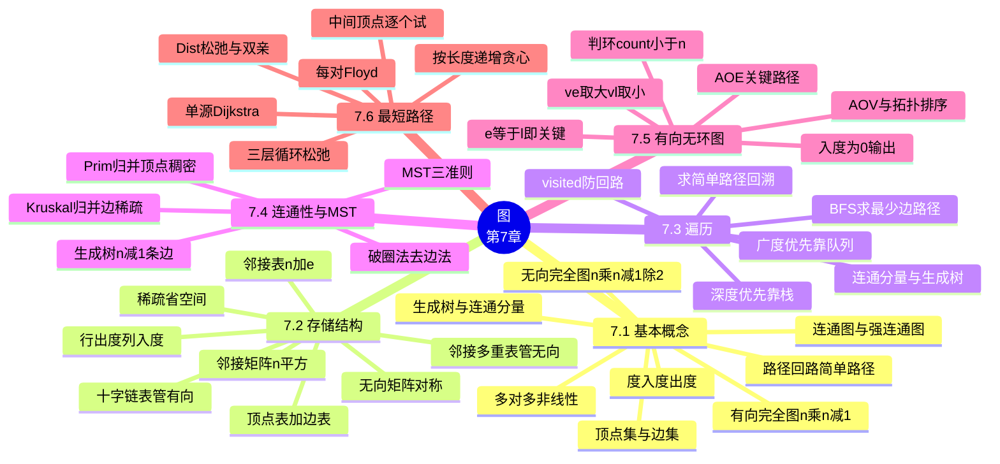

# 第七章 图

> **本章主线**：逻辑结构四分天下——线性（一对一）、树形（一对多）、集合、**图形（多对多）**→ **7.1 图的定义**：Graph=(V, E)，V 顶点有穷非空、E 边/弧有穷 → 术语体系：无向/有向、完全图（$e = n(n-1)/2$ / $e = n(n-1)$）、稀疏与稠密、权与网、**度/入度/出度**（$\sum D(v) = 2e$、$\sum ID + \sum OD = e$）、路径/回路/简单路径、连通图与**强**连通、子图/**生成树**（n 顶点 n-1 条边）/连通分量 → **7.2 存储结构**：顺序 = **邻接矩阵**（$O(n^2)$，稠密图、唯一、判边 O(1)）；链式 = **邻接表**（$O(n+e)$，稀疏图、不唯一）+ 有向图**十字链表**（邻接表+逆邻接表）、无向图**邻接多重表**（每边一结点）→ **7.3 遍历**：DFS 深度优先（**栈/递归**，树先根的推广）与 BFS 广度优先（**队列**，层次遍历的推广），靠 **visited 数组**防回路重复访问，非连通图顺带求出**全部连通分量** → 应用：求简单路径（回溯）、BFS 改造求**最短条数路径** → **7.4 连通性**：遍历即生成树（DFS/BFS 生成树，BFS 更矮），**最小生成树** MST 三准则（只用网边、n-1 条、不回路）——**Prim 归并顶点**（$O(n^2)$ 稠密）、**Kruskal 归并边**（$O(e\log e)$ 稀疏）→ **7.5 DAG**：**AOV 网 + 拓扑排序**（入度 0 输出，判环 O(n+e)）、**AOE 网 + 关键路径**（ve 取 max、vl 取 min、**e(i)=l(i) 即关键**，最短工期=最长路径）→ **7.6 最短路径**：单源 **Dijkstra**（按路径长度**递增**贪心，$O(n^2)$）、每对 **Floyd**（逐个顶点作中间点松弛，$O(n^3)$）。
> 一句话版本：**图 = 多对多，一切从"找邻接点"出发**——矩阵管稠密、邻接表管稀疏，DFS 用栈、BFS 用队列；生成树砍到 n-1 条边取权和最小是 MST（Prim 点、Kruskal 边），DAG 上入度 0 是拓扑、ve/vl 之差为零是关键路径，单源递增贪心是 Dijkstra、n 个中间点轮一遍是 Floyd。



---

## 7.1 图的基本概念

### 7.1.1 图的定义

**回顾**——按逻辑结构划分：**线性结构**一个对一个（线性表、栈、队列）；**树形结构**一个对多个（树、家谱树）；**集合**除"同属一个集合"外无其它关系（一堆沙子）；**图形结构**——**多个对多个**（交通图、高铁图）。存储结构上，顺序存储借**相对位置**表示关系、链式存储借**指针**表示关系（图依然沿用这两类思想，但因多对多而复杂得多）。

**图（Graph）的定义**——非线性结构，数据元素之间呈**多对多**的关系；将数据元素作为**顶点**、元素间关系作为顶点间的**连接**，即由顶点集合 V 和描述顶点间关系的**边的集合** VR（或 E）组成：

$$\text{Graph} = (V, \text{VR}) \quad \text{或} \quad \text{Graph} = (V, E)$$

- **V**——顶点（数据元素）的**有穷非空**集合（注意：**顶点集不能空**，边集可空）；
- **VR（或 E）**——弧（关系）的**有穷**集合。

**例 1（有向图）**：$G_1 = (V_1, VR_1)$，$V_1 = \{A, B, C, D, E\}$，$VR_1 = \{<A,B>, <A,E>, <B,C>, <C,D>, <D,B>, <D,A>, <E,C>\}$。
**例 2（无向图）**：$G_2 = (V_2, VR_2)$，$V_2 = \{A, B, C, D, E, F\}$，$VR_2 = \{(A,B), (A,E), (B,E), (C,D), (D,F), (B,F), (C,F)\}$。

### 7.1.2 图的相关术语

**（1）基本类型**

1. **顶点**——数据元素所构成的结点；
2. **有向图**——弧的顶点偶对**有序**：对弧 $<v_i, v_j>$ 而言，$v_i$ 是**弧尾/初始点**、$v_j$ 是**弧头/终端点**；
3. **无向图**——边的顶点偶对**无序**：$(v_i, v_j)$ 和 $(v_j, v_i)$ 代表同一条边（$i \ne j$）；
4. **（无向）完全图**——每个顶点与其余顶点都有边：n 个顶点时**边数 $e = n(n-1)/2$**；
5. **有向完全图**——每个顶点与其余顶点都有弧：n 个顶点时**弧数 $e = n(n-1)$**；
6. **稀疏图**——有很少边或弧的图（经验界 $e < n\log n$）；**稠密图**——有较多边或弧。

**（2）权与网**

1. **权**——图中的边或弧具有一定的**大小**概念；
2. **网**——**边/弧带权**的图。

**（3）邻接与关联**

1. **邻接**——存在 $(v_i, v_j)$ 则 $v_i$ 与 $v_j$ **互为邻接点**；存在 $<v_i, v_j>$ 则称 $v_i$ **邻接到** $v_j$、$v_j$ **邻接于** $v_i$；
2. **关联（依附）**——边/弧与顶点的关系：该边/弧**关联于**其两端顶点。

**（4）度**

1. **顶点的度 $D(v)$**——与该顶点相关联的边的数目；
2. **入度 $ID(v)$**——有向图中以该顶点为**弧头**的弧数目；**出度 $OD(v)$**——以该顶点为**弧尾**的弧数目。

**度数公式**：

- 无向图：$e = \frac{1}{2}\sum_{i=1}^{n} D(v_i)$——n 个顶点、e 条边、度数之和 = **2e**；
- 有向图：$\sum_{i=1}^{n} ID(v_i) = \sum_{i=1}^{n} OD(v_i) = e$——**入度之和 = 出度之和 = 弧数**。

> 思考：当有向图中**仅 1 个顶点入度为 0、其余顶点入度均为 1**，是何形状？——**是树的形状**（生成有向树）。

**（5）路径相关**

1. **路径**——接续的边构成的顶点序列；**路径长度**——路径上**边/弧的数目**（带权图中为**权值之和**）；
2. **回路（环）**——第一个与最后一个顶点相同的路径；**简单路径**——序列中**顶点均不相同**的路径；**简单回路（简单环）**——除起点终点相同外其余顶点均不同。

**（6）连通性**

1. **连通图**——无向图 G 中**任何两个顶点 v、u 都存在路径**；**强连通图**——有向图中任何两个顶点间**双向都存在路径**；
2. **子图**——$V' \subseteq V$、$E' \subseteq E$ 且 E' 关联顶点都在 V' 中，则 G' 是 G 的子图；
3. **生成子图**——由图的**全部顶点和部分边**组成的子图；
4. **生成树**——包含图中**全部顶点的极小连通子图**（少一条边即不连通）；**生成有向树**——恰有一个顶点入度为 0、其余入度均为 1；**生成森林**——包含所有顶点的若干棵有向树构成的子图；
5. **连通分量**——无向图 G 的**极大**连通子图（再加入任何顶点就不连通）；**强连通分量**——有向图的**极大**强连通子图。

### 7.1.3 图的基本操作（ADT）

1. `CreatGraph(&G, V, VR)` 生成；2. `DestroyGraph(&G)` 销毁；3. `LocateVex(G, value)` 顶点定位；4. `Getvex(G, v)` 取顶点数据；5. `Putvex(&G, v, value)` 对顶点赋值；6. `FirstAdjVex(G, v)` 求第一个邻接顶点；7. `NextAdjVex(G, v, w)` 求下一个邻接顶点；8. `InsertVex(&G, v)` / 9. `DeleteVex(&G, v)` 插删顶点；10. `InsertArc(&G, v, w)` / 11. `DeleteArc(&G, v, w)` 插删边弧；12. `Traverse(G)` 遍历。

> 记忆锚点：**参数 v、w 均为顶点编号**——逻辑上先给顶点编号，一切操作围绕"编号 + 邻接关系"进行；`FirstAdjVex`/`NextAdjVex` 这对"第一个/下一个"是后面所有遍历算法的**存储无关抽象**。

---

## 7.2 图的存储结构

图的存储两大类：**顺序存储**——数组表示法（**邻接矩阵**）；**链式存储**——邻接表、邻接多重表、十字链表（以及关联矩阵，见 7.2.5）。图的多重链表家族因"顶点度不一"而生——**一个结点连多条边**，怎么连决定哪种结构。

### 7.2.1 邻接矩阵表示法（数组表示法）

**定义**——设图 A = (V, E) 有 n 个顶点，则**邻接矩阵**是一个二维数组 A.Edge[n][n]：

$$\text{A.Edge}[i][j] = \begin{cases} 1, & (v_i, v_j) \in E \text{（无向）或} <v_i, v_j> \in E \text{（有向）} \\ 0, & \text{否则} \end{cases}$$

即"**1 表示有边、0 表示无边**"。顶点本身是否连自己（对角线）视约定，一般为 0。

**无向图的邻接矩阵**——**对称矩阵**；**分析**：（1）顶点 i 的**度 = 第 i 行（或列）中 1 的个数**；（2）**完全图**的邻接矩阵：对角元素为 0、其余全 1。

**有向图的邻接矩阵**——**可能不对称**：**第 i 行** = 以 $v_i$ 为**尾**的弧（**出度**边）；**第 i 列** = 以 $v_i$ 为**头**的弧（**入度**边）。故：

$$OD(v_i) = \text{第 i 行元素之和},\quad ID(v_i) = \text{第 i 列元素之和},\quad D(v_i) = \text{行和} + \text{列和}$$

**网（带权图）的邻接矩阵**——$N.\text{Edge}[i][j] = W_{ij}$（有边时取权值），**无边时取 $\infty$**（代码用 `INFINITY = INT_MAX`）；对角线为 0（自身到自身权 0）。

**存储结构定义**：

```c
#define INFINITY       INT_MAX   // 最大值∞
#define MAX_VERTEX_NUM 20        // 最大顶点个数
typedef enum {DG, DN, UDG, UDN} GraphKind;
// 有向图、有向网、无向图、无向网，四种图类型
typedef int VertexType;
typedef struct ArcCell {
    VRType   adj;      // 无权图取0或1；带权图取权值
    InfoType *info;    // 该弧的相关信息指针
} ArcCell, AdjMatrix[MAX_VERTEX_NUM][MAX_VERTEX_NUM];
typedef struct {
    VertexType vexs[MAX_VERTEX_NUM];  // 顶点向量
    AdjMatrix  arcs;                  // 邻接矩阵
    int        vexnum, arcnum;        // 当前顶点数和弧数
    GraphKind  kind;                  // 图的种类标志
} MGraph;
```

**例 1（无向图）**：顶点 A(0) B(1) C(2) D(3)，邻接矩阵：

$$\begin{pmatrix} 0 & 1 & 1 & 0 \\ 1 & 0 & 1 & 1 \\ 1 & 1 & 0 & 1 \\ 0 & 1 & 1 & 0 \end{pmatrix}$$

——**无向图的邻接矩阵具有对称性**。**例 2（有向网）**：A→B 权 3、A→C 权 2、C→B 权 5、B→D 权 4、D→C 权 2，矩阵第 0 行 = `0 3 2 ∞`，非对称。

**特点**——**优点**：容易实现图的操作（求度、判边是否存在、找邻接点，全部 O(1) 或 O(n)）；**缺点**：n 个顶点需要 $n \times n$ 个单元存边，**空间 $O(n^2)$，对稀疏图尤其浪费**。

**建立无向网的数组型存储步骤**：1) 读顶点数 n、边数 e $O(1)$；2) 读每个顶点填 vexs $O(n)$；3) 矩阵初始化——**全部置 ∞、主对角线置 0** $O(n^2)$；4) 建立邻接矩阵——读一条边的两顶点 i、j 和权 w，置 `arcs[i][j]=w, arcs[j][i]=w` $O(e)$；总体 **$O(n^2)$**。输入示例：`4 5` / `A B C D` / `0 1` / `0 2` / `0 3` / `1 2` / `2 3`。

### 7.2.2 邻接表表示法

**邻接表（Adjacency List）**——图的**顺序存储与链式存储结合**：将顶点 V 的邻接点放入一个**线性表（链式实现）**存储。对每个顶点 $v_i$ 建立一个**单链表（边表）**，把与 $v_i$ 关联的边链接起来：

1. **边表结点（ArcNode）**三个域：`adjvex`（**邻接点域**，表示 $v_i$ 的一个邻接点位置）、`nextarc`（**链域**，指向下一条边/弧）、`weight`/`info`（**数据域**，权值等，非带权图不设）；
2. **顶点表结点（VNode）**两个域：`data`（存储顶点 $v_i$ 信息）、`firstarc`（指向该顶点单链表第一个结点的头指针）。

**存储结构定义**：

```c
typedef struct ArcNode {
    int              adjvex;   // 该边/弧所指向的顶点位置
    struct ArcNode  *nextarc;  // 指向下一条边或弧
    int              weight;   // 权重，网类型时使用
    InfoType        *info;
} ArcNode;
typedef struct VNode {
    VertexType  data;          // 顶点信息
    ArcNode    *firstarc;      // 指向第一条依附该顶点的弧
} VNode, AdjList[MAX_VERTEX_NUM];
typedef struct {
    AdjList   vertices;        // 顶点向量
    int       vexnum, arcnum;
    GraphKind kind;
} ALGraph;
```

**要点**：**邻接表不唯一**（各边结点链入顺序任意）；空间效率 **$O(n+2e)$**（无向）/ **$O(n+e)$**（有向）——若稀疏（$e \ll n^2$）比邻接矩阵 $O(n^2)$ 省空间。无向图每条边被两个顶点的边表各记一次；**有向图的邻接表存"出边"**，要快速求入度需**逆邻接表（入边表）**。

**有向图的出度与入度**（邻接表下）：**出度 $OD(v_i)$ = 单链出边表中链接的结点数**；**入度 $ID(v_i)$ = 邻接点域为 $v_i$ 的弧个数**（须扫所有边表）；**度 = 出度 + 入度**。空间效率 $O(n+e)$。

**建立无向网邻接表步骤**：1) 读 n、e $O(1)$；2) 读顶点填 vertices $O(n)$；3) 建边表——读边 (i, j, w)，申请结点 `adjvex=j, weight=w` **插到 $v_i$ 边表头部**；再申请 `adjvex=i, weight=w` 插到 $v_j$ 边表头部；重复 $O(e)$；总体 **$O(n+e)$**。

**反向绘图练习（PPT）**：已知某网的**邻接（出边）表**（顶点表 + 各边表带权），画出该网络——**当邻接表存储结构形成后，图便唯一确定**（结构本身即定义）。

### 7.2.3 邻接矩阵与邻接表的关系

**联系**——邻接表中**每个链表对应于邻接矩阵中的一行**，链表中结点个数等于该行非零元素个数（第 31 页图示：同一张图的矩阵与邻接表逐一对应）。

**区别**：

1. 对于任一确定的**无向图**，**邻接矩阵唯一**（行列号与顶点编号一致），而**邻接表不唯一**（链接次序与顶点编号无关）；
2. 空间复杂度：矩阵 $O(n^2)$，邻接表 $O(n+e)$；
3. 邻接表**空间效率高**、容易找顶点的邻接点；邻接矩阵**空间效率低**、但容易找顶点相关的边/弧（判边 O(1)）；
4. **用途**：**邻接矩阵多用于稠密图；邻接表多用于稀疏图**。

**空间对比表**：

| 存储 | 无向图 | 有向图 | 适用 |
| --- | --- | --- | --- |
| 邻接矩阵 | 顶点表 n + 邻接矩阵 $n^2/2$（对称只存一半也行，通常存 $n^2$） | 顶点表 n + 邻接矩阵 $n^2$ | **稠密图** $O(n^2)$ |
| 邻接表 | 顶点表 n + 边表 $2e$ | 顶点表 n + 边表 $e$ | **稀疏图** $O(n+e)$ |

> 口诀：**矩阵判边快、邻接找点省——稠密用矩阵、稀疏用邻接表；矩阵唯一表不唯一**。

**基本操作时间复杂度对比（补充说明）**——以"求度、判边、求边数"为例（均含"扫描顶点表定位"的 $O(n)$ 前置）：

| 操作 | 邻接矩阵 | 邻接表 |
| --- | --- | --- |
| 求顶点 v 的度 | 扫**一行**统计：无向 O(n)；有向**行出度+列入度** | 无向/出度：数**该点边表** O(n)；入度：扫**所有边表** O(n+e) |
| 判定边 (u,v) 是否存在 | 取矩阵对应下标 **O(1)** | 扫 u 或 v 的边表 O(e) |
| 求边（弧）数目 | 扫描整个矩阵 $O(n^2)$ | 扫所有边表（无向再**除以 2**）O(n+e) |
| 插入/删除顶点 | 加删矩阵行列 $O(n^2)$ | 改顶点表 + 扫边表挂/摘结点 |

> 口诀：**矩阵判边一步到位、邻接数度一条链扫完；无向边数记得除 2、有向入度必须全表扫**。

### 7.2.4 十字链表与邻接多重表

**十字链表（Orthogonal List）**——**适用对象：有向图**（顺序+链式），**核心思路：一条链表记录结点指向了谁，另一条记录谁指向了它——邻接表和逆邻接表的结合**（存储结构定义参教材第 165 页）：

1. **顶点结点**：`data`（顶点数据）、`firstin`（指向**进入**该顶点第一条弧的弧结点）、`firstout`（指向**自该顶点出发**的第一条弧）；
2. **弧结点**：`info`（权值等，可无）、`tailvex`（**出发**顶点下标）、`headvex`（**终止**顶点下标）、`hlink`（**终止点相同**的下一条弧）、`tlink`（**出发点相同**的下一条弧）。

——即每个顶点两条链（出弧链 + 入弧链），每条弧结点同时挂在"同尾"和"同头"两条链上。

**邻接多重表（Adjacency Multilist）**——**适用对象：无向图**（顺序+链式），**核心思路：每条边对应一个结点**，方便无向图中**对边**的操作（如标记边是否被访问）——因为无向图一条边会被两个端点各引用一次，用一个结点表示可避免重复：

1. **顶点结点**：`data`、`firstedge`（指向依附该顶点的第一条边的边结点）；
2. **边结点**：`mark`（**标志域**，标识该边是否访问过）、`ivex`/`jvex`（本边依附的**两个顶点**下标）、`ilink`/`jlink`（分别指向下一条依附 ivex / jvex 的边）、`info`（权值，可无）。

**关联矩阵（补充说明）**——以"顶点 × 边"的矩阵表示：无向图中 A[i][j]=1 表示顶点 i 与边 j 关联；有向图用 **±权** 区分方向（如 A 行：`-3 -2 0 0 0`、B 行：`3 0 5 -4 0`——负号表示"弧尾进入"）。

> 口诀：**有向要用十字链（同尾同头两根链）、无向要用邻接多重表（一边一结点不重复）**——按"图的有无向 + 操作对象是点还是边"选结构。

---

## 7.3 图的遍历

**遍历定义**——从已给的连通图中某一顶点出发，沿着一些边**访遍图中所有的顶点，且使每个顶点仅被访问一次**，叫做**图的遍历**。图的遍历是基本运算，是求解图的**连通性、拓扑排序和求关键路径**的基础。

**遍历的难点**——由于图中可能存在**回路**，且任一顶点都可能与其它顶点相通，访问完某顶点后可能沿某些边**又回到曾经访问过的顶点**；**遍历实质：找每个顶点的邻接点的过程**。

**记录方式**——设置辅助数组 **visited[n]**：`visited[i]` 初值 0(false)，i 被访问后改为 1(true)，防止多次访问。**DFS 递归/栈记录访问过的结点；BFS 用队列**。为何不直接顺序扫顶点表？——树没有"所有结点的简单存储结构"，图有了顶点表，但**图的遍历要按邻接关系走**（顺顶点表只是"枚举顶点"，不是沿边访问）。

**两种遍历示例**——从 $v_1$ 出发（图 $v_1$ 连 $v_2, v_3$；$v_2$ 连 $v_4, v_5$；$v_3$ 连 $v_6, v_7$；$v_4$ 连 $v_8$）：

- **深度优先**：$v_1 \to v_2 \to v_4 \to v_8 \to v_5 \to v_6 \to v_3 \to v_7$（一条道走到底再回溯）；
- **广度优先**：$v_1 \to v_2 \to v_3 \to v_4 \to v_5 \to v_6 \to v_7 \to v_8$（逐层扩散）。

### 7.3.1 深度优先搜索（DFS）

**算法思想（递归）**：

1. 访问顶点 v，并记录 v 已被访问；
2. 依次从 v 的**未访问的邻接点**出发，递归进行深度优先搜索：（2.1）找到 v 的第一个邻接点 w；（2.2）若 w 存在且未访问，对 w 递归 DFS，若 w 不存在则返回；（2.3）从 w 出发找下一个邻接点；（2.4）回到（2.2）；
3. 在顶点表中还有未访问顶点，则令其为 v 回到（1）；否则结束。

**核心思路**：只要将 v 的邻接点都递归访问完，v 所在**连通分量**中的顶点就都会被访问到；对**非连通图**，依次对每个连通分量执行即可完成全图 DFS——**DFS = 树的先根遍历的推广**。

**通用形式（基于抽象存储）**：

```c
typedef enum {FALSE, TRUE} Boolean;
Boolean visited[MAX_VERTEX_NUM];  // 辅助访问标志向量

void DFS(Graph G, int v)
{ visit(v);
  visited[v] = TRUE;
  for (w = FirstAdjVex(G, v); w > -1; w = NextAdjVex(G, v, w))
      if (!visited[w]) DFS(G, w);
} // DFS

void DFSTraverse(Graph G)
{ for (v = 0; v < G.vexnum; ++v) visited[v] = FALSE;  // 初始化
  for (v = 0; v < G.vexnum; ++v)
      if (!visited[v]) DFS(G, v);   // 非连通图的下一个连通分量
} // DFSTraverse
```

**邻接矩阵实现**——"按行找"：`for (j = 0; j < G.vexnum; ++j) if (G.arcs[v][j] != 0 && !visited[j]) DFS(G, j);`
**邻接表实现**——"按边表找"：`p = G.vertices[v].firstarc; while (p) { if (!visited[p->adjvex]) DFS(G, p->adjvex); p = p->nextarc; }`

**非递归算法思想**：（1）访问一个顶点并记录，**将其所有未访问邻接顶点入栈**；（2）栈空则退出，否则栈顶出栈；（3）该顶点若已访问过转（2），否则转（1）。

**时间复杂度**——主要操作是"查找每个顶点的所有邻接点"：**邻接矩阵 $O(n^2)$；邻接表 $O(n+e)$**（无向图结点数 n+2e、有向图 n+e）——**对照树的遍历 $O(n)$，图多出的开销全在"找邻接点"上**。

### 7.3.2 广度（宽度）优先遍历（BFS）

**算法思想**：

1. 访问顶点 v，记录已访问，**v 入队列**；
2. 队列空则退出，否则从队中取出一顶点；
3. 求该顶点的一个邻接点；若未访问，则访问、记录、**入队**；
4. 还有下一个邻接点转（3），否则转（2）。

**BFS = 树的按层次遍历的推广**——先到先访（FIFO），按"路径长度渐增"的次序访问。

**算法实现（辅助数组 visited + 辅助队列配合）**：

```c
void BFSTraverse(Graph G)
{ for (v = 0; v < G.vexnum; ++v) visited[v] = FALSE;
  InitQueue(Q);
  for (v = 0; v < G.vexnum; ++v) {
      if (!visited[v]) {
          visit(v); visited[v] = TRUE; EnQueue(Q, v);
          while (!QueueEmpty(Q)) {
              DeQueue(Q, u);
              for (w = FirstAdjVex(G, u); w > -1; w = NextAdjVex(G, u, w))
                  if (!visited[w]) { visited[w] = TRUE; visit(w); EnQueue(Q, w); }
          }
      }
  }
} // BFSTraverse
```

（PPT 另给出"每个连通分量单独 InitQueue"的 BFS 拆分版，语义相同。）**时间复杂度与 DFS 相同**：邻接矩阵 $O(n^2)$、邻接表 $O(n+e)$。

### 7.3.3 图的遍历小结

1. **深度优先借助栈（或递归即系统栈）实现；广度优先借助队列实现**；
2. **图的遍历序列与算法和存储方式有关**（同图、不同存储/不同起点，DFS 序列不同）；
3. 对**非连通图**，通过遍历可求得**各连通分量**（DFSTraverse 外层循环的作用）。

**DFS 与 BFS 对比表**：

| 对比项 | 深度优先 DFS | 广度优先 BFS |
| --- | --- | --- |
| 辅助结构 | **栈 / 递归** | **队列** |
| 推广来源 | 树的**先根**遍历 | 树的**层次**遍历 |
| 访问次序 | 一条路走到底再回溯 | 按路径长度渐增逐层扩散 |
| 序列特点 | 依赖存储结构与邻接点顺序 | 同层内仍依赖顺序，层间严格 |
| 生成树高度 | 较**高**（单链倾向） | 较**矮**（扇形展开） |
| 时间复杂度 | 矩阵 $O(n^2)$ / 邻接表 $O(n+e)$ | 同 DFS |

> 口诀：**DFS 栈先根、BFS 队列层层摊——深树浅树差在结构（BFS 生成树更矮），序列都得看存储和邻接顺序**。

### 7.3.4 图的遍历应用举例

**例 1：求一条从顶点 i 到顶点 s 的简单路径（DFS + 回溯）**——从 b 出发 DFS，假设第一个邻接点是 a，访问序列为 `b a d h c e k f g`；假设第一个邻接点是 c，则为 `b c h d a e k f g`。**结论**：

1. 从 i 到 s 若存在路径，则从 i 出发 DFS **必能搜索到 s**；
2. 遍历中搜索到的顶点 X **不一定是路径上的顶点**；
3. 由 X 出发已完成的 DFS 顶点**也不一定**在路径上。

**实现要点**：递归 DFS 中，顶点进入时 `Append(PATH, v)`（加入路径）、回退时 `if (!found) Delete(PATH, v)`——**"进站记、出站删"的回溯模板**；若 `w == s` 则 `found = TRUE` 并输出。与第 6 章"由先序恢复二叉树"同属**回溯思想**。

**例 2：求两顶点间路径长度最短的路径（BFS 改造）**——DFS 访问次序取决于存储结构，而 **BFS 按"路径长度"渐增访问**，故**最少边数路径**可基于 BFS。改造链队列：

1. 队列结点改为**双链结点**（含 next 和 prior 两个指针）；
2. **入队**：新队尾结点的 `prior` 指向**刚刚出队的结点**（当前队头）——即记录"谁发现了我"；
3. **出队**：仅移动队头指针，**不删除结点**——保留 prior 链用于回溯路径。

例：顶点 3 至顶点 5 的最短路径，链队列状态 `3 1 2 4 7 5` 逐层展开，由 5 沿 prior 回溯到 3 即得最短路径——**队列记层次、prior 串路径**。

---

## 7.4 图的连通性问题

### 7.4.1 生成树与生成森林

**子图与生成子图**——设 $G=(V,E)$、$G_1=(V_1,E_1)$，若 $V_1 \subseteq V$、$E_1 \subseteq E$，则 $G_1$ 是 G 的**子图**；由图的**全部顶点和部分边**组成的子图称**生成子图**。

**生成树**——**包含图中所有顶点的极小连通子图**。"极小"：该子图是连通子图，**再删任何一条边子图就不再连通**。对连通图 G 的一次遍历：边集被分成 **T(G)**（遍历经过的边）和 **B(G)**（剩余边），**T(G) 就是 G 的一棵生成树**。

**生成树的性质**：

1. 连通图 G 有 n 个顶点 → 生成树必具有 **n-1 条边**；
2. 生成树**可通过 DFS/BFS 遍历得到**——分别称**深度优先生成树 / 广度优先生成树**（算法中访问 $v_j$ 时记录其父结点 $v_i$，$(v_i, v_j)$ 即树边）；
3. **一般 BFS 生成树的树高小于 DFS 生成树的高度**（BFS 层层摊开、DFS 深钻）；
4. **生成树不唯一**——从不同顶点出发、采用不同存储结构和存储顺序，结果都不同。

**生成森林**——对**非连通图**遍历，得到的是**生成森林**（每个连通分量一棵生成树，如三棵 DFS 生成树组成）。

### 7.4.2 最小生成树（MST）

**问题（典型用途）**——n 个城市间建通信网：n 城市铺 **n-1 条线路**，但候选线路有 $n(n-1)/2$ 条且各有成本，如何选 n-1 条使**总费用最少**？数学模型：**顶点=城市、边=线路、权=经济代价、连通网=通信网**——求**各边权值之和最小的生成树**，记为 **MST（Minimum Cost Spanning Tree）**。

**构造最小生成树的准则**：

1. 必须只使用**该网中的边**；
2. 必须**使用且仅使用 n-1 条边**联结 n 个顶点；
3. **不能使用产生回路的边**。

**MST 性质（轻边性质）**——设 N=(V, {E}) 是连通网络，U 是 V 的真子集，若边 $(u, v)$（$u \in U, v \in V-U$）是 E 中所有**一个端点在 U 内、一个端点不在 U 内**的边中**权值最小**的一条边（**轻边**），则**一定存在一棵生成树包括此边**。

**构造方法总览**——两大经典算法 + 两个辅助思想：

1. **Prim（普里姆）算法**——**归并顶点**，与边数无关，**适于稠密网**；
2. **Kruskal（克鲁斯卡尔）算法**——**归并边**，**适于稀疏网**；
3. **破圈法**（补充）：找一个回路 → 去掉回路中**权值最大**的边 → 反复至无回路；
4. **去边法**（补充）：边按权**从大到小**排 → 依次去掉最大边，**若图不再连通则保留** → 反复至只剩 n-1 条边。

### 7.4.2.1 Prim 算法

**思想（三步）**：1) 顶点分两个集合——X 含一个顶点 $v_0$，Y 含其余；2) 把**跨接两集合的权值最小边**加入生成树，并把 Y 中该边另一端点移入 X；3) 反复直到 Y 为空——**每次"长出"一个顶点，本质是 MST 性质的直接应用**。注意：U 中多个顶点到 V-U 中同一顶点有多条边时，**只留权值最小那条作候选，其余放弃**。

**存储结构**——主：带权邻接矩阵 `G.arcs[n][n]`；辅：数组 `closedge[i]`（i=0..n-1）记录**候选边**：`lowcost`（当前关联 $v_i$ 的轻边权值）、`adjvex`（该边依附的 **U 集合**中的顶点下标）。**已并入 U 的顶点 lowcost 置 0，不再参与筛选**。

**执行示例（n=6，从 $v_0$ 开始）**——邻接矩阵（∞ 即无边）：

| | v0 | v1 | v2 | v3 | v4 | v5 |
| --- | --- | --- | --- | --- | --- | --- |
| **v0** | 0 | 6 | 1 | 5 | ∞ | ∞ |
| **v1** | 6 | 0 | 5 | ∞ | 3 | ∞ |
| **v2** | 1 | 5 | 0 | 5 | 6 | 4 |
| **v3** | 5 | ∞ | 5 | 0 | ∞ | 2 |
| **v4** | ∞ | 3 | 6 | ∞ | 0 | 6 |
| **v5** | ∞ | ∞ | 4 | 2 | 6 | 0 |

> 口诀：**矩阵行即点的权表——第 i 行读作 $v_i$ 到各顶点的权，无边记 ∞、对角记 0、对称是无向**。

1. 用 $v_0$ 行初始化：`lowcost = {0, 6, 1, 5, ∞, ∞}`、`adjvex = {0,0,0,0,0,0}`；
2. 最小 → **$v_2$(权 1)**，输出边 $(v_0, v_2)$，$v_2$ 入 U；用 $v_2$ 行调整：$v_1$ 处 5<6 → `(2,5)`；$v_4$ 处 6 → `(2,6)`；$v_5$ 处 4 → `(2,4)`；$v_3$ 处 5=5 不换 → `lowcost={0,5,0,5,6,4}`、`adjvex={0,2,0,0,2,2}`；
3. 最小 → **$v_5$(权 4)**，输出 $(v_2, v_5)$；用 $v_5$ 行调整：$v_3$ 处 2<5 → `(5,2)` → `lowcost={0,5,0,2,6,0}`、`adjvex={0,2,0,5,2,0}`；
4. 最小 → **$v_3$(权 2)**，输出 $(v_5, v_3)$；
5. 最小 → **$v_1$(权 5)**，输出 $(v_2, v_1)$；用 $v_1$ 行调整：$v_4$ 处 3<6 → `(1,3)`；
6. 最后 **$v_4$(权 3)**，输出 $(v_1, v_4)$——完成。

**算法步骤**（以 v 为出发点）：1) 用 v 的行向量初始化 closedge $O(n)$；2) 重复 n-1 次：（2.1）选 lowcost 最小且非 0 者记为 k $O(n)$；（2.2）输出 $(adjvex, k)$；（2.3）$closedge[k].lowcost = 0$（k 并入 U）；（2.4）调整——若 `G.arcs[k][j] < closedge[j].lowcost` 则更新 $closedge[j]$ $O(n)$。总复杂度 **$O(n^2)$**。

```c
struct { int adjvex; VRType lowcost; } closedge[MAX_VERTEX_NUM];

void Prim(MGraph G, VertexType u)
{ k = LocateVex(G, u);
  for (j = 0; j < G.vexnum; ++j)          // v 结点所在行初始化候选边
      closedge[j] = {k, G.arcs[k][j].adj};
  for (i = 1; i < G.vexnum; ++i) {        // n-1 次选边
      k = minium(closedge);               // 选权值最小候选边
      printf(closedge[k].adjvex, k);
      closedge[k].lowcost = 0;            // 顶点 k 并入 U 集
      for (j = 0; j < G.vexnum; ++j)      // 用 k 带来的边调整
          if (G.arcs[k][j].adj < closedge[j].lowcost)
              closedge[j] = {k, G.arcs[k][j].adj};
  }
} // Prim
```

### 7.4.2.2 Kruskal 算法

**算法步骤**：1) **初始化 T**：顶点集=所有顶点（每个独立顶点为一棵树）、边集为空 $O(n)$；2) 依**权值递增序**对 G 的边排序 $O(e\log e)$；3) 依次检测各边 $(u,v)$：若 u 和 v 分属 T 中**两棵不同的树**，则加入该边并**合并两棵树**；若 T 中所有顶点尚未属于一棵树，转 3) $O(e\log e)$。判"是否同树"可参阅教材 139 页**树与等价问题**（并查集思想）。**特点：适用于稀疏图，总复杂度 $O(e\log e)$**。

**示例（n=6）**——边按权排序 `1,1,2,2,3,3,4,5,5,6...`，依次取**两端落在不同连通分量**的最小边，逐条加入直至全部顶点连通——**选边像"排着队接线，接上就并网"**。

**Prim 与 Kruskal 对比表**：

| 对比项 | Prim 普里姆 | Kruskal 克鲁斯卡尔 |
| --- | --- | --- |
| 归并对象 | **归并顶点**（每次长入一个顶点） | **归并边**（每次接通两个连通分量） |
| 核心依据 | **MST 性质（轻边）** | 边排序 + **判环（是否同树）** |
| 时间复杂度 | $O(n^2)$ | $O(e\log e)$ |
| 适应范围 | **稠密图** | **稀疏图** |
| 辅助结构 | closedge 候选边数组 | 边表 + 等价类（并查集） |

> 口诀：**Prim 长点看候选表、稠密 $n^2$；Kruskal 排边并森林、稀疏 $e\log e$**——一个从点找边、一个从边找点，殊途同归 n-1 条边。

**Prim 改进（补充说明）**：用**斐波那契堆**实现"选最小"操作，可使总复杂度降到 $O(n\log_2 n + e)$。

---

## 7.5 有向无环图及其应用

**有向无环图（DAG, Directed Acyclic Graph）**——无回路的有向图。任务划分、事件依赖、表达式求值等天然呈 DAG 形态。

### 7.5.1 拓扑排序

**问题目标**——当一个任务可划分为若干子任务，且任何子任务可能又以另外的子任务作为先决条件时，如何**排定子任务的执行顺序**，达到整体任务的完成？例如施工图或程序数据流图，**图中不允许出现回路**。

**AOV 网（Activity On Vertex）**——**顶点表示活动、弧表示活动间的优先关系**；**可拓扑排序的条件：有向无环图**。例：计算机专业必修课依赖——C0 高数（无先修）、C1 程设基础（无）、C2 离散数学（C0,C1）、C3 数据结构（C2,C4）、C4 程设语言（C1）、C5 编译原理（C3,C4）、C6 操作系统（C3,C8）、C7 普通物理（C0）、C8 计算机原理（C7）。

**拓扑排序定义**——按照有向图给出的**次序关系**，将图中顶点排成一个**线性序列**；它也是**检查有向图中是否存在回路的方法之一**。例：A→B、A→C、B→D、C→D 可得 `A B C D` 或 `A C B D`；若存在回路 {B, C, D} 则**不能求得拓扑有序序列**——**拓扑序列不唯一，回路图则无解**。

**方法一：无前趋的顶点优先（入度 0）**

- **算法原理**：在拓扑序列中，每个顶点必定出现在它的**所有前趋之后**；
- **算法思想**：1) 选择一个**入度为 0** 的顶点（无前趋），输出它；2) **删去该顶点及其关联的所有出边**；重复直至没有入度 0 的顶点——**若所有顶点均被输出则成功，否则图中存在有向环**（count < vexnum 即失败）。

**数据结构**——主：邻接表 G；辅：`indegree[0..n-1]`（各顶点当前入度）、**栈 S（或队列 Q）**暂存当前所有入度为 0 的顶点（**避免每次全表扫描 indegree**）。例图初值：`indegree = {0, 0, 1, 2, 2}`，初始入栈 v1、v2。

**算法步骤**（复杂度 $O(n+e)$）：

1. 初始化：1.1 扫描各出边表计数入度 $O(n+e)$；1.2 入度为 0 者入栈 $O(n)$；1.3 count = 0；
2. 栈不空反复：2.1 栈顶 i 出栈；2.2 输出 i，count++；2.3 扫描 i 的出边表——邻接点入度减 1，**若入度变为 0 则入栈**；
3. 若 count < vexnum → "排序失败！"（存在有向环），否则成功。

```c
Status TopologicalSort(ALGraph G)
{ FindInDegree(G, indegree);            // 求各顶点入度
  InitStack(S);
  for (i = 0; i < G.vexnum; ++i)
      if (!indegree[i]) push(S, i);     // 入度为0入栈
  count = 0;
  while (!StackEmpty(S)) {
      pop(S, i);
      printf(i, G.vertices[i].data); ++count;
      for (p = G.vertices[i].firstarc; p; p = p->nextarc) {
          k = p->adjvex;
          if (!(--indegree[k])) push(S, k);   // 入度归0入栈
      }
  }
  if (count < G.vexnum) return ERROR;   // 存在环
  else return OK;
} // TopologicalSort
```

**方法二：无后继的顶点优先（出度 0）**——按**逆拓扑次序**生成：选**出度为 0** 的顶点输出，删去它及其所有**入边**，反复至无出度 0 顶点——输出序列即**逆拓扑序列**（如 `v5 v4 v3 v2 v1`）。

**方法三：利用深度优先遍历（补充）**——从入度 0 的顶点出发 DFS，**递归返回时输出顶点 v**（此时 v 相当于无后继）——得到**逆拓扑序列**。注意：PPT 指出该写法**仅适用于有向无环图**（某些实现不能检测出有向环，会得到虚假拓扑序列）。

### 7.5.2 关键路径（AOE 网）

**问题目标**——任务/工程划分为若干子活动，整个工程**至少需要多少时间**？**哪些活动是影响进度的关键**？

**AOE 网（Activity On Edge）**——用 DAG 表示：**顶点=事件（event）、弧=活动（activity）、权值=活动所需时间（dut）**。性质：**进入 $v_i$ 的活动都结束，$v_i$ 代表的事件才能发生；$v_i$ 发生，从它出发的活动才能开始**。例图中整个工程所需时间 = **18**，关键活动 = **a0、a3、a6、a7、a9、a10**。

**相关术语**：

1. **源点**——入度为 0 的顶点（工程开始点）；**汇点**——出度为 0 的顶点（完成点）；
2. **活动持续时间**——活动 $a_i$ 由弧 $<j,k>$ 表示，记 $dut(<j,k>)$；
3. **关键路径**——**从源点到汇点的最长路径**；**关键路径长度 = 最短工期**；
4. **关键活动**——关键路径上的活动，**加快关键活动可缩短工期**。

**四个变量**——$ve(j)$：事件 $v_j$ **最早**发生时间（earliest time of vertex）；$vl(j)$：事件 $v_j$ **最迟**发生时间；$e(i)$：活动 $a_i$ 最早开始时间；$l(i)$：活动 $a_i$ 最迟开始时间。对弧 $<j,k>$（活动 ai）：

$$e(i) = ve(j), \qquad l(i) = vl(k) - dut(<j,k>)$$

**关键活动的判断方法：$e(i) = l(i)$**。

**求关键路径算法步骤**——主结构：邻接矩阵或邻接表；辅助：`ve(0..n-1)`、`vl(0..n-1)`、`e(0..m-1)`、`l(0..m-1)`（n 顶点、m 弧）、栈 T 存拓扑序列：

1. 输入所有弧，建立 AOE 网存储结构；
2. **算 ve[]**：**拓扑排序**过程中，每求得一个顶点 j 则入栈 T，并调整 j 所有后继的 ve 值；
3. **算 vl[]**：按栈 T **从栈顶到栈底（逆拓扑序）**求各顶点 vl；
4. **算 e[]、l[]**：由公式求各活动的 e、l，**依据 $e(i)=l(i)$ 确定关键活动，再确定关键路径**。

**(2) 求 ve（最早发生时间）**：

$$ve(0) = 0, \qquad ve(j) = \max_{i \in j的前驱}\{ve(i) + dut(<i,j>)\}$$

*算法思想*：初值全 0；每输出一个无前驱顶点 j 后，修正所有后继 k——`ve[k] = max(ve[j] + dut(<j,k>))`——**由不同前驱算出时每次保留最大的**（最晚也得等所有前置活动完成）。例图拓扑序列 0-1-2-3-4-5-6-7-8 下逐步得 `ve = {0, 6, 4, 5, 7, 7, 16, 14, 18}`。

**(3) 求 vl（最迟发生时间）**：

$$vl(n-1) = ve(n-1), \qquad vl(j) = \min_{k \in j的后继}\{vl(k) - dut(<j,k>)\}$$

*算法思想*：初值 `vl[j] = ve[j]`；按拓扑序列**逆序**计算——**由不同后继算出时每次保留最小的**（再迟就赶不上任一后继）。例图得 `vl = {0, 6, 6, 8, 7, 10, 16, 14, 18}`。

**(4) 求 e、l 并确定关键活动**——$e(i) = ve(j)$、$l(i) = vl(k) - dut(<j,k>)$：

| i | 0 | 1 | 2 | 3 | 4 | 5 | 6 | 7 | 8 | 9 | 10 |
| --- | --- | --- | --- | --- | --- | --- | --- | --- | --- | --- | --- |
| e(i) | 0 | 0 | 0 | 6 | 4 | 5 | 7 | 7 | 7 | 16 | 14 |
| l(i) | 0 | 2 | 3 | 6 | 6 | 8 | 7 | 7 | 10 | 16 | 14 |

> 口诀：**e、l 同列并排比——相等即关键、不等可拖延；e 最早不得早于 ve、l 最晚不得晚于 vl 减工时**。

$e=l$ 者为关键活动：**a0、a3、a6、a7、a9、a10**——**最短工期 18**（存在两条关键路径时，各条都需关注）。

**核心代码（Part 1：带 ve 的拓扑排序）**：

```c
Status TopologicalOrder(ALGraph G, Stack &T, int *ve)
{ FindInDegree(G, indegree);
  InitStack(S); count = 0;
  for (i = 0; i < G.vexnum; ++i) ve[i] = 0;
  for (i = 0; i < G.vexnum; ++i) if (!indegree[i]) push(S, i);
  InitStack(T);
  while (!StackEmpty(S)) {
      pop(S, j); push(T, j); ++count;
      for (p = G.vertices[j].firstarc; p; p = p->nextarc) {
          k = p->adjvex;
          if (!(--indegree[k])) push(S, k);
          if (ve[j] + (p->weight) > ve[k]) ve[k] = ve[j] + (p->weight);  // ve取max
      }
  }
  if (count < G.vexnum) return ERROR; else return OK;
} // TopologicalOrder
```

**核心代码（Part 2：CriticalPath）**——先 `TopologicalOrder` 得 ve 与栈 T；`vl` 全体初始化为 `ve[n-1]`；按 T 逆拓扑弹出 j，对每条弧 `if (vl[k] - weight < vl[j]) vl[j] = vl[k] - weight;`（**vl 取 min**）；最后双循环求每条弧的 `ee = ve[j]`、`el = vl[k] - dut`，**`ee==el` 打 '·' 标记为关键活动**。

**AOV 与 AOE 对比表**：

| 对比项 | AOV 网（拓扑排序） | AOE 网（关键路径） |
| --- | --- | --- |
| 顶点含义 | **活动** | **事件** |
| 弧/权含义 | 弧 = 优先关系，无权 | 弧 = 活动，权 = 持续时间 |
| 核心计算 | **入度 0 输出**（无前趋优先） | **ve 取 max、vl 取 min** |
| 判定/结果 | count < n → 有环 | $e(i)=l(i)$ → 关键活动 |
| 复杂度 | $O(n+e)$ | 拓扑两遍 + 扫弧 $O(n+e)$ |
| 序列性质 | 拓扑序列**不唯一** | **最短工期 = 最长路径** |

> 口诀：**AOV 入度归零往下砍、AOE 前向取大后向取小、e 等于 l 就是关键**——拓扑管"顺序"、关键路径管"工期"。

---

## 7.6 最短路径

### 7.6.1 概述

**问题对象**——交通网、通信网：两地之间**是否有路相通**？多条通路时**哪一条最短**？问题对象是**有向网络**（可扩展到无向网络）。

**最短路径定义**——**单源最短路径**：从某**源点**到其它所有顶点间的最短路径；**每一对顶点间的最短路径**：各顶点到其它所有顶点间。

**两个典型算法**——单源：**迪杰斯特拉（Dijkstra）**算法；每对：**弗洛伊德（Floyd）**算法。**拓展**：Dijkstra 被证明是**普遍最优**的——配足够高效的堆后，其运行时间与比较次数在最坏情况下也最优（universal optimality）。

**朴素思路的反例**——先求两点间**所有简单路径**再取最短，太低效；Dijkstra 的思路：**贪心地按"路径长度递增"次序逐个产生最短路径**——先拿最近的当跳板，再看经它绕路是否更近，反复直至全部确定。

### 7.6.2 从某个源点到其余各顶点的最短路径（Dijkstra）

**算法原理——按路径长度递增次序产生源点 S 到其余各顶点的最短路径**：

1. **第一条最短路径**的特点（反证法可证）：必定**只含一条弧**，且是所有从源点出发的弧中**权值最小**的；
2. **下一条次短路径**只可能是两种之一：或者**直接从源点到该点**（一条弧）；或者**从源点经过已确定的顶点 $v_1$ 再到该点**（两条弧）；
3. **递推**——其余最短路径：或者直接一条弧，或者**从源点经过"已求得最短路径的顶点"再到达**——即**永远只允许经过"已入围"的中间点**。

**与 Prim 的对偶（补充说明）**——两者都从一个顶点出发、每次加一条弧带入一个顶点、最终生成一棵树：**Prim 生成最小生成树（找距"整棵树"最近的顶点）；Dijkstra 生成最短路径树（找距"源点 S"最近的顶点）**。

**【题目】** 有向网中顶点 a 为源点，各边权值为：a→b 24、a→c 8、a→d 15、c→e 7、c→f 3、e→f 6、f→g 10、d→g 4、g→b 3。请用 Dijkstra 算法求源点 a 到其余各顶点（b、c、d、e、f、g）的最短路径及最短路径长度。

**【解题步骤】**

1. **初始化**：$D = \{a:0,\; b:24,\; c:8,\; d:15,\; e:\infty,\; f:\infty,\; g:\infty\}$，path 记为 ab、ac、ad，源点 a 入集合 S；
2. **第 1 轮**：未确定中 D 最小为 **c（8）**，确定最短路径 `ac`；用 c 松弛——e：$8+7=15 < \infty$ → `ace` 15；f：$8+3=11 < \infty$ → `acf` 11；
3. **第 2 轮**：最小为 **f（11）**，确定 `acf`；用 f 松弛——g：$11+10=21 < \infty$ → `acfg` 21；e：$11+6=17 > 15$ 不换；
4. **第 3 轮**：最小为 **e（13）**，确定 `acfe`；e 的出边（e→f 6）不能改进其它点；
5. **第 4 轮**：最小为 **d（15）**，确定 `ad`；用 d 松弛——g：$15+4=19 < 21$ → `adg` 19；
6. **第 5 轮**：最小为 **g（19）**，确定 `adg`；用 g 松弛——b：$19+3=22 < 24$ → `adgb` 22；
7. **第 6 轮**：最小为 **b（22）**，确定 `adgb`——全部顶点已确定，算法结束。

**【最终答案】** a 到各点最短路径长度：b=**22**、c=**8**、d=**15**、e=**13**、f=**11**、g=**19**；最短路径：**adgb、ac、ad、acfe、acf、adg**；时间复杂度 $O(n^2)$。

**【一句话概括】** 每轮从未确定顶点里取 D 最小者"转正"、再用它松弛一圈——D 最小即已证最短，这正是"按路径长度递增产生最短路径"的贪心本质。

**数据结构**——主：邻接矩阵 `G.arcs[n][n]`；辅：`S[0..n-1]`（顶点是否已确定最短距离）、`D[0..n-1]`（源点到该点当前最短路径长度）、`P[0..n-1]`（记录该顶点的**双亲**，用于回溯输出路径；教材 189 页算法 7.15 用布尔矩阵 P[v][w] 标记"路径中含哪些点"，**不能得到顶点顺序**，PPT 版本用双亲数组可顺序输出）。初值：`S=FALSE, D[i]=arcs[v0][i], P[i]=v0 或 -1`。

**算法步骤**（设源点 v）：

1. 初始化：$S[i]=FALSE$、$D[i]=G.arcs[v][i]$、若 $D[i] \ne \infty$ 则 $P[i]=v$ 否则 $P[i]=-1$ $O(n)$；
2. 确定源点：$S[v]=TRUE, D[v]=0$；
3. 循环 n-1 次：（3.1）在未确定者中找 **D 最小**的顶点 k；（3.2）若 min 为 ∞ 则退出（不连通）；（3.3）$S[k]=TRUE$；（3.4）**松弛**——对未确定的 j，若 $D[j] > D[k] + G.arcs[k][j]$ 则 $D[j] = D[k] + G.arcs[k][j]$，$P[j]=k$；
4. 打印：每个终点 i 输出 $D[i]$，再沿 $P[i] \to P[P[i]] \to \cdots$ 回溯出路径（$P[i]=-1$ 即到源点）。

```c
void ShortestPath_DIJ(MGraph G, int v0, PathMatrix &P, ShortPathTable &D)
{ for (v = 0; v < vexnum; v++) {
      final[v] = FALSE; D[v] = G.arcs[v0][v];
      for (w = 0; w < vexnum; w++) P[v][w] = FALSE;
      if (D[v] < INFINITY) P[v][v0] = P[v][v] = TRUE;
  }
  D[v0] = 0; final[v0] = TRUE;
  for (i = 1; i < vexnum; i++) {
      min = INFINITY;
      for (w = 0; w < vexnum; w++)
          if (!final[w] && D[w] < min) { k = w; min = D[w]; }
      final[k] = TRUE;
      for (w = 0; w < vexnum; w++)                      // 松弛
          if (!final[w] && (min + G.arcs[k][w] < D[w])) {
              D[w] = min + G.arcs[k][w];
              P[w] = P[k]; P[w][w] = TRUE;
          }
  }
} // 教材189页算法7.15
```

### 7.6.3 每一对顶点之间的最短路径（Floyd）

**问题**——可调用 n 次 Dijkstra 求每对顶点最短路径（$O(n^3)$），还有别的办法吗？**Floyd 算法**——设**每个顶点都可以是中间顶点**：通过该顶点有可能使其它顶点间距离缩短；把所有顶点都作为中间顶点**操作一遍**后，所得各顶点对间距离即最短距离。

**Floyd 的定义**——n 阶方阵序列 $D^{(0)}, D^{(1)}, \ldots, D^{(n-1)}$：$D^{(0)}$ 为邻接矩阵；$D^{(i)}$ 表示在 $D^{(i-1)}$ 基础上，**将 i 点为中间顶点**时各顶点间距离和路径。$D^{(k)}[i][j]$ 的含义：**允许的中间顶点序号最大为 k 时，从 $v_i$ 到 $v_j$ 的最短路径长度**。

**递推公式**——当 $D[i][k] + D[k][j] < D[i][j]$ 时，用路径 $v_i v_k v_j$ 替代 $v_i v_j$：

$$D^{(k)}[i][j] = \min\{D^{(k-1)}[i][j],\; D^{(k-1)}[i][k] + D^{(k-1)}[k][j]\}$$

**执行示例（5 顶点有向网）**——$D^{(0)}$（直达）：

$$\begin{pmatrix} 0 & 6 & \infty & \infty & 2 \\ \infty & 0 & \infty & \infty & \infty \\ \infty & 1 & 0 & 3 & \infty \\ 2 & \infty & \infty & 0 & \infty \\ \infty & 3 & 1 & 3 & 0 \end{pmatrix}$$

依次以 $v_1 \ldots v_5$ 为中间点修正：$D^{(1)}$：$v_4 \to v_2$ 变 8（经 $v_1$）、$v_4 \to v_5$ 变 4；$D^{(2)}$：$v_5 \to v_1$ 变 2（经 $v_2$？按图修正为 2/3 标记）；$D^{(3)}$：$v_5 \to v_2$ 变 2、$v_4 \to v_1$ 保持；$D^{(4)}$：$v_3 \to v_1$ 变 5（经 $v_4$）、$v_3 \to v_5$ 变 7；$D^{(5)}$：$v_1 \to v_3$ 变 5、$v_3 \to v_2$ 变 3 等——**最终 $D^{(5)}$ 即全源最短距离**，标注 `值/中间点` 的路径为非直达路径，其余为直达。**复杂度同为 $O(n^3)$，但算法更清晰（三重循环规整）**。

**算法思想（集合视角）**——用二维数组 D 记录当前最短路径长度（初值 = 邻接矩阵）；集合 S 记录**当前允许的中间顶点**（初值空）；依次把 $v_0, v_1, \ldots, v_{n-1}$ 加入 S，每加入一个 $v_k$ 对 D 修正一次；**path 矩阵记录 i→j 的中间顶点序列**。

```c
void ShortestPath_FLOYD(MGraph G, PathMatrix &P, DistanceMatrix &D)
{ for (v = 0; v < n; v++)
    for (w = 0; w < n; w++) {
        D[v][w] = G.arcs[v][w];  path[v][w] = ; 
        if (D[v][w] < INFINITY) path[v][w] = [v]+[w];
    }
  for (k = 0; k < n; k++)            // 每个顶点作中间点
    for (v = 0; v < n; v++)
      for (w = 0; w < n; w++)
        if (D[v][k] + D[k][w] < D[v][w]) {
            D[v][w] = D[v][k] + D[k][w];
            path[v][w] = path[v][k] + path[k][w];   // 拼接路径
        }
} // ShortestPath_FLOYD1
```

（教材 P191 算法 7.16 的 `ShortestPath_FLOYD2` 用三维布尔 `P[v][w][k]` 标记"v 到 w 的最短路径是否含顶点 k"，修正时按位或合并——含义相同、实现更省事。）

**Dijkstra 与 Floyd 对比表**：

| 对比项 | Dijkstra | Floyd |
| --- | --- | --- |
| 解决问题 | **单源**（一个源点 → 其余各点） | **每一对顶点间**（全源） |
| 核心思想 | 按路径长度**递增**贪心，每次确定一个顶点 | **逐个顶点作中间点**，三层循环松弛 |
| 辅助数组 | D[]、S[]/final[]、P[]（双亲） | D[][] 距离方阵、path 中间点 |
| 时间复杂度 | $O(n^2)$ | $O(n^3)$ |
| 组合用法 | 调 n 次 Dijkstra 也可解全源（$O(n^3)$） | 矩阵递推更规整清晰 |

> 口诀：**Dijkstra 一个源点递增贪、Floyd 人人当中间点**——单源看 D 松弛、全源三层循环转。

---

### 知识定位与框架衔接

- **前置知识**：第 2 章**线性表**（边表/顶点表是线性结构）、第 3 章**栈与队列**（DFS 用栈、BFS 用队列、拓扑排序用栈）、第 6 章**树与森林**（生成树、DFS/BFS 是树遍历的推广，树是"无环连通"的特例）、第 4 章**递归与回溯**（求简单路径）。图是**前六章结构的综合场**。
- **后续位置**：**第 9 章查找**（图结构上的查找、B-树等多路平衡树与图存储思想呼应）；**第 10/11 章排序**（拓扑排序、Kruskal 的排序步骤）；课程延伸——**操作系统**（进程依赖图、死锁检测）、**编译原理**（表达式 DAG、依赖分析）、**网络路由**（Dijkstra/Floyd 即路由协议原型）。
- **比喻**：**邻接矩阵像"全班通讯录的方阵"**——一格一格查有没有关系；**邻接表像"每个人的微信列表"**——只记真有关系的人；**生成树像"把城市连成一张最低造价的网"**——多一条就绕、少一条就断；**关键路径像"工期的命脉"**——上面的活动一天都不能耽搁。
- **灵魂问题**：**为什么图遍历必须有 visited 而树不需要（树无回路）？为什么邻接矩阵判边 O(1) 而邻接表 O(e)？为什么 BFS 生成树比 DFS 矮？为什么 MST 必须是 n-1 条边且判环？为什么"最长路径"反而是最短工期（AOE）？为什么 Dijkstra 只允许经"已确定"的中间点？**——六问各打通一节：7.3、7.2、7.4.1、7.4.2、7.5.2、7.6.2。

> **一句话总结本章**：**图是多对多，一切归结为"找邻接点"——矩阵管稠密判边 O(1)、邻接表管稀疏找点 O(1)；DFS 栈先根、BFS 队列层层摊，顺手切出 n-1 条边的生成树；Prim 长点、Kruskal 排边造 MST，入度归零是拓扑、ve 大 vl 小 e=l 是关键路径，单源递增贪心是 Dijkstra、人人当中间点是 Floyd——第 6 章的树在这里长成了森林，后面查找与排序的图算法都从这几张底牌出发。**

---

## 课件 PDF

<iframe src="https://cognishelf.naimore3.workers.dev/课程笔记/大二上/数据结构/07图/07图.pdf" width="100%" height="800px"></iframe>

[打开 PDF](https://cognishelf.naimore3.workers.dev/课程笔记/大二上/数据结构/07图/07图.pdf)