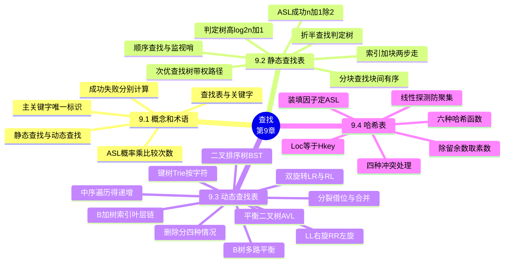

# 第九章 查找

> **本章主线**：数据被看作**集合**逻辑结构，本章回答"怎么找得快"——**9.1 概念**：查找表、**关键字**（主关键字唯一标识 / 次关键字不唯一）、静态与动态查找、**ASL** $=\sum_{i=1}^{n}p_ic_i$（等概率时 $p_i=1/n$，成功与失败**分别**计算）→ **9.2 静态查找表**（只查不改）：**顺序查找**（**监视哨**把每次循环 2 次比较减半，$ASL_s=(n+1)/2$、$ASL_f=n+1$）→ **折半查找**（仅限**有序表**，$mid=\lfloor (low+high)/2 \rfloor$，判定树高 $h=\lfloor\log_2 n\rfloor+1$，$ASL\approx\log_2(n+1)-1$）→ **静态树表**（非等概率：**高概率者做根**，带权内路径长度 $PH=\sum w_ih_i$ 最小，暴力构造 $O(4^n/n^{1.5})$ → 实用**次优查找树**只差 1%~2%）→ **分块查找**（**块间有序、块内无序** + 索引表两步走，$ASL=\frac{b+1}{2}+\frac{s+1}{2}$，$s=\sqrt{n}$ 时最优 $\sqrt{n}+1$）→ **9.3 动态查找表**（边查边增删）：**二叉排序树 BST**（左小右大、**中序遍历得递增序列**，最好 $\log_2(n+1)-1$、单支树 $(n+1)/2$、有序输入**退化** $O(n)$）→ **平衡二叉树 AVL**（平衡因子 $|bf|\le 1$，**LL/RR 单旋、LR/RL 双旋**，树高 $\le 1.44\log_2 n$）→ **B-树**（$m$ 阶**多路平衡**树，为外存**减少访外**，溢出**分裂**、删后**借位/合并**，$h\le\log_{\lceil m/2\rceil}\frac{n+1}{2}+1$）→ **B+树**（非叶结点只做**索引**、全部关键字沉到**叶层并链接**）→ **键树/Trie**（把关键字拆成**字符**逐层比对）→ **9.4 哈希表**：$Loc(i)=H(key_i)$ **理想 $O(1)$ 不比较**——六种哈希函数（**除留余数法的 $p$ 取素数**）+ 四种冲突处理（开放定址 / 再哈希 / 链地址 / 公共溢出区）+ **装填因子** $\alpha=n/m$ 决定 ASL 与空间的博弈。
> 一句话版本：**查找就是比较次数的战争**——顺序查找靠**监视哨**省一半比较，折半查找靠**有序**把比较压到 $\log_2 n$，分块查找用**索引**夹在中间，BST 让比较路径自己**长平衡**（AVL 旋转、B-树分裂），哈希表干脆**不算比较**、用 $H(key)$ 直接算出地址，代价是**冲突**和装填因子 $\alpha$ 的平衡。



---

## 9.1 概念和术语

### 9.1.1 查找表与关键字

- **查找表**：同一类型的**记录**（数据元素）的集合。元素之间只存在**松散的关系**（逻辑结构可认为是**集合**）；为提高查找效率，可在元素之间人为地附加某种确定的关系（如有序、索引、树形层次）。
- **关键字**：记录（数据元素）中的某个**数据项**的值。
    - **主关键字**：该关键字可以**唯一地**标识一个记录（如学号、身份证号）。
    - **次关键字**：该关键字**不能唯一**标识一个记录（如姓名、性别）。
- **查找（检索）**：给定某个值，在查找表中确定**是否存在**一个记录，其关键字等于给定值。
- **查找成功 / 查找不成功**：查找表中**存在 / 不存在**满足查找条件的记录。
- **内查找 / 外查找**：整个查找过程都在**内存**中进行 / 查找过程中需要**访问外存**，数据元素需分段读入内存。

### 9.1.2 静态查找表与动态查找表

| 对比项 | 静态查找表 | 动态查找表 |
|---|---|---|
| 表是否变化 | 仅以查询为目的，**不改动**表中数据 | 查找过程中同时**插入**不存在的记录、**删除**已存在的记录 |
| 典型结构 | 顺序表、有序表、分块（索引顺序）表 | 二叉排序树、平衡二叉树、B-树、哈希表 |
| 适用场景 | 数据**稳定**、变动很少 | **频繁**进行插入、删除 |
| 本章对应 | 9.2 节 | 9.3、9.4 节 |

> 口诀：**静不动、动会变——静态只查表不动，动态边查边增删**；数据稳定选顺序与折半，频繁增删上树表与哈希。

查找表上的基本操作有 6 项：

1. 查找表初始化：`InitTable(&T)`
2. 销毁查找表：`DestroyTable(&T)`
3. 检索某个特定的数据元素：`SearchTable(T, key)`
4. 插入一个数据元素：`InsertTable(&T, e)`
5. 删去某个数据元素：`DeleteTable(&T, key)`
6. 遍历：`TraverseTable(T, Visit())`

静态查找表只用到第 3 项，动态查找表 3、4、5 项都会用到；查找算法的优劣直接影响这几个操作的整体效率。

### 9.1.3 平均查找长度 ASL

**ASL（Average Search Length，平均查找长度）**是衡量查找方法时效的度量：为确定记录在查找表中的位置，需将**关键字与给定值的比较次数**的期望值。

$$ASL=\sum_{i=1}^{n}p_ic_i$$

- $n$：记录的个数。
- $p_i$：查找第 $i$ 个记录的概率；**不特别声明时认为等概率**，即 $p_i=1/n$。
- $c_i$：找到第 $i$ 个记录所需的**比较次数**。
- 查找**不成功**时的 ASL：按查找失败时**实际的比较次数**计算。
- 在无法确定查找成功与查找不成功的概率时，**分别计算和讨论**两种 ASL。

> 口诀：**ASL = Σ(概率 × 比较次数)，等概率时 p 取 1/n；成功失败两本账，谁也别替谁算**。

本章约定关键字类型为整型：

```c
typedef int KeyType;
typedef struct {
    KeyType key;
    /* 其它数据域 */
} ElemType;
```

---

## 9.2 静态查找表

**静态查找表**：对查找表的查找仅以查询为目的，不改动查找表中的数据；数据稳定、变动很少时使用。

### 9.2.1 顺序表的查找

顺序查找（线性查找）从表的一端开始，逐个把记录的关键字与给定值比较。【算法9-1(a)】给出最直观的实现，查找表数据存放在 `data[1]` 至 `data[n]` 中，找到返回下标，否则返回 0：

```c
int Seq_Search_1(datatype data[], keytype kx, int n)
{
    int i = 1;
    while (i <= n && data[i].key != kx)
        i++;            /* 从表头端向后查找 */
    if (i > n)
        return 0;
    else
        return i;
}
```

每次循环要做**两次比较**（`i<=n`、`data[i].key!=kx`）和一次关系运算，稍加修改可使比较减少一半——**设置监视哨**。

#### 监视哨（哨兵）技巧

把给定值（被查找值 key）放在**第 0 个记录**处，然后**从后向前**查找，直到找到所查记录为止，找不到则返回 0。记录 0 像**哨兵**一样看守查找表下界，不会越界，**无需越界检查**：

```c
int Seq_Search_2(SSTable ST, KeyType key)
{
    ST.elem[0].key = key;                   /* 监视哨 */
    for (i = ST.length; ST.elem[i].key != key; i--)
        ;                                   /* 从后向前查找 */
    return i;                               /* 找到返回下标，失败返回 0 */
}
```

对应的存储结构定义（下标 0 留作哨兵位）：

```c
typedef struct {
    ElemType *elem;     /* elem[0..length]，0 号作监视哨 */
    int length;         /* 当前表长 */
} SSTable;
```

[程序设计技巧] **设置监视哨**：查找时每一步不必检测位置是否越界，把每轮 2 次比较减为 1 次，提高算法效率。若用链式存储，哨兵应放在**表尾**（这样从后向前查找不需要判空）；为避免每一步的越界检测，配合**单循环链表或双循环链表**为好——哨兵即"绕回表头"的那个接点。

#### 性能分析与算法特点

- **空间**：只需一个辅助空间（0 号哨兵位）。
- **时间**——设表中各记录查找概率相等：

$$ASL_s(n)=\sum_{i=1}^{n}p_ic_i=\frac{1+2+\cdots+n}{n}=\frac{n+1}{2}$$

- 查找**不成功**时：每个元素都要比较、再加一次哨兵比较，$ASLf=n+1$。

- **算法特点**：
    - 算法简单，对表中元素**排列顺序无任何要求**。
    - $n$ 很大时效率较低（比较次数与 $n$ 成**线性**关系）。
    - 改进措施：**非等概率**查找时，把查找概率高的记录排在表前部（如汉字输入法的同音字选择列表）。
    - 逐个查找的方法同样适用于**链表**表示的静态查找表。

### 9.2.2 有序表的查找

**有序表**：满足 $r[i].key \le r[i+1].key$（$1 \le i < n$）的查找表。有序后可以用更聪明的办法。

#### 有序表上的顺序查找

除了哨兵，还可以利用有序表中**大于或小于 key 的 $r[i]$** 起到哨兵作用：

1. 从前向后查找，哨兵设在尾部，当 $r[i] \ge key$ 时即可结束；
2. 从后向前查找，哨兵设在头部，当 $r[i] \le key$ 时即可结束。

```c
int seqsearch(sstable R, keytype K)
{
    R.elem[0].key = K;
    for (i = R.length; R.elem[i].key > K; i--)
        ;
    if (R.elem[i].key == K)
        return i;
    else
        return 0;
}
```

#### 折半查找（对半查找 / 二分查找）

**思想**：给定值与**中间位置**的记录比较——相等则成功；给定值更小则在**前半子表**继续折半，更大则在**后半子表**继续折半；若子表**上界小于下界**（`low > high`），则查找失败。前提是**顺序存储的有序表**。

非递归算法：

```c
int Search_Bin(SSTable ST, keytype key)
{
    low = 1;
    high = ST.length;               /* 置区间初值 */
    while (low <= high)
    {
        mid = (low + high) / 2;
        if (key == ST.elem[mid].key)
            return mid;             /* 找到待查元素 */
        else if (key < ST.elem[mid].key)
            high = mid - 1;         /* 在前半区间查找 */
        else
            low = mid + 1;          /* 在后半区间查找 */
    }
    return 0;                       /* 表中不存在待查元素 */
}
```

递归算法（递归出口 `low > high`，否则对前半 `low..mid-1` 或后半 `mid+1..high` 递归）：

```c
int Search_Bin(SSTable ST, keyType key, int low, int high)
{
    if (low > high)
        return 0;                   /* 查找不到时返回 0 */
    mid = (low + high) / 2;
    if (key == ST.elem[mid].key)
        return mid;
    else if (key < ST.elem[mid].key)
        return Search_Bin(ST, key, low, mid - 1);   /* 前半部 */
    else
        return Search_Bin(ST, key, mid + 1, high);  /* 后半部 */
}
```

#### 判定树与性能分析

**判定树**：描述折半查找过程的二叉树——内结点对应比较成功的记录，**外结点**（叶子）对应查找失败的区间。树高与完全二叉树性质 4 相同：

$$h=\lfloor \log_2 n \rfloor + 1$$

成功查找时的平均查找长度（等概率，$j$ 为层次）：

$$ASL_s=\sum_{j=1}^{h}j\cdot 2^{j-1}=\frac{(h-1)\cdot 2^h+1}{n}\approx \log_2 n - 1 \quad (n>50)$$

例：$n=11$ 时 $ASL_s=(1\times1+2\times2+3\times4+4\times4)/11=3$。

查找不成功时的查找长度为 $h-1$ 或 $h$ 次。判定树中关键字比较的次数不超过树高，故折半查找时间复杂度为 $O(\log_2 n)$。

**【题目】** 对有序表 `05 13 19 21 37 56 64 75 80 88 92`（下标 1~11）：(1) 用折半查找求 $K=21$ 和 $K=85$，写出每一步的 `low/high/mid`；(2) 画出（描述）判定树并求成功查找的 $ASL_s$ 与查找不成功时的比较次数。

**【解题步骤】**

1. **$K=21$**：初值 `low=1, high=11, mid=6`（值 56）→ 21<56，`high=5`；`mid=3`（值 19）→ 21>19，`low=4`；`mid=4`（值 21）→ **相等，查找成功**，比较 3 次。
2. **$K=85$**：`mid=6`（56）→ 85>56，`low=7`；`mid=9`（80）→ 85>80，`low=10`；`mid=10`（88）→ 85<88，`high=9`；此时 `low=10 > high=9`，**查找失败**，共比较 3 次（失败区间为 (80,88) 的外结点）。
3. **判定树**：以 `mid=(low+high)/2` 逐层分裂——根为 56，左子 19、右子 80，再下层为 13、37、64、92……共 4 层，$h=\lfloor\log_2 11\rfloor+1=4$。
4. **ASL 计算**：第 1 层 1 个、第 2 层 2 个、第 3 层 4 个、第 4 层 4 个关键字：

$$ASL_s=\frac{1\times1+2\times2+3\times4+4\times4}{11}=\frac{33}{11}=3$$

**【最终答案】** $K=21$：`1/11/6 → 1/5/3 → 4/5/4`，3 次比较成功；$K=85$：`1/11/6 → 7/11/9 → 10/11/10 → low>high`，3 次比较失败；判定树高 $h=4$；$ASL_s=3$，查找不成功比较 3~4 次（$h-1$ 或 $h$）。

**【一句话概括】** 折半查找 = 每次只跟**中间元素**比、直接砍掉一半区间，代价是表必须有序，收益是 $O(\log n)$ 与 $ASL\approx\log_2 n-1$。

#### 扩展：斐波那契查找与插值查找

- **斐波那契查找**：设记录数 $n=F_u-1$，给定值先与第 $F_{u-1}$ 个记录比较，决定在左段 $1\sim F_{u-1}-1$ 还是右段 $F_{u-1}+1\sim F_u-1$ 中查找，分割点由斐波那契数列给出。
- **插值查找**：关键字**均匀分布**时，用

$$i=\frac{key-r[L].key}{r[H].key-r[L].key}\cdot n$$

估取比较位置，平均性能在记录数较多时优于折半查找。

### 9.2.3 静态树表的查找

前面的有序表查找都假设**等概率**；若各记录查找概率不等，怎样查找效率更高？

- **问题出发点**：例——关键字 15/19/36/42/67，概率 0.1/0.2/0.1/0.4/0.2。按折半（根为 36）$ASL=2.3$；让**高概率的 42 做根**（19、67 次之，15、36 为叶）$ASL=1.8$。
- **两个原则**（非等概率下提高查找效率）：
    1. 最先访问的结点应是**访问概率最大**的结点；
    2. 每次访问应使结点两边尚未访问结点的**被访概率之和尽可能相等**。

**静态最优查找树**：查找性能最佳的判定树，性质为**带权内路径长度**之和 $PH$ 最小：

$$PH=\sum_{i=1}^{n}w_ih_i \quad (\text{与 ASL 成正比})$$

其中 $n$ 为结点个数（有序表长度），$h_i$ 为第 $i$ 个结点的层次，$w_i=cp_i$（$c$ 为常数，$p_i$ 为查找概率）。暴力求解需生成所有二叉查找树再取 $PH$ 最小者，复杂度 $O(4^n/n^{1.5})$，代价太大。

**次优查找树（nearly optimal search tree）**：$PH$ 近似最小，构造时间远小于最优树，查找性能只差 1%~2%（很少差 3% 以上）。构造步骤：

1. 对升序序列 $(r_l,\dots,r_h)$，计算每个位置的**权值差**

$$\Delta p_i=\Big|\sum_{j=l}^{i-1}w_j-\sum_{j=i+1}^{h}w_j\Big|$$

   取 $\Delta p_i$ 最小的 $r_i$ 作根；若相邻关键字权值更大，则以权值大的位置替代（调整）。
2. 递归处理左子序列 $(r_l,\dots,r_{i-1})$；
3. 递归处理右子序列 $(r_{i+1},\dots,r_h)$。

**简化计算**：设累计权值和 $sw_i=\sum_{j=1}^{i}w_j$（置 $sw_0=0$），则

$$\Delta p_i=|(sw_h+sw_{l-1})-sw_i-sw_{i-1}|$$

算一次存数组、反复使用。

例：关键字 A~I，权值 1,1,2,5,3,4,4,3,5 → $sw$：1,2,4,9,12,16,20,23,28 → $\Delta p_i$：[27,25,22,15,**7**] **0** [8,15,23] → 第 6 个（$\Delta p_6=0$）为根，再递归左右子树分别计算（右子树 $\Delta p$：8,1,7；左子树 $\Delta p$：11,9,6,1,9）。

**查找步骤**：将根作为当前结点——指针为空返回 NULL；$K=key$ 返回该结点；$K>key$ 转右孩子、$K<key$ 转左孩子，循环直至成功或失败。**比较次数不超过树的深度**，$O(\log_2 n)$。

### 9.2.4 索引顺序表的查找（分块查找）

**分块查找**：分块有序——分成若干子表，要求**每个子表中的数值都比后一块中的数值小**（块内可以无序），即"**块间有序、块内无序**"。把各子表的**最大关键字**与**起始地址**构成有序的**索引表**。

```c
typedef struct {
    KeyType maxkey;     /* 本块最大关键字 */
    int stadr;          /* 本块起始地址 */
} indexItem;            /* 索引项 */
typedef struct {
    indexItem *elem;
    int blocknum;       /* 块数 */
} indexTable;           /* 索引表 */
```

**分块查找两步**：

1. 对**索引表**用折半查找或顺序查找（索引表有序），确定待查关键字所在的**块**；
2. 在已确定的**块内**用顺序查找（块内无序）。

**性能分析**：设 $b$ 为索引表长度，$s$ 为块中记录个数（$n=b\cdot s$）。

- 顺序查索引 + 顺序查块：

$$ASL_{bs}=\frac{b+1}{2}+\frac{s+1}{2}=\frac{n/s+s}{2}+1$$

  当 $s=\sqrt{n}$ 时 $ASL_{bs}$ 取最小值 $\sqrt{n}+1$。
- 折半查索引 + 顺序查块：$ASL_{bs}=[\log_2(b+1)-1]+\frac{s+1}{2}\approx \log_2(n/s+1)+s/2$。
- **分块查找的效率介于顺序查找和折半查找之间**；

$$\text{索引顺序查找 ASL}=\text{查找"索引"的 ASL}+\text{查找"块"的 ASL}$$

**优缺点与适用**：

- 优点：**插入和删除比较容易**，无需大量移动（只动相应块）；线性表既要求快速查找又允许少量动态变化时适用。
- 缺点：增加一个**索引表**的存储空间，并需对初始索引表排序。
- 实用中各块大小不一定相等；可在每块后**预留空闲位置**以便插删；主表可集中顺序存储、按块分别顺序存储，也可用单链表（或每块一个单链表）。

#### 静态查找四法对比

| 方法 | 适用条件 | 核心操作 | ASL（等概率） | 时间复杂度 |
|---|---|---|---|---|
| 顺序查找 | 任意表（无序也可） | 逐个比较 + 监视哨 | $(n+1)/2$ | $O(n)$ |
| 折半查找 | **有序**顺序表 | 每次与中间元素比较 | $\approx\log_2 n-1$ | $O(\log n)$ |
| 分块查找 | **块间有序**、块内可无序 | 索引定位块 + 块内顺序 | 最优 $\sqrt{n}+1$ | $O(\sqrt{n})$ 量级 |
| 静态树表 | 关键字**概率不等** | 高概率做根的判定树 | 受概率分布影响 | $O(\log n)$ |

> 口诀：**无序只能顺序扫，有序才能折半找；块间有序先索引，概率不等树表挑**——效率从 $n$ 到 $\log n$ 到 $\sqrt n$，代价是一个比一个挑食。

---

## 9.3 动态查找表

**动态查找表**：在查找的过程中同时**插入**不存在的记录，或**删除**某个已存在的记录——频繁插删的查找表用树形结构维护。

### 9.3.1 二叉排序树 BST

**定义**：二叉排序树（二叉查找/搜索树，BST）或者是空树，或者是满足如下性质的二叉树：

1. 若其**左**子树非空，则左子树上所有结点的值**均小于**根结点的值；
2. 若其**右**子树非空，则右子树上所有结点的值**均大于**根结点的值；
3. 其左右子树本身又各是一棵二叉排序树。

**性质**：**中序遍历**一棵二叉排序树，得到一个**关键字递增**的有序序列（如 45/24,53/12,28,90 中序得 12,24,28,45,53,90）。

二叉排序树是**动态**查找树：查找失败时把给定值**插入**树中，树在查找过程中动态生成。例：请求序列 {54,32,54,25,73,25,94,68,32,73,9}——失败则插入、成功则返回结点指针；从空树出发反复调用插入即可**生成**树，如 {10,18,3,8,12,2,7} 依次插入。

通常取**二叉链表**作存储结构。三种操作代码如下。

**1) 查找（只查不插，递归）**——找到返回结点地址，否则返回空：

```c
BiTree SearchBST(BiTree T, KeyType key)
{
    if ((!T) || EQ(key, T->data.key))
        return T;
    else if (LT(key, T->data.key))
        return SearchBST(T->lchild, key);
    else
        return SearchBST(T->rchild, key);
}
```

带回双亲版本（`f` 指向当前结点的双亲，初始为 NULL；失败时 `p` 指向**查找路径上最后一个结点**——即未来插入的位置）：

```c
bool SearchBST(BiTree T, KeyType key, BiTree f, BiTree &p)
{
    if (!T) { p = f; return FALSE; }       /* 失败：p 指向双亲 */
    else if (EQ(key, T->data.key)) { p = T; return TRUE; }
    else if (LT(key, T->data.key))
        return SearchBST(T->lchild, key, T, p);
    else
        return SearchBST(T->rchild, key, T, p);
}
```

**非递归**版本用工作指针 `p` 与跟踪双亲的 `q` 循环下移；失败时 `p = q` 返回最后一个结点。

**2) 插入**——先查找，不存在才建新结点挂上（小则挂左、大则挂右）：

```c
bool InsertBST(BiTree &T, ElemType e)
{
    if (!SearchBST(T, e.key, NULL, p)) {
        s = (BiTree)malloc(sizeof(BiTNode));
        s->data = e;
        s->lchild = s->rchild = NULL;
        if (!T)  T = s;                    /* 空树：s 即根 */
        else if (LT(e.key, p->data.key))
            p->lchild = s;                 /* 小则插到 p 左 */
        else
            p->rchild = s;                 /* 大则插到 p 右 */
        return TRUE;
    } else
        return FALSE;                      /* 已存在 */
}
```

**3) 查找并插入（合并版）**：查找成功 `p` 指向该结点；失败则**就地插入**，`p` 指向新结点（空树时先创建根）。

**4) 删除**——被删除结点 `*p` 分四种情况：

| 情况 | 结构特征 | 处理方法 |
|---|---|---|
| （1）叶子结点 | 无左右孩子 | 修改其**双亲指针**置空即可 |
| （2）只有左孩子 | 左子树非空、右空 | 用 **p 的左子树**代替以 p 为根的子树 |
| （3）只有右孩子 | 右子树非空、左空 | 用 **p 的右子树**代替以 p 为根的子树 |
| （4）两个孩子 | 左右子树均非空 | 找 p 的**中序前驱（或后继）结点 q**，q 的数据**复制给 p**，再**递归处理 q 的删除** |

> 口诀：**叶子删指针、单支顶上来、双孩找后继（前驱）顶替它再删那个"替死鬼"**——永远只让"最多一个孩子"的结点真正离场。

#### 性能分析

- 等概率查找成功时 $ASL=\sum c_i/n$：
    - **最差**（单支树，退化成链）：$(n+1)/2$；
    - **最好**（类似折半查找的判定树）：$\log_2(n+1)-1$；
    - 随机：$\le 2(1+\frac{1}{n})\ln n$（P232 公式 9-20）。
- **退化风险**：关键字**有序出现**时构造出"退化"的单支二叉排序树，树深为 $n$，各种操作代价 $O(n)$。**避免方法：采用平衡二叉树**。

### 9.3.2 平衡二叉树 AVL

**定义**：或者是空树，或者是满足如下性质的**二叉排序树**：

1. 它的左、右子树的**高度之差的绝对值不超过 1**；
2. 其左右子树本身又各是一棵平衡二叉树。

**平衡因子**：该结点的**左子树高度减去右子树的高度**（$bf=h_L-h_R\in\{-1,0,1\}$）。由两位前苏联数学家 Adel'son-Vel'sii 和 Landis 于 1962 年提出（AVL）。注意：**平衡二叉树不一定是理想的最矮状态**。

**存储结构**——在二叉链表上增加平衡因子域：

```c
typedef struct BSTNode {
    ElemType data;
    int bf;                     /* 平衡因子 */
    struct BSTNode *lchild, *rchild;
} BSTNode, *BSTree;
```

**查找**：方法同二叉排序树。

**插入与平衡旋转**：插入后沿路径回溯，**找到离插入结点最近且 |bf|>1 的祖先**——以它为根的子树是可能不平衡的**最小树**，重新平衡的范围就局限于这棵树。四种旋转：

| 类型 | 失衡特征（插入位置） | 旋转操作 | 一句话 |
|---|---|---|---|
| LL 型 | 插在左孩子的**左**子树 | 单向**右旋**（顺时针一次） | 左左→右转 |
| RR 型 | 插在右孩子的**右**子树 | 单向**左旋**（逆时针一次） | 右右→左转 |
| LR 型 | 插在左孩子的**右**子树 | 先对左孩子**左旋**、再**右旋** | LR = RR + LL |
| RL 型 | 插在右孩子的**左**子树 | 先对右孩子**右旋**、再**左旋** | RL = LL + RR |

> 口诀：**单旋看两代同向（LL 右旋、RR 左旋），双旋先反后正（LR 先左后右、RL 先右后左）**——LR is RR followed by LL，RL is LL followed by RR。

**生成示例**：按 (90,60,20,50,40,30,10,110,100,70,120,80) 顺序建立平衡二叉排序树，过程中依次触发 **LL → RL → LL → RL → RR → RL** 旋转，最终树形为：

```text
        60
     40     90
   20   50 70   110
  10 30    80 100  120
```

等概率查找成功 $ASL=(1\times1+2\times2+4\times3+5\times4)/12=37/12\approx3.08$。

**删除**（思路同插入）：若被删结点 q 有两个孩子，先用其中序前驱/后继结点 r 取代它、删除 r；若平衡性被破坏，用单旋/双旋恢复。

**性能**：$n$ 个结点的 AVL 树最大深度 $h=\log_a(\sqrt5(n+1))-2$，其中 $a=(1+\sqrt5)/2$——最坏情况下 AVL 树高约为 $1.44\log_2 n$（完全平衡树约 $\log_2 n$），**接近最优**，平均查找长度与 $\log_2 n$ 同数量级。

**红黑树（Red-Black Tree）（拓展）**：自平衡二叉查找树，特化的 AVL——左右子树高差**可能大于 1**，不是严格意义上的平衡二叉树，但**平衡代价更低、平均统计性能强于 AVL**，查/插/删均 $O(\log n)$。五条性质：① 每个结点红或黑；② 根为黑；③ 所有叶子（NULL 外部结点）为黑；④ 红结点的两个孩子都黑（路径上无连续红）；⑤ 任一结点到其每个叶子的路径包含**相同数目的黑结点**——因此最长路径不多于最短路径的两倍。插入后通过**着色（color flip）与旋转**恢复性质（插入至多 2 次旋转、删除至多 3 次）；应用：C++ STL set/map/multimap、Linux CFS 进程调度、Java HashMap/TreeMap、epoll、MySQL InnoDB。

### 9.3.3 B-树

**背景**：海量数据存放在外存，不可能一次全部调入内存，主要矛盾是**减少访外次数**（磁盘受机械运动制约）。1970 年由 R. Bayer 和 E. McCreight 提出用 B-Tree 作为索引组织文件。例：10 万条记录用平衡二叉树做索引，平均需访问外存 $\log_2100000\approx17$ 次，最坏 $1.44\log_2n\approx24$ 次；$n=2^{30}$ 时 AVL 树高 30~43、红黑树 30~60——不可接受。**优化方向：降低树的高度，把二叉树改成多叉树（m-way）**。m 路查找树：每个内部结点至多 $m-1$ 对关键字、$m$ 个孩子（$m=2$ 即二叉排序树）。

#### 定义

一棵 **m 阶 B-树**（B 即 balanced，平衡的**多路**查找树）或为空树，或为满足下列特性的 m 叉树：

1. 树中每个结点**最多有 m 棵子树**（至多 $m-1$ 个关键字）；
2. 若根结点不是叶子结点，则**最少有两棵子树**；
3. 除根之外的所有非叶子结点**最少有 $\lceil m/2 \rceil$ 棵子树**；
4. 所有非叶子结点包含 $(n, A_0, K_1, A_1, K_2, \dots, K_n, A_n)$：$n$ 为关键字个数，$A_i$ 为指向子树的指针，$K_i$ 为关键字，$n$ 个关键字把指针分成 $n+1$ 段；
5. **所有叶子结点在同一层上，且不带信息**（称为**失败结点 F**，实际并不存在——空值保存在 $h-1$ 层结点的指针域中，引入目的是便于分析性能）。

关系：2 阶 B 树 = 二叉排序树；**2-3 树 = 3 阶**；**2-3-4 树 = 4 阶**；3-4-5 树 = 5 阶。

**存储定义**：

```c
#define m 3                          /* B-树的阶 */
typedef struct BTNode {
    int keynum;                      /* 关键字个数 */
    struct BTNode *parent;           /* 双亲指针 */
    KeyType key[m+1];                /* 0 号未用 */
    struct BTNode *ptr[m+1];         /* 0 号未用，子树指针 */
    Record *recptr[m+1];             /* 0 号未用，磁盘记录地址 */
} BTNode, *BTree;

typedef struct {
    BTNode *pt;                      /* 所在结点 */
    int i;                           /* 成功：第 i 个关键字等于 key；失败：在 i 与 i+1 之间 */
    int tag;                         /* 1 成功，0 失败 */
} Result;
```

**用途**：内存装不下全部记录时，在磁盘等直接存取设备上组织**动态查找表**——根结点可常驻内存，其余非叶结点放在外存、每结点作为一个读取单位（页/块）；选较大阶次 $m$ 降低树高、减少外存访问。信息组织两种方式：记录其它信息与关键字一起存；或存**外存地址（页指针）**起索引作用。

#### 查找

从根结点开始：(a) 在当前结点 `*p` 中**顺序或折半**查找——若 `key[i]=K` 成功，返回 (p,i,1)；否则确定 $key[i]<K<key[i+1]$ 的 $i$；(b) 若 `ptr[i]` 为空则失败，返回 (q,i,0)；(c) `DiskRead(p->ptr[i])` 读入子结点，转 (a)。

```c
Result SearchBTree(BTree T, KeyType K)
{
    p = T; q = NULL; found = FALSE; i = 0;
    while (p && !found) {
        i = Search(p, K);            /* 使 key[i] <= K < key[i+1] */
        if (i > 0 && p->key[i] == K)
            found = TRUE;
        else { q = p; p = p->ptr[i]; }
    }
    if (found) return (p, i, 1);
    else       return (q, i, 0);
}
```

#### 插入（分裂）

关键字总是插在**最靠近叶子的非终端结点**中：若插入后 `keynum <= m-1` 则完毕；否则以 **key[⌈m/2⌉] 为划分点**把结点**分裂**为两个——居中关键字**上送**父结点，对上一层同样处理，直至每个结点关键字数均不超过 $m-1$。第一个关键字的插入也从空树开始。若分裂一路传到根仍需分裂，则**构造新根，B-树增高一层**。

例（m=4）：插入 K=47 → 结点 `41 43 47` 变 `41 43 45 47`；再插 K=45 后该结点关键字数达 4 溢出 → 分裂，`43` 上送、左右各留两个关键字；上层继续可能连锁分裂直至根。

算法步骤：(a) 查找 K，失败则定位到最低层非叶结点 (q,i) 插入 [K, ^]；(b) keynum+1，未溢出 (`keynum<m`) 则写盘返回；(c) 否则以 key[⌈m/2⌉] 分裂为 q 与 q1，写盘；(d) 读父结点，把 (key[⌈m/2⌉], q1) 插入父结点，以父为当前结点转 (b)。

**生成**：从空树起逐个插入。

#### 删除

(a) 查找 K，未找到则返回；否则定位到结点 q 且 `q->key[i]=K`；(b) 若 q **不是最下层非叶结点**，则查 `ptr[i]` 子树的**最小关键字 x**（中序后继）替换 `key[i]`，转化为删除最下层结点上的关键字（如 m=4 删 49 → 用 49 的后继替换）；(c) 删除最下层关键字分三种情况：

1. 所属结点关键字个数 $>\lceil m/2\rceil-1$：**简单删除**；
2. 关键字个数 $=\lceil m/2\rceil-1$，其**左或右兄弟**关键字个数 $>\lceil m/2\rceil-1$：向兄弟**借**一个关键字（双亲关键字下移补位、兄弟最小/最大关键字上移）；
3. 关键字个数 $=\lceil m/2\rceil-1$，左右兄弟也都是 $\lceil m/2\rceil-1$：与兄弟**合并**——双亲关键字下移并入，若双亲因此空了则**向上递归**继续借/合并（可能一路到根，删掉空根、树高减一）。

> 口诀：**删非叶先找后继顶上来；删底层三步走——够删就删、兄弟够借就借、兄弟也穷就合并，父空向上传，根空降一层**。

#### 高度与性能

**定理**：任一含 $n>0$ 个关键字的 $m$（$m>2$）阶 B-树，树高

$$h\le \log_t\frac{n+1}{2}+1,\quad t=\lceil m/2\rceil$$

决定时间开销的两个因素：**外存访问次数** $O(h)=O(\log_t n)$ 与 **CPU 结点内比较定位** $O(hm)$ 或 $O(h\log_2 m)$——**前者起主导作用**。故外存使用的 B-树 $m$ 越大树高越小，但要兼顾一个结点的磁盘读取单位（页/块）；**仅在内存中使用必须取较小的 m，通常取最小值 m=3**。最坏搜索时间：$(a\cdot k + b\cdot m + c\cdot\log_2 m)\cdot h$（$a$ 扇区读入时间、$k$ 结点扇区数、$b$ 写入单位时间、$c$ 内存查找单位时间）——$m$ 太小则 $h$ 大、$m$ 太大则结点内操作慢，存在最优 $m$（如某硬件下 m≈50 附近）。

### 9.3.4 B+树

**B+树是 B-树的变形树**，广泛应用在文件系统（如 IBM 数据库的 VSAM 文件系统）。m 阶 B+树与 B-树的不同：

1. 有 $n$ 棵子树的结点中有 **$n$ 个关键字**（B-树是 $n-1$ 个）；
2. **非叶结点可以看成索引部分**：$A_i$ 是第 $i$ 个子结点指针，$K_i$ 是第 $i$ 个子结点的**最大（或最小）关键字**；
3. **所有叶子结点包含全部关键字信息**及指向记录的指针，且叶子结点按关键字**从小到大顺序链接**——支持顺序查找。

**结点结构**：非叶 $(A_1,K_1,\dots,A_n,K_n)$ 为**索引集**；叶结点为**数据集**（关键字 + 指向记录的指针）。

**基本运算**：

- **查找**——方式 1：从根结点沿**索引集**逐层向下直到叶子；方式 2：从最小关键字开始沿**叶子链**顺序查找。
- **插入**：**仅在叶子结点**进行，关键字个数大于 $m$ 则分裂。
- **删除**：**仅在叶子结点**进行，关键字个数小于 $\lceil m/2\rceil$ 时需合并。

#### B-树与 B+树对比

| 对比项 | B-树 | B+树 |
|---|---|---|
| 关键字位置 | 非叶、叶**都可**存关键字 | 关键字**全部在叶子**，非叶只是索引 |
| 子树与关键字数 | $n$ 个关键字、$n+1$ 棵子树 | $n$ 棵子树、$n$ 个关键字 |
| 非叶结点内容 | $(n,A_0,K_1,A_1,\dots,K_n,A_n)$ | $(A_1,K_1,\dots,A_n,K_n)$，$K_i$ 为子结点最大/最小值 |
| 查找方式 | 任意结点命中即成功 | 根→叶索引查找，或**沿叶子链**顺序查找 |
| 插入/删除 | 可在任意层结点，可能向上传播 | **仅在叶子**结点进行 |
| 范围查找 | 不支持 | 叶子有序链表**天然支持**（数据库索引首选） |

> 口诀：**B-树关键字"随遇而安"，B+树"全下沉到叶子、非叶只当路标"**——所以 B+树能顺着叶子链扫区间，这正是数据库都用 B+树的原因。

### 9.3.5 键树（数字查找树 / 字符树）

**概念**：将关键字**分解为字符**的多叉树——每个结点只代表关键字中的**一个字符**，**叶结点**表示字符串结束符（如 `$`）并含指向该关键字记录的指针；从根到叶路径上所有字符连起来就代表一个关键字。约定：**键树是有序树**；**结束符小于任何字符**。例：{beg, bell, big, log, long, nil}——根分 b/l/n 三支，逐字符下探；数值集合 {6,71,78,99,235,243,467} 可按纯字符串或整型两种方式建树。

**存储与操作**：

1. **双链树**——以树的**孩子兄弟链表**表示，结点为 `(symbol, ptr, next)`：`symbol` 字符、`next` 兄弟指针；**leaf 型** `ptr` 指向记录、**nonleaf 型** `ptr` 指向孩子。
    - **查找** K[1..m]：从根出发沿 `next` 顺序找 `symbol==K[1]` 的结点，再沿 `ptr` 下一层找 K[2]……直至叶结点比较完。成功 $ASL=h(1+d)/2$（$d$ 为结点最大度）；失败时在第一个不匹配字符处终止（如 K='LIANG' 在 'U>A' 处终止并给出插入位置）。
    - **插入**：查找不成功时插入；**删除**：确认查找成功后删除——注意**结点只有一个孩子或它是叶结点时才可删除**（否则需分支压缩）。
2. **Trie 树**（源自 retrieval，检索）——以**多重链表**表示，主要应用于**信息检索**、支持快速模式匹配。若某结点到叶子的路径上每个结点都只有一个孩子，则把该路径**压缩成一个"叶子结点"**（存指向记录的指针）。分支结点：`num` 有用指针数 + `ptr[0..m]` 指针数组；叶子结点：`key` 关键字 + `recptr` 记录指针。**降低深度的途径**：选择合适的分割方式——前后交叉分割 / 取样。

---

## 9.4 哈希表

### 9.4.1 概述

**引例**：某市小学生信息系统，6 个年级共约 60 万学生、学号 = 入学年份+学校代码+班级代码+班内序号，数据可一次装入内存。可选：有序数组二分、索引顺序表、B-树、组合技术（按班分块+分级索引）。若**内存无限大**，直接 `[base + 学号 - 首个学号]*S` 存取——查找 $O(1)$，但空闲区浪费巨大；对学号**分段运算**压缩后空闲大大减少，仍是 $O(1)$——这正是哈希思想的雏形。

**基本思想**：在记录的**存储地址**和它的**关键字**之间建立**确定的对应关系** $Loc(r_i)=H(key_i)$（$H$ 为**哈希函数**），由关键字值**直接算出存储位置**；理想状态（无冲突）**不经过比较**，一次存取即得，$O(1)$，查找效率与元素个数 $n$ **无关**。

**术语**：

- **哈希表（散列表/杂凑表）**：按上述思想构造的、容纳按哈希地址存储记录的**有限连续地址空间**。
- **哈希函数**：记录的存储位置与关键字之间的确定对应关系 $Loc(r_i)=H(key_i)$。
- **冲突（collision）**：对 $key_i\ne key_j$ 且 $i\ne j$——① $H(key_i)=H(key_j)$；② 或 $H$ 值不同但 $key_i$ 占用了 $key_j$ 的存储位置。
- **同义词（synonym）**：$key_i\ne key_j$ 但 $H(key_i)=H(key_j)$ 的一组关键字（如 $H=key\bmod100$ 时 9 与 109）。注意：**冲突的两个关键字不一定是同义词**（情形 ②）。
- **哈希地址**：由设定的哈希函数和处理冲突方法共同确定的记录存储位置。
- **装填因子**：$\alpha=n/m$——表中记录数 $n$ 与表长 $m$ 之比。

**设计哈希表的三步**：① 明确地址空间范围（确定 $H$ 的值域）；② 选择合理的哈希函数（地址均在值域内、冲突尽量少）；③ 设定处理冲突的方法。

**查找流程**：给定 $k$ → 算 $H(k)$ → 该地址为空则**失败**；等于 $k$ 则**成功**；否则按**处理冲突方法**算 $H_i$ 继续。**建立（查询并插入）**流程相同，仅在空位处把 $k$ 存入。**删除**需结合冲突处理方法考虑（见开放定址的限制）。

**空值约定**：哈希表需引入一个**与任何 key 都不同**的特殊空值；若值域中找不到合适空值，就给元素增设 **tag 标签**字段标记"正常数据 / 空值"；表特别大时初始化很慢，可用 **bitmap** 等方法优化空值的初始化与判定。

**例**：元素序列 (14,23,39,9,25,11)，$Loc(k)=k\bmod100$——存入下标 9/23/39/14/25/11；查 9 → $H(9)=9$ 内容为 9 成功；查 311 → $H(311)=11$ 内容为 11 冲突，需继续；查 24 → $H(24)=24$ 内容为空，失败。

### 9.4.2 哈希函数的基本构造方法

**要求**：① 算法简单、运算量小，值域地址空间尽量小；② 计算结果尽量**均匀**，冲突尽量少。

| 方法 | 公式 / 要点 | 适用条件 |
|---|---|---|
| 直接定址法 | $H(key)=a\cdot key+b$（$a,b$ 常数） | 地址集合大小 == 关键字集合大小；**计算简单、冲突最少** |
| 数字分析法 | 取关键字的**若干数位**作地址（分析全体取分布均匀的位） | 能预先估计全体关键字每位上数字出现频度 |
| 平方取中法 | 取关键字**平方后的中间几位**（平方"扩大差别"、中间位受各位影响） | 关键字中每位都有某些数字**重复频度很高** |
| 折叠法 | 关键字**分割成位数相同的几部分**，各部分**叠加**（舍去进位）作地址 | 关键字的**数字位数特别多**（如 110108380428895 按间界移位叠加） |
| 除留余数法 | $H(key)=key\bmod p$，$p\le m$，**$p$ 最好取素数** | **最常用**；$p$ 含质因子会让含该因子的关键字扎堆（p=9 时 12,39,18,24,33,21 全映到 3 的倍数） |
| （伪）随机数法 | $H(key)=random(key)$（以关键字为种子） | 关键字**长度不等**时 |

> 口诀：**直接定址一对一、数字分析看数位、平方取中扩差别、折叠对付位数多、除留余数最常用、素数作模散得匀**——先估分布再选方法，均匀少冲突是唯一标准。

### 9.4.3 处理冲突的常用方法

1. **开放定址法（空缺编址法）**：$H_i=(H(key)+d_i)\bmod m$，$i=1,2,\dots,k$（$k\le m-1$），$m$ 表长、$d_i$ 增量序列。
    - **线性探测再散列**：$d_i=1,2,\dots,m-1$——缺陷：**聚集（堆积）**现象，非同义词也地址冲突；
    - **二次探测再散列**：$d_i=1^2,-1^2,2^2,-2^2,\dots,\pm k^2$（$k\le m/2$）——缺陷：**不易探查到整个散列空间**；
    - **伪随机探测再散列**：$d_i$ = 伪随机数序列。
    - **开放定址法不能直接执行删除操作**（删除会截断后面的探测链）——用 **tag 标记"占用过但已删除"**，即**懒惰删除（lazy deletion）**；tag 可用 bitmap 等位级结构省内存。
2. **再哈希法**：$H_i=RH_i(key)$，准备**一组哈希函数**依次使用——不易产生聚集，但增加计算时间。
3. **链地址法（拉链法）**：为**每个哈希地址建一个单链表**，存放所有同义词记录——无聚集问题、删除方便。
4. **建立公共溢出区法**：**基本表 + 溢出表**，基本表放不下的进溢出表。

> 口诀：**开放定址线性会堆积、二次探不全、伪随机折中；再哈希换函数不聚集费计算；拉链一地址一链最省心；溢出区兜底最简单**——记住：开放定址删不得，懒惰删除打 tag。

**线性 vs 二次探测示例**：关键字集合 {19,01,23,14,55,68,11,82,36}，$H(key)=key\bmod11$（表长 11）——各关键字 $H$ 值为 8,1,2,3,0,2,0,5,3；线性探测下 55 落 0、68 落 1?（冲突顺移）、11 冲突顺移、82 落 5、36 冲突顺移……冲突次数分别为 1,1,2,1,3(或2),…，二次探测则向正负两个方向跳开。

### 9.4.4 哈希表的建立、查找及其 ASL 分析

**【题目】** 关键字序列 (38, 59, 125, 168, 216, 719, 455, 20)，用 $H(key)=key\bmod10$ 顺序散列到 $HT[0..9]$，分别用**线性再探测**、**链地址**、**公共溢出区**三种方法解决冲突，画出散列表并求等概率下查找**成功**与**不成功**的 ASL。

**【解题步骤】**

1. **算初址**：38→8，59→9，125→5，168→8，216→6，719→9，455→5，20→0。
2. **线性再探测**（$d_i=1,2,\dots$）：168 与 38 撞 8 号 → 顺移到 9? 再撞 59 → 继续到 0；依次类推落位后表为 `0:20 1:? 2:? …` 逐格顺移填满（38→8, 59→9, 125→5, 168→顺移, 216→6, 719→顺移, 455→顺移, 20→0）。成功比较数 1+1+1+3+1+3+3+3=16。
3. **链地址**：8 号挂 38→168，9 号挂 59→719，5 号挂 125→455，6 号挂 216，0 号挂 20。成功比较数 1+1+2+1+1+2+1+2=11（8 个记录）。
4. **公共溢出区**：基本表放 38,59,125,168,216,719,455（溢出 20? 按基本表先占位、放不下进溢出区）→ 成功比较数 1+1+1+1+1+2+3+4=14。
5. **不成功 ASL**：线性探测按"从各起始地址出发探测到空位"的比较次数 $4+3+2+1+1+9+8+7+6+5=46$（10 个地址）；链地址按各链表长度 $1+2+1+2+2+10$? 逐桶累计 = 18；溢出区按各区 $5+1+1+1+1+5+5+1+5+5=30$。

**【最终答案】** 线性探测：$ASL_{成功}=16/8=2$，$ASL_{不成功}=46/10=4.6$；链地址法：$ASL_{成功}=11/8=1.375$，$ASL_{不成功}=18/10=1.8$；公共溢出区：$ASL_{成功}=14/8=1.75$，$ASL_{不成功}=30/10=3$。

**【一句话概括】** 同一批关键字、同一个 $H$，只因**冲突处理方式不同**，ASL 从 1.375 到 2 不等——**哈希表的效率一半在哈希函数，一半在冲突处理**；链地址法通常最稳，线性探测最怕堆积。

#### 装填因子与 ASL 的关系

一般情况下，$\alpha\downarrow$ → 冲突可能性 $\downarrow$ → ASL $\downarrow$，但**空间浪费 $\uparrow$**。各方法的 ASL 与 $\alpha$ 的关系（$m$ 表长、$n$ 记录数、$\alpha=n/m$）：

| 冲突处理方法 | 查找成功 ASL | 查找不成功 ASL |
|---|---|---|
| 线性探测再散列 | $\frac{1}{2}\left(1+\frac{1}{1-\alpha}\right)$ | $\frac{1}{2}\left(1+\frac{1}{(1-\alpha)^2}\right)$ |
| 伪随机探测再散列 | $-\frac{1}{\alpha}\ln(1-\alpha)$ | $\frac{1}{1-e^{-\alpha}}$ |
| 链地址法 | $1+\frac{\alpha}{2}$ | $\alpha+e^{-\alpha}$（≈ 各链长期望） |

> 口诀：**装填因子是个天平——α 小了省冲突费空间，α 大了省空间费比较**；线性探测最敏感（含 $1/(1-\alpha)^2$），链地址最温和（线性于 α）。

**哈希表的缺点**：① 冲突问题——$\alpha$ 接近 1 时产生大量冲突，性能下降；② 哈希表是**非排序表**，无法从中查出关键字在所有数据元素中的顺序。

**开放定址哈希表的实现（教材代码）**：

```c
int hashsize[] = { 997 /* , ... */ };
typedef struct {
    ElemType *elem;             /* 按 hashsize[sizeindex] 申请空间 */
    int count;                  /* 当前数据元素个数 */
    int sizeindex;              /* hashsize[sizeindex] 为当前容量 */
    float a;                    /* 填装因子上限 */
} HashTable;
#define SUCCESS    1
#define UNSUCCESS  0
#define DUPLICATE  -1
```

查找（`collision(p, ++c)` 按某个冲突解决方法算下一位置）与插入（超过装填上限或冲突过多则 `RecreateHashTable` **重建哈希表**）：

```c
Status SearchHash(HashTable H, KeyType K, int &p, int &c)
{
    p = Hash(K);                /* 求哈希地址 */
    while (!isNull(H.elem[p]) && !EQ(K, H.elem[p].key))
        collision(p, ++c);       /* 求下一探查地址 */
    if (EQ(K, H.elem[p].key))
        return SUCCESS;
    else
        return UNSUCCESS;
}

Status InsertHash(HashTable &H, ElemType e)
{
    if ((float(H.count + 1) / float(hashsize[H.sizeindex])) > H.a)
        return UNSUCCESS;        /* 装填因子超限 */
    int p = 0, c = 0;
    if (SearchHash(H, e.key, p, c) == SUCCESS)
        return DUPLICATE;        /* 已存在 */
    if (c < hashsize[H.sizeindex] / 2) {
        H.elem[p] = e;
        ++H.count;
    } else
        RecreateHashTable(H, e); /* 冲突过多，重建 */
    return OK;
}
```

链地址法的存储结构用 `HashNode { ElemType data; HashNode *next; }` 数组 + 指针（或动态分配的链表桶数组）。

**哈希方法的其他用途（拓展）**：① 对原始数据做**数字摘要**校验一致性（报文校验字段、MD5 校验）；② 分布式系统中把同源同的数据**快速分发**到同一设备；③ 海量数据**快速分类筛选**。工程实现：**CRC** 循环冗余校验（CRC-16/CRC-32 等多项式散列，软硬件实现）、Linux 内核 **jhash**、**Pearson 皮尔逊哈希**（不支持 shift/xor 时用码表）。

#### 各章查找方法 ASL 总表

| 查找方法 | 平均查找长度（等概率、成功） | 失败 ASL | 关键前提 |
|---|---|---|---|
| 顺序查找（监视哨） | $(n+1)/2$ | $n+1$ | 无 |
| 折半查找 | $\approx\log_2 n-1$ | $h-1$ 或 $h$ 次 | **有序**顺序表 |
| 分块查找 | 最优 $\sqrt{n}+1$（$s=\sqrt n$） | 索引段 + 块段之和 | 块间有序 |
| 静态树表（次优） | $O(\log n)$，逼近最优 | 同树高 | 概率已知 |
| 二叉排序树 | 最好 $\log_2(n+1)-1$，最坏 $(n+1)/2$ | 同树高 | 随机插入近似 $2\ln n$ |
| AVL 树 | 与 $\log_2 n$ 同数量级（高 $\le1.44\log_2 n$） | 同树高 | 平衡约束 |
| B-树（m 阶） | $O(\log_{\lceil m/2\rceil} n)$，访外 $O(h)$ 主导 | 外存同量级 | 外存组织 |
| 哈希表 | 理想 $O(1)$；链地址 $1+\alpha/2$ | 随方法（$\alpha$ 决定） | 哈希函数 + 冲突处理 |

> 口诀：**顺序 $\to$ 折半 $\to$ 分块 $\to$ 树表 $\to$ 哈希，比较次数从线性降到常数**——每降一级都多要一样东西：有序、索引、平衡、或者一个好的散列函数。

---

### 知识定位与框架衔接

- **前置知识**：第 2 章**线性表**（顺序表/链表是静态查找与键树的容器）、第 5 章**数组与广义表**（顺序存储、下标寻址是直接定址的底座）、第 6 章**树与二叉树**（BST/AVL/B-树全部建立在二叉树性质与遍历之上，中序遍历有序性是 BST 的灵魂）、递归思想（折半、BST、B-树操作全是递归）。查找章是**"树 + 递归 + 概率"的综合场**。
- **后续位置**：**第 10 章排序**（快速排序的划分、归并与折半查找同源；排序后的表才能用折半）；课程延伸——**数据库系统**（B+树索引、哈希索引是存储引擎的两大支柱）、**编译原理**（键树/Trie 做关键字识别）、**分布式与缓存**（一致性哈希、布隆过滤器）、**密码学与校验**（哈希函数、CRC）。
- **比喻**：**顺序查找像"挨个翻抽屉找东西"**；**折半查找像"先翻到字典中间，再决定往左还是往右"**；**分块查找像"先看目录页再翻章节"**；**BST 像"每次比较都把人分流到左右两队"**，AVL 是"不让任何一队排得太长"；**B-树像"图书馆的多层书架，一层能放一排书，层数少取书快"**；**哈希表像"信箱投递——按门牌号直接扔进去，唯一的烦恼是两个人共用一个信箱（冲突）"**。
- **灵魂问题**：**为什么折半查找必须有序、而顺序查找不用？为什么有序输入会让 BST 退化成链表（从而催生 AVL）？为什么 B-树的叶子必须在同一层（失败结点等高才有统一的失败代价）？为什么 B+树把关键字全赶到叶子（数据库为什么偏爱它）？为什么除留余数法的 p 要取素数？为什么开放定址法不能直接删除？**——六问各打通一节：9.2.2、9.3.1、9.3.3、9.3.4、9.4.2、9.4.3。

> **一句话总结本章**：**查找的全部斗争都是在"比较次数"上做文章——静态查找靠有序（顺序→折半→分块，$O(n)\to O(\log n)\to O(\sqrt n)$），动态查找靠结构自平衡（BST→AVL→B-树/B+树，把比较路径压到 $\log n$ 甚至更矮），哈希表干脆绕过比较用 $H(key)$ 直算地址搏一个 $O(1)$，代价是冲突与装填因子的权衡——第 6 章的树在这里长成了"会自己长、会分裂、会旋转"的查找树，第 10 章排序的折半思想也在这里扎根。**

---

## 课件 PDF

<iframe src="https://cognishelf.naimore3.workers.dev/课程笔记/大二上/数据结构/09查找/09查找.pdf" width="100%" height="800px"></iframe>

[打开 PDF](https://cognishelf.naimore3.workers.dev/课程笔记/大二上/数据结构/09查找/09查找.pdf)


