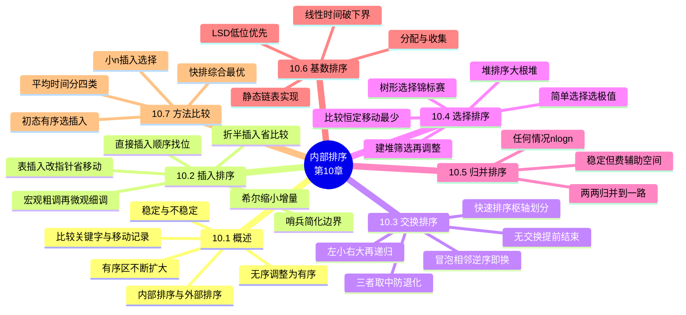

# 第十章 内部排序

> **本章主线**：**10.1 概述**——排序 = 把"无序"记录序列按关键字调整为**非递减/非递增**的有序序列；分类四把尺：**内部/外部**（是否全程在内存）、**稳定/不稳定**（相同关键字记录相对次序是否保持）、存储结构（顺序/链式/**地址排序**——只对"关键字+指针"辅助表物理重排）、辅助空间（**就地** $O(1)$ / 非就地）；评价三指标 = 时间（**比较关键字** + **移动记录**，分最好/最坏/平均）+ 空间 + **稳定性**；全部过程都是**有序区不断扩大、无序区不断缩小** → **10.2 插入排序**：**直接插入**（顺序找位 + 依次后移，正序 $C=n-1,M=0$、逆序 $C=\frac{(n+2)(n-1)}{2}$、平均 $\approx n^2/4$，稳定、就地）→ 改进：**折半插入**省比较、**2-路插入**与**表插入**省移动 → **希尔排序**按增量 $d_k$ 分组各作插入、增量缩至 1（宏观粗调 + 微观细调，均值约 $O(n^{1.3})$，**不稳定**、就地）→ **10.3 交换排序**：**冒泡**相邻逆序即换、一趟挤出一个极值、**无交换即提前结束**（稳定、$O(n^2)$）→ **快速排序**取**枢轴**一趟划分成"左小右大"两段再递归（平均 $kn\ln n$ **当前最优**、最坏 $O(n^2)$、辅助 $O(\log n)$、**不稳定**，**三者取中**防退化）→ **10.4 选择排序**：**简单选择**每趟扫描选最小换入有序区尾（比较恒 $\frac{n(n-1)}{2}$ 与初态无关、移动仅 $3(n-1)$，不稳定）→ **树形选择（锦标赛）** $O(n\log n)$ 但辅助空间多、要与 $\infty$ 多余比较 → **堆排序**：**大根堆**（$K_i\ge K_{2i},K_i\ge K_{2i+1}$）——建堆从 $\lfloor n/2\rfloor$ 逐个**筛选**，随后 $n-1$ 趟"堆顶换尾再调整"（全程 $O(n\log n)$、辅助 $O(1)$、不稳定，适合大文件）→ **10.5 归并排序**：$n$ 个长度 1 的子序列两两归并（**任何情况** $O(n\log n)$、**稳定**、代价辅助 $O(n)$，很少单独用于内部排序）→ **10.6 基数排序**：借**多关键字**思想（MSD/LSD），**分配 + 收集**替代关键字比较，链式静态链表实现——$O(d(n+rd))$，$d,rd$ 常数即 $O(n)$，**突破比较排序 $O(n\log n)$ 下界**，稳定；拓展**计数排序**与**桶排序** → **10.7 比较**：平均时间四类 $O(n^2)$ / $O(n\log n)$ / $O(n^{1+\varepsilon})$ / $O(n)$，**快速排序是基于比较的内部排序中最好的方法**。
> 一句话版本：**排序 = 有序区一点点长大**——插入把它"挪进来"、交换把它"撞出去"、选择把它"挑出来"、归并把它"并起来"、基数"按位分配再收集"；**快排平均最快、堆排最省空间、归并最稳且不怕逆序、基数不比较直接线性**——选型：小 $n$ 用直接插入，大 $n$ 用快速/堆排序，要稳定看插入/冒泡/归并/基数，初态基本有序直接插入。



---

## 10.1 概述

### 10.1.1 什么是排序

将一组"**无序**"的记录（数据元素）序列调整为"**有序**"的记录序列——根据关键字值的**非递减或者非递增**（递增或者递减）关系，将记录的次序重新排列。

例：关键字序列 `52, 49, 80, 36, 14, 58, 61, 23, 97, 75` 调整为 `14, 23, 36, 49, 52, 58, 61, 75, 80, 97`。

内部排序的过程是一个**逐步扩大记录的有序序列长度**的过程——每经过一趟排序，**有序序列区**扩大一个（或一批）记录，**无序序列区**相应缩小。各种内部排序方法的差别，本质上是**"扩大"有序序列长度的方法**不同。

### 10.1.2 排序的分类

| 分类标准 | 类别 | 含义 |
|---|---|---|
| 记录存放位置 | **内部排序** | 排序过程中将**全部记录放在内存**中处理 |
| | **外部排序** | 排序过程中需在**内外存之间交换**信息 |
| 相同关键字相对次序 | **稳定排序** | 任意 $K_i=K_j$（$i\ne j$），排序前 $R_i$ 领先 $R_j$，排序后这种关系**不变**（对**所有**输入实例而言） |
| | **不稳定排序** | **只要有一个实例**使算法不满足稳定性要求 |
| 存储结构 | 顺序存储 / 链式存储 | 直接在记录序列上移动 |
| | **地址排序** | 待排记录顺序存储，排序时只对**辅助表（关键字+指针）**的表目进行物理重排 |
| 辅助空间 | **就地排序** | 辅助空间 $O(1)$ |
| | 非就地排序 | 辅助空间 $O(n)$ 或与 $n$ 有关 |

> 口诀：**内存排是内排、外存换是外排；同序不变是稳定、一例不保即不稳；原地不动 O(1) 算就地**——四种分类四个坑，考试先问"谁在哪排、稳不稳"。

### 10.1.3 评价排序算法的主要衡量指标

- **时间开销**——考察两个基本操作的次数：**比较关键字**、**移动记录**；当时间还与输入实例初始状态有关时，分**最好、最坏、平均**三种情况讨论。
- **空间开销**——所需的**辅助空间**。
- **稳定性**——A 和 B 的关键字相等，排序后 A、B 先后次序保持不变，则称该排序算法是**稳定的**。

讨论约定：**顺序存储**、按记录关键字**非递减**、关键字为整数；`r[0]` 闲置或作**哨兵**。

```c
#define MAXSIZE 20
typedef int KeyType;
typedef struct {
    KeyType key;
    InfoType otherinfo;
} RedType;
typedef struct {
    RedType r[MAXSIZE + 1];   /* r[0] 闲置或作哨兵 */
    int length;
} SqList;
```

按本章方法所依据的**规则**（以及时间复杂度）分类：

| 类别 | 包含方法 | 时间复杂度归类 |
|---|---|---|
| **插入排序** | 直接插入、折半插入、表插入 → **希尔排序** | 简单法 $O(n^2)$；希尔约 $O(n^{1.3})$ |
| **交换排序** | 冒泡排序 → **快速排序** | 冒泡 $O(n^2)$；快排平均 $O(n\log n)$ |
| **选择排序** | 简单选择 → 树形选择 → **堆排序** | 简单选择 $O(n^2)$；树形/堆 $O(n\log n)$ |
| **归并排序** | 2 路归并排序 | $O(n\log n)$，任何情况 |
| **基数排序** | 链式基数排序（分配收集） | $O(d(rd+n))$，$d,rd$ 为常数即 $O(n)$ |

> 口诀：**插入靠挪、交换靠撞、选择靠挑、归并靠并、基数靠分**——简单法（直接插入、折半插入、冒泡、简单选择）都是 $O(n^2)$，先进法（快速、树形选择、堆、2 路归并）都是 $O(n\log n)$，基数排序不比较、另算账。

## 10.2 插入排序

### 10.2.1 直接插入排序

**算法思想**：将一个记录插入到已排好序的有序表中，从而得到一个新的、记录数增 1 的有序表——每趟使有序序列区**增加一个记录**，第 $i$ 趟把无序区的第一个记录 $R[i]$ 插入到有序区 $R[1..i-1]$ 中的**适当位置**上。

每趟要解决两件事：

1. 在 $R[1..i-1]$ 中**确定插入位置** $j$（$1\le j\le i-1$），使 $R[1..j].key \le R[i].key \lt R[j+1..i-1].key$（满足非递减）；
2. 将 $R[j+1..i-1]$ 中所有关键字**大于** $R[i].key$ 的记录**依次后移**一个位置（让出第 $j+1$ 位），$R[i]$ 插入到空出的 $j+1$ 位置上。

**示例**：`{0, -4, 8, 1, -4, -6}`（$n=6$，$r[0]$ 为哨兵）——1 趟后 `-4, 0, 8, 1, -4, -6`，2 趟后 `-4, 0, 8, 1, -4, -6`，3 趟后 `-4, 0, 1, 8, -4, -6`，4 趟后 `-4, -4, 0, 1, 8, -6`，5 趟后 `-6, -4, -4, 0, 1, 8`。

算法实现（有**哨兵**，可简化边界条件测试）：

```c
void InsertSort(SqList &L) {
    int i, j;
    for (i = 2; i <= L.length; i++) {
        if (L.r[i].key < L.r[i - 1].key) {      /* 需要插入 */
            L.r[0] = L.r[i];                    /* 暂存待插记录，兼作哨兵 */
            for (j = i - 1; L.r[0].key < L.r[j].key; j--)
                L.r[j + 1] = L.r[j];            /* 大于者逐个后移 */
            L.r[j + 1] = L.r[0];                /* 插入到正确位置 */
        }
    }
}
```

**算法分析**（$C$ = 比较次数，$M$ = 移动次数）：

| 情况 | 条件 | 比较次数 | 移动次数 |
|---|---|---|---|
| **最好** | 待排序列已按关键字正序 | $C_{\min}=\sum_{i=2}^{n}1=n-1$ | $M_{\min}=0$ |
| **最坏** | 待排序列按关键字**逆序** | $C_{\max}=\frac{(n+2)(n-1)}{2}$ | $M_{\max}=\frac{(n+4)(n-1)}{2}$ |
| **平均** | 随机排列 | $C_{avg}=\frac{C_{\min}+C_{\max}}{2}\approx \frac{n^2}{4}$ | $M_{avg}\approx \frac{n^2}{4}$ |

> 口诀：**正序 n-1 免移动、逆序平方对半算、平均 n²/4**——直接插入排序"**比较随初态变、移动看逆序**"，就地、稳定、实现简单。

时间复杂度 $O(n^2)$、辅助空间 $O(1)$；**是稳定排序**（内层比较用 $R[0]\lt R[j]$ 的"严格小于"，等值不移动，反例不成立）。

**直接插入排序的改进**：

- **折半插入排序**：在有序区内用**折半查找**代替顺序查找确定插入位置——**只减少比较次数**（$O(n\log n)$），移动次数**不变**，时间复杂度仍为 $O(n^2)$。
- **2-路插入排序**：在**循环向量**中借助**移动表首元素**的办法减少记录的移动。
- **表插入排序**：借助**静态链表**存储结构，按关键字**改链**代替记录移动（移动只发生一次、用于建表），但**不能折半**（非顺序存储），最终按链**物理重排**。

```c
/* 表插入：移动表头（不移动数据记录） */
void InsertSort2(SqList &L) {
    int i, j;
    RedType t;
    /* 建立初始循环链表，r[0] 存放最小关键字 */
    L.r[0].key = MAXINT;
    L.r[0].next = 1;
    L.r[1].next = 0;
    for (i = 2; i <= L.length; i++) {
        j = 0;
        while (L.r[j].next != 0 && L.r[L.r[j].next].key <= L.r[i].key)
            j = L.r[j].next;
        L.r[i].next = L.r[j].next;   /* 改链 */
        L.r[j].next = i;
    }
}
```

### 10.2.2 希尔排序（Shell's Sort）

**算法思想**——**"缩小增量排序"**：先取一个正整数 $d_1 \lt n$，把**所有相距为 $d_1$ 的记录放在同一组**里，在各组内进行**直接插入排序**；然后取第二个增量 $d_2 \lt d_1$ 重复上述分组和排序……直到增量 $d_t=1$ 为止，即所有记录放在同一组中进行**直接插入排序**。

**理解要点**：**前几趟**在**较大范围内**插入，**宏观粗调**使序列"大体有序"；**最后一趟** $d_t=1$ 是**整体范围内的插入**，**微观细调**——此时序列已基本有序，直接插入的代价很小。

**示例**：`46 82 52 40 67 31 40 73 53 76`（$n=10$）

- 第 1 趟 $d_1=5$（各组距 5）→ `31 40 52 40 67 46 82 73 53 76`
- 第 2 趟 $d_2=3$ → `31 40 46 40 67 52 76 73 53 82`
- 第 3 趟 $d_3=1$ → `31 40 40 46 52 53 67 73 76 82`

```c
void ShellSort(SqList &L, int dlta[], int t) {
    /* dlta[0..t-1] 为增量序列，如 5, 3, 1 */
    int k, i, j;
    for (k = 0; k < t; k++) {
        int step = dlta[k];
        for (i = step + 1; i <= L.length; i++) {
            if (L.r[i].key < L.r[i - step].key) {
                L.r[0] = L.r[i];
                for (j = i - step; j > 0 && L.r[0].key < L.r[j].key; j -= step)
                    L.r[j + step] = L.r[j];
                L.r[j + step] = L.r[0];
            }
        }
    }
}
```

**算法分析**：

- 时间复杂度**不易精确分析**，取决于 **$n$ 的取值**和 **dlta[] 序列**的选取；如何选择最佳增量序列**尚未从理论上解决**。
- 实验表明：$n$ 较大时，比较和移动次数约为 $n^{1.25} \sim 1.6\,n^{1.25}$——已**低于 $O(n^2)$**，约 $O(n^{1.3})$。
- 增量序列**最后一个必须为 1**；应**避免相邻增量互为倍数**。
- **不是稳定排序**（同组相距 $d$ 的记录跨过其他组记录直接比较移动）；**就地排序**（$O(1)$ 辅助空间）。

> 口诀：**d1 分组粗排、缩到 1 整体细排；增量最后必须 1、相邻避免成倍数**——希尔排序快在"**先粗后细**"，代价是**不稳定 + 增量无最优解**。

## 10.3 交换排序

**交换排序**：两两比较待排序列中的记录，若发生**逆序**则进行**交换**，直到没有逆序的记录为止。

### 10.3.1 冒泡排序（起泡排序）

**算法思想**：设待排序列 $R[1..n]$，将序列中的记录看作**自下而上**的气泡，较小（大）的元素逐渐从底部**往上冒泡**（较大的往下沉）——对 $n$ 个记录**最多**作 $n-1$ 趟扫描，**每一趟**从底向上**两两比较相邻元素**，若为**逆序**则**交换**，一趟结束后**一个最大值**的记录"沉"到了顶部（第 $i$ 趟后第 $i$ 个最大值就位）。

**要点**：

- 若某趟扫描中**没有发生交换**，说明序列已**有序**，**提前结束**——这是冒泡排序**最好情况**的来源。
- **是稳定排序**（相邻比较、逆序才换，等值不换）。

```c
void BubbleSort(SqList &L) {
    int i, j;
    RedType t;
    for (i = 1; i < L.length; i++) {      /* 最多 n-1 趟 */
        int sorted = 0;
        for (j = L.length; j > i; j--)    /* 自下而上 */
            if (L.r[j].key < L.r[j-1].key) {
                t = L.r[j]; L.r[j] = L.r[j-1]; L.r[j-1] = t;
            } else {
                sorted = 1;
            }
        if (sorted) break;                /* 本趟无交换 → 有序，结束 */
    }
}
```

**算法分析**：

- **最好**（正序）：$C_{\min}=n-1$、$M_{\min}=0$，一趟即结束。
- **最坏**（逆序）：$C_{\max}=\sum_{i=1}^{n-1}(n-i)=\frac{n(n-1)}{2}$ 次比较、$M_{\max}=3\sum_{i=1}^{n-1}(n-i)=\frac{3n(n-1)}{2}$ 次移动。
- 时间复杂度 $O(n^2)$、辅助空间 $O(1)$、**稳定**。
- 优点：每趟能**基本理顺**部分逆序；**无交换即可提前结束**。

**改进思路**：**记住最后交换位置**（该位置之后已有序）；**双向交替扫描**（鸡尾酒排序/搅拌排序，兼顾两端小元素）。

### 10.3.2 快速排序（QuickSort）

**算法思想**——**分划交换排序（分治）**：任取待排序列 $R[1..n]$ 中的一个记录（通常取**第一个**）作为**枢轴元素（pivot，枢轴）**，按枢轴元素关键字**比较**，将整个序列**划分**为**两部分**——**左半部分**所有记录关键字**小于**枢轴、**右半部分**所有记录关键字**大于等于**枢轴；再对**左、右两部分分别递归**用同样办法划分……直到每个子序列**只有一个或零个**记录为止（分解→求解→组合）。

**一趟划分过程**（$r[0]$ 为枢轴暂存/哨兵，$i$ 从左向右、$j$ 从右向左）：

1. **从后向前**找第一个**小于**枢轴的记录，填入当前**左空位**；
2. **从前向后**找第一个**大于**枢轴的记录，填入当前**右空位**；
3. 重复 1、2，直到**相遇**（$i=j$），把枢轴填入最后一个空位——一趟结束。

**示例**（枢轴取 49，以 `{(49) 38 65 97 76 13 27 49}` 为例）：

| 比较步骤 | 序列状态（`*` 为空位，枢轴 49 暂存 $r[0]$） |
|---|---|
| 初态，$R[1]$ 空出 | `*(49) 38 65 97 76 13 27 49` |
| $j$ 从右找到 27（$27\lt49$），填入左空位 | `27 38 65 97 76 13 * 49` |
| $i$ 从左找到 65（$65\gt49$），填入右空位 | `27 38 * 97 76 13 65 49` |
| $j$ 找到 13（$13\lt49$），填入左空位 | `27 38 13 97 76 * 65 49` |
| $i$ 找到 97（$97\gt49$），填入右空位 | `27 38 13 * 76 97 65 49` |
| $i,j$ 相遇于第 4 位，枢轴归位 | `{27 38 13} 49 {76 97 65 49}`——**左小右大** |

> 口诀：**右小填左、左大填右、相遇填枢轴**——一趟划分只做"**双向填坑**"：跑完左全小、右全大、枢轴一次到位。

```c
int Partition(SqList &L, int low, int high) {
    L.r[0] = L.r[low];                 /* 枢轴存入 r[0] */
    int pivotkey = L.r[low].key;
    while (low < high) {
        while (low < high && L.r[high].key >= pivotkey) high--;
        L.r[low] = L.r[high];          /* 右侧小者左填 */
        while (low < high && L.r[low].key <= pivotkey) low++;
        L.r[high] = L.r[low];          /* 左侧大者右填 */
    }
    L.r[low] = L.r[0];                 /* 枢轴就位 */
    return low;
}
void QSort(SqList &L, int low, int high) {
    if (low < high) {
        int pivotloc = Partition(L, low, high);
        QSort(L, low, pivotloc - 1);   /* 左子表递归 */
        QSort(L, pivotloc + 1, high);  /* 右子表递归 */
    }
}
```

**算法分析**：

- **最好**：每次划分后左右子表**长度相等**（$n$ 的各次幂之和），$O(n\log_2 n)$。
- **最坏**：当 $k_1\le k_2\le \cdots \le k_n$（**已正序/逆序**且每次取第一个为枢轴）时，$C_{\max}=\frac{n(n-1)}{2}$，退化为 $O(n^2)$。
- **平均**：$T_{avg}=kn\ln n$（$k\approx 2\ln 2\approx 1.385$），是**基于比较的内部排序中最好的方法**。
- 辅助空间复杂度：**最好 $O(\log n)$**（递归深度）、**最坏 $O(n)$**。
- **不是稳定排序**——反例 `[2, 2, 1]`（以第一个 2 为枢轴，一趟后 1 在前、两个 2 位置互换）。
- 提高方法：**三者取中法**（首、中、尾三个关键字**居中者**作枢轴）、**随机取枢轴**——避免正/逆序输入时退化为 $O(n^2)$。

> 口诀：**枢轴一放、左小右大、两边递归**——快排平均 $kn\ln n$ 最快、正逆序最坏 $n^2$、辅助栈 $log n$、**不稳定**；三者取中防退化，链式存储难实现。

> 两趟冒泡对比：若第 3 趟冒泡**无交换**，则第 4 趟比较次数**减少**（剩余部分已有序，可提前结束或减少内层范围）——记住"**无交换即收工**"是冒泡最好情况的根。

**【题目】** 关键字序列 `(49, 38, 65, 97, 76, 13, 27, 49)`，快速排序每次取子表**第一个元素**作枢轴。(1) 写出**一趟划分**的结果（左子表、枢轴、右子表）；(2) 按同样规则**递归**完成整个排序，给出最终有序序列与各子表的划分顺序；(3) 判断本例属最好、最坏还是平均情况，并说明快速排序的稳定性。

**【解题步骤】**

1. **一趟划分**（枢轴 49 暂存 $r[0]$）：从右向左找第一个小于 49 的 27 填入左坑 → 从左向右找第一个大于 49 的 65 填入右坑 → 再从右找到 13 填左坑 → 再从左找到 97 填右坑 → $i,j$ 相遇于第 4 位，枢轴归位，得 `{27 38 13} 49 {76 97 65 49}`。
2. **左子表 (27, 38, 13)**：枢轴 27 → 右侧 13 填左坑、38 填右坑、相遇于第 2 位 → `{13} 27 {38}`；两侧各剩单元素，递归结束。
3. **右子表 (76, 97, 65, 49)**：枢轴 76 → 右侧第一个小于 76 的 49 填左坑、左侧第一个大于 76 的 97 填右坑、右侧 65 填左坑 → 相遇于第 3 位 → `{49 65} 76 {97}`；再对 `(49, 65)` 取枢轴 49，右侧无小于 49 的元素，直接得 `{49} {65}`。
4. **回溯合并**：按"左子表 + 枢轴 + 右子表"逐层拼接 → 最终序列 `13 27 38 49 49 65 76 97`。
5. **情况判定与稳定性**：该序列既非正序也非逆序 → 属**平均情况**，比较次数约 $kn\ln n$（$k\approx 1.385$）；若输入正序或逆序且仍取首元素作枢轴，则退化为**最坏情况** $\frac{n(n-1)}{2}=\frac{8\times 7}{2}=28$ 次比较、$O(n^2)$；快速排序**不稳定**——反例 `[2, 2, 1]`：以第一个 2 为枢轴，一趟后第二个 2 被换到第一个 2 之前。

**【最终答案】**：(1) 一趟划分 → 左 `{27 38 13}`、枢轴 `49`、右 `{76 97 65 49}`；(2) 划分顺序 `49 → 27 → 76 → 49`，最终有序序列 `13 27 38 49 49 65 76 97`；(3) 平均情况 $O(n\log n)$（正/逆序退化 $O(n^2)$、28 次比较），**不稳定**。

**【一句话概括】**：快排一趟"**枢轴归位、左小右大**"，两边递归各排各的——平均 $n\log n$ 最快，正逆序退化 $n^2$，**不稳定**；要稳定用插入、冒泡或归并。

## 10.4 选择排序

**选择排序**：每一趟扫描（或在某棵**选择树**中）**选出含最小（或最大）关键字的元素**，使其**一次性与无序区的最后一个记录交换**，放入有序区末尾——把原来需要多次移动的操作**转化为一次交换**，以**比较次数**换取**移动次数**。

### 10.4.1 简单选择排序（直接选择排序）

**算法思想**：对 $n$ 个记录进行 $n-1$ 趟扫描，第 $i$ 趟在无序区 $R[i..n]$ 中**选出一个最小记录**，与该区**第一个**记录 $R[i]$ **交换**——一趟扫描选定一个最小值并归位，共 $n-1$ 趟。

**要点**：

- **最直观、最容易理解**的排序方法。
- **比较次数**与关键字初始状态**无关**（每一趟都必须把无序区扫完）——恒为 $C=\frac{n(n-1)}{2}$。
- **移动次数最少**：最多 $3(n-1)$ 次移动（好情况下为正序时 $M=0$），最坏情况只交换 $n-1$ 次。
- **不是稳定排序**——反例 `{5, 5, 2}`：第一趟第一个 5 与 2 交换，两个 5 相对次序颠倒。
- 可用于**链式存储**（头插入或尾插入很方便）。

```c
void SelectSort(SqList &L) {
    int i, j, k;
    for (i = 1; i < L.length; i++) {       /* n-1 趟 */
        k = i;
        for (j = i + 1; j <= L.length; j++) /* 扫描无序区选最小 */
            if (L.r[j].key < L.r[k].key)
                k = j;
        if (k != i) {                      /* 最小者换到有序区末尾 */
            RedType t = L.r[i];
            L.r[i] = L.r[k];
            L.r[k] = t;
        }
    }
}
```

**简单选择排序与冒泡排序的对比**：

| 对比项 | 简单选择排序 | 冒泡排序 |
|---|---|---|
| 核心操作 | 一趟扫描**选出**一个最小值，结束后与占位者**交换 1 次** | 相邻比较，**逆序即交换**，最大者逐位下沉 |
| 结束条件 | 固定 $n-1$ 趟 | 某趟**无移动**即说明排序成功，**提前结束** |
| 比较次数 | **多**（与初态无关） | **多**（最坏与选择相同 $\frac{n(n-1)}{2}$） |
| 移动次数 | **少**（最多 $3(n-1)$） | **多**（最坏 $\frac{3n(n-1)}{2}$） |
| 链式存储 | **方便**（头/尾插入） | 值交换方式也方便 |

> 口诀：**选最小、最后换、比较多来移动少**——简单选择排序"**不动就不动、要动换一次**"：比较恒 $n^2/2$ 与初态无关，移动仅 $3(n-1)$，不稳定、$O(1)$ 就地。

### 10.4.2 树形选择排序（锦标赛排序）

**算法思想**：模仿**锦标赛名次产生过程**——先**两两比较**（初赛），胜者再两两比较（复赛）……直到**决出冠军（最小值）**；输出冠军后，**沿该冠军所在分支**重新比较选出**亚军**，以此类推。

- **优点**：较简单选择排序**减少"比较"次数**（除第一次外，每次只需走树的**一条分支**），时间复杂度 $O(n\log_2 n)$。
- **缺陷**：**辅助空间较多**；每次都要与**"最大值"**（等价者）进行**多余的比较**——由此引出堆排序。

### 10.4.3 堆排序（HeapSort）

**堆的定义**：$n$ 个关键字的序列 $(k_1, k_2, \dots, k_n)$，当且仅当满足下列条件之一：

- $K_i \le K_{2i}$ 且 $K_i \le K_{2i+1}$——**小根堆**（小者在上）；
- $K_i \ge K_{2i}$ 且 $K_i \ge K_{2i+1}$——**大根堆**（大者在上）；

其中 $i=1,2,\dots,\lfloor n/2 \rfloor$，则称该序列为一个**堆**。

**堆与完全二叉树**：堆对应**完全二叉树的顺序存储结构**——**树只是作为堆的描述工具**，堆实际**存放在线性空间**中（数组 $R[1..n]$，$n/2$ 向下取整以后的结点**没有孩子**）。例如序列 `(83, 96, 83, 27, 38, 11, 9)`（编号 1~6 对应）——**堆顶元素（根）为最小值或最大值**。

**判定示例**：$(80, 75, 40, 62, 73, 35, 28, 50, 38, 25, 47, 15)$ 对应完全二叉树，且逐层满足 $K_i \ge K_{2i}, K_i \ge K_{2i+1}$（$80\ge 75,40$；$75\ge 62,73$；$40\ge 35,28$；$62\ge 50,38$；$73\ge 25,47$；$35\ge 15$）——**是大根堆**。

**堆排序基本思想**（以大根堆为例，$n$ 个记录）：

1. 第 1 趟：将初始文件 $R[1..n]$ **建成一个大根堆**（**建堆**）；
2. 第 2 趟：将关键字**最大**的记录（堆顶）$R[1]$ 与无序区**最后一个**记录 $R[n]$ **交换**；再将新的无序区 $R[1..n-1]$ **调整为堆**；
3. 第 3 趟：$R[1]$ 与 $R[n-1]$ 交换，再将 $R[1..n-2]$ 调整为堆；
4. ……第 $i$ 趟：$R[1]$ 与 $R[n-i+1]$ 交换，再将 $R[1..n-i]$ 调整为堆；直到执行完第 $n-1$ 趟为止。

**堆排序要解决的两个问题**：

1. **如何由一个无序序列建成一个堆？**——把 $i=\lfloor n/2\rfloor, \lfloor n/2\rfloor-1, \dots, 1$ 的子树**依次调整为堆**（也称为第一趟/建堆），即**自下而上**逐个非叶子结点执行**筛选**；
2. **如何在输出堆顶之后调整剩余元素为新堆？**——**筛选（调整堆）**：将堆顶与无序区最后元素交换后，**从根开始**：选出**较大孩子**与该结点比较——若父大则停止；否则**父下移**、继续向下筛，直到叶子。

**建堆示例**：`49 38 13 50 76 65 27 97`（$n=8$，从 $i=4$ 开始筛选：先调 $i=4$（50/97 交换）、$i=3$（13 筛到底）、$i=2$（38 筛）、$i=1$（49 筛）→ 得大根堆）。

```c
void HeapSort(HeapType &H) {
    int i;
    for (i = H.length / 2; i > 0; i--)      /* 自下而上建堆 */
        HeapAdjust(H, i, H.length);
    for (i = H.length; i > 1; i--) {        /* n-1 趟：顶尾交换再调整 */
        RedType t = H.r[1]; H.r[1] = H.r[i]; H.r[i] = t;
        HeapAdjust(H, 1, i - 1);
    }
}
void HeapAdjust(HeapType &H, int s, int m) {
    RedType rc = H.r[s];
    for (int j = 2 * s; j <= m; j *= 2) {   /* 沿较大孩子下筛 */
        if (j < m && H.r[j].key < H.r[j + 1].key) j++;
        if (rc.key > H.r[j].key) break;     /* 父大则停 */
        H.r[s] = H.r[j]; s = j;             /* 否则大孩子上移 */
    }
    H.r[s] = rc;                            /* 落位 */
}
```

**算法分析**：

- **最坏情况 $O(n\log_2 n)$**——建初始堆时比较次数 $\le 4n$；反复调整堆时比较次数 $lt; 2n\lfloor\log_2 n\rfloor$。
- 实验表明：**平均性能接近于最坏性能 $O(n\log_2 n)$**。
- 辅助空间复杂度 $O(1)$（较树形选择排序**只省下一个辅助空间**用途上的差异，无须额外数组）；**不稳定排序**；对**记录数较大的文件**很有效。

> 口诀：**建堆自下而上筛、取顶换尾再调整**——堆排序全程 $O(n\log n)$、辅助 $O(1)$、**不稳定**；比简单选择**少重复比较**、比树形选择**省辅助空间**。

## 10.5 归并排序（合并排序）

**归并的概念**：指将**两个或两个以上**的**同序**序列**归并成一个**序列的操作。

### 10.5.1 两路归并排序

**算法思想**：

- 第 1 趟：将待排序列 $R[1..n]$ 看作 **$n$ 个长度为 1 的有序子序列**，**两两归并**，得到 $\lceil n/2 \rceil$ 个长度为 2 的有序子序列（或最后一个子序列长度为 1）；
- 第 2 趟：将上述子序列**两两归并**，得到长度为 4 的有序子序列；
- ……直到**合并成一个序列**为止。

**示例**（$n=7$）：

| 趟次 | 序列状态 |
|---|---|
| 初态 | `(49) (38) (65) (97) (76) (49) (13)` |
| 第 1 趟 | `(38 49) (65 97) (49 76) (13)` |
| 第 2 趟 | `(38 49 65 97) (13 49 76)` |
| 第 3 趟 | `(13 38 49 49 65 76 97)` |

> 口诀：**n 个段、段长翻倍、$\log n$ 趟收工**——归并排序"**只合并、不跳跃**"：每趟两两对齐，段越并越长、段数越并越少。

**算法实现**（递归分解 + 归并）：

```c
void MSort(RedType SR[], RedType &TR1[], int s, int t) {
    /* 将 SR[s..t] 归并排序为 TR1[s..t] */
    if (s == t)
        TR1[s] = SR[s];
    else {
        int m = (s + t) / 2;              /* 分解 */
        MSort(SR, TR2, s, m);             /* 左半归并有序 */
        MSort(SR, TR2, m + 1, t);         /* 右半归并有序 */
        Merge(TR2, TR1, s, m, t);         /* 两路合并 */
    }
}
void Merge(RedType SR[], RedType &TR[], int i, int m, int n) {
    /* 将有序的 SR[i..m] 和 SR[m+1..n] 归并为有序的 TR[i..n] */
    int j, k;
    for (j = m + 1, k = i; i <= m && j <= n; k++) {
        if (SR[i].key <= SR[j].key)       /* 取等号 → 稳定 */
            TR[k] = SR[i++];
        else
            TR[k] = SR[j++];
    }
    if (i <= m) TR[k..n] = SR[i..m];      /* 剩余段直接复制 */
    if (j <= n) TR[k..n] = SR[j..n];
}
```

**性能分析**：

- **任何情况**时间复杂度 $O(n\log_2 n)$（分解树高 $\log_2 n$，每层合计比较/移动 $O(n)$）——**不随初态变化**。
- 空间复杂度 $O(n)$（递归栈 + 辅助数组）。
- 合并时 $SR[i]\le SR[j]$ 取**等号**→ **稳定排序**。
- **很少用于内部排序**（代价在于辅助空间），但**外部排序**的基础。

### 10.5.2 自然两路归并排序

**算法思想**：以**游程（自然的有序段）**作为子序列进行归并——不强行拆成长度 1 的段，而是识别序列中**已自然有序的段**直接归并，**可以比直接两路归并更有效**（初态越有序，趟数越少）。

**示例**：`503 87 512 61 908 170 897 275 653 426 154 512` 经归并逐步得到 `61 87 154 170 275 426 503 512 512 653 897 908`。

> 口诀：**1 与 1 并、2 与 2 并、层翻 $\log n$**——归并排序任何情况 $O(n\log n)$、**稳定**、代价辅助 $O(n)$；自然归并按"游程"并更省，初态越有序越快。

## 10.6 基数排序（分配排序）

**特点**：通过**"分配"和"收集"**过程来实现排序，时间复杂度可以**突破**基于关键字比较一类方法的**下界 $O(n\log n)$**，达到 $O(n)$。

**方法**：借助**多关键字排序**的思想对**单关键字**排序——把一个关键字按位拆成多个"子关键字"。

### 10.6.1 多关键字排序：MSD 与 LSD

**示例**：扑克牌排序（**双关键字**）——花色 ♣<♦<♠<♥、点数 $2\lt 3\lt \dots \lt Q\lt K\lt A$，**"花色"地位高于"面值"**。

| 方法 | 过程 | 特点 |
|---|---|---|
| **MSD**（最高位优先） | 按**花色**分成 4 堆 → 对每堆按面值排 → 从小到大收集成堆 | 必须将序列**逐层分割成若干子序列**，对各子序列**分别排序** |
| **LSD**（最低位优先） | 按**点数**分 13 堆收集 → 再按**花色**分 4 堆收集 | **不必分子序列**，每个关键字都是**整个序列**参加排序；可**不通过比较**，通过若干次**分配与收集**实现 |

> 口诀：**MSD 先分大堆再细分、LSD 全体从低位排队**——基数排序选 LSD：**不拆子序列**，整批整批地分配收集。

**基数排序算法思想**（借鉴 **LSD 法**）：设序列 $K=\{K_1,\dots,K_n\}$，其中 $K_i$ 是 $d$ 位 $r_d$ 进制的数，$r_d$ 称为**基数**，$d$ 由所有元素中最长的一个元素的位数计量——从**低位到高位**依次对 $K_j\ (j=d-1,\dots,0)$ 根据基数**分配**，再按基数**递增序收集**，则可得有序序列。

例：$K=\{3621, 0724, 8385, 0075, 0514, 7368, 0008\}$，$r_d=10, d=4$；字符串 $K=\{$Zhang, Wang, Li, Zhao$\}$，$r_d=27, d=5$。

### 10.6.2 链式基数排序

**示例**：$\{477, 241, 467, 5, 363, 81, 5\}$（$r_d=10, d=3$）：

- **第 1 趟**（按个位分配+收集）→ `{241, 81, 363, 5, 5, 477, 467}`
- **第 2 趟**（按十位）→ `{5, 5, 241, 363, 467, 477, 81}`
- **第 3 趟**（按百位）→ `{5, 5, 81, 241, 363, 467, 477}`

**数据结构**：

- **主**：**静态链表** $r[0..n]$——数据域（key + otheritem）存记录，指针域（next）存下一个记录的**序号**；
- **辅**：$f[0..r_d-1]$ 各链式队列**头指针**、$e[0..r_d-1]$ 各链式队列**尾指针**（$f[j]=0$ 表示空队列）。

```c
void RadixSort(SLList &L) {
    for (int i = 0; i < L.recnum; i++)
        L.r[i].next = i + 1;               /* 改造为静态链表 */
    L.r[L.recnum].next = 0;
    for (i = 0; i < L.keynum; i++) {        /* d 趟 */
        Distribute(L.r, i, f, e);           /* 按第 i 位分配 */
        Collect(L.r, i, f, e);              /* 按序收集 */
    }
}
void Distribute(SLCell &r, int i, ArrType &f, ArrType &e) {
    for (int j = 0; j < RADIX; j++) f[j] = 0;
    for (int p = r[0].next; p; p = r[p].next) {
        j = ord(r[p].keys[i]);              /* 第 i 位 → 队列编号 */
        if (!f[j]) f[j] = p;
        else r[e[j]].next = p;
        e[j] = p;
    }
}
void Collect(SLCell &r, int i, ArrType &f, ArrType &e) {
    int j;
    for (j = 0; !f[j]; j++);               /* 找第一个非空子队列 */
    r[0].next = f[j]; int t = e[j];
    while (j < RADIX) {
        for (j++; j < RADIX - 1 && !f[j]; j++);  /* 下一个非空队列 */
        if (f[j]) { r[t].next = f[j]; t = e[j]; }
    }
    r[t].next = 0;
}
```

**性能分析**（记录数 $n$、关键字位数 $d$、基数 $r_d$）：

- 每一趟：**分配 $O(n)$** + **收集 $O(r_d)$**；$d$ 趟总计 $O(d(n+r_d))$——通常 $d, r_d$ 均为常数 → **$O(n)$**。
- 辅助空间：$n$ 个指针域（游标）+ $f[0..r_d-1]$ 和 $e[0..r_d-1]$ 数组 → $O(r_d+n)$。
- **是稳定排序**（同一桶内按链表原序追加，等值相对次序不变）。

### 10.6.3 拓展：计数排序与桶排序

**计数排序**：只能用于**已知序列中元素在 $0..k$ 之间**的场景，步骤：

1. 找出待排序数组中**最大和最小**的元素；
2. 统计数组中每个值为 $i$ 的元素**出现的次数**，存入数组 $C$ 的第 $i$ 项；
3. 对所有计数**累加**（从 $C$ 中第一个元素开始，每一项与前一项相加）；
4. **反向填充**目标数组：将每个元素 $i$ 放在新数组的第 $C(i)$ 项，每放一个元素将 $C(i)$ **减去 1**。

**桶排序（箱排序）**：将数组分到**有限数量的桶**里，每个桶**再个别排序**（可能用别的排序算法或**递归**地继续桶排序），最后**依次把各个桶中的记录列出来**即得有序序列。

> 口诀：**LSD 不拆段、按位先分后收；分配 $O(n)$、收集 $O(r_d)$、走 $d$ 趟线性 $O(d(n+r_d))$**——基数排序不比较、稳定、辅助 $r_d+n$，破比较下界靠"**子关键字拆位**"。

## 10.7 各种内部排序方法的比较

### 10.7.1 性能总表

| 排序方法 | 最好时间 | 平均时间 | 最坏时间 | 辅助空间 | 稳定性 |
|---|---|---|---|---|---|
| 直接插入 | $O(n)$ | $O(n^2)$ | $O(n^2)$ | $O(1)$ | 稳定 |
| 希尔 | — | $O(n^{1.3})$ | — | $O(1)$ | 不稳定 |
| 冒泡 | $O(n)$ | $O(n^2)$ | $O(n^2)$ | $O(1)$ | 稳定 |
| 快速 | $O(n\log_2 n)$ | $O(n\log_2 n)$ | $O(n^2)$ | $O(\log_2 n)$ | 不稳定 |
| 简单选择 | $O(n^2)$ | $O(n^2)$ | $O(n^2)$ | $O(1)$ | 不稳定 |
| 堆排序 | $O(n\log_2 n)$ | $O(n\log_2 n)$ | $O(n\log_2 n)$ | $O(1)$ | 不稳定 |
| 归并 | $O(n\log_2 n)$ | $O(n\log_2 n)$ | $O(n\log_2 n)$ | $O(n)$ | 稳定 |
| 基数 | $O(d(r_d+n))$ | $O(d(r_d+n))$ | $O(d(r_d+n))$ | $O(r_d+n)$ | 稳定 |

> 口诀：**插入冒泡归并基数稳，选择希尔快排堆不稳；小 $n$ 插入选择、大 $n$ 快排堆归并，$O(1)$ 空间除归并基数全都有**——快排最坏 $n^2$ 记心里，希尔均值 $n^{1.3}$ 单独一档。

### 10.7.2 方法选型与适用策略

按**平均时间**排序方法分为四类：$O(n^2)$、$O(n\log n)$、$O(n^{1+\varepsilon})$、$O(n)$。

- **快速排序**是目前**基于比较的内部排序中最好**的方法；关键字随机分布时，快排平均时间最短，**堆排序次之**，但后者所需的**辅助空间更少**。
- 当 $n$ 较小时（如 $n<50$），可采用**直接插入**或**简单选择**排序——前者是**稳定**排序，但后者通常**记录移动次数少于**前者。
- 当 $n$ 较大时，应采用 $O(n\log n)$ 的排序方法（主要为**快速排序**和**堆排序**）或者**基数排序**，但后者对**关键字的结构**有一定要求。
- 当 $n$ 较大时，为避免顺序存储时大量移动记录的时间开销，可考虑用**链表**作为存储结构（如**插入排序、归并排序、基数排序**）；**快速排序和堆排序难于在链表上实现**，可以采用地址排序的方法，之后再按辅助表的次序重排各记录。
- 文件初态**基本按正序排列**时，应选用**直接插入、冒泡或随机化的快速排序**。
- 选择排序方法应综合考虑各种因素。

**讨论**：假设有 $n$ 个值不同的元素存于顺序结构中，要求**不经排序**选出前 $k$（$k\ll n$）个最小元素——

1. **选择排序或冒泡排序**：只做 $k$ 趟，比较次数约 $kn$ 次；
2. **快速排序**：每次仅对第一个子序列划分，直至子序列长度 $\le k$；长度不足 $k$，则再对其后的子序列划分补足，平均对数据比较 $2n$ 次；
3. **堆排序**：先建**小根堆**，再作 $k-1$ 次堆调整，比较次数约 $4n+(k-1)\log_2 n$ 次。

若**这 $k$ 个元素也要有序**：选择/冒泡的 $k$ 趟本身就产出有序前缀；快排划分到子表长度为 $k$ 时左段即有序；堆排序依次取出堆顶 $k$ 次即得有序序列。

> 口诀：**小 n 插入稳、移动看选择；大 n 快堆归并三选一，链表插入归并基数行**——初态有序插冒快，前 k 小用堆最省比较。

---

### 知识定位与框架衔接

- **前置知识**：第 3 章**栈与递归**（快速排序、归并排序的递归实现）、第 6 章**树与二叉树**（堆是完全二叉树的顺序存储，树形选择排序是完全二叉树上的锦标赛）、第 9 章**查找**（折半插入排序中的折半查找直接复用 9.2.2；分块思想与希尔的分组粗排同源）、算法复杂度分析（$O(n^2)$ 与 $O(n\log n)$ 的分水岭）。排序章是**"递归 + 树形结构 + 复杂度分析"的综合场**。
- **后续位置**：**外部排序**（第 11 章——归并思想扩展到多路归并与置换-选择排序，败者树是树形选择排序的推广）；课程延伸——**数据库系统**（ORDER BY 的排序算法选型、归并排序在外部排序与索引合并中的核心地位）、**标准库实现**（C++ `std::sort` = 快排 + 插入 + 堆的内省排序 IntroSort）、**分布式系统**（MapReduce 的 shuffle 本质是归并排序）。
- **比喻**：**直接插入排序像"打扑克抓牌往手里插"**；**冒泡排序像"碳酸气泡上浮"**——最小的先冒上去；**快速排序像"以一个基准把人群分成矮个和高个两队，再各队内部再分"**；**堆排序像"淘汰赛决赛圈——冠军（堆顶）先出线，然后重整对阵表再打下一轮"**；**归并排序像"两条已经排好队的队伍合成一条"**；**基数排序像"先按门牌号分堆、再按楼层收集"**——根本不比大小，按位分拣。
- **灵魂问题**：**为什么快排平均最快却最怕正序输入（如何用三者取中治它）？为什么堆排序理论上 $O(n\log n)$ 与快排同级，实践中却常常更慢（比较次数与缓存局部性的代价）？为什么归并排序牺牲 $O(n)$ 空间换来"任何情况都 $O(n\log n)$"是值得的？为什么基数排序能突破比较排序的 $O(n\log n)$ 下界——它到底"没做什么"？稳定性在实际应用（如多关键字排序）中为什么不是可选项？**——五问各打通一节：10.3.2、10.4.3、10.5.1、10.6.1、10.1.2。

> **一句话总结本章**：**内部排序 = 有序区不断长大的五种姿势**——插入往里"挪"、交换互相"撞"、选择每趟"挑"、归并两两"并"、基数按位"分收"；简单四法（直接插入、冒泡、简单选择、折半插入）都是 $O(n^2)$，先进四法（快速、树形选择、堆、归并）都是 $O(n\log n)$，基数排序不比较走 $O(d(n+r_d))$ 线性道——**快排平均最快但最坏 $n^2$ 不稳定，堆最省空间全程 $n\log n$，归并稳定但要 $O(n)$ 辅助，插入冒泡稳定适合小 $n$ 与初态基本有序**；第 6 章的完全二叉树在这里长成堆，第 9 章的折半查找在这里长成折半插入，而这场排序的思想直接通向第 11 章的外部排序。

---

## 课件 PDF

<iframe src="https://cognishelf.naimore3.workers.dev/课程笔记/大二上/数据结构/10内部排序/10内部排序.pdf" width="100%" height="800px"></iframe>

[打开 PDF](https://cognishelf.naimore3.workers.dev/课程笔记/大二上/数据结构/10内部排序/10内部排序.pdf)
