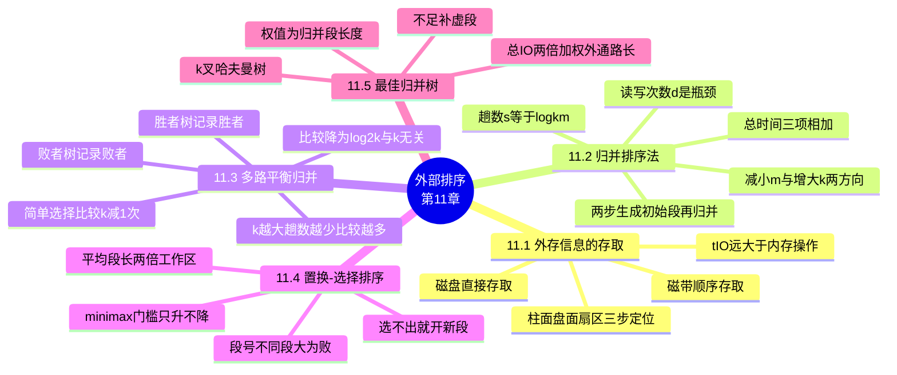

# 第十一章 外部排序

> **本章主线**：**11.1 外存存取**——外存分**磁带**（顺序存取，$T_{I/O}=t_a+n\cdot t_w$）与**磁盘**（直接存取，$T_{I/O}=t_{seek}+t_{la}+n\cdot t_w$），$t_{I/O}$ 远大于内存操作时间 → **外部排序 = 两步**：**生成初始归并段**（把 $n$ 个记录按内存缓冲区分成 $L$ 长的子文件，逐个调入内存用内排序排好送回外存）+ **多趟归并**（外存上两路/多路归并直至整体有序）；总时间 $= m\cdot t_{IS} + d\cdot t_{IO} + s\cdot u\cdot t_{mg}$——**瓶颈是读写次数 $d$**，$s=\lceil\log_k m\rceil$ → **11.2 例子**：10000 条、内存 1000、块 200 → 10 个初始段，2 路归并 4 趟共访问外存 **440 次**，5 路归并 2 趟仅 **300 次** → 提效两方向：**减小 $m$**（置换-选择排序）与**增大 $k$**（败者树多路归并） → **11.3 多路平衡归并**：简单选择每选一个要 $k-1$ 次比较，$C_{总}=\lceil\log_k m\rceil(k-1)(n-1)$——$k$ 大了 $s$ 小了但 $c$ 大了；用**胜者树/败者树**使 $c=\log_2 k$，$C_{总}=\lceil\log_2 m\rceil(n-1)$ **与 $k$ 无关**；**败者树**记败者、胜者直通向上，**重构修改结点更少**，实现时树中存**归并段号**（段号不同段大为败，段号相同 key 大为败） → **11.4 置换-选择排序**：在选择排序基础上维护**门槛 minimax**——只输出**大于等于 minimax 的最小值**，找不到就**开新段**；平均产生 **$2w$ 长**的初始段（$w$ = 工作区大小），把 $m$ 砍半 → **11.5 最佳归并树**：初始段搭配不同 I/O 不同，**最佳归并树 = $k$ 叉哈夫曼树**（权 = 段长），$(m-1)\bmod(k-1)\ne 0$ 时补**长度为 0 的虚段**，总 I/O $= 2\times$ 加权外通路长度。
> 一句话版本：**外排的账全在读写次数上**——内存小就先本地排成"初始段"，段多就**多路归并**（$s=\lceil\log_k m\rceil$），段太短就**置换-选择**让它翻倍（平均 $2w$），选最小用**败者树**把比较降为 $\log_2 k$，搭配顺序按**哈夫曼**（补虚段）让 I/O 最省——**减 m、增 k、树选、哈夫曼配对**，四板斧砍掉 $d\cdot t_{IO}$ 这个大头。

---

## 11.1 外存信息的存取

**外部排序的应用对象**：保存在外存储器上的、信息量很大（远远大于内存可存储的记录数量）的数据记录文件。

**外排序面临的问题**：无法将所有记录**一次性读入内存**，无法采用内排序一次性把排序完成——必须**结合分批读入内存**的处理方法想办法。

**外排序与内排序的差别**：内部排序充分利用内存可以**随机存取**的特点——希尔排序中相隔 $d_i$ 的记录可比较、堆排序中父 $R[i]$ 与子 $R[2i],R[2i+1]$ 可比较、快速排序需**正向和逆向**访问序列；而外存信息的**定位和存取受其物理特性的限制**，只能**顺序**或**按块**进行。外部排序的实现手段：在排序过程中进行**多次内外存之间的数据交换**。

### 11.1.1 磁带信息的存取

属于**顺序存取设备**，只适用于存储**顺序文件**。

- 磁带**不是连续运转设备**，而是**启停设备**；I/O 操作以**块**为单位（1K~8KB/块）；
- 块与块之间有 **IBG**（块间隙，Inter Block Gap）、记录之间有 **IRG**（记录间隙，Inter Record Gap）；
- 读写一块信息的时间：$T_{I/O} = t_a + n\cdot t_w$——$t_a$ 为磁头定位在物理块起始位置的时间，$t_w$ 为传输一个字符的时间。

### 11.1.2 磁盘信息的存取

属于**直接存取设备**，适用于各类存储形式的文件。

- 磁盘可以是单片的，或由若干个盘片组成**盘组**；**磁道**是盘片上的同心圆，**柱面**是各盘面上半径相同的磁道合在一起，**扇区**是每个磁道等分出的若干块；
- 读取信息的过程（三步定位）：① **柱面号** → 移动磁头；② **盘面号（磁道号）** → 选定所用磁头；③ **扇区/块号** → 磁盘一直高速旋转，磁头等待开始位置；
- 读写一块信息的时间：$T_{I/O} = t_{seek} + t_{la} + n\cdot t_w$——$t_{seek}$ 为磁头定位到磁道的时间，$t_{la}$ 为等待时间。

| 对比项 | 磁带 | 磁盘 |
|---|---|---|
| 存取方式 | **顺序**存取 | **直接**存取 |
| 适用文件 | 顺序文件 | 各类存储形式的文件 |
| 运转特点 | 启停设备，有 IBG/IRG | 持续高速旋转，等起始位置 |
| 定位成本 | 磁头定位 $t_a$ | 寻道 $t_{seek}$ + 等待 $t_{la}$ |
| 读写时间 | $t_a + n\cdot t_w$ | $t_{seek} + t_{la} + n\cdot t_w$ |

> 口诀：**磁带只能顺着排、磁盘三步柱面到扇区**——两者读写都拆成"**定位 + 传输**"两截，磁盘多付一份寻道和旋转等待的钱。

## 11.2 外部排序的基本方法——归并排序法

### 11.2.1 两个步骤

**步骤一：生成若干初始归并段（初始归并串/顺串），即对文件进行预处理**

1. 把含有 $n$ 个记录的文件，按**内存缓冲区大小**分成若干长度为 $L$ 的、可一次完整装入内存的子文件/段；
2. 将每个段依次调入内存，用**有效的内排序方法**排序后送回外存，形成若干个"**初始归并段**"——即每 $L$ 个记录进行一次内部排序，得到一个初始归并段。

**步骤二：对初始归并段进行多路合并（多路归并）**

初始方法：对初始归并段进行**多次 2 路归并排序**，直至最后在外存上得到整个有序文件为止（原理同内排序的 2 路归并排序）。

### 11.2.2 例：访问外存次数的计算

假设有一个含 **10,000** 个记录的磁盘文件，当前计算机**一次只能对 1,000 个记录进行内部排序**，"数据块"大小为 **200**（每次访问外存可读/写 200 个记录，全部处理一遍 10,000 条需访问外存 **100 次**，读和写各 50 次）：

1. **首先**利用内部排序得到 **10 个**（$10{,}000/1{,}000$）初始归并段，需访问外存 **100 次**；
2. **第一趟**：10 个归并段两两归并 → 5 个归并段（$5\times2000$ 条）——全部记录参加，100 次；
3. **第二趟**：5 个 → 3 个（$2\times4000 + 1\times2000$ 条）——本趟有一段 2000 条不参加归并，$1\times100 - 10\times2 =$ **80 次**；
4. **第三趟**：3 个 → 2 个（$6000+4000$ 或 $8000+2000$ 条）——按条数多的 4000 条未参加计算，$1\times100 - 10\times4 =$ **60 次**；
5. **第四趟**：2 个 → 1 个（10000 条）——全部记录参加，100 次；总计访问外存 **100 + 200 + 80 + 60 = 440 次**。

| 处理阶段 | 归并情况 | 是否全部记录参加 | 访问外存次数 |
|---|---|---|---|
| 生成初始段 | 10 段 × 1000 条 | 全部读写一遍 | 100 |
| 第 1 趟 | 10 → 5 段 | 是（合计 100 次） | 100 |
| 第 2 趟 | 5 → 3 段 | 否（2000 条免读写） | 80 |
| 第 3 趟 | 3 → 2 段 | 否（4000 条免读写） | 60 |
| 第 4 趟 | 2 → 1 段 | 是 | 100 |
| **合计（2 路）** | $s=4$ 趟 | — | **440** |

> 口诀：**一段一读一写记 100、免读免写按块扣**——算外排 I/O 就数"**哪趟哪些段没参加**"，每 200 条扣 1 次读 + 1 次写，别忘了初始段生成也要 100 次。

### 11.2.3 外部排序总时间与提效途径

外排总的时间还应包括**内部排序所需时间**和**逐趟归并时内部归并的时间**；由于 $t_{IO}$ 值是外存操作时间，**远远大于** $t_{IS}$ 和 $t_{mg}$，所以**外部排序总时间取决于读写外存的次数 $d$**：

$$T_{总} = \underbrace{m\cdot t_{IS}}_{\text{产生初始归并段}} + \underbrace{d\cdot t_{IO}}_{\text{外存信息读写}} + \underbrace{s\cdot u\cdot t_{mg}}_{\text{内部归并}}$$

其中 $m$ 为初始归并段个数，$t_{IS}$ 为一次内部排序耗时，$d$ 为归并排序的全部读写次数，$t_{IO}$ 为单次磁盘读写时间，$s$ 为归并趟数，$u$ 为 $u$ 个记录内存归并排序的时间。

**提高外排序效率（缩短总时间）的途径**——多路归并是树型结构，总合并趟数 $s=\lceil\log_k m\rceil$，优化目标是**减少趟数 $s$ 以减少 I/O 次数**：

- **方向 1，减少 $m$**：内存受限时设法**扩大初始归并段长度**（大于内存容纳数量），从而减少初始归并段个数——采用**置换-选择排序**建立初始归并段；
- **方向 2，增加 $k$**：进行**基于败者树的多路（$k$ 路，$k\gt2$）归并**——归并时每段每次只需读入 1 次 I/O 可读入的少量记录；设内存可容纳 5 次 I/O 的物理块，则 **4 个作输入缓冲区、1 个作输出缓冲区**进行 4 路归并。

**对比**：上述例子 2 路归并 4 趟共 440 次；若采用 **5 路归并**则只需 $\lceil\log_5 10\rceil=$ **2 趟**，总访问外存次数为 $100 + 2\times100 =$ **300 次**。一般地，$m$ 个初始归并段做 $k$ 路归并，$s=\lceil\log_k m\rceil$——随着 $k$ 增大或 $m$ 减小，趟数减少，故外排通常采用**多路归并**；但 $k$ 的大小需综合考虑各种因素（$k$ 太大会使内部归并时选最小值变慢，见 11.3）。

## 11.3 多路平衡归并

### 11.3.1 简单选择归并的矛盾

设记录总数 $n$、初始归并段个数 $m$、进行 $k$ 路归并，共 $s=\lceil\log_k m\rceil$ 趟；归并时用**简单选择排序**从 $k$ 个记录中选最小者需比较 $c=k-1$ 次，则 $s$ 趟内部归并的总比较次数为：

$$C_{总} = s\cdot c\cdot (n-1) = \lceil\log_k m\rceil \cdot (k-1)\cdot(n-1) = \left\lceil\frac{\log_2 m}{\log_2 k}\right\rceil\cdot(k-1)\cdot(n-1)$$

| 变化 | 对趟数 $s$ 的影响 | 对每选一个的比较数 $c$ | 净效果 |
|---|---|---|---|
| $k$ 增大 | $\lceil\log_k m\rceil$ **减少** → I/O 次数减少 | $c=k-1$ **增大** → 归并效率下降 | 矛盾：两头不能同时得利 |

> 口诀：**$k$ 大趟数少、$k$ 大比较多**——简单选择让"省 I/O"和"费比较"互相打架，解法是把 $c$ 从 $k-1$ 压到 $\log_2 k$。

### 11.3.2 胜者树（树形选择排序）

**算法思想**：模仿**锦标赛名次产生过程**——树中**保留两两比较的胜者**；选关键字最小的记录时 $c=\log_2 k$，此时 $C_{总}=\lceil\log_2 m\rceil(n-1)$，**与 $k$ 无关**。

**重构过程**（输出胜者 6 之后）：从**胜者所在的归并段**中补充一个新数据到**胜者原叶子结点**，再从此叶子结点**向根方向依次比较更新**一遍——**根结点至新补入记录叶结点路径上的所有结点都必须更新**。

### 11.3.3 败者树

**算法思想**：**记录败者，胜者参加下一轮比赛**——从叶子结点依次比到根，在**根上记录最后一次的败者**，**胜者输出**出去（$ls[0]$ 存放最终胜者）。

**优点**：**重构时修改结点较少**——重构时只需沿路径逐层改写"上一轮的败者"，比较双方的胜者可直接上递。

**实现细节**：败者树中保存的通常是**归并段号**（而非记录本身），便于补充记录值时比较；比较规则为——**段号不同，段大为败；段号相同，key 大为败**（段号即当前记录所属归并段的编号，保证低段号中的小值优先输出，维持归并段的先后次序）。

| 对比项 | 胜者树 | 败者树 |
|---|---|---|
| 树中记录 | **胜者** | **败者**（胜者向上走参加下一轮） |
| 最终胜者 | 在**根**结点 | 在 **$ls[0]$**（根处记录的是最后一次败者） |
| 重构代价 | 路径上**所有**结点都要更新 | 只改路径上的**败者**结点，**修改较少** |
| 存储内容 | 记录（或其关键字） | 通常存**归并段号** |

> 口诀：**胜者留树根上立、败者记账胜者升**——两树都把 $k$ 路选最小从 $k-1$ 次比较降到 $\log_2 k$ 次，$C_{总}=\lceil\log_2 m\rceil(n-1)$ 与 $k$ 无关；败者树重构更省，实现存段号、口诀"**段大为败、key 大为败**"。

## 11.4 置换-选择排序

### 11.4.1 为什么需要置换-选择

$m$ 个初始归并段做 $k$ 路平衡归并时趟数为 $\lceil\log_k m\rceil$，为了减少趟数也可以**减小 $m$ 的值**（即增加归并段的长度）。

**问题**：内存长度一定时，假设内存中可容纳 $M$ 条记录，按通常的内部排序方法，一次内部排序只能对 $M$ 条记录排序，初始归并段长度**受内存可容纳记录数的限制**就是 $M$。

**解决**：使用**置换-选择（replacement selection）排序**，平均情况下可以产生**两倍内存长度**的初始归并段——用于在多路归并前产生较长的初始归并段，减少初始归并段数量。

### 11.4.2 基本思想与算法步骤

置换-选择排序是在**选择排序**的基础上进行：内存工作区 $WA$ 可容纳 $w$ 个记录，输入文件 $FI$、输出文件 $FO$。

1. 从 $FI$ 输入 $w$ 个记录到 $WA$；
2. 从 $WA$ 中选择关键字**最小**的记录，记为 **minimax**；
3. 将 minimax **输出**到 $FO$ 中；
4. 若 $FI$ 不空，从 $FI$ 输入下一个记录到 $WA$ 补位；
5. 从 $WA$ 中所有关键字**比 minimax 大**的记录中选出**最小**关键字记录，作为**新的 minimax**；
6. 重复 3~5 直至 $WA$ 中选不出新的 minimax——此时得到**一个初始归并段**（显然此归并段长度可以大于 $w$）；
7. 重复 2~6（重新从 $WA$ 选最小者作新段的 minimax），直至处理完所有数据。

**理解要点**：minimax 是一道**只升不降的门槛**——归并段内的记录必须**不小于**已输出的最后一个记录；当 $WA$ 里所有记录都小于 minimax 时，说明它们**放不进当前归并段**，只能**另起新段**（这些小值留在 $WA$ 里成为下一段的种子，不重新读入外存——这就是"**置换**"的含义）。

### 11.4.3 示例

设 $WA$ 容纳 4 个记录，$FI = \{36, 21, 33, 87, 23, 7, 62, 16, 54, 43, 29, \dots\}$：

| 步骤 | $FO$（输出） | $WA$（工作区） | $FI$（剩余） |
|---|---|---|---|
| 初始 | 空 | 36, 21, 33, 87 | 23, 7, 62, 16, 54, 43, 29, … |
| 选 21 输出 | 21 | 36, 23, 33, 87 | 7, 62, 16, 54, 43, 29, … |
| 选 23 输出 | 21, 23 | 36, 7, 33, 87 | 62, 16, 54, 43, 29, … |
| 选 33 输出 | 21, 23, 33 | 36, 7, 62, 87 | 16, 54, 43, 29, … |
| 选 36 输出 | 21, 23, 33, 36 | 16, 7, 62, 87 | 54, 43, 29, … |
| 选 62 输出 | 21, 23, 33, 36, 62 | 16, 7, 54, 87 | 43, 29, … |
| 选 87 输出 | 21, 23, 33, 36, 62, 87 | 16, 7, 54, 43 | 29, … |
| 选不出（均小于 87） | **段 1 结束** ‖ 7 起段 2 | 16, 29, 54, 43 | … |

> 口诀：**门槛只升不降、小于门槛就开新段**——置换-选择把 $WA$ 里"没资格进当前段"的记录**留下当种子**，段长平均翻倍（$2w$），$m$ 减半趟数跟着少。

第一个初始归并段为 **21, 23, 33, 36, 62, 87**（长度 6，**大于 $w=4$**）；随后以 $WA$ 中最小的 **7** 开始第二段（7, 16, … 继续）。

### 11.4.4 败者树实现、效果与并行

- **实现**：置换-选择排序可通过**败者树**实现（教材图 11.6，$WA=6$，序列 $\{51, 49, 39, 46, 38, 29, 14, 61, 15, 30, 1, 48, 52, 3, 63, 27, 4, \dots\}$）；比较规则：**段号不同，段大为败；段号相同，key 大为败**。输出一个记录后，从同一段补入一个新记录，按此规则沿路调整——段号相同才能继续留在当前段，段号变大说明已进入更晚的段。
- **注意**：当全部记录的段号标志都变成 2 之后，初始归并段 1 的记录已全部生成，再输出的记录需放入**第二个归并段**（新段的比较按新段的门槛进行）。
- **效果**：所得初始归并段**长度不等**；当输入文件关键字**随机分布**时，初始归并段的平均长度为内存工作区大小 $w$ 的**两倍**（即 $m$ 约减半）。
- **缓冲区及并行操作**：设置 $k$ 个输入缓冲区 + 1 个输出缓冲区，使**输入、输出和内部归并三种操作同时进行**（硬件间的并行），也能降低总的外部排序时间；但应综合考虑**缓冲区数目、工作区大小**等参数的设置。

## 11.5 最佳归并树

### 11.5.1 归并方案与 I/O 次数

进行 $k$ 路归并时，**初始归并段的不同搭配**，会导致归并过程中 **I/O 的次数不同**。

设有 **9 个**初始归并段，长度分别为：9，30，12，18，3，17，2，6，24，做 3 路归并——

| 归并方案 | 归并搭配思路 | 总 I/O 次数计算 | 合计 |
|---|---|---|---|
| **方案一**（随意分组） | 依次每 3 段并：$9{+}30{+}12$、$18{+}3{+}17$、$2{+}6{+}24$，再三并一 | $(9{+}30{+}12{+}18{+}3{+}17{+}2{+}6{+}24)\times2 + (51{+}38{+}32)\times2$ | **484** |
| **方案二**（短段先并） | 先并最短的 $2{+}3{+}6$，再逐步并 | $[(2{+}3{+}6)\times3 + (9{+}12{+}17{+}18{+}24)\times2 + 30\times1]\times2$ | **446** |

> 口诀：**短段先并深、长段后并浅**——总 I/O = 加权外通路长 ×2，越短的段越该往深处放（多读写几次也便宜），这就是哈夫曼的"**权小离根远**"。

总 I/O 次数 = **所有叶结点加权外通路长度的 2 倍**（每段归并时读一遍、写一遍，故 ×2；权值即段长）。

### 11.5.2 构造方法

**最佳归并树即 $k$ 叉（阶）哈夫曼树**。设初始归并段为 $m$ 个，进行 $k$ 路归并：

1. 若 $(m-1)\bmod(k-1)\ne 0$，则需附加 $(k-1)-(m-1)\bmod(k-1)$ 个**长度为 0 的虚段**，以使每次归并都可以**恰好对应 $k$ 个段**（不补则最后一层凑不满 $k$ 路）；
2. 按照**哈夫曼树的构造原则**（权值越小的结点离根结点**越远**）构造最佳归并树，**权值为归并段的长度**。

**【题目】** 长度分别为 2，3，6，9，12，17，18，24 的 **8 个**初始归并段进行 **3 路归并**，求最佳归并树并计算总 I/O 次数。

**【解题步骤】**

1. **判断是否补虚段**：$m=8$，$k=3$，$(m-1)\bmod(k-1) = 7\bmod 2 = 1 \ne 0$，需要补充 $(k-1)-(m-1)\bmod(k-1) = 2-1 =$ **1 个长度为 0 的虚段**（补后共 9 段，$(9-1)\bmod 2=0$，恰可每层 3 段并完）。
2. **按哈夫曼原则逐次取最小的 3 段归并**（权小离根远）：
    - 第 1 次：取 $0, 2, 3 \to 5$（虚段参与，内部结点权 5）；
    - 第 2 次：取 $5, 6, 9 \to 20$；
    - 第 3 次：取 $12, 17, 18 \to 47$；
    - 第 4 次：取 $20, 24, 47 \to 91$（根）。
3. **确定各叶深度**：$0, 2, 3$ 深 3（挂在 5 下，5 挂 20 下，20 挂根下）；$6, 9$ 深 2；$12, 17, 18$ 深 2（挂在 47 下）；$24$ 深 1（直接挂根下）。
4. **算加权外通路长度**：$(2+3)\times3 + (6+9+12+17+18)\times2 + 24\times1 = 15 + 124 + 24 = 163$（虚段权 0，贡献 0）。
5. **总 I/O = 加权外通路长 ×2**：$163\times2 = 326$。

**【最终答案】**：补 **1 个长度为 0 的虚段**后按 $k$ 叉哈夫曼构造——内部结点依次为 $5=(0{+}2{+}3)$、$20=(5{+}6{+}9)$、$47=(12{+}17{+}18)$、$91=(20{+}24{+}47)$（根）；总 I/O 次数 $=[(2+3)\times3 + (6+9+12+17+18)\times2 + 24\times1]\times2 =$ **326 次**。

**【一句话概括】**：最佳归并树 = **$k$ 叉哈夫曼树**——先补虚段凑齐每层 $k$ 路，再"**权小离根远**"配对，总 I/O = **加权外通路长度 × 2**，短段多跑几趟、长段少跑，总账最省。

---

### 知识定位与框架衔接

- **前置知识**：第 10 章**内部排序**（初始归并段靠内排序生成——直接插入/快速/堆排序都可当"预处理器"，2 路归并的思想直接沿用 10.5）、第 6 章**哈夫曼树**（最佳归并树就是 $k$ 叉哈夫曼，"权小离根远"原则原封不动）、第 10.4.2 **树形选择排序**（胜者树/败者树是多路归并选最小的底座）、栈与树的递归、复杂度分析。外排是"**内排序 + 外存特性**"的工程合体。
- **后续位置**：课程延伸——**数据库系统**（外部归并连接、排序溢出段）、**分布式计算**（MapReduce 的 shuffle 阶段 = 分布式多路归并 + 置换-选择生成顺串）、**文件系统与日志结构**（LSM-Tree 的 compaction 就是多路归并 + 最佳搭配）、大规模数据处理（排序-归并范式）。
- **比喻**：**外排像"客厅太小，照片先分批在茶几上理好（初始段），再两两/三三合成大册"**；**置换-选择像"打扑克时手里握一把牌，只出比上一张大的——实在没牌可出就换一副新牌（开新段）"**；**败者树像"擂台赛：败者记在牌子上，胜者直接登台守擂，换人只需改一条记录"**；**最佳归并树像"搬家打包：小箱子塞进大箱子多折腾几层没关系，大箱子尽量少搬"**。
- **灵魂问题**：**为什么外排总时间由读写次数 $d$ 而不是比较次数决定（$t_{IO}\gg t_{IS}$）？为什么增大 $k$ 有上限（简单选择 $c{=}k{-}1$ 涨得比趟数掉得快——败者树把它压成 $\log_2 k$ 后呢）？为什么置换-选择能突破"段长 ≤ 内存容量"的直觉（minimax 门槛只升不降，允许段内"暂时无序"）？为什么补虚段不补行不行（最后一层凑不满 $k$ 路会怎样）？**——四问各打通一节：11.2.3、11.3.1、11.4.2、11.5.2。

> **一句话总结本章**：**外部排序 = 生成初始归并段 + 多趟归并**，总时间 $m\cdot t_{IS} + d\cdot t_{IO} + s\cdot u\cdot t_{mg}$，瓶颈是读写次数 $d$——于是四板斧：**多路归并**把趟数压到 $s=\lceil\log_k m\rceil$、**败者树**把每选一个的比较从 $k{-}1$ 降到 $\log_2 k$（$C_{总}=\lceil\log_2 m\rceil(n-1)$ 与 $k$ 无关）、**置换-选择**把段长平均翻到 $2w$ 减半 $m$、**最佳归并树（$k$ 叉哈夫曼 + 补虚段）**把搭配顺序排到总 I/O 最省——第 10 章的内排序是它的预处理器，第 6 章的哈夫曼是它的账房先生。

---

## 课件 PDF

<iframe src="https://cognishelf.naimore3.workers.dev/课程笔记/大二上/数据结构/11外部排序/11外部排序.pdf" width="100%" height="800px"></iframe>

[打开 PDF](https://cognishelf.naimore3.workers.dev/课程笔记/大二上/数据结构/11外部排序/11外部排序.pdf)
